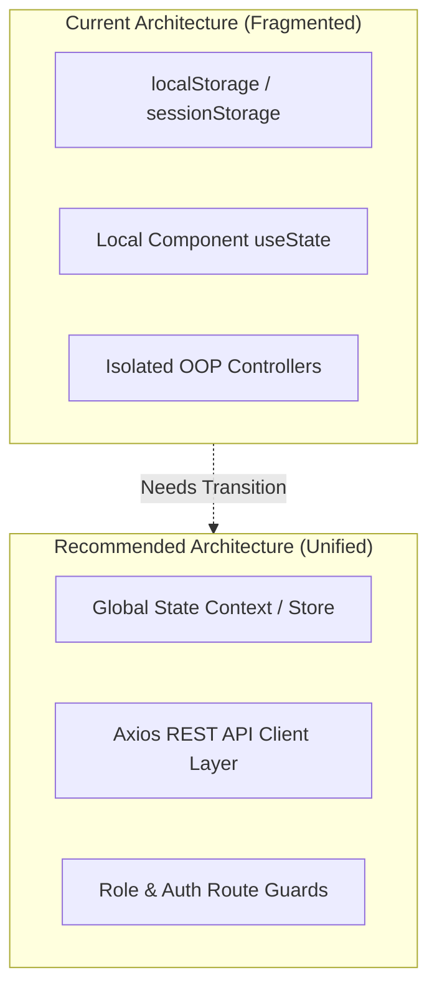
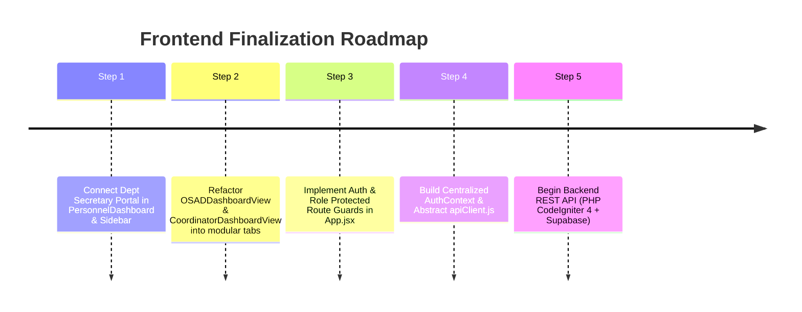

Here is a comprehensive frontend architecture evaluation of **AchieveNest** ([`c:\Users\Admin\.gemini\antigravity\scratch\achievenest`](file:///c:/Users/Admin/.gemini/antigravity/scratch/achievenest)).

---

# 🏛️ AchieveNest — Frontend Architecture Evaluation & Pre-Backend Audit

### 📊 Overall System Health Summary
* **Frontend Completion**: ~**85%** (UI components, pages, modals, role switchers, and client-side OOP controllers are well built).
* **Architecture Style**: Component-based React 19 + Vite + Tailwind CSS v4 + ES6 Controller/Model layer.
* **Readiness for Backend**: **Requires 4 key frontend wiring fixes and UI modularization steps** before commencing REST API development.

---

## 1. 🏗️ What the Frontend Architecture Lacks



1. **Centralized Reactive State Management**:
   * Currently, state is split between local `useState` in pages/components, `localStorage` triggers, custom hooks (`usePersonnelPortfolio`), and static OOP controller instances.
   * Modifying state in one role view (e.g. OSAD assigning a role in [OSADDashboardView.jsx](file:///c:/Users/Admin/.gemini/antigravity/scratch/achievenest/src/components/osad/OSADDashboardView.jsx)) does not automatically re-render or update state in [RoleSwitcher.jsx](file:///c:/Users/Admin/.gemini/antigravity/scratch/achievenest/src/components/RoleSwitcher.jsx) or [Header.jsx](file:///c:/Users/Admin/.gemini/antigravity/scratch/achievenest/src/components/Header.jsx) without page reloads or storage listener events.
   * **Missing**: A unified React Context (e.g. `AuthContext`, `UserContext`) or a lightweight store (e.g., Zustand) to coordinate role switches, notifications, and user session updates across all components.

2. **Abstract HTTP API Service / Client Layer**:
   * [authService.js](file:///c:/Users/Admin/.gemini/antigravity/scratch/achievenest/src/services/authService.js) and controllers (`OSADController.js`, `HRController.js`, `AttendanceController.js`) directly mutate mock objects in local memory.
   * **Missing**: An `apiClient.js` service configured with Axios interceptors for bearer JWT handling, standard response/error formatters, and environment base URLs (`import.meta.env.VITE_API_BASE_URL`).

3. **Protected Route Guards & Explicit Role URL Routes**:
   * In [App.jsx](file:///c:/Users/Admin/.gemini/antigravity/scratch/achievenest/src/App.jsx), all routes are publicly mounted without authentication or role verification wrappers (`RequireAuth`, `RequireRole`). Any logged-out user can type `/osad/dashboard` or `/hr/dashboard` into the browser URL and view executive interfaces.
   * Sub-roles (Program Coordinator, Org Moderator, Department Secretary) lack dedicated top-level route namespaces (e.g., `/coordinator/dashboard`, `/org-moderator/dashboard`), relying instead on query parameters (`?tab=...`) inside [PersonnelDashboard.jsx](file:///c:/Users/Admin/.gemini/antigravity/scratch/achievenest/src/pages/PersonnelDashboard.jsx).

---

## 2. 🔌 Unconnected Workflow Logic & Disconnected Features

### 🔴 Critical Disconnect: Department Secretary Portal is Unwired
* **The Issue**: Fully built components exist in [`src/components/depsec/`](file:///c:/Users/Admin/.gemini/antigravity/scratch/achievenest/src/components/depsec):
  - [DepSecEvaluatorWorkbench.jsx](file:///c:/Users/Admin/.gemini/antigravity/scratch/achievenest/src/components/depsec/DepSecEvaluatorWorkbench.jsx)
  - [DepSecPortfolioRoster.jsx](file:///c:/Users/Admin/.gemini/antigravity/scratch/achievenest/src/components/depsec/DepSecPortfolioRoster.jsx)
* **The Bug**: In [PersonnelDashboard.jsx](file:///c:/Users/Admin/.gemini/antigravity/scratch/achievenest/src/pages/PersonnelDashboard.jsx#L200-L206):
  ```javascript
  {activeRoleContext === 'program_coordinator' ? (
    <CoordinatorDashboardView currentUser={currentUser} />
  ) : activeRoleContext === 'organization_moderator' ? (
    <OrgModeratorDashboardView currentUser={currentUser} />
  ) : (
    /* Falls back to standard Personnel View — Dept Secretary is IGNORED! */
  )}
  ```
  When a user switches role to **Department Secretary** via [RoleSwitcher.jsx](file:///c:/Users/Admin/.gemini/antigravity/scratch/achievenest/src/components/RoleSwitcher.jsx), the app renders the default Personnel view, rendering the Dept Secretary evaluation workbench completely inaccessible. Also, [Sidebar.jsx](file:///c:/Users/Admin/.gemini/antigravity/scratch/achievenest/src/components/Sidebar.jsx#L48) lacks navigation items for `department_secretary`.

### 🟡 Other Disconnected Workflows:
1. **Dossier PDF Generation Engine**:
   * [portfolioPdfGenerator.js](file:///c:/Users/Admin/.gemini/antigravity/scratch/achievenest/src/services/portfolioPdfGenerator.js) currently contains only a 5-line wrapper calling `window.print()`. It needs a structured client-side exporter (or canvas print template) until backend mPDF is ready.
2. **Scanner Attendance Persistence**:
   * [AttendanceScannerModal.jsx](file:///c:/Users/Admin/.gemini/antigravity/scratch/achievenest/src/components/organization/AttendanceScannerModal.jsx) and [OfficerScannerPage.jsx](file:///c:/Users/Admin/.gemini/antigravity/scratch/achievenest/src/pages/OfficerScannerPage.jsx) simulate student barcode check-ins, but logs remain inside modal local state and do not update `EventModel` or sync back to student participation records.
3. **Cross-Portal System Audit Logs**:
   * The Audit Logs tab in [OSADDashboardView.jsx](file:///c:/Users/Admin/.gemini/antigravity/scratch/achievenest/src/components/osad/OSADDashboardView.jsx) renders static logs. Actions performed in Student, Personnel, or Coordinator portals (such as submitting an accomplishment or verifying points) do not write to `SecurityController`.

---

## 3. 🚧 Unfinalized Sections for Users

| Component / Portal | Unfinalized Element | Impact / Description |
| :--- | :--- | :--- |
| **HR Office Dashboard** | [HRDashboardView.jsx](file:///c:/Users/Admin/.gemini/antigravity/scratch/achievenest/src/components/hr/HRDashboardView.jsx) | Accreditation export and faculty promotion rank criteria use static fallback tables instead of binding to `HRRankingController.js`. |
| **Public Authenticity Verification** | Public QR Route `/verify/:portfolioId` | Specified in architecture docs, but missing a public verification page layout for third-party document validation. |
| **Notifications Drawer** | [NotificationPopover.jsx](file:///c:/Users/Admin/.gemini/antigravity/scratch/achievenest/src/components/NotificationPopover.jsx) | Renders hardcoded notification items; clicking them does not navigate to the corresponding achievement/event item. |
| **Account & Settings Pages** | [AccountPage.jsx](file:///c:/Users/Admin/.gemini/antigravity/scratch/achievenest/src/pages/AccountPage.jsx), [SettingsPage.jsx](file:///c:/Users/Admin/.gemini/antigravity/scratch/achievenest/src/pages/SettingsPage.jsx) | 2FA toggles, profile picture updates, and email preference changes do not persist to user profile models. |

---

## 4. 🎨 UI Style & Component Structure Redesign Recommendations

Before proceeding to backend API development, refactoring the following UI sections will prevent major code maintenance friction:

### 1. 📦 Break Down Monolithic Component Files
* **[OSADDashboardView.jsx](file:///c:/Users/Admin/.gemini/antigravity/scratch/achievenest/src/components/osad/OSADDashboardView.jsx)** is **164 KB (~4,000 lines in a single file)**.
* **[CoordinatorDashboardView.jsx](file:///c:/Users/Admin/.gemini/antigravity/scratch/achievenest/src/components/coordinator/CoordinatorDashboardView.jsx)** is **104 KB**.
* **[OrgModeratorDashboardView.jsx](file:///c:/Users/Admin/.gemini/antigravity/scratch/achievenest/src/components/organization/OrgModeratorDashboardView.jsx)** is **96 KB**.
> **Recommendation**: Extract internal tabs (e.g. `OSADAccountTab`, `OSADAwardTab`, `OSADAwardeesTab`, `OSADReportsTab`) into individual files in `src/components/osad/tabs/`. Trying to connect a 4,000-line file to backend API endpoints will be error-prone and hard to debug.

### 2. 🌙 Dark Mode Class Standardization
* Certain pages use explicit dark mode utility classes (`dark:bg-[#0b1320]`, `dark:bg-slate-900`), while modals use custom background colors (`#1b4332`, `#dfebd9`, `#eef7f0`).
> **Recommendation**: Standardize dark/light surface tokens in `index.css` (e.g., `--color-surface-bg`, `--color-card-bg`, `--color-[#2d8a4e]`) to eliminate color mismatch when switching themes.

### 3. 📱 Mobile & Tablet Table Responsiveness
* Tables in OSAD Governance, HR Personnel Directory, and DepSec Evaluator Workbench break layout containers on screen widths `< 1024px`.
> **Recommendation**: Wrap tables in standard overflow containers (`overflow-x-auto`) or convert them to responsive card lists on mobile viewports.

---

## 📋 Recommended Action Plan Before Starting Backend Development



1. **Connect Dept Secretary Component**:
   - Update [PersonnelDashboard.jsx](file:///c:/Users/Admin/.gemini/antigravity/scratch/achievenest/src/pages/PersonnelDashboard.jsx) to render `<DepSecPortfolioRoster />` / `<DepSecEvaluatorWorkbench />` when `activeRoleContext === 'department_secretary'`.
   - Update [Sidebar.jsx](file:///c:/Users/Admin/.gemini/antigravity/scratch/achievenest/src/components/Sidebar.jsx) to include navigation links for the Department Secretary portal.

2. **Decompose Oversized Files**:
   - Split `OSADDashboardView.jsx`, `CoordinatorDashboardView.jsx`, and `OrgModeratorDashboardView.jsx` into smaller tab components.

3. **Add Protected Route Guards**:
   - Wrap routes in [App.jsx](file:///c:/Users/Admin/.gemini/antigravity/scratch/achievenest/src/App.jsx) with a `ProtectedRoute` component to enforce login and active role context checks.

4. **Create REST API Service Layer (`src/services/apiClient.js`)**:
   - Set up an Axios instance with base URL configuration, request interceptors for JWT, and standard error handling ready to connect to CodeIgniter 4 endpoints.