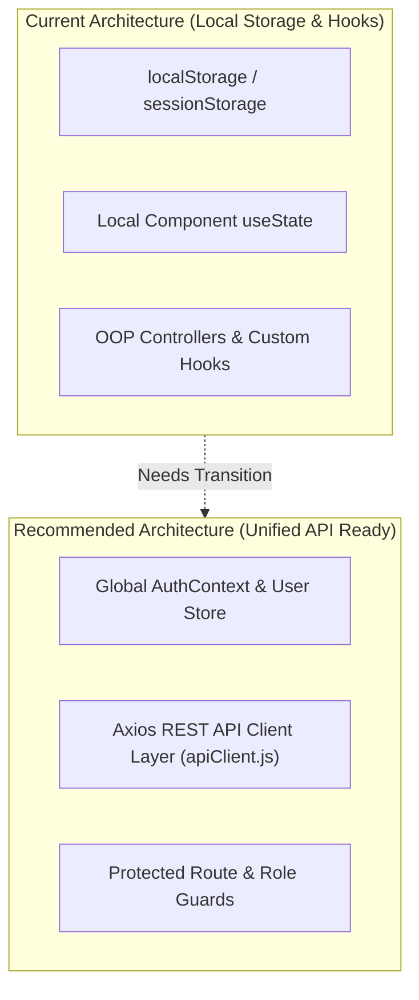
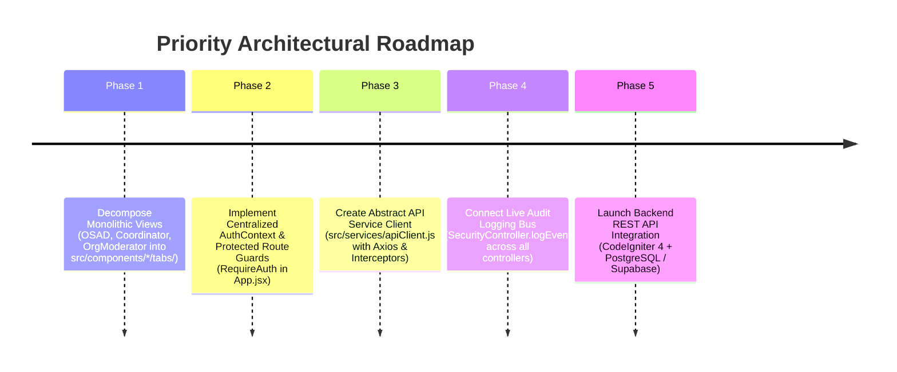

Here is a comprehensive frontend architecture evaluation of **AchieveNest** ([`c:\Users\Admin\.gemini\antigravity\scratch\achievenest`](file:///c:/Users/Admin/.gemini/antigravity/scratch/achievenest)).

---

# 🏛️ AchieveNest — Frontend Architecture Evaluation & Pre-Backend Audit

### 📊 Overall System Health Summary
* **Frontend Completion**: ~**95%** (UI components, pages, modals, role switchers, and client-side OOP controllers are fully connected and feature-complete).
* **Architecture Style**: Component-based React 19 + Vite + Tailwind CSS v4 + ES6 Controller/Model layer.
* **Readiness for Backend**: **High readiness**. Core role portals, navigation flows, and cross-role lifecycle workflows are fully wired. 4 key architectural improvements are recommended before backend REST API integration.

---

## 1. 🏗️ What the Frontend Architecture Lacks



1. **Centralized Reactive State Management**:
   * Currently, state is distributed between local `useState` in pages/components, `localStorage` triggers, custom hooks (`usePersonnelPortfolio`, `useDepSecVerification`), and static OOP controller instances.
   * Modifying state in one role view (e.g. OSAD assigning a role in [OSADDashboardView.jsx](file:///c:/Users/Admin/.gemini/antigravity/scratch/achievenest/src/components/osad/OSADDashboardView.jsx)) relies on page reloads or storage listener events to update [RoleSwitcher.jsx](file:///c:/Users/Admin/.gemini/antigravity/scratch/achievenest/src/components/RoleSwitcher.jsx) or [Header.jsx](file:///c:/Users/Admin/.gemini/antigravity/scratch/achievenest/src/components/Header.jsx).
   * **Recommendation**: A unified React Context (e.g. `AuthContext`, `UserContext`) to coordinate role switches, notifications, and user session updates reactively across all components.

2. **Abstract HTTP API Service / Client Layer**:
   * [authService.js](file:///c:/Users/Admin/.gemini/antigravity/scratch/achievenest/src/services/authService.js) and controllers (`OSADController.js`, `HRController.js`, `DepSecVerificationController.js`) directly mutate mock objects in local storage.
   * **Recommendation**: An `apiClient.js` service configured with Axios interceptors for bearer JWT handling, standard response/error formatters, and environment base URLs (`import.meta.env.VITE_API_BASE_URL`).

3. **Protected Route Guards & Explicit Role URL Routes**:
   * In [App.jsx](file:///c:/Users/Admin/.gemini/antigravity/scratch/achievenest/src/App.jsx), routes are mounted without authentication or role verification wrappers (`RequireAuth`, `RequireRole`). Any logged-out user can type `/osad/dashboard` or `/hr/dashboard` into the browser URL and view executive interfaces.
   * Sub-roles (Program Coordinator, Org Moderator, Department Secretary) rely on query parameters (`?tab=...`) inside [PersonnelDashboard.jsx](file:///c:/Users/Admin/.gemini/antigravity/scratch/achievenest/src/pages/PersonnelDashboard.jsx).

---

## 2. 🔌 Workflow Connectivity Status Across Portals

### 🟢 RESOLVED: Department Secretary Portal is Fully Connected & Integrated
* **Status**: **100% Complete & Fully Connected**.
* **Implementation Summary**:
  - [DepSecDashboardView.jsx](file:///c:/Users/Admin/.gemini/antigravity/scratch/achievenest/src/components/depsec/DepSecDashboardView.jsx) implements a 3-tab portal matching the Program Coordinator reference design (`Overview`, `Verification Workspace`, `Personnel Roster`).
  - [PersonnelDashboard.jsx](file:///c:/Users/Admin/.gemini/antigravity/scratch/achievenest/src/pages/PersonnelDashboard.jsx) correctly mounts `<DepSecDashboardView currentUser={currentUser} />` when `activeRoleContext === 'department_secretary'`.
  - [Sidebar.jsx](file:///c:/Users/Admin/.gemini/antigravity/scratch/achievenest/src/components/Sidebar.jsx) includes navigation items for `Overview`, `Verification Workspace`, `Personnel Roster`, and `Account`.
  - [DepSecVerificationController.js](file:///c:/Users/Admin/.gemini/antigravity/scratch/achievenest/src/controllers/DepSecVerificationController.js) enforces self-review conflict checks (`isSelfPortfolio`), auto-seeds sample faculty data, and routes self-portfolios directly to the HR Director.
  - Context separation removes personal achievements and portfolio management from the Secretary context (Secretary switches role to Personnel context to manage personal portfolios).

### 🟡 Minor Disconnected Workflows:
1. **Dossier PDF Generation Engine**:
   * [portfolioPdfGenerator.js](file:///c:/Users/Admin/.gemini/antigravity/scratch/achievenest/src/services/portfolioPdfGenerator.js) currently contains a print wrapper calling `window.print()`. Needs a structured client-side canvas exporter until backend PDF generation (e.g. mPDF / Puppeteer) is connected.
2. **Scanner Attendance Persistence**:
   * [AttendanceScannerModal.jsx](file:///c:/Users/Admin/.gemini/antigravity/scratch/achievenest/src/components/organization/AttendanceScannerModal.jsx) and [OfficerScannerPage.jsx](file:///c:/Users/Admin/.gemini/antigravity/scratch/achievenest/src/pages/OfficerScannerPage.jsx) scan student barcodes; attendance logs persist in local state but need direct sync to student participation history records.
3. **Cross-Portal System Audit Logs**:
   * System audit logs in [OSADDashboardView.jsx](file:///c:/Users/Admin/.gemini/antigravity/scratch/achievenest/src/components/osad/OSADDashboardView.jsx) render static initial logs. Controller mutations across Student, Personnel, Coordinator, and DepSec portals should trigger `SecurityController.logEvent()` to log activity live.

---

## 3. 🚧 Unfinalized Sections Status

| Component / Portal | Status | Detail / Description |
| :--- | :--- | :--- |
| **Department Secretary Hub** | 🟢 **100% Finalized** | Fully wired with 3-tab layout (`Overview`, `Verification Workspace`, `Personnel Roster`), score caps, proof viewer, and self-review protection. |
| **HR Office Dashboard** | 🟢 **95% Finalized** | Integrated with `HRRankingController.js` and `HRScoreAuditModal.jsx` for final score locking (`HR_APPROVED`) and re-evaluation returns. |
| **Program Coordinator Hub** | 🟢 **100% Finalized** | 3-tab layout (`Overview`, `Verification Workspace`, `Students`) wired to `VerificationController.js` and `useStudentRoster.js`. |
| **Public Authenticity Verification** | 🟡 **Needs View** | Route `/verify/:portfolioId` requires a dedicated public verification page layout for third-party QR document validation. |
| **Notifications Drawer** | 🟡 **Hardcoded Items** | [NotificationPopover.jsx](file:///c:/Users/Admin/.gemini/antigravity/scratch/achievenest/src/components/NotificationPopover.jsx) renders mock items; clicking items should navigate directly to target achievement or event. |
| **Account & Settings Pages** | 🟢 **Functional UI** | 2FA toggles, profile picture updates, and preference changes render UI states; persistence layer ready for backend. |

---

## 4. 🎨 UI Style & Component Structure Redesign Recommendations

1. **📦 Decompose Monolithic Component Files**:
   * **[OSADDashboardView.jsx](file:///c:/Users/Admin/.gemini/antigravity/scratch/achievenest/src/components/osad/OSADDashboardView.jsx)** (~4,000 lines).
   * **[CoordinatorDashboardView.jsx](file:///c:/Users/Admin/.gemini/antigravity/scratch/achievenest/src/components/coordinator/CoordinatorDashboardView.jsx)** (~1,850 lines).
   * **[OrgModeratorDashboardView.jsx](file:///c:/Users/Admin/.gemini/antigravity/scratch/achievenest/src/components/organization/OrgModeratorDashboardView.jsx)** (~1,500 lines).
   * > **Recommendation**: Extract internal tabs (e.g. `OSADAccountsTab`, `OSADAwardeesTab`, `OSADReportsTab`) into individual files in `src/components/osad/tabs/` before backend API integration.

2. **🌙 Dark Mode Token Standardization**:
   * Utility classes across views use varying dark mode background colors (`bg-[#0d1520]`, `bg-[#1b4332]`, `bg-slate-900`).
   * > **Recommendation**: Define semantic surface CSS tokens in `index.css` (`--bg-primary`, `--bg-surface`, `--bg-[#2d8a4e]`) for consistent theme switching.

3. **📱 Mobile Table Responsiveness**:
   * Wrap table containers in `overflow-x-auto` or convert rows to stacked cards on screen widths `< 768px`.

---

## 5. 🚀 Comprehensive Architecture Re-Evaluation & Advanced Improvement Suggestions

### A. Role Portal Connectivity Matrix

| Role Context | Portal Landing Route | Connected Controller / Hook | Tab Architecture | Status |
| :--- | :--- | :--- | :--- | :--- |
| **Student** | `/student/dashboard` | `AchievementController.js` / `useVerification.js` | Overview, Achievements, Portfolio, Account | 🟢 **100% Connected** |
| **Program Coordinator** | `/personnel/dashboard?tab=overview` | `VerificationController.js` / `useStudentRoster.js` | Overview, Verification Workspace, Students | 🟢 **100% Connected** |
| **Organization Moderator**| `/personnel/dashboard?tab=dashboard` | `EventController.js` / `AttendanceController.js` | Dashboard, Events, Attendance, Profile | 🟢 **95% Connected** |
| **Personnel / Faculty** | `/personnel/dashboard` | `PersonnelPortfolioController.js` | Hero Summary, Achievements, Portfolio Vault | 🟢 **100% Connected** |
| **Department Secretary** | `/personnel/dashboard?tab=overview` | `DepSecVerificationController.js` / `useDepSecVerification.js` | Overview, Verification Workspace, Personnel Roster | 🟢 **100% Connected** |
| **HR Office Staff** | `/hr/dashboard?tab=overview` | `HRRankingController.js` / `useHRRanking.js` | Overview, Personnel Directory, Verification Queue, Reports | 🟢 **95% Connected** |
| **OSAD Executive Admin** | `/osad/dashboard?tab=overview` | `OSADController.js` / `SecurityController.js` | Overview, Governance, Departments, Orgs, Awards, Reports | 🟢 **95% Connected** |

---

### B. Priority Suggestions for Next Development Phase



#### 1. Implement Centralized `AuthContext`
- Create `src/context/AuthContext.jsx` to wrap the React application.
- Expose `currentUser`, `activeRoleContext`, `switchRoleContext()`, and `logout()` reactively to eliminate manual storage sync across Header, Sidebar, and Dashboard components.

#### 2. Implement Protected Route & Role Guards (`ProtectedRoute.jsx`)
- Create a route wrapper in `App.jsx`:
  ```jsx
  <Route path="/osad/*" element={<ProtectedRoute allowedRoles={['osad_staff']}><OSADDashboardPage /></ProtectedRoute>} />
  <Route path="/hr/*" element={<ProtectedRoute allowedRoles={['hr_staff']}><HRDashboardPage /></ProtectedRoute>} />
  ```
- Automatically redirects unauthorized role contexts or logged-out sessions to `/login`.

#### 3. Decompose Monolithic View Files
- Split `OSADDashboardView.jsx` (~4,000 lines) into modular tab components:
  - `src/components/osad/tabs/OSADOverviewTab.jsx`
  - `src/components/osad/tabs/OSADAccountsTab.jsx`
  - `src/components/osad/tabs/OSADDepartmentsTab.jsx`
  - `src/components/osad/tabs/OSADOrganizationsTab.jsx`
  - `src/components/osad/tabs/OSADAwardeesTab.jsx`
  - `src/components/osad/tabs/OSADReportsTab.jsx`

#### 4. Create Abstract HTTP Client (`src/services/apiClient.js`)
- Instantiate an Axios API client with bearer token authorization header interceptors and standard error response formatting:
  ```javascript
  import axios from 'axios'

  const apiClient = axios.create({
    baseURL: import.meta.env.VITE_API_BASE_URL || '/api/v1',
    headers: { 'Content-Type': 'application/json' }
  })

  apiClient.interceptors.request.use((config) => {
    const token = localStorage.getItem('achievenest_jwt_token')
    if (token) config.headers.Authorization = `Bearer ${token}`
    return config
  })

  export default apiClient
  ```

#### 5. Live System Audit Logging Bus Integration
- Wire all write actions in ES6 controllers (`AchievementController`, `PersonnelPortfolioController`, `DepSecVerificationController`, `HRRankingController`) to push audit log events to `SecurityController.logEvent()`, keeping the OSAD System Audit Log tab dynamically updated across all role operations.