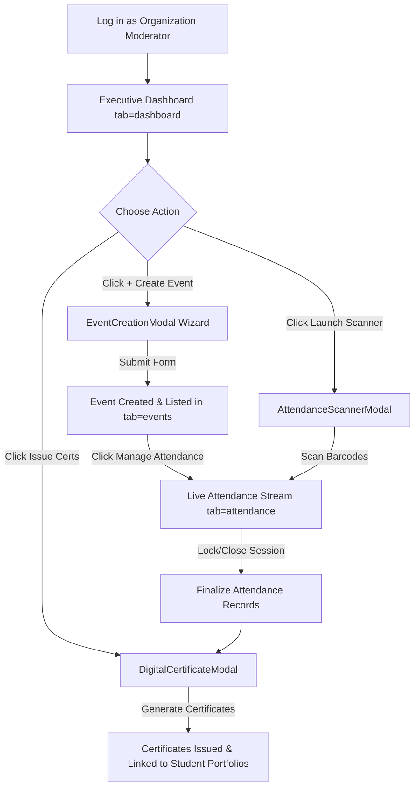

# AchieveNest System Specification: Organization Moderator Portal

This document provides a comprehensive, step-by-step feature specification for the **Organization Moderator Portal** in the **AchieveNest** application ecosystem. It covers all navigation views, dashboard sections, interactive controls, modal flows, and step-by-step user click pathways.

---

## 1. Portal Architecture & Navigation Overview

The **Organization Moderator Portal** (`active_role_context: 'organization_moderator'`) empowers student organization moderators and student council officers (e.g., Computer Society NDMU) to manage university events, monitor real-time QR attendance sessions, issue accredited digital certificates, and maintain organization profile records.

### Primary Sidebar Navigation Bar
* **Executive Dashboard** (`/personnel/dashboard?tab=dashboard`)
* **Manage Events** (`/personnel/dashboard?tab=events`)
* **Attendance Sessions** (`/personnel/dashboard?tab=attendance`)
* **Manage Profile** (`/personnel/dashboard?tab=profile`)
* **Account Controls**:
  * **Notifications** (`/notifications`)
  * **Settings** (`/student/settings`)
  * **Logout** (Session Termination)

---

## 2. Dashboard Section: Executive Overview (`tab=dashboard`)

The **Executive Overview** serves as the central command dashboard for organization moderators, presenting real-time operational metrics and quick access triggers.

### A. Organization Header Card
- **Visual Elements**: Organization Logo (`CEAC`), Organization Name (**Computer Society NDMU**), Org Code (**CEAC**), Department (**College of Engineering, Architecture, and Computing**), Academic Year (**AY 2025-2026**), and Assigned Moderator Name (**Dr. Ana Reyes**).
- **Accreditation Badge**: Displays `OSAD Accredited Organization 🛡️` status indicator.

### B. Real-Time Operational Metrics Cards (Interactive Filter Cards)
1. **`EVENTS (AY 2025-2026)`**: Displays the total count of organization events for the active academic year (e.g., `4 Events`).
   - **Click Action**: Navigates directly to the **Manage Events** workspace (`tab=events`).
2. **`TOTAL ATTENDEES`**: Displays cumulative verified attendee check-ins across all events (e.g., `606 Attendees`).
   - **Click Action**: Navigates directly to the **Attendance Sessions** hub (`tab=attendance`).
3. **`DIGITAL CERTS ISSUED`**: Displays total accredited digital certificates generated (e.g., `150 Issued`).
   - **Click Action**: Opens `DigitalCertificateModal.jsx` to preview certificate templates and issuance logs.
4. **`REGISTERED MEMBERS`**: Displays active organization member count (e.g., `45 Members`).
   - **Click Action**: Switches to the **Manage Profile** section (`tab=profile`).

### C. Quick Action Toolbar & User Click Pathways

#### 1. "+ Create New Event" Button
- **User Click Action**: Clicking the green **"+ Create New Event"** button opens the **Event Creation Modal** (`EventCreationModal.jsx`).
- **Workflow**: Launches a 4-step event creation wizard (Basic Info $\rightarrow$ Schedule & Venue $\rightarrow$ Capacity & Eligibility $\rightarrow$ Digital Certificate Setup).

#### 2. "Live Attendance Scanner" Button
- **User Click Action**: Clicking the amber **"Live Attendance Scanner"** button opens the **Live Attendance Scanner Modal** (`AttendanceScannerModal.jsx`).
- **Workflow**: Activates the camera scanner for real-time barcode/QR scanning or manual Student ID check-in.

#### 3. "Digital Certificates" Button
- **User Click Action**: Clicking the button opens the **Digital Certificate Modal** (`DigitalCertificateModal.jsx`).
- **Workflow**: Selects an event to preview template graphics, signatory details, and auto-dispatch status.

### D. Showcase Events Grid & Event Card Options Menu
Each event card features an **Event Card Options Dropdown Menu** (`EventCardOptionsMenu.jsx`) and direct action buttons:
- **`👁️ Preview` Button**: Opens the full event summary modal/view.
- **`📱 Attendance` Button**: Switches directly to `tab=attendance` with the target event active.
- **`⚙️ 3-Dots Options Menu`**:
  1. **Preview Event Details**: Full summary view.
  2. **Monitor Live Attendance**: Switches to attendance hub.
  3. **Launch QR Scanner**: Opens camera barcode scanner.
  4. **Edit Event Details**: Opens pre-populated event creation wizard.
  5. **Certificate & Auto-Dispatch**: Previews certificate template & verifies automatic portfolio delivery status.
  6. **Export Attendance CSV**: Instantly generates and downloads `.csv` attendance roster.
  7. **Archive Event**: Archives the event with confirmation prompt.

### E. Automated Certificate Delivery Logic
When an event is created with certificate settings enabled:
- **Automatic Dispatch on Event Close**: Once the event concludes or when the moderator closes the attendance session (`handleSessionControl('Closed')`), official accredited digital certificates are **automatically transmitted directly into attending students' Student Achievement Portfolios**. No manual individual sending is required.

---

## 3. Manage Events Section (`tab=events`)

The **Manage Events** section provides complete lifecycle management for university events, seminars, workshops, and general assemblies.

### A. Event Search & Filter Controls
- **Search Bar Input**: Real-time text filter by Event Title, Venue, or Description.
- **Filter Tabs**:
  * **All Events**: Displays the complete event registry.
  * **Upcoming**: Filters for future scheduled events.
  * **Ongoing**: Filters for currently active events.
  * **Completed**: Filters for concluded events.
  * **Archived**: Filters for past archived event records.

### B. Event Cards & Action Controls
Each event card displays comprehensive event metadata:
- Event Title (e.g., *Computer Society Tech Summit 2026*)
- Date & Time Range (e.g., *Feb 20, 2026 • 8:00 AM - 5:00 PM*)
- Venue & Location (e.g., *NDMU Convention Center*)
- Capacity Gauge (e.g., *250 / 300 Registered*)
- Event Status Badge (`Upcoming`, `Ongoing`, `Completed`, `Archived`)

#### User Click Pathways per Event Card:

1. **Click "Edit Event" (Pencil Icon)**
   - Opens `EventCreationModal.jsx` pre-populated with existing event parameters.
   - **Click "Save Changes"**: Persists updated event date, venue, or capacity limits.

2. **Click "Manage Attendance" (QrCode / Check Icon)**
   - Switches the active tab to `tab=attendance` and automatically loads the selected event into the live attendance session monitor.

3. **Click "Issue Certificates" (Award Icon)**
   - Opens `DigitalCertificateModal.jsx` pre-selected for the target event.

4. **Click "Archive / Delete Event" (Trash Icon)**
   - Triggers a confirmation prompt (`"Are you sure you want to archive this event?"`).
   - Upon confirmation, updates the event status to `Archived`.

---

## 4. Attendance Sessions & Live Stream Section (`tab=attendance`)

The **Attendance Sessions** section is the core real-time monitoring engine for event check-ins, barcode verification, and officer scanning operations.

### A. Student Officer Barcode Lock & Authentication Gatekeeper (`AttendanceScannerModal.jsx`)
To ensure institutional security, access control, and complete audit accountability:
- **Mandatory Officer Authentication Lock**: When an assigned Student Officer opens the scanner terminal, the scanner opens in a **`🔒 Terminal Locked`** state.
- **Officer Barcode Scan Step**: The Student Officer MUST scan or enter their official **NDMU Student Officer ID Barcode** (e.g. `OFFICER-2024-001 (Juan Dela Cruz - CompSoc VP)`).
- **Active Duty Shift Badge**: Upon barcode verification, the terminal unlocks with a green operator indicator: `🟢 Active Officer: Juan Dela Cruz (CompSoc Vice President)`.
- **Audit Trail Logging**: Every scanned student attendance check-in is stamped with `Verified Student Officer: Juan Dela Cruz`.
- **"Switch Officer / End Duty" Button**: Re-locks the terminal when officers transfer gate scanning duties.

### B. Event Selector & Session Safeguard Bar
- **Event Switcher Dropdown**: Allows the moderator to toggle between active events (e.g., *Tech Summit 2026*, *AI Workshop*, *General Assembly*).
- **Session Status Safeguard Controls**:
  - **Status Indicator Badge**: Displays real-time status (`Active 🟢`, `Locked 🔒`, `Closed 🔴`).
  - **"Lock / Unlock Session" Toggle Button**:
    - **User Click Action**: Clicking **"Lock Session"** prevents new attendance scans from being recorded (useful during break times or after entry cutoff). Clicking **"Unlock Session"** resumes scan acceptance.
  - **"End / Close Session" Button**:
    - **User Click Action**: Triggers a confirmation modal to permanently close the attendance session. Once closed, attendance records are finalized for certificate issuance.
  - **"Copy Public Scanner Link" Button**:
    - **User Click Action**: Copies the secure link (`http://localhost:5173/scanner?evt=evt-1`) to the clipboard for assigned student officers.
    - Displays a temporary success toast notification (`"Scanner Link Copied! 📋"`).
  - **"Export Attendance CSV" Button**:
    - **User Click Action**: Generates and downloads a `.csv` spreadsheet containing full attendee records (Student ID, Full Name, Program, Timestamp, Scanning Officer, Status).

### C. Live Attendance Stream Table & Manual Entry
- **Real-time Live Table**: Automatically updates whenever an officer scans a barcode anywhere on campus via WebSocket / Storage events (`achievenest_attendance_update`).
- **Table Columns**:
  1. **Student Name & Avatar**
  2. **Student ID** (e.g., `2024-01234`)
  3. **Academic Program & Year** (e.g., `BSIT - Year 3`)
  4. **Scan Timestamp** (e.g., `8:14:22 AM`)
  5. **Scanning Officer** (e.g., `Verified Officer: Juan Dela Cruz (VP)`)
  6. **Attendance Status Tag** (`Present 🟢`, `Late 🟡`, `Flagged 🔴`)

#### Manual Attendance Entry Pathway
- **User Click Action**: Clicking **"+ Add Manual Entry"**:
  - Opens an inline modal form allowing moderators to manually input a Student ID for students without physical barcodes.
  - **Fields**: Student ID, Student Full Name, Program, Remarks.
  - **Click "Submit Manual Entry"**: Instantly adds the student to the verified attendance list.

---

## 5. Manage Profile Section (`tab=profile`)

The **Manage Profile** section handles organization registration details, contact info, and official accreditation metadata.

### A. Profile Information Card
Displays current organization records:
- Organization Full Name
- Organization Abbreviation / Code
- Parent College / Department
- Academic Year Context
- Official Faculty Moderator Name
- Organization Contact Email & Social Links
- Official Organization Description & Mission

### B. Edit Profile Workflow & User Clicks
1. **Click "Edit Profile" Button**:
   - Toggles form fields into editable input state.
2. **Form Input Modifications**:
   - Update Organization Description, Contact Email, Facebook Page URL, or Office Location.
3. **Click "Save Changes" Button**:
   - Validates input fields and saves updated profile data.
   - Displays a success confirmation toast (`"Organization Profile Updated Successfully! ✨"`).

---

## 6. Account & Global Settings Section

### A. Notifications View (`/notifications`)
- **User Click Action**: Clicking **Notifications** in the lower sidebar section navigates to `/notifications`.
- **Features**:
  - View event submission approvals from OSAD.
  - View accreditation status updates.
  - View student verification requests and system alerts.

### B. Account Settings View (`/student/settings`)
- **User Click Action**: Clicking **Settings** in the lower sidebar section navigates to `/student/settings`.
- **Features**:
  - **Security & Password**: Update account login password.
  - **Notification Preferences**: Toggle email alerts for event registrations and attendance summaries.
  - **Active Role Switcher**: Quick-switch between Moderator, Personnel, or Student role contexts.

### C. Logout Workflow
- **User Click Action**: Clicking **Logout** (red button in lower sidebar):
  - Clears active authentication tokens (`authService.logoutUser()`).
  - Redirects user back to the primary Login / Landing page (`/`).

---

## 7. Step-by-Step Modal Workflows & Interaction Matrix

| Modal Component | Trigger Button Click | Form / Interactive Elements | Final Action Click | Resulting System Action |
| :--- | :--- | :--- | :--- | :--- |
| **`EventCreationModal.jsx`** | Click **"+ Create New Event"** on Dashboard or Events page | **Step 1:** Title, Category, Description **Step 2:** Date, Time, Venue **Step 3:** Capacity, Eligible Programs **Step 4:** Certificate Enable & Signatories | Click **"Create Event"** / **"Save Changes"** | Saves event to system registry, generates event ID, updates metrics. |
| **`AttendanceScannerModal.jsx`** | Click **"Launch QR Scanner"** or **"Live Officer QR Scanner"** | • Live Camera Viewport • Manual Barcode Input Textbox • Audio/Visual Flash Feedback | Click **"Scan"** or aim camera at barcode | Verifies barcode against database, adds student to live attendance list, plays beep sound. |
| **`DigitalCertificateModal.jsx`** | Click **"Issue Digital Certificates"** | • Select Target Event • Certificate Template Preview • Signatory Name & Verification Hash | Click **"Issue Certificates to All Verified Attendees"** | Generates digital PDF certificates with QR verification hash for all checked-in students. |

---

## 8. Summary of Organization Moderator Workflow

