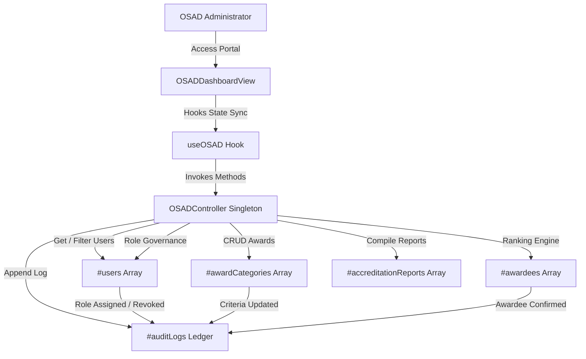

# AchieveNest — OSAD Admin Portal Features & System Specification

This document provides an exhaustive, step-by-step specification of all system features, layout sections, interactive elements, data models, algorithm workflows, and user click pathways for the **OSAD Admin Portal** (Office of Student Affairs & Services) in the **AchieveNest** application ecosystem.

---

## 1. Role Scope & Architectural Overview

### A. Role Definition & Core Mandate
- **User Role**: OSAD Administrator / OSAD Staff (`role_context: 'osad_staff'`, e.g., *Director Marcus Vance, Ph.D. — Director, Office of Student Affairs & Services*).
- **Primary Responsibility**: Central university-wide oversight of student affairs, governance of faculty administrative roles (assigning and revoking Program Coordinator and Organization Moderator privileges), definition of multi-criteria award scoring standards and certificate templates, execution of automated honor roll candidate ranking algorithms, compilation and export of official accreditation reports (PACUCOA, CHEd, OSAD Parangal), and real-time monitoring of system security audit logs.

### B. OOP & MVC Architectural Compliance
Strictly following the project guidelines in [`SYSTEM_ARCHITECTURE_ANALYSIS.md`](file:///c:/Users/Admin/.gemini/antigravity/scratch/achievenest/SYSTEM_ARCHITECTURE_ANALYSIS.md) and [`AGENTS.md`](file:///c:/Users/Admin/.gemini/antigravity/scratch/achievenest/.agents/AGENTS.md):
- **Domain Controller ([`src/controllers/OSADController.js`](file:///c:/Users/Admin/.gemini/antigravity/scratch/achievenest/src/controllers/OSADController.js))**:
  - Encapsulates private fields (`#users`, `#awardCategories`, `#awardees`, `#auditLogs`, `#accreditationReports`) inside an ES6 singleton class.
  - Controls business logic for role assignments/revocations, category CRUD, candidate ranking algorithms, report compilation, and transaction logging.
- **Bridge Hook ([`src/hooks/useOSAD.js`](file:///c:/Users/Admin/.gemini/antigravity/scratch/achievenest/src/hooks/useOSAD.js))**:
  - Custom React hook connecting View components to [`OSADController.js`](file:///c:/Users/Admin/.gemini/antigravity/scratch/achievenest/src/controllers/OSADController.js), providing state synchronization, filter state management, and toast notifications.
- **Lightweight View ([`src/components/osad/OSADDashboardView.jsx`](file:///c:/Users/Admin/.gemini/antigravity/scratch/achievenest/src/components/osad/OSADDashboardView.jsx))**:
  - Decoupled React component handling rendering, layout structure, responsive grids, Tailwind CSS glassmorphic aesthetics, and interactive modal dialogs.
- **Page Container ([`src/pages/OSADDashboard.jsx`](file:///c:/Users/Admin/.gemini/antigravity/scratch/achievenest/src/pages/OSADDashboard.jsx))**:
  - Top-level page wrapper embedding [`OSADDashboardView`](file:///c:/Users/Admin/.gemini/antigravity/scratch/achievenest/src/components/osad/OSADDashboardView.jsx).

### C. Sidebar Navigation & URL Routing Structure
The OSAD Admin Portal utilizes URL search parameters (`/osad/dashboard?tab=<tab_name>`) for direct, linkable tab routing:

| Sidebar Navigation Label | Tab Query Parameter | Primary Purpose |
| :--- | :--- | :--- |
| **OSAD Command Center** | `tab=overview` | Executive metrics, quick-action navigation hub, college achievement breakdown |
| **Account Management** | `tab=accounts` | Search university accounts, assign/revoke Coordinator & Moderator roles |
| **Award Categories** | `tab=awards` | Configure multi-criteria award standards, point multipliers & certificate templates |
| **Identify Awardees** | `tab=awardees` | Run automated honor roll ranking algorithm & confirm official awardees |
| **Accreditation Reports** | `tab=reports` | Live inspection & export of PACUCOA, CHEd, & OSAD annual audit reports |
| **System Audit Logs** | `tab=audit` | Real-time security trail tracking administrative transactions and role modifications |

---

## 2. Section 1: OSAD Executive Command Center (`tab=overview`)

The **Executive Command Center** serves as the primary governance dashboard, delivering high-level university metrics, rapid navigation triggers, and real-time achievement analytics.

```
+-----------------------------------------------------------------------------------+
| OSAD Executive Command Center Banner                                              |
| Central Governance | Director Marcus Vance, Ph.D. | 97.8% PACUCOA & CHEd Ready       |
+-----------------------------------------------------------------------------------+
| Quick Action Hub: Account Governance | Award Engine | Reports | System Security Logs  |
+-----------------------------------------------------------------------------------+
| KPI Cards: Enrolled Students | Verified Records | Active Awards | Security Status  |
+-----------------------------------------------------------------------------------+
| Analytics: College Distribution Bar Graph    | Recent Confirmed Awardees List    |
+-----------------------------------------------------------------------------------+
```

### A. Executive Banner & Header
- **Context Badge**: `CENTRAL EXECUTIVE GOVERNANCE • AY 2025-2026 • Main Campus`
- **Director Profile**: `Director Marcus Vance, Ph.D. • Central oversight suite for university user account governance, administrative role assignment, automated honor roll ranking, and institutional accreditation audit logs.`
- **Accreditation Readiness Indicator**: Glass card displaying `97.8% PACUCOA & CHEd Ready` with verified shield icon.

### B. Executive Quick Action & Governance Hub
Four high-impact quick-action shortcut buttons for immediate navigation:
1. **Account & Role Governance**: Triggers switch to `tab=accounts`. Subtext: *Assign Program Coordinator & Org Moderator roles to faculty*.
2. **Award Ranking Engine**: Triggers switch to `tab=awardees`. Subtext: *Run automated multi-criteria honor roll scoring algorithm*.
3. **Accreditation Reports**: Triggers switch to `tab=reports`. Subtext: *Export PACUCOA, CHEd, & OSAD annual audit PDFs/CSVs*.
4. **System Security Logs**: Triggers switch to `tab=audit`. Subtext: *Inspect real-time administrative logs and security trail*.

### C. High-Impact KPI Counter Cards Grid
- **`Enrolled Students`**: Displays total registered student count (e.g., `5 Accounts`) across 5 Colleges & 18 Programs.
- **`Verified Records`**: Displays campus-wide verified achievement submissions (e.g., `1254 Verified Records`, `+14.2% vs Last Academic Term`).
- **`Active OSAD Awards`**: Displays active university award categories (e.g., `5 Standards`, `OSAD Templates 01-05 Attached`).
- **`Security & Audit Trail`**: Displays overall system security status (`Protected`, `Zero Unresolved Audit Alerts`).

### D. University Achievement Analytics & Recent Awardees Feed
- **College Distribution Bar Graph**:
  - Visual breakdown of verified achievements per college:
    - **CEAC** (Engineering, Architecture & Computing): `420 Achievements (33.5%)`
    - **CBA** (Business & Accountancy): `310 Achievements (24.7%)`
    - **CAS** (Arts & Sciences): `280 Achievements (22.3%)`
    - **CED** (College of Education): `244 Achievements (19.5%)`
- **Recent Confirmed Awardees Feed**:
  - Compact feed showing student name, award title, program, total points, and rank badge (`Rank #1`, `Rank #2`, `Rank #3`).
  - Includes **"View All"** quick link redirecting to `tab=awardees`.

---

## 3. Section 2: User Account Governance & Administrative Role Assignment (`tab=accounts`)

The **Account Management & Role Assignment Suite** empowers OSAD administrators to inspect all user accounts across the university ecosystem and delegate administrative roles to faculty members.

### A. Control Bar & Search Filter
- **Role Filter Pills**: `All Accounts` | `Students` | `Personnel & Faculty`
- **Real-Time Search Bar**: Instant text search filtering by full name, Student ID / Employee ID (e.g., `EMP-7491`), department, or program.

### B. Account Governance Table Schema

| Column Name | Description & Data Formatting |
| :--- | :--- |
| **User Details** | Full Name & NDMU Email address |
| **ID Number** | Monospaced Student ID (`2023-10492`) or Employee ID (`EMP-[#2d8a4e]-201`) |
| **Role Context** | Semantic Pill Badge: `Student` (Emerald) vs `Faculty / Personnel` (Purple) |
| **Department / Program** | Academic program or department assignment |
| **Assigned Administrative Roles** | Active administrative role badges with inline revocation triggers |
| **Actions** | Role assignment trigger buttons (`+ Assign Coordinator`, `+ Assign Moderator`) |

### C. Inline Role Revocation Workflow
- **Revoke Button (`×`)**: Clicking the inline `×` on any assigned role badge invokes `revokeRole(userId, roleId)` in [`OSADController.js`](file:///c:/Users/Admin/.gemini/antigravity/scratch/achievenest/src/controllers/OSADController.js).
- **Data Cleanup**: Nullifies `coordinator_program` or `moderator_org` on the target user object.
- **Audit & Toast**: Logs a `ROLE_REVOCATION` entry in audit trail and displays toast feedback: `"Revoked role [program_coordinator] from Engr. Roberto Cruz"`.

### D. Role Assignment Modal Dialogs
When an administrator clicks `+ Assign Coordinator` or `+ Assign Moderator`:
1. **Target User Header**: Displays target faculty member's name and department.
2. **Program / Organization Dropdown**:
   - **Program Coordinator Modal**: Select from `BS Computer Science`, `BS Information Technology`, `BS Civil Engineering`, `BS Business Administration`.
   - **Organization Moderator Modal**: Select from `Computer Society NDMU`, `Junior Executive Club`, `Supreme Student Council`, `Civil Engineering Association`.
3. **Form Submission**:
   - Executes `assignProgramCoordinator()` or `assignOrganizationModerator()`.
   - Adds `ROLE_ASSIGNMENT` record to central audit log.
   - Triggers confirmation toast: `"Assigned Program Coordinator role for [BS Computer Science] to Engr. Roberto Cruz"`.

---

## 4. Section 3: Award Categories & Multi-Criteria Scoring Setup (`tab=awards`)

The **Award Management Module** enables OSAD administrators to define university-wide recognition standards, set point eligibility thresholds, assign scoring weight multipliers, and bind official OSAD certificate templates.

### A. Interactive Award Category Cards Grid
Displays active award criteria cards with the following attributes:
- **Category Pill**: `Student Leadership`, `Research & Innovation`, `Sports & Athletics`, `Culture & Arts`, `Academic Excellence`.
- **Status Badge**: `Active` (Emerald) vs `Inactive` (Slate).
- **Min Points Threshold**: Minimum total points required for candidate eligibility (e.g., `300 pts`).
- **Weight Multiplier**: Category scoring multiplier (e.g., `1.5x`, `2.0x`).
- **Attached OSAD Certificate Template**: Displays attached template name and ID (e.g., `Certificate of Leadership & Merit (OSAD-TPL-02)`).

### B. Create Award Category Modal Workflow
Clicking **"Create Award Category"** opens a modal containing:
- **Award Title Input**: Name of the award (e.g., *Outstanding Student Researcher of the Year*).
- **Category Type Selector**: Dropdown menu for category classification.
- **Min Points & Weight Multiplier Inputs**: Numeric threshold and multiplier values.
- **Attached Template Selector**: Dropdown to select from the official OSAD Certificate Template Vault:
  - `OSAD-TPL-01`: Official NDMU Certificate of Participation
  - `OSAD-TPL-02`: Certificate of Leadership & Merit
  - `OSAD-TPL-03`: Certificate of Workshop Completion
  - `OSAD-TPL-04`: Excellence & Special Distinction Award
  - `OSAD-TPL-05`: NDMU Sports & Athletics Accreditation Certificate
- **Description & Criteria Notes**: Detailed text area for award eligibility guidelines.
- **Save Action**: Updates [`OSADController.js`](file:///c:/Users/Admin/.gemini/antigravity/scratch/achievenest/src/controllers/OSADController.js), logs `AWARD_CATEGORY_CREATED` event, and refreshes the view.

---

## 5. Section 4: Automated Candidate Identification & Ranking Engine (`tab=awardees`)

The **Automated Ranking Engine** evaluates all student achievement records against defined award criteria, generates weighted scores, presents top rankers on an interactive leaderboard, and records confirmed awardees into the official university ledger.

```
+-----------------------------------------------------------------------------------+
| Award Category Selector: [ Leadership Excellence Award (300 pts min) v ]          |
| Action Button: [ Sparkles Run Ranking Engine ]                                    |
+-----------------------------------------------------------------------------------+
| Student Points Leaderboard & Analytics Graph                                      |
| Filter Pills: All Students | CEAC (Engineering & IT) | CBA (Business)            |
| Top 3 Podium: 🥇 #1 Maria Santos (410 PTS) | 🥈 #2 Samantha Ray | 🥉 #3 Juan Cruz |
| Bar Graph: Scale 0 to 500 PTS (Horizontal progress bars per student)              |
+-----------------------------------------------------------------------------------+
| Evaluated Ranked Candidates Table (Action: [ Confirm Awardee ])                  |
+-----------------------------------------------------------------------------------+
| Official Confirmed OSAD Awardees Roster Ledger                                   |
+-----------------------------------------------------------------------------------+
```

### A. Candidate Evaluation Algorithm
When the user selects an award category and clicks **"Run Ranking Engine"**:
1. **Filtering**: Identifies all student accounts where `total_points >= category.min_points`.
2. **Weighted Scoring Calculation**:
$$\text{Weighted Score} = \text{Math.round}(\text{total\_points} \times \text{weight\_multiplier})$$
3. **Sorting & Rank Assignment**: Sorts candidates descending by `weighted_score` and assigns sequential rank indices (`Rank #1`, `Rank #2`, etc.).
4. **Output**: Populates `generatedCandidates` state table.

### B. Student Points Leaderboard & Analytics Graph
- **College Filter Pills**: Filter leaderboard graph by `All Students`, `CEAC`, or `CBA`.
- **Top 3 Podium Cards**:
  - **🥇 #1 Gold Ranker Card**: Gold border & gradient background, large point badge, verified proof count, and gold progress bar.
  - **🥈 #2 Silver Ranker Card**: Slate styling, rank badge, total points, and relative progress bar.
  - **🥉 #3 Bronze Ranker Card**: Amber/bronze styling, rank badge, total points, and relative progress bar.
- **Visual Points Comparison Bar Graph**:
  - Monospace 0 to 500 PTS axis ticks scale.
  - Animated horizontal progress bars for each student with color-coded gradients based on rank (`#1 Gold/Emerald`, `#2 Deep Emerald`, `#3 Slate/Emerald`).

### C. Candidate Confirmation Workflow
In the evaluated candidates table (`generatedCandidates`):
- Click **"Confirm Awardee"** on any candidate row:
  - Invokes `confirmAwardee(candidate)` in [`OSADController.js`](file:///c:/Users/Admin/.gemini/antigravity/scratch/achievenest/src/controllers/OSADController.js).
  - Appends record to `#awardees` array with status `Confirmed` and current ISO timestamp.
  - Increments `confirmed_awardees` count on the respective award category.
  - Generates `AWARDEE_CONFIRMATION` log entry (`SUCCESS` severity).
  - Removes candidate from pending evaluation table and updates the **Official Confirmed OSAD Awardees Roster**.

---

## 6. Section 5: Accreditation Reports & Institutional Compliance Suite (`tab=reports`)

The **Accreditation Reports Suite** compiles university achievement data into standardized compliance audits required by accrediting bodies (PACUCOA, CHEd, and internal NDMU central administration).

### A. Interactive Report Selector Cards
Provides quick toggle selection between three pre-configured institutional audit reports:
1. **PACUCOA Level III Institutional Compliance Report** (PACUCOA Agency, `412 Student Recs`, `188 Faculty Recs`, `96.4% Compliance`).
2. **CHEd Regional Excellence & Student Welfare Audit** (CHEd Region XII Agency, `380 Student Recs`, `154 Faculty Recs`, `98.1% Compliance`).
3. **OSAD Annual University Honor Roll & Recognition Summary** (NDMU OSAD Central, `520 Student Recs`, `210 Faculty Recs`, `Approved for Parangal`).

### B. Live Report Document Content Inspection Panel
Selecting any report card renders a live document inspection view featuring:
- **Official Header Seal Banner**: NDMU Emblem, OSAD Department Title, Report Name, Target Agency, Period, and Generation Date.
- **Summary Metrics Grid**: Displays student accomplishment count, faculty achievement count, combined verified scope, and compliance index badge.
- **Section A: Departmental Achievement & Compliance Breakdown**:
  - Table breaking down student records, faculty records, verification rate (e.g., `98.2%`), and audit status per college (`CEAC`, `CBA`, `CAS`, `CED`).
- **Section B: Sample Verified Bundled Accomplishment Entries**:
  - Table of audited accomplishment entries showing Title, Category, Owner/Faculty, Department, Verification Badge (`OSAD Verified`, `HR Verified`), and Date.
- **Section C: Official Signatory Approval Box**:
  - Displays signatory credentials for **Director Marcus Vance, Ph.D.** (*Director, OSAD*) and NDMU Central Registrar seal with audit serial `NDMU-OSAD-2026-ACC-882`.

### C. Full-Screen Inspection Modal & PDF Export Engine
- **Full-Screen Inspection Button**: Opens `isPreviewModalOpen` modal dialog presenting an un-truncated, full-screen document view.
- **Export Active Report PDF Button**: Triggers `handleExportPDF()`, displaying feedback toast: `"Exported [PACUCOA Level III Institutional Compliance Report] as Official PDF Document!"`.

---

## 7. Section 6: System Security & Transaction Audit Logs (`tab=audit`)

The **System Security Logs Module** provides an immutable, real-time audit trail of all administrative transactions, role modifications, criteria updates, and report generation events.

### A. Search & Severity Filter Bar
- **Text Search Bar**: Real-time filtering by admin username (e.g., *Director Marcus Vance*), action type, target entity, or transaction details.
- **Severity Filter Dropdown**: Filter by `All Severities`, `INFO`, `SUCCESS`, or `WARNING`.

### B. Security Audit Log Table Schema

| Timestamp | Admin User | Action Type | Target Entity | Transaction Details | Severity |
| :--- | :--- | :--- | :--- | :--- | :--- |
| `2026-07-27 22:15:40` | Director Marcus Vance (OSAD) | `ROLE_ASSIGNMENT` | Engr. Roberto Cruz | Assigned role [Program Coordinator] for BS Computer Science | `INFO` |
| `2026-07-27 21:04:12` | Director Marcus Vance (OSAD) | `ROLE_ASSIGNMENT` | Dr. Ana Reyes | Assigned role [Organization Moderator] for Computer Society NDMU | `INFO` |
| `2026-07-27 19:30:00` | Director Marcus Vance (OSAD) | `AWARD_CRITERIA_UPDATE` | Leadership Excellence Award | Updated point threshold to 300 pts and weight multiplier to 1.5x | `INFO` |
| `2026-07-26 16:45:10` | Director Marcus Vance (OSAD) | `AWARDEE_CONFIRMATION` | Maria Clara Santos | Confirmed awardee status for Institutional Honor Roll (Rank #1) | `SUCCESS` |
| `2026-07-25 14:12:05` | System Automated Guard | `ACCREDITATION_REPORT_GEN` | PACUCOA Year-End Audit | Compiled PACUCOA Level III accreditation achievement summary PDF | `INFO` |

### C. Export Audit CSV Action
- Click **"Export Audit CSV"**: Invokes CSV export handler, generating a downloadable audit log spreadsheet and displaying confirmation toast: `"Exported Security Audit Trail CSV!"`.

---

## 8. Auxiliary OSAD Features & Cross-System Integrations

### A. OSAD Password Reset Helpdesk Ticket System
- **Integration**: Located in [`AccountPage.jsx`](file:///c:/Users/Admin/.gemini/antigravity/scratch/achievenest/src/pages/AccountPage.jsx#L710-L745).
- **Workflow**: Allows students or personnel who forget their credentials to submit a fallback helpdesk ticket directly to OSAD.
- **Ticket Format**: Generates ticket numbers like `#OSAD-2026-8912` marked as `Pending OSAD Staff Verification`.

### B. Signature Vault Integration
- **Integration**: [`signatureVault.js`](file:///c:/Users/Admin/.gemini/antigravity/scratch/achievenest/src/utils/signatureVault.js#L58).
- **Purpose**: Stores official digital signatures for OSAD signatories (*Prof. Juan Dela Cruz — OSAD Director*) attached to digital barcodes, certificates, and event accreditation cards.

### C. Digital Barcode ID Verification
- **Integration**: [`DigitalBarcodeIDCard.jsx`](file:///c:/Users/Admin/.gemini/antigravity/scratch/achievenest/src/components/student/DigitalBarcodeIDCard.jsx#L88) & [`ExportPortfolioPreviewModal.jsx`](file:///c:/Users/Admin/.gemini/antigravity/scratch/achievenest/src/components/student/ExportPortfolioPreviewModal.jsx#L59).
- **Purpose**: Binds student digital achievement barcode cards to OSAD Event Scanners and certifies student portfolio exports with OSAD verification badges.

---

## 9. Verification & Data Flow Parity Matrix



This specification represents the complete, authoritative reference for the **OSAD Admin Portal** in AchieveNest, fully aligned with OOP & MVC architectural standards and existing project specifications.
