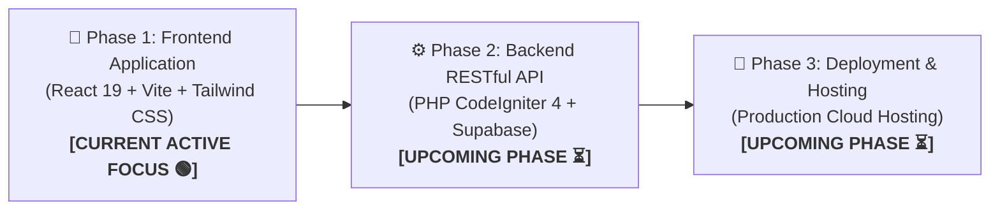
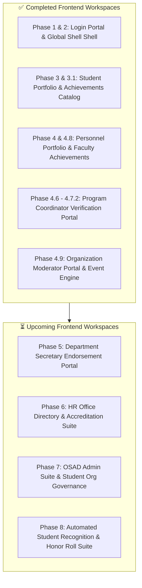

# AchieveNest Platform: Master Progress Roadmap & Lifecycle Status

**Notre Dame of Marbel University (NDMU)**  
*Web-Based Achievement, Portfolio, and Recognition Management System for Students and Personnel*

---

## 📍 1. Master High-Level System Lifecycle Timeline

---

## 🚦 2. Current Progress & Phase Breakdown

| Overall Phase | Development Domain | Scope & Core Technologies | Current Status | Completion % |
| :--- | :--- | :--- | :--- | :---: |
| **PHASE 1** | **Frontend Client Web Application** | React 19, Vite, Tailwind CSS 4, Lucide Icons, Client-Side Data Flow & State Management | 🟢 **ACTIVE DEVELOPMENT** | **65%** |
| **PHASE 2** | **Backend REST API & Database Integration** | PHP 8.3, CodeIgniter 4, PostgreSQL (Supabase), JWT Authentication, mPDF Engine | ⏳ **UPCOMING** | **0%** |
| **PHASE 3** | **Production Deployment & Server Hosting** | Vercel / NDMU Server Infrastructure, SSL, Custom Domain, Security Audits | ⏳ **UPCOMING** | **0%** |

---

## 🎨 Phase 1: Frontend Client Application [CURRENT ACTIVE FOCUS 🟢]

> [!IMPORTANT]
> **Active Development Location**: Workspace `c:\Users\Admin\.gemini\antigravity\scratch\achievenest`  
> All user interface components, interactive modal workflows, role-switching engines, and client-side data models are actively being built and verified inside this React frontend application.

### 📋 Detailed Module Progress Matrix

#### ✅ 1. Completed Frontend Modules
- [x] **Phase 0 & 1: Development Stack & Split-Screen Login Portal**: 50/50 NDMU Forest Green split layout with demo account presets.
- [x] **Phase 2: Global Shell Layout & Dynamic Role Switcher**: Top Header navbar, Notification popover, and multi-role context switcher (`Header.jsx`, `Sidebar.jsx`, `RoleSwitcher.jsx`).
- [x] **Phase 3 & 3.1: Student Portfolio & Achievements Catalog**: Digital NDMU ID Barcode modal, status filter pills, list/grid toggle, 3-step submission wizard, and CSV exporter.
- [x] **Phase 4 & 4.8: Personnel Professional Portfolio & Faculty Achievements**: Parity with student catalog for research outputs, training records, and PDF dossier exporter.
- [x] **Phase 4.6 - 4.7.2: Program Coordinator Verification Portal**: Department-scoped verification queue, full submitted field viewer, interactive student dossier modal, and coordinator settings.
- [x] **Phase 4.9: Organization Moderator Workspace & Event Engine**: Computer Society NDMU hero banner, 4 white metric cards (`Events: 4`, `Participants: 606`, `Certs: 150`, `Members: 45`), 2x2 event showcase grid with 3D graphics (`💻`, `🎯`, `⚽`, `🌱`), Live Barcode Scanner modal, and Digital Certificate preview generator.

#### ⏳ 2. Remaining Frontend Modules
- [ ] **Phase 5: Department Secretary Endorsement Portal**: Review faculty submissions and endorse entries to HR Office.
- [ ] **Phase 6: HR Office Directory & Accreditation Suite**: University-wide employee records and secretary role delegation.
- [ ] **Phase 7: OSAD Admin Suite**: Student org charter moderation and barcode scanner session generator.
- [ ] **Phase 8: Automated Student Recognition Engine**: Multi-criteria automated award ranking engine for Araw ng Parangal.

---

## ⚙️ Phase 2: Backend RESTful API & Database Integration [UPCOMING PHASE ⏳]

Once the entire frontend UI ecosystem is finalized and verified, backend development will commence:

1. **Database Schema Setup (PostgreSQL / Supabase)**:
   - Migration scripts for 22 relational database tables (`users`, `students`, `personnel`, `achievements`, `organizations`, `events`, `event_attendances`, etc.) per [achievenest_system_design.md](file:///c:/Users/Admin/.gemini/antigravity/scratch/achievenest/achievenest_system_design.md).
   - PostgreSQL Row Level Security (RLS) policies and trigger functions.

2. **REST API Endpoints Development (PHP CodeIgniter 4)**:
   - RESTful API controllers (`AuthAPI`, `AchievementAPI`, `VerificationAPI`, `OrganizationAPI`, `ReportAPI`).
   - JWT authentication middleware and role-based access control (RBAC).

3. **PDF & Verification Document Services**:
   - `mPDF` service for generating official NDMU printable certificates, faculty dossiers, and accreditation reports.
   - Verification QR Code link endpoint for public authenticity validation.

---

## 🚀 Phase 3: Deployment & Hosting Infrastructure [UPCOMING PHASE ⏳]

Final production release and deployment pipeline:

1. **Frontend Deployment**:
   - Host React application bundle on Vercel / Netlify / NDMU Web Server with custom domain mapping (`achievenest.ndmu.edu.ph`).
   - Configure HTTPS/SSL certificates and CDN caching rules.

2. **Backend Server & Database Hosting**:
   - Deploy CodeIgniter 4 REST API on production Linux web server.
   - Connect to Supabase Cloud PostgreSQL database instance.

3. **Institutional Audit & Compliance**:
   - PAASCU Accreditation report export audit.
   - System stress testing and security vulnerability scans.

---

## 📄 Key System Specifications & Reference Files

- 📘 **[achievenest_master_plan.md](file:///c:/Users/Admin/.gemini/antigravity/scratch/achievenest/achievenest_master_plan.md)** — Master Feature Roadmap & Clickable Component Specification.
- 📐 **[SYSTEM_ARCHITECTURE_ANALYSIS.md](file:///c:/Users/Admin/.gemini/antigravity/scratch/achievenest/SYSTEM_ARCHITECTURE_ANALYSIS.md)** — Architectural & OOP/MVC Standards.
- 🗄️ **[achievenest_system_design.md](file:///c:/Users/Admin/.gemini/antigravity/scratch/achievenest/achievenest_system_design.md)** — PostgreSQL Schema (22 Tables) & Backend API Specifications.
