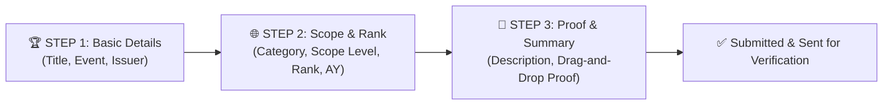

# AchieveNest NDMU Platform: Master Feature Roadmap & Clickable Component Specification

---

> [!NOTE]
> **Project Scope & Architecture Notice**:
> All implementation phases in this repository encompass the **Complete Frontend Client Web Application System** (built using React + Vite + TailwindCSS), featuring complete interactive UI components, dynamic state management, modal workflows, CSV exporters, role context switchers, and client-side data flows. Backend server API integration, database persistence, and server endpoints will be developed separately outside of Antigravity.

---

## 📊 1. Master System Status & Clickable Feature Matrix

This matrix provides an authoritative, complete inventory of all interactive buttons, cards, menus, modals, and links across the AchieveNest web application, detailing the exact behavior and display output triggered by each click.

### 🎓 A. Student Portal (`/student/dashboard` & `/student/achievements`)
| View / Component | Clickable Element | Interaction Type | Behavior & Display Output | Current Status |
| :--- | :--- | :--- | :--- | :--- |
| **Student Homepage** | `Digital ID Barcode` Button | Modal Popup | Opens `DigitalBarcodeIDCard` modal displaying NDMU Student ID, barcode graphics, and print button | ✅ **WORKING & CLICKABLE** |
| **Student Homepage** | `Submit New Achievement` Card | Navigation + Modal | Redirects to `/student/achievements` AND automatically opens `AchievementSubmissionModal` form overlay | ✅ **WORKING & CLICKABLE** |
| **Student Homepage** | `Edit Basic Information` Card | Modal Popup | Opens `EditBasicInfoModal` allowing editing of student contact info and academic details | ✅ **WORKING & CLICKABLE** |
| **Student Homepage** | `My Verified Certificates` Card | Category Filter | Filters timeline list to show verified student certificates only | ✅ **WORKING & CLICKABLE** |
| **Student Homepage** | Category Vault Cards | Filter & Scroll | Sets category filter and scrolls smoothly to timeline section | ✅ **WORKING & CLICKABLE** |
| **Achievements Catalog** | `Export Achievements` Button | CSV Download | Generates and downloads a structured CSV file (`AchieveNest_Student_Achievements.csv`) | ✅ **WORKING & CLICKABLE** |
| **Achievements Catalog** | `+ Add Achievement` Button | Modal Popup | Opens `AchievementSubmissionModal` overlay to attach document proof & submit entry | ✅ **WORKING & CLICKABLE** |
| **Achievements Catalog** | Stat Pills (Total / Verified / Pending) | Filter Grid | Filters achievement cards grid by verification status (`Verified`, `Pending Review`, `Returned`) | ✅ **WORKING & CLICKABLE** |
| **Achievements Catalog** | Grid 🔲 / List ☰ Toggle Buttons | Layout Toggle | Toggles card display between 2-column certificate card grid and compact row list view | ✅ **WORKING & CLICKABLE** |
| **Achievements Catalog** | "By Category" Sidebar Items | Filter Grid | Filters achievement cards grid by category (Academic, Leadership, Community, Sports, etc.) | ✅ **WORKING & CLICKABLE** |

### 👨‍🏫 B. Faculty & Personnel Portfolio (`/personnel/dashboard`)
| View / Component | Clickable Element | Interaction Type | Behavior & Display Output | Current Status |
| :--- | :--- | :--- | :--- | :--- |
| **Personnel Portfolio** | `Digital ID Barcode` Button | Modal Popup | Opens `DigitalBarcodeIDCard` modal with faculty employee ID, barcode, and designation | ✅ **WORKING & CLICKABLE** |
| **Personnel Portfolio** | `Submit New Accomplishment` Card | Modal Popup | Opens `PersonnelSubmissionModal` overlay to attach research/seminar proof | ✅ **WORKING & CLICKABLE** |
| **Personnel Portfolio** | `Edit Basic Information` Card | Modal Popup | Opens `EditBasicInfoModal` to update faculty rank, department, and credentials | ✅ **WORKING & CLICKABLE** |
| **Personnel Portfolio** | `My Verified Proofs` Card | Filter Timeline | Filters timeline cards to verified faculty accomplishments | ✅ **WORKING & CLICKABLE** |
| **Personnel Portfolio** | Category Vault Cards | Filter & Scroll | Sets category filter and scrolls smoothly to accomplishments timeline | ✅ **WORKING & CLICKABLE** |

### 🔄 C. Personnel Multi-Role Context Switcher (`Header.jsx` & `Sidebar.jsx`)
| View / Component | Clickable Element | Interaction Type | Behavior & Display Output | Current Status |
| :--- | :--- | :--- | :--- | :--- |
| **Top Header Menu** | Profile Avatar Dropdown | Popover Menu | Opens top-right profile popover menu (aligned right; `Switch To` hidden for students) | ✅ **WORKING & CLICKABLE** |
| **Header Dropdown** | `Switch To` Accordion | Submenu Toggle | Expands available administrative roles for personnel (excludes currently active view) | ✅ **WORKING & CLICKABLE** |
| **Header Dropdown** | `Program Coordinator` Option | Context Switch | Switches context to Program Coordinator; renders `CoordinatorDashboardView` & updates sidebar badge | ✅ **WORKING & CLICKABLE** |
| **Header Dropdown** | `Organization Account` Option | Context Switch | Switches context to Organization Moderator portal (purple role badge, distinct from blue Program Coordinator badge) | ✅ **WORKING & CLICKABLE** |
| **Header Dropdown** | `Department Secretary` Option | Context Switch | Switches context to Department Secretary endorsement view | ✅ **WORKING & CLICKABLE** |
| **Header Dropdown** | `Faculty / Personnel View` Option | Context Switch | Switches context back to default Faculty Professional Portfolio view | ✅ **WORKING & CLICKABLE** |

### 🛡️ D. Program Coordinator Verification Portal (`active_role_context === 'program_coordinator'`)
| View / Component | Clickable Element | Interaction Type | Behavior & Display Output | Current Status |
| :--- | :--- | :--- | :--- | :--- |
| **Coordinator View** | Stat Counter Cards | Overview Metrics | Displays 4 counters: Pending Reviews (1), Verified (3), Returned (1), Avg Review Time (2.5 hrs) | ✅ **WORKING & CLICKABLE** |
| **Coordinator View** | Scope Notice Banner | Program Scope | Restricts view to assigned degree program (*BS Computer Science*) | ✅ **WORKING & CLICKABLE** |
| **Coordinator View** | Pending Queue Item Card | Modal Popup | Opens student submission review modal with document proof preview | ✅ **WORKING & CLICKABLE** |
| **Coordinator View** | `Approve & Verify` Button | Action Trigger | Approves achievement, updates status to Verified, and increments stats | ✅ **WORKING & CLICKABLE** |
| **Coordinator View** | `Return with Remarks` Button | Action Trigger | Returns submission to student with required feedback remarks | ✅ **WORKING & CLICKABLE** |

### 🏢 D.1. Organization Moderator Portal (`active_role_context === 'organization_moderator'`)
| View / Component | Clickable Element | Interaction Type | Behavior & Display Output | Current Status |
| :--- | :--- | :--- | :--- | :--- |
| **Org Moderator View** | Header Role Badge | Context Indicator | Renders **Light-Green Organization Account Pill Badge** (`bg-emerald-500/20 text-emerald-100 border-emerald-500/30`) | ✅ **WORKING & CLICKABLE** |
| **Org Moderator View** | Stat Counter Cards | Overview Metrics | Displays 4 counters: Events This Year (4), Total Participants (606), Certs Issued (150), Active Members (45) | ✅ **WORKING & CLICKABLE** |
| **Org Moderator View** | `Create Event` Button | Modal Popup | Opens `EventCreationModal` with title, category, venue, and 3D banner icon selection | ✅ **WORKING & CLICKABLE** |
| **Org Moderator View** | `Start Attendance Session` Button | Modal Popup / Camera | Launches `AttendanceScannerModal` live barcode/QR scanner interface for student NDMU ID scanning | ✅ **WORKING & CLICKABLE** |
| **Org Moderator View** | `Issue Digital Certificates` Button | Action Trigger | Opens `DigitalCertificateModal` with NDMU certificate preview, verification QR code & PDF exporter | ✅ **WORKING & CLICKABLE** |
| **Org Moderator View** | `2x2 Event Cards Grid` | Showcase Cards | Renders event cards with 3D banners, status pills (Ongoing, Upcoming, Completed) & participant progress bars | ✅ **WORKING & CLICKABLE** |

### 🏢 E. Department Secretary Portal (`active_role_context === 'department_secretary'`)
| View / Component | Clickable Element | Interaction Type | Behavior & Display Output | Current Status |
| :--- | :--- | :--- | :--- | :--- |
| **Secretary View** | Submissions Queue Cards | Modal Popup | Opens faculty submission review modal with document proof preview | ⏳ **IN PLANNING (Phase 5)** |
| **Secretary View** | `Endorse to HR` Button | Action Trigger | Endorses faculty accomplishment to HR Office queue and stamps `Dept Endorsed` | ⏳ **IN PLANNING (Phase 5)** |
| **Secretary View** | `Return to Faculty` Button | Action Trigger | Returns faculty accomplishment submission with required correction remarks | ⏳ **IN PLANNING (Phase 5)** |

### 🏛️ F. HR Office Directory & OSAD Admin Suite
| View / Component | Clickable Element | Interaction Type | Behavior & Display Output | Current Status |
| :--- | :--- | :--- | :--- | :--- |
| **HR Staff Dashboard** | Faculty Directory & Accreditation | Management | Manages university-wide records, exports accreditation reports & assigns secretary roles | ⏳ **IN PLANNING (Phase 6)** |
| **OSAD Admin Suite** | Org Moderation & Attendance | Scanner Engine | Moderates student org charters, runs barcode scanner sessions & generates digital certificates | ⏳ **IN PLANNING (Phase 7)** |

---

## 🚀 2. Phased Implementation Roadmap & Button Specifications

### Phase 1: Core Design System & Theme Infrastructure [COMPLETED - ✅ IMPLEMENTED & WORKING]
- Established NDMU Forest Green (`#1b4332`), Emerald accent (`#2d8a4e`), and Mint token design system in `src/index.css`.

### Phase 2: Application Shell Layout [COMPLETED - ✅ IMPLEMENTED & WORKING]
- Implemented `MainLayout.jsx`, `Header.jsx`, `Sidebar.jsx`, and `NotificationPopover.jsx`.

### Phase 3: Student Portfolio & Digital NDMU Barcode ID Interface [COMPLETED - ✅ IMPLEMENTED & WORKING]
- Implemented `StudentDashboard.jsx`, `DigitalBarcodeIDCard.jsx`, and `AchievementSubmissionModal.jsx`.

### Phase 3.1: Dedicated Student Achievements Catalog & Workspace [COMPLETED - ✅ IMPLEMENTED & WORKING]
- Implemented `StudentAchievementsPage.jsx` (`/student/achievements`) featuring grid/list view mode toggles, category/status filters, CSV export, category breakdown sidebar widget, and homepage submission redirect.

#### 📋 Detailed Field & UI Text Specification: 3-Step Achievement Submission Wizard [COMPLETED - ✅ IMPLEMENTED & WORKING]

##### 🏆 STEP 1: Basic Achievement Details
- **Header Title**: Submit New Achievement
- **Header Subtitle**: Step 1 of 3: Basic Details
- **Step Badge 1**: `1. Basic Info` (Active Green Pill)

| Field Name | Label Text | Component Type | Placeholder / Helper Text | Validation |
| :--- | :--- | :--- | :--- | :--- |
| `title` | Award / Achievement Title * | Text Input | e.g. Dean's Lister - First Semester AY 2025-2026 | Required, Min 5 chars |
| `event_name` | Event / Competition Name * | Text Input | e.g. 12th SOCCSKSARGEN IT Summit / NDMU Intramurals 2025 | Required, Min 3 chars |
| `issuer_organization` | Issuing Body / Organization * | Text Input | e.g. NDMU CITE / DOST Region XII | Required |

- **Step 1 Action Buttons**:
  - `Cancel` (Ghost button → closes modal)
  - `Next: Scope & Rank →` (Primary Emerald CTA)

##### 🌐 STEP 2: Classification, Scope & Rank Weighting
- **Header Subtitle**: Step 2 of 3: Scope & Rank
- **Step Badge 2**: `2. Scope & Rank` (Active Green Pill)

| Field Name | Label Text | Component Type | Options List / Values | Validation |
| :--- | :--- | :--- | :--- | :--- |
| `category_id` | Category * | Dropdown Select | Academic, Leadership, Athletics, Volunteerism & Community, Arts & Culture | Required |
| `scope_level` | Geographic Scope / Level * | Dropdown Select | Institutional / Campus-Wide, Local / City Level, Regional (Region XII), National Level, International Level | Required |
| `rank_conferred` | Rank / Position Conferred * | Dropdown Select | Champion / 1st Place, 2nd Place, 3rd Place, Finalist / Runner-Up, Dean's Lister, Leadership Officer / Lead, Participant / Special Award | Required |
| `academic_year` | Academic Year * | Dropdown Select | AY 2025-2026, AY 2024-2025, AY 2023-2024 | Required |
| `semester` | Term / Semester * | Dropdown Select | 1st Semester, 2nd Semester, Summer Term | Required |
| `date_achieved` | Date Conferred * | Date Picker | MM / DD / YYYY | Required |

- **Step 2 Action Buttons**:
  - `← Back` (Returns to Step 1)
  - `Next: Proof & Submit →` (Primary Emerald CTA)

##### 📄 STEP 3: Supporting Proof & Summary Submission
- **Header Subtitle**: Step 3 of 3: Proof & Summary
- **Step Badge 3**: `3. Proof & Summary` (Active Green Pill)

| Field Name | Label Text | Component Type | Instruction / Helper Text | Validation |
| :--- | :--- | :--- | :--- | :--- |
| `description` | Narrative Description | Textarea (3 rows) | Brief details about the accomplishment, criteria met, or project abstract... | Optional |
| `document_url` | Supporting Evidence Document (PDF/JPG/PNG) * | Drag-and-Drop File Upload | Icon: Upload Cloud Primary Text: Click or drag certificate attachment here Subtext: PDF, JPG, PNG up to 5MB | Required |

- **Step 3 Action Buttons**:
  - `← Back` (Returns to Step 2)
  - `Submit Entry ✓` (Primary Emerald CTA)

### Phase 3.2: Dedicated Student Public Portfolio & Accomplishments Profile Workspace (`/student/portfolio`) [COMPLETED - ✅ IMPLEMENTED & WORKING]
- **Objective**: Build `StudentPortfolioPage.jsx` (`/student/portfolio`) matching design screenshots featuring hero banner with avatar, About Me card, vertical Experience & Involvement timeline, Featured Achievements grid, Supporting Evidence gallery, Contact & Skills cards, and category navigation redirect logic.
- **Key Components & Layout**:
  1. **Hero Header Profile Banner (NDMU Forest Green `#1b4332`)**: Large student avatar with verified badge, Full Name (*Maria Santos*), Student ID (*2024-01234*), Program (*BS Computer Science*), Year Level & Age (*3rd Year - 21 yrs*), Location (*Koronadal City, South Cotabato*), and 3 Right Stat Pill Cards (`5 Total`, `3 Verified`, `30 Points`).
  2. **About Me Card**: Narrative student bio and academic background statement.
  3. **Experience & Involvement Timeline Card**: Vertical timeline showcasing student positions (*President • Computer Society NDMU*, *Dean's Lister • CEAC NDMU*, *Community Extension • Koronadal City Barangay Program*, *Hackathon Finalist • DICT RegTech 2024*, *Core Developer • University Web Dev Team*).
  4. **Featured Achievements Grid**: Cards showing verified achievements with banner illustrations/emojis and category badges.
  5. **Supporting Evidence Section**: Evidence gallery cards displaying thumbnail previews for certificates.
  6. **Interactive Navigation Logic**: Clicking a category item under *Achievements by Category* or in *Supporting Evidence* redirects to the **Achievements Section** (`/student/achievements`) with that category pre-filtered!
### Phase 3.3: Canva-Style Portfolio Export Flow & Multi-Page PDF Generator [COMPLETED - ✅ IMPLEMENTED & WORKING]
- **Objective**: Transform the export modal into a Canva-style split-screen workspace (`w-full max-w-6xl`) with multi-page live document rendering, custom structure toggles, template selectors, and interactive page-by-page PDF generation (strictly PDF portfolio).
- **Key Architectural Specs & Layout**:
  - **Strict PDF Focus**: Dedicated 100% to print-ready PDF portfolio export (CSV format removed).
  - **Left Panel (65% width)**:
    - Live multi-page interactive preview renderer with pagination controls (`< Page X of Y >`, page jump dropdown).
    - **Page 1**: Official NDMU Cover Page (University Crest, Student Info, Program Seal).
    - **Page 2**: Table of Contents & Executive Summary (Dynamic stats recalculation based on selected items).
    - **Page 3 (and each category start)**: Full-page Category Separator Slide (e.g. `1. ACADEMIC ACHIEVEMENTS`).
    - **Page 4+ (Dedicated Self-Contained 1-Page Per Achievement)**:
      - **Strict Layout Guarantee**: Every achievement page fits **ALL important metadata on the top 35-40%**, immediately followed by **1 full attached certificate scan / document proof on the lower 60-65% of the EXACT SAME PAGE**.
      - **Top Metadata Section**: Title, Event/Competition Name, Issuing Entity, Geographic Scope Level, Rank Conferred, Academic Term, Date Conferred, Verifier Name, System QR Code, and `Verified ✓` badge.
      - **Bottom Certificate Section**: High-resolution scanned certificate / evidence preview box.
      - Page break rule: `page-break-after: always` to ensure zero overflow.
  - **Right Panel (35% width)**:
    - **Template Selection**: *Official NDMU Dossier*, *Modern Clean*, *Executive 1-Pager*.
    - **Structure Toggles**: Switches for `Include Cover Page`, `Include Table of Contents`, `Include Category Separators`, and `Chronological Sorting (Newest First)`.
    - **Item Checklist**: Collapsible category tree with checkboxes allowing students to pick/unpick specific items.
    - **Dynamic CTA**: `Download Portfolio PDF (X Pages)`.

### Phase 3.4: Student Account & Profile Information Edit Suite [COMPLETED - ✅ IMPLEMENTED & WORKING]
- **Objective**: Build `EditStudentInfoModal.jsx` allowing students to edit non-immutable profile fields (Bio, Contact info, Skills, Experience timeline) while protecting registrar-managed fields (Full Name, Student ID, Degree Program, College).
- **Field Mutability Rules**:
  - **Editable Fields**: Avatar Image, About Me narrative bio, Phone Number, Secondary Email, Address, Social/Portfolio URLs, Skills & Competencies (with 3-dot proficiency levels), Experience & Involvement entries (Role, Organization, Period).
  - **Read-Only / Protected System Fields**: Full Name (*Maria Santos*), Student ID (*2024-01234*), Program (*BS Computer Science*), College (*College of Information Technology*), Academic Year/Year Level.
- **Key Components**:
  - `EditStudentInfoModal.jsx`: Tabbed modal dialog featuring:
    - **Tab 1: Bio & Contact Details**: Avatar preview & URL, About Me statement, Phone, Email, Location.
    - **Tab 2: Skills & Competencies Manager**: Add/remove skill tags with 3-dot level selectors (*1: Familiar, 2: Proficient, 3: Expert*).
    - **Tab 3: Experience & Involvement Timeline**: Add/edit/delete position entries (*Role title, Organization, Period*).
  - Integrates directly with `StudentPortfolioPage.jsx` and top-right profile header.

### Phase 3.5: Account Section & OSAD Security Management Page [COMPLETED - ✅ IMPLEMENTED & WORKING]
- **Objective**: Implement the dedicated Account Settings workspace (`/account` and `/student/account`) following the exact UI mockup, featuring system identity fields, protected registrar notices, and OSAD password reset requests.
- **UI Architecture & Layout Specifications**:
  - **Profile Avatar Header Card**: Large avatar preview, Name (*Maria Santos*), Account Type badge (*Student Account*), and `Change Profile Picture` action.
  - **Account Information Form**:
    - **Full Name**: Editable input field.
    - **Student Number / Employee ID**: Read-only disabled mint field with lock indicator & notice: *"This field cannot be edited"*.
    - **Program / Department**: Read-only disabled mint field with program label.
    - **Email Address**: Editable email input.
    - **Contact Number**: Editable phone number input.
    - **Save Changes Button**: Green primary action button.
  - **Security Settings Card**:
    - **Password Reset Container**: Mint callout card with helper text *"To reset your password, submit a request to OSAD. They will verify your identity and provide you with new credentials."*
    - **Request Password Reset CTA**: Interactive button triggering confirmation toast & OSAD ticket tracking.

### Phase 3.5.1: Dual Password Reset Suite for Students [COMPLETED - ✅ IMPLEMENTED & WORKING]
- **Objective**: Implement a dual-mode password management workflow in `AccountPage.jsx` featuring instant self-service password updates for logged-in students alongside OSAD administrative ticket requests for forgotten credentials or locked-out accounts.
- **UI Architecture & Workflow Specifications**:
  - **Option 1: Instant Self-Service Password Change (Primary)**:
    - **Step 1: Current Password Verification**: Verify current password with visibility toggles.
    - **Step 2: New Password & Strength Meter**: Password strength indicator, character requirements checklist (min 8 chars, uppercase, number/special char), and real-time password matching validation.
    - **Step 3: Security Audit Confirmation**: Confirmation toast and security email audit dispatch alert.
  - **Option 2: OSAD Reset Ticket Request (Fallback / Helpdesk)**:
    - Secondary action (`Forgot Password? Request OSAD Reset`) triggering ticket generation (`#OSAD-2026-XXXX`) for forgotten passwords or administrative identity resets.

### Phase 3.6: Interactive Notifications Workspace & Management Center [COMPLETED - ✅ IMPLEMENTED & WORKING]
- **Objective**: Build `NotificationsPage.jsx` (`/notifications` and `/student/notifications`) following the exact reference UI mockup, featuring category filters, bulk actions (`Mark all read`, `Clear all`), individual read/delete controls, and bottom notification metric stat cards.
- **UI & Technical Specifications**:
  - **Header Card & Bulk Control Toolbar**:
    - Title: **Notifications** with unread counter subtitle (*"X unread notifications"*).
    - Top Right Actions: `✓ Mark all read` (marks all entries as read) and `🗑️ Clear all` (removes all entries with empty state).
    - Filter Pills Row: `All (4)`, `Unread (3)`, `Read (1)` with active green pill styling.
  - **Interactive Notifications Feed Card**:
    - Row-divided notification items featuring:
      - Category type icons (*Green Check for Verification/Certificate Ready*, *Amber Warning for Revisions*, *Blue Info for New Events*).
      - Title & Description message text (*"Your submission 'Dean's Lister' has been verified"*).
      - Timestamp + Inline Action Links: `2 hours ago` • `Mark as read` (green link) • `Delete` (red link).
      - Unread indicator dot on far right margin.
  - **Bottom 4 Notification Metric Stat Cards Grid**:
    - `Total` (4) (Blue bell icon)
    - `Unread` (3) (Orange exclamation icon)
    - `Success` (2) (Green check icon)
    - `Warnings` (1) (Amber warning icon)
  - **App Shell Integration**: Connects with `Sidebar.jsx` Account section and `NotificationPopover.jsx`.
- Implemented `PersonnelDashboard.jsx`, `EditBasicInfoModal.jsx`, and `PersonnelSubmissionModal.jsx`.

### Phase 3.7: Portfolio Privacy, Sharing & Settings Enhancements [COMPLETED - ✅ IMPLEMENTED & WORKING]
- **Objective**: Enhance the Account & Settings workspace with dedicated privacy controls, custom shareable portfolio links, PDF export visibility options, unified theme notification preferences, and improved account management actions.
- **UI Architecture & Feature Specifications**:
  - **Portfolio Privacy & Sharing Card (New)**:
    - **Public Portfolio Toggle**: Easily turn public access on or off.
    - **Custom Shareable Link**: Direct link `achievenest.ndmu.edu/p/maria-santos` with a `Copy Link` button.
    - **PDF Export Visibility Controls**: Checkboxes to include/exclude Student ID and Phone number on exported PDFs.
  - **Notification Preferences Card (Unified Theme)**:
    - All toggle switches and icon badges match the official NDMU Forest Green color scheme (`#2d8a4e`) for visual consistency.
  - **Account & Security Card (Improved Actions)**:
    - **Explicit Action Buttons**: Explicit action buttons (`Update`, `Download CSV`) on the right side of each option.
    - **Deactivate Public Portfolio**: Replaces the inappropriate "Delete Account" option with a soft red deactivation button that respects institutional university records.

### Phase 4.5: Personnel Multi-Role Context Switcher & Profile Menu [COMPLETED - ✅ IMPLEMENTED & WORKING]
- Implemented multi-role switching in `Header.jsx` and `Sidebar.jsx` supporting `program_coordinator`, `organization_moderator`, `department_secretary`, and `personnel`.

### Phase 4.6: Program Coordinator Verification & Management Portal [COMPLETED - ✅ IMPLEMENTED & WORKING]
- Implemented `CoordinatorDashboardView.jsx` with hero summary banner, 4 stat counter cards, program scope notice (*BS Computer Science*), pending verification queue, and verification summary cards.

### Phase 4.6.1: Program Coordinator Verification & Student Roster Workspace [COMPLETED - ✅ IMPLEMENTED & WORKING]
- **Objective**: Expand `CoordinatorDashboardView.jsx` with multi-tab workspace navigation (`Overview`, `Verification Workspace`, `Students`, `Reports`), document proof preview modal, search filtering, and student roster management restricted to assigned program scope (*BS Computer Science*).
- **UI & Technical Specifications**:
  - **Multi-Tab Workspace Navigation**:
    - `Overview`: Hero banner, 4 stat counter cards (*Pending Reviews (1)*, *Verified (3)*, *Returned (1)*, *Avg Review Time (2.5 hrs)*), pending queue, and program verification summary cards.
    - `Verification Workspace`: Filterable queue table with document proof preview modal, point preview, and approval/return actions.
    - `Students`: Program student directory grid displaying verified points, achievement counters, and student dossier access.
    - `Reports`: Program verification compliance analytics and CSV export capability.
  - **Submission Review & Proof Modal**:
    - High-resolution certificate preview, student metadata breakdown, required return remarks textarea, and `Approve & Verify` / `Return with Remarks` CTAs.
  - **Strict Program Scope Enforcement**: Restricted to assigned program (*BS Computer Science*) for institutional privacy and role-based access control.

### Phase 4.6.2: Program Coordinator Overview Section Content Refinement [COMPLETED - ✅ IMPLEMENTED & WORKING]
- **Objective**: Streamline the lower section of `CoordinatorDashboardView.jsx` (`activeTab === 'overview'`) by removing redundant progress charts and duplicate sidebar shortcuts, replacing them with a focused 2-column layout featuring a **Recent Verification Activity Log** and **Coordinator Guidelines & SLA Policy**.
- **UI & Technical Specifications**:
  - **Top Cards Preserved**: Hero Banner (*Dr. Ana Reyes*), 4 Stat Counter Cards (*Pending Reviews*, *Verified*, *Returned*, *Avg Review Time*), and Program Scope Notice Banner (*BS Computer Science*) remain 100% intact.
  - **Refined Overview Layout (Option 2 Streamlined)**:
    - **Left Column (span-2)**: **Recent Verification Activity Log** — Real-time audit stream of student submissions, approved entries, returned items with remarks, and achievement point synchronizations.
    - **Right Column (span-1)**: **Coordinator Guidelines & Verification Standards** — Institutional SLA policy (24-48h turnaround), proof document criteria, achievement scoring reference, and return remarks requirements.

### Phase 4.6.3: Verification Workspace Master-Detail Redesign [COMPLETED - ✅ IMPLEMENTED & WORKING]
- **Objective**: Redesign the **Verification Workspace** tab (`activeTab === 'workspace'`) in `CoordinatorDashboardView.jsx` based on the reference layout into a responsive master-detail 2-column workspace for rapid submission inspection, document proof review, and instant decision handling.
- **UI & Technical Specifications**:
  - **Top Action & Search Toolbar**:
    - Title: `Verification Workspace` with subtitle `Review and verify student achievement submissions`.
    - Right Action Buttons: `[Filter]` button (with filter icon) and solid green `[Export Queue]` button (with download icon).
    - Full-width Search Bar with status filter pills on the right: `Pending (N)`, `Returned (N)`, `All (N)`.
  - **Split 2-Column Master-Detail Layout**:
    - **Left Column: Submission Queue (1/3 Width)**:
      - Header displaying active queue total e.g., `Submission Queue (1)`.
      - Interactive scrollable list of queued student submission cards.
      - Active item card highlights with a blue border, subtle blue background tint, rounded corners, student avatar, achievement title, student name, document counter badge (`1 docs`), and status pill (`Pending`, `Returned`, `Verified`).
    - **Right Column: Inspection & Verification Panel (2/3 Width)**:
      - **Student Header Section**: Avatar, Student Name, Student ID (`Student ID: 2024-01234`), and status pill (`PENDING`, `RETURNED`, `VERIFIED`).
      - **Achievement Details Card**:
        - Title: e.g., `Community Outreach Volunteer`.
        - Key-value metadata badges: `Category` (green pill), `Date` (calendar icon), `Venue` / `Scope Level`.
        - `Description` Container: Light green shaded box displaying student submission notes.
      - **Supporting Documents Section**:
        - Header `Supporting Documents (N)`.
        - Document file container showing download icon, filename (`photo_evidence.jpg`), filesize (`445.3 KB`), and action buttons: `[View]` (blue button with eye icon) and `[Download]` (outlined button with download icon).
      - **Comments / Feedback Section**:
        - Header `Comments / Feedback` with message icon.
        - Textarea for providing feedback or specifying what needs to be revised.
      - **Decision Action Bar**:
        - `Return for Revision` button (amber outline CTA requiring feedback remarks).
        - `Approve & Verify` button (solid green CTA to verify achievement and award points).

### Phase 4.6.4: Program Student Roster Directory Redesign [COMPLETED - ✅ IMPLEMENTED & WORKING]
- **Objective**: Redesign the **Students** tab (`activeTab === 'students'`) in `CoordinatorDashboardView.jsx` based on the reference design into an interactive 3-column student card grid with multi-level filtering and individual accomplishment summaries.
- **UI & Technical Specifications**:
  - **Top Banner & Search/Filter Controls**:
    - **Header Card**: Title `Students` with green rounded icon badge and subtitle `5 students in your program` (dynamic count). Export Data button removed per requirement.
    - **Search & Dropdown Filter Toolbar**:
      - Search Input: `Search by name, ID, or email...` with search icon.
      - Year Level Filter Dropdown: `All Years`, `1st Year`, `2nd Year`, `3rd Year`, `4th Year`.
      - Course/Program Filter Dropdown: `All Courses`, `BS Computer Science`, `BS Information Technology`, `BS Nursing`, `BS Business Administration`.
  - **Student Cards Grid Layout (3 Columns)**:
    - **Student Card Component**:
      - **Header Section**: Avatar icon container (dark purple/slate circle silhouette), Student Full Name (bold text), Student ID (`2021-00123`), and Course/Department info (`BS Computer Science (CEAC)`).
      - **Middle Stats Container (Soft Light-Green Shaded Box)**:
        - **Achievements Column**: Icon, label `Achievements`, bold count (e.g., `12`).
        - **Points Column**: Icon, label `Points`, bold points total (e.g., `450`).
      - **Bottom Status Breakdown Footer**:
        - Green indicator dot + count text: `10 verified`.
        - Orange/Amber indicator dot + count text: `2 pending`.

### Phase 4.6.5: Program Coordinator Reports Section Removal [COMPLETED - ✅ IMPLEMENTED & WORKING]
- **Objective**: Remove the **Reports** section (`activeTab === 'reports'`) and its sidebar navigation link from the Program Coordinator workspace in `CoordinatorDashboardView.jsx` and `Sidebar.jsx`.
- **UI & Technical Specifications**:
  - Remove the **Reports** navigation menu item from the Program Coordinator sidebar options in `Sidebar.jsx`.
  - Remove the `activeTab === 'reports'` view block from `CoordinatorDashboardView.jsx`.
  - Ensure URL query parameter fallback defaults safely to `'overview'` if `?tab=reports` is accessed.

### Phase 4.6.6: Verification Workspace — Full Achievement Detail Panel [COMPLETED - ✅ IMPLEMENTED & WORKING]
- **Objective**: Enhance the right-column Inspection & Verification Panel in the `Verification Workspace` tab of `CoordinatorDashboardView.jsx` so that the Program Coordinator sees **every field the student submitted** in `AchievementSubmissionModal.jsx` — nothing is hidden.
- **Gap Analysis** (Fields submitted by student vs. currently shown in detail panel):

  | Student Submission Field | Currently Shown? | Action |
  |---|---|---|
  | Award / Achievement Title | ✅ Yes | Keep |
  | Category | ✅ Yes | Keep |
  | Date Conferred | ✅ Yes | Keep |
  | Geographic Scope / Level | ✅ Yes | Keep |
  | Narrative Description | ✅ Yes | Keep |
  | Supporting Document file | ✅ Yes | Keep |
  | **Event / Competition Name** | ❌ Missing | Add |
  | **Issuing Body / Organization** | ❌ Missing | Add |
  | **Rank / Position Conferred** | ❌ Missing | Add |
  | **Academic Year** | ❌ Missing | Add |
  | **Term / Semester** | ❌ Missing | Add |
  | **Student Program** | ❌ Missing | Add to header |

- **UI & Technical Specifications**:
  - **Student Header Section** (top bar): Add the student's **Program / Course** label beneath the Student ID.
  - **Achievement Details Card** (metadata badges row): Add `Event / Competition Name`, `Issuing Body / Organization`, `Rank / Position Conferred`, `Academic Year`, `Term / Semester` as labeled metadata chips alongside the existing `Category`, `Date`, and `Scope Level` chips.
  - **Data Model**: Ensure the `initialSubmissionsData` array in `CoordinatorDashboardView.jsx` and the `AchievementModel.js` model contain all new fields (`event_name`, `issuer`, `rank_conferred`, `academic_year`, `semester`). Seed them with realistic sample values in existing demo entries.
  - **MVC Compliance**: No new business logic inside the View. The `AchievementModel.js` model stores field definitions; `VerificationController.js` reads from models; `useVerification.js` hook exposes the hydrated item to the View.
  - **Zero UI Redesign**: The existing 2-column master-detail layout, fonts, spacing, and color palette must remain 100% unchanged. Only the **right detail panel's content area** is extended with the missing fields.

### Phase 4.7.1: Program Coordinator Student Dossier & Portfolio Inspection Modal [COMPLETED - ✅ IMPLEMENTED & WORKING]
- **Objective**: Create a comprehensive, interactive Student Portfolio Dossier Modal when the Program Coordinator clicks any student card in the `Students` directory tab (`activeTab === 'students'`).
- **Detailed Plan & Specification of What the Coordinator Will See**:

  1. **👤 Student Profile Header Banner**:
     - **Avatar & Personal Info**: Student Profile Avatar, Full Name, Student ID (`2021-00123`), NDMU Institutional Email (`maria.santos@ndmu.edu.ph`).
     - **Academic Context**: Course / Program (`BS Computer Science`), Department (`Department of Computer Studies`), Year Level badge (`4th Year`).
     - **Summary Counter Cards**:
       - 🏆 `Total Achievements` (e.g. `12`)
       - ✅ `Verified` (e.g. `10`)
       - ⏳ `Pending Review` (e.g. `2`)
       - 🔄 `Returned for Revision` (e.g. `0`)

  2. **📂 Categorized Accomplishment Portfolio Tabs**:
     - **Tab 1: Verified Accomplishments**:
       - Displays every approved achievement earned by this student.
       - Each entry shows: Title, Category pill, Date Conferred, Scope Level, Event Name, Issuing Body, and attached proof files (*Certificate Document* and *Photo Evidence of Participation*).
     - **Tab 2: Pending Submissions**:
       - Shows active pending submissions waiting for coordinator review.
       - Includes quick inline `[Approve & Verify]` and `[Return for Revision]` action buttons.
     - **Tab 3: Returned Submissions**:
       - Displays entries returned to the student along with the coordinator's recorded feedback/remarks.

  3. **📄 Document & Photo Evidence Inspector**:
     - Integrated preview viewer for certificate PDFs and event participation photos directly inside the student's dossier.

  4. **📥 Action Toolbar**:
     - `[Export Student Dossier PDF / Report]` button to download an official accomplishment record.
     - `[Filter by Category]` dropdown (Academic, Leadership, Athletics, Community, Recognition).
     - `[Close Dossier]` button.

- **Architectural & MVC Compliance**:
  - **Model (`StudentModel.js` & `AchievementModel.js`)**: Encapsulate student portfolio query methods and dossier data fields inside domain classes.
  - **Controller (`RosterController.js`)**: Place logic for filtering student-specific achievements by status and category inside `RosterController.js`.
  - **Hook (`useStudentRoster.js`)**: Connect the dossier modal to the controller.
  - **View (`CoordinatorDashboardView.jsx`)**: Render the presentational dossier modal while strictly maintaining visual parity and design system standards.

### Phase 4.7.2: Program Coordinator Profile & Notification Settings Redesign [COMPLETED - ✅ IMPLEMENTED & WORKING]
- **Objective**: Redesign the Program Coordinator Settings workspace (`SettingsPage.jsx` when accessed in Program Coordinator / Personnel context) to match the reference mockup image with exact visual parity.
- **Detailed Specifications (Based on Reference Mockup)**:

  1. **👤 Profile Settings Card**:
     - **Header**: Circular green icon container with user silhouette icon, Title `Profile Settings`, Subtitle `Manage your account information`.
     - **Form Fields Grid**:
       - `Full Name`: Input field initialized with `Dr. Ana Reyes`.
       - `Email Address`: Input field initialized with `personnel@ndmu.edu.ph`.
       - `Department`: Input field initialized with `CEAC - College of Engineering, Architecture, and Computing`.

  2. **🔔 Notification Preferences Card**:
     - **Header**: Circular blue icon container with notification bell icon, Title `Notification Preferences`, Subtitle `Choose how you want to be notified`.
     - **Toggle Settings List**:
       - ✉️ **Email Notifications**: Subtitle `Receive updates via email` • **[Toggle ON - Green]**
       - 🔔 **Push Notifications**: Subtitle `Get instant notifications` • **[Toggle ON - Green]**
       - 🛡️ **Achievement Alerts**: Subtitle `Notify when achievements are verified` • **[Toggle ON - Green]**
       - ✉️ **Weekly Digest**: Subtitle `Receive weekly summary emails` • **[Toggle OFF - Gray]**

- **Architectural & MVC Standards**:
  - Delegate state updates and user model modifications to `UserModel.js` and `AuthController.js`.
  - Ensure zero UI layout disruption while matching 100% of the rounded card borders, spacing, and colors.

### Phase 4.8: Personnel Achievements & Portfolio Workspaces (Student Design Parity) [COMPLETED - ✅ IMPLEMENTED & WORKING]
- **Objective**: Establish 100% design and feature parity between Student and Personnel portals by creating dedicated `PersonnelAchievementsPage.jsx` (`/personnel/achievements`) and `PersonnelPortfolioPage.jsx` (`/personnel/portfolio`), using student pages as exact visual and functional references.
- **UI Architecture & Workflow Specifications**:
  - **Personnel Achievements Workspace (`PersonnelAchievementsPage.jsx`)**:
    - **Header & Action Toolbar**: Search, category filters (*Research & Publications*, *Seminars & Workshops*, *Extension Services*, *Institutional Awards*, *Certifications & Licenses*), status filters (*HR Verified*, *Dept Endorsed*, *Pending Review*), grid/list view toggle, and CSV export.
    - **3-Step Wizard Modal (`PersonnelSubmissionModal.jsx`)**: Step 1 Basic Info -> Step 2 Category & Scope -> Step 3 Proof Attachment & Summary.
  - **Personnel Portfolio Workspace (`PersonnelPortfolioPage.jsx`)**:
    - **Hero Profile Banner**: Faculty avatar, full name, employee ID, designation, department, and CTAs (*Edit Profile*, *Share Link*, *Export PDF Dossier*).
    - **Academic & Research Profile**: Specialization, years of service, academic appointments timeline, contact details, and core competencies badges.
    - **Accomplishment Showcase Gallery**: Category showcase cards (*Research & Publications*, *Seminars & Workshops*, *Extension Services*, *Institutional Awards*).
    - **Export PDF Modal (`ExportPortfolioPreviewModal.jsx`)**: Generates official NDMU faculty portfolio PDF.

### Phase 4.9: Organization Moderator Workspace & Event Certificate Engine [COMPLETED - ✅ IMPLEMENTED & WORKING]
- **Objective**: Establish the dedicated **Organization Moderator Workspace** (`active_role_context === 'organization_moderator'`) matching the exact visual layout and interactive specifications of the reference mockup image. Enables faculty/personnel assigned as organization moderators (e.g., *Computer Society NDMU*) to manage student organization events, track member participation, launch attendance barcode scanning sessions, and issue digital certificates.
- **Detailed UI Architecture & Visual Specification (Based on Reference Mockup Image)**:

  1. **🟢 Sidebar Navigation & Organization Role Badge**:
     - **Sidebar Search Bar**: `Search...` input field.
     - **Organization Account Role Badge**: Located directly beneath sidebar search, styled as a light green container pill (`bg-emerald-500/20 text-emerald-100 border border-emerald-500/30 font-semibold`) with building/account icon and label `Organization Account` — explicitly differentiating it from the **Blue** badge (`text-blue-700 bg-blue-50 border-blue-200`) used for the **Program Coordinator**.
     - **Navigation Menu Items**:
       - `Dashboard` • Solid green active highlight pill (`bg-[#2d8a4e] text-white`) with dashboard grid icon.
       - `Manage Events` • Calendar icon link to event catalog and creation modal.
       - `Attendance Sessions` • Barcode scanner icon link to live scanning session engine.
       - `Manage Profile` • User profile icon link.
     - **Account Footer Links**:
       - `Notifications` (bell icon), `Settings` (gear icon), `Logout` (red highlight text).

  2. **🏛️ Main Content Area — Dark Forest Green Hero Header Banner**:
     - **Container Styling**: Rounded dark NDMU forest green card (`bg-[#1b4332] p-6 text-white shadow-xl`).
     - **Organization Info Section**:
       - Green circular avatar icon container with group silhouette icon.
       - Title: `Computer Society NDMU` (Bold white typography).
       - Subtitle: `College of Computer Studies • AY 2025-2026` (Subtle mint tint text).
       - Top Right Badge: Circular NDMU emblem badge logo (`NDMU`).
     - **Overview Metrics Row (4 White Stat Cards)**:
       - 📅 **Card 1 (`Events This Year`)**: Calendar icon, big bold count `4`.
       - 👥 **Card 2 (`Total Participants`)**: Group icon, big bold count `606`.
       - 🎖️ **Card 3 (`Certs Issued`)**: Ribbon/Certificate icon, big bold count `150`.
       - 📈 **Card 4 (`Active Members`)**: Trending line icon, big bold count `45`.

  3. **🎪 Events Showcase Grid (`Upcoming Events`)**:
     - **Section Title**: `Upcoming Events` (Bold heading).
     - **2x2 Event Cards Grid**:
       - 💻 **Card 1 — `Computer Society Tech Summit 2026`**:
         - Graphic Header: Subtle gradient banner with 3D Laptop illustration (`💻`).
         - Status Badge: `Ongoing` (Light green pill badge in top right).
         - Title: `Computer Society Tech Summit 2026`
         - Date & Time: 📅 `2026-08-15 • 9:00 AM - 5:00 PM`
         - Venue: 📍 `NDMU Convention Center`
         - Participants Progress: Green filled progress bar with `156 / 200` count label.
       - 🎯 **Card 2 — `Leadership Training Workshop`**:
         - Graphic Header: Subtle gradient banner with 3D Target/Bullseye illustration (`🎯`).
         - Status Badge: `Upcoming` (Light green pill badge in top right).
         - Title: `Leadership Training Workshop`
         - Date & Time: 📅 `2026-06-20 • 2:00 PM - 6:00 PM`
         - Venue: 📍 `Student Center Hall`
         - Participants Progress: Gray progress bar with `0 / 100` count label.
       - ⚽ **Card 3 — `Annual Intramurals 2026`**:
         - Graphic Header: Subtle gradient banner with 3D Soccer Ball illustration (`⚽`).
         - Status Badge: `Completed` (Gray pill badge in top right).
         - Title: `Annual Intramurals 2026`
         - Date & Time: 📅 `2026-05-10 • 7:00 AM - 6:00 PM`
         - Venue: 📍 `NDMU Sports Complex`
         - Participants Progress: Green filled progress bar with `450 / 500` count label.
       - 🌱 **Card 4 — `Environmental Awareness Campaign`**:
         - Graphic Header: Subtle gradient banner with 3D Sprout/Plant illustration (`🌱`).
         - Status Badge: `Upcoming` (Light green pill badge in top right).
         - Title: `Environmental Awareness Campaign`
         - Date & Time: 📅 `2026-06-25 • 8:00 AM - 12:00 PM`
         - Venue: 📍 `Sarangani Bay`
         - Participants Progress: Gray progress bar with `0 / 150` count label.

  4. **🎟️ Barcode Scanner Session Engine & Digital Certificate Generator**:
     - **Attendance Session Engine**: Camera QR/Barcode scanner (`html5-qrcode`) for scanning student digital NDMU IDs (`2021-00123`) during live organization events.
     - **Certificate Generator**: Automated NDMU digital certificate generation featuring event title, student name, verification QR code, and bulk PDF export options.

- **Architectural & MVC Compliance**:
  - **Domain Models (`src/models/`)**: Encapsulate entity schemas for `OrganizationModel.js`, `EventModel.js`, and `AttendanceModel.js`.
  - **Controllers (`src/controllers/`)**: Handle event lifecycle, barcode session state, and certificate generation inside `OrganizationController.js` and `AttendanceController.js`.
  - **Bridge Hook (`src/hooks/`)**: Expose reactive state via `useOrganization.js`.
  - **View Component (`src/components/organization/`)**: Build `OrgModeratorDashboardView.jsx` maintaining 100% visual parity and zero UI disruption to existing portals.

### Phase 4.9.1: Organization Moderator — Manage Events Workspace & Navigation Logic [COMPLETED - ✅ IMPLEMENTED & WORKING]
- **Objective**: Implement the dedicated **Manage Events Workspace** (`activeTab === 'events'`) for Organization Moderators matching the exact visual layout and interactive specifications of the reference mockup image, incorporating seamless navigation redirect logic when creating events from the main Dashboard.
- **UI Architecture & Visual Specification (Based on Reference Mockup Image)**:

  1. **📋 Header & Action Bar**:
     - **Header Title**: `Manage Events` with green calendar icon container.
     - **Event Counter**: `4 total events` (dynamically updated).
     - **Primary Action CTA**: Solid green `+ Create Event` button (`bg-[#2d8a4e] text-white hover:bg-[#236e3e]`).

  2. **🔍 Search Toolbar & Status Filter Pills**:
     - **Search Bar**: `Search events...` input field with search magnifying icon.
     - **Status Filter Pills Row**:
       - `All (4)` • Active green pill badge (`bg-[#2d8a4e] text-white`).
       - `Upcoming (2)` • Light green tint pill badge (`bg-[#eef7f0] text-slate-700 hover:bg-emerald-100`).
       - `Ongoing (1)` • Status pill badge.
       - `Completed (1)` • Status pill badge.
       - `Archived (0)` • Status pill badge.

  3. **📜 Event List Items Container**:
     - Clean white card list view rendering formatted event rows:
       - **Row Icon**: 3D graphic badge container (`💻` Tech Summit, `🎯` Leadership, `⚽` Intramurals, `🌱` Environmental).
       - **Event Metadata Line**: Title, Date & Time, Venue location, Participant counter e.g. `156 participants`, and Category tag.
       - **Action Buttons & Status Pill**:
         - Status badge pill (`Ongoing`, `Upcoming`, `Completed`).
         - `[✏️ Edit]` button • Opens `EventCreationModal` populated with existing event details for editing.
         - `[🗑️ Archive]` button • Archives event item into the `Archived` tab filter.

  4. **🔄 Navigation & Redirect Control Logic**:
     - **Dashboard Redirect Behavior**: When the Organization Moderator clicks the `Create Event` button on the main Dashboard (`activeTab === 'dashboard'`), the application automatically navigates/switches active tab to `Manage Events` (`activeTab === 'events'`) AND opens the `EventCreationModal` form overlay seamlessly.

- **Architectural & MVC Compliance**:
  - Update `OrgModeratorDashboardView.jsx` and `Sidebar.jsx` navigation handling.
  - Extend `OrganizationController.js` with `updateEvent()` and `archiveEvent()` business logic.
  - Maintain 100% visual parity with zero UI disruption.

### Phase 4.9.1.1: Organization Moderator — Event Creation Form Refinement & Smart OSAD Certificate Template Auto-Matching Architecture [COMPLETED - ✅ IMPLEMENTED & WORKING]
- **Objective**: Refine the **Event Creation & Editing Workflow** (`EventCreationModal.jsx`) for Organization Moderators. Incorporates a 3-step wizard layout, mandatory event parameter inputs, **Smart OSAD Certificate Template Auto-Matching Logic** (dynamically selecting the exact template based on event category/keywords with manual override flexibility), real-time certificate preview capabilities, and automated post-event certificate dispatch rules to participant student portfolios.
- **Institutional Architectural Validation (OSAD Template Governance & Smart Auto-Matching)**:
  - **Is Smart Auto-Matching Logic Feasible & Sound?**: **Yes, 100% Feasible, Logical, and Superior UX**. Instead of forcing Org Moderators to guess which template to use, the system intelligently inspects the selected `Event Category` and `Event Title` keywords to auto-match the official OSAD-approved certificate template. Org Moderators retain 100% manual override flexibility while maintaining university branding, institutional seal integrity, and OSAD accreditation standards.

- **UI Architecture & Detailed Workflow Specifications**:

  1. **🤖 Smart OSAD Template Auto-Matching Engine**:
     - As the Org Moderator selects an `Event Category` or types the title, the system instantly evaluates and auto-matches the corresponding OSAD template:
       - **Category `Workshop`** (or title containing *Workshop, Training, Bootcamp*) $\rightarrow$ Auto-matches `[OSAD-TPL-03] Certificate of Workshop Completion`.
       - **Category `Leadership`** (or title containing *Leadership, Officer, Merit*) $\rightarrow$ Auto-matches `[OSAD-TPL-02] Certificate of Leadership & Merit`.
       - **Category `Sports`** (or title containing *Intramurals, Sports, Tournament*) $\rightarrow$ Auto-matches `[OSAD-TPL-05] NDMU Sports & Athletics Accreditation Certificate`.
       - **Category `Summit`** (or title containing *Summit, Distinction, Excellence*) $\rightarrow$ Auto-matches `[OSAD-TPL-04] Excellence & Special Distinction Award`.
       - **Category `Seminar` / General** $\rightarrow$ Auto-matches `[OSAD-TPL-01] Official NDMU Certificate of Participation`.
     - **Visual Badge Indicator**: Displays `⚡ Auto-Matched OSAD Template (Recommended by OSAD)` badge with a `[Change Template]` button for manual override.

  2. **📝 Refined 3-Step Event Creation Wizard (`EventCreationModal.jsx`)**:
     - **Step 1: Event Essentials & Metadata**:
       - `Event Title`: Full official event title (e.g. *Computer Society Tech Summit 2026*).
       - `Event Category`: Dropdown (*Summit, Workshop, Seminar, Sports, Leadership, Community Service*).
       - `Banner Graphic Style`: 3D Icon selector (*💻 Tech, 🎯 Leadership, ⚽ Sports, 🌱 Community*).
       - `Date & Schedule`: Event Date picker (`YYYY-MM-DD`), Start Time & End Time (e.g., `9:00 AM - 5:00 PM`).
       - `Venue & Target Audience Scope`: Venue location (e.g., *NDMU Convention Center*) and Target Audience Scope (e.g., *All NDMU Students & Faculty*). (Note: Max capacity limit removed for open student attendance & auto-accreditation).
       - `Description & Target Scope`: Full event description and target audience scope.
     - **Step 2: Attendance Window & Security**:
       - `Attendance Start Time` & `Attendance End Time` (e.g., `08:30 AM` to `09:30 AM`).
       - Automated Officer Link Token generation (`/scanner/:eventId`).
     - **Step 3: Smart OSAD Certificate Setup & Signatories**:
       - Smart Auto-Matched OSAD Template box with template preview thumbnail.
       - `Primary Signatory`: Name & Title (e.g. *Dr. Ana Reyes — Club Moderator*).
       - `Secondary Signatory`: Name & Title (e.g. *Prof. Juan Dela Cruz — OSAD Director*).

  3. **👁️ Instant Side-by-Side Real-Time Certificate Preview (Stage 3 Layout)**:
     - **UX Enhancement**: Eliminates extra clicks by embedding an instant, real-time certificate preview right on the right side of the form during Stage 3 (`Step 3: OSAD Certificate & Live Side Preview`).
     - **Live Synchronization**: As the Org Moderator selects an OSAD template or edits the Primary/Secondary Signatory names, the rendered certificate card on the right updates **instantly in real time** with gold seals, dynamic student placeholders (`[STUDENT PARTICIPANT FULL NAME]`), event title, date, venue, and signatures before finalizing event creation.

  4. **⚡ Automatic Post-Event Portfolio Dispatch Rule**:
     - **Automated Delivery Trigger**: Immediately upon event end time (`attendance_end_time` / event completion trigger), the system automatically processes all verified attendance check-in records (`scanned_participants`), generates signed digital certificates using the auto-matched OSAD template, and dispatches them directly into each attending student's **Student Achievement Portfolio** (`StudentProfileView.jsx`).

- **Architectural & MVC Compliance**:
  - **Domain Model**: Extend `EventModel.js` with `osad_template_id`, `signatory_1`, `signatory_2`, `description`, and `target_audience`.
  - **Controller**: Update `OrganizationController.js` with `autoMatchOSADTemplate(category, title)` helper and store certificate metadata.
  - **View Component**: Refine `EventCreationModal.jsx` with 3-step wizard navigation, auto-matching template badge, and live preview modal.

### Phase 4.9.2: Organization Moderator — Officer Barcode Attendance Session & Live Monitoring Architecture [COMPLETED - ✅ IMPLEMENTED & WORKING]
- **Objective**: Establish the role-separated **Attendance Scanner & Live Monitoring Architecture**. Strengthens attendance security by generating secure Officer Scanner links, enforcing pre-start countdown locks for student officers, enabling real-time barcode scanning with student profile feedback, and providing a live monitoring hub for Organization Moderators.
- **UI Architecture & Detailed Workflow Specifications**:

  1. **🔐 Attendance Scheduling & Officer Link Generation**:
     - When creating/editing an event in `EventCreationModal.jsx`, the Organization Moderator configures:
       - `attendance_start_time` (e.g., `8:30 AM`)
       - `attendance_end_time` (e.g., `9:30 AM`)
     - System automatically generates a unique **Officer Scanner Link** e.g., `/scanner/evt-1` with an embedded security access token.
     - **Share Officer Link**: Org Moderator can click `[Copy Officer Scanner Link]` to send to assigned Student Officers.

  2. **📱 Student Officer Scanner Workspace (`/scanner/evt-1`)**:
     - Mobile-optimized interface used by Student Officers standing at entrance gates.
     - **State A: Pre-Start Countdown Lock (Scanning Disabled)**:
       - Displays event details, venue, scheduled attendance window (`8:30 AM - 9:30 AM`).
       - Big live digital countdown timer: `Attendance Starts in 00:14:32`.
       - Camera scanner is **LOCKED and DISABLED** to prevent premature barcode scanning before the event starts.
       - Automatic Unlock: When countdown reaches `00:00:00` (or if Moderator triggers Force Start), the camera viewfinder unlocks automatically with notification chime.
     - **State B: Active Scanner & Student Verification Feedback**:
       - Live web camera scanner (`html5-qrcode`) viewfinder active.
       - Upon scanning student digital NDMU ID barcode (`2022-01452`):
         - Plays success check-in chime sound.
         - Displays **Scanned Student Profile Card** modal/popover (*Student Name, ID Number, Program & Year Level, Timestamp*).
         - Appends student to the **Scanned Attendance Log List** below the scanner.
     - **State C: Post-Session Lock**:
       - When attendance window expires (or is closed), camera locks with total check-in count summary.

  3. **📊 Organization Moderator Live Monitoring Hub (`OrgModeratorDashboardView.jsx` - Attendance Tab)**:
      - **Human-Error Prevention & Safety Confirmation Guards**:
        - High-risk actions (`Close Session`, `Pause / Lock Session`, `Force Open`) now trigger a **Safety Confirmation Guard Modal** (`setConfirmModalAction`) requiring explicit confirmation before state changes. Prevents accidental session closures during live events.
      - **Active Entrance Gate Officer Duty Tracker**:
        - Live tracker displaying active Student Officers currently logged in and scanning at entrance gates (*e.g., Officer Alex • Gate 1 • Active Now*).
      - **Real-Time Stream Search & Anti-Duplicate Security**:
        - Real-time search filter input allowing instant lookup of scanned attendees by name, student ID, or course.
        - Enforces `🛡️ Anti-Duplicate Enforcement` (1 student = 1 verified scan credit).
      - **Smart Auto Time-Lock Guard**: Toggleable automated lock/unlock scheduler based on event start & end times.
      - **Moderator Role Scope**: Org Moderator monitors overall progress and does NOT perform manual scanning.
      - **Live Monitor Feed**: Real-time streaming table/list of students checked in by officers (*Student Name, Student ID, Program, Scanned Time, Officer Name*).
      - **Real-Time Analytics Cards**: Total Scanned / Capacity ratio (e.g., `156 / 200`), Check-in Rate progress bar, and `[Export Attendance CSV]` action.
      - **Manual Session Controls**: `[Force Open Session]`, `[Pause Session]`, `[Close Session]`, and `[Extend Time]`.

- **Architectural & MVC Compliance**:
  - **Domain Model**: Extend `EventModel.js` with `attendance_start_time`, `attendance_end_time`, `session_status` (`Locked`, `Active`, `Closed`), and `scanned_participants` array.
  - **Controller**: Create `AttendanceController.js` for validating session access tokens, checking time windows, recording check-in timestamps, and streaming live attendance feeds.
  - **Page Component**: Create `OfficerScannerPage.jsx` (`/scanner/:eventId`) dedicated for student officers.

### Phase 4.9.3: Student Officer Barcode Authentication & Duty Accountability Architecture [UPCOMING]
- **Objective**: Implement mandatory **Student Officer Barcode Authentication** prior to scanning student participants. Ensures 100% institutional auditability by stamping each participant check-in record with the exact Officer ID, Officer Name, and Gate Station info of the officer who scanned them.
- **UI Architecture & Workflow Specifications**:

  1. **🛂 Officer Authentication Duty Screen (`OfficerScannerPage.jsx`)**:
     - When a Student Officer opens the scanner URL (`/scanner/evt-1`), after session start time:
       - If no active officer session exists, scanner displays **Officer Authentication Gate**:
         - Banner: `Officer Duty Check-In Required`
         - Instruction: `Please scan your NDMU Student Officer Barcode ID to authenticate and begin attendance duty.`
         - Quick Test Presets: `[2021-00123 (Officer Maria Santos)]`, `[2023-08812 (Officer Marcus Vance)]`.
     - Upon scanning a valid Officer ID:
       - Displays success chime and unlocks Participant Scanner.
       - Top Bar Badge: `ACTIVE OFFICER: Officer Maria Santos (BSIT 4A) • Gate 1`
       - Action CTA: `[Switch Officer / End Shift]` button.

  2. **📋 Audit Stamping & Live Moderator Streaming**:
     - Each student participant scanned (e.g. `2022-01452`) automatically records:
       - `officer_id`: `"2021-00123"`
       - `officer_name`: `"Officer Maria Santos (BSIT 4A)"`
       - `scanned_at`: `"8:42:15 AM"`
     - Data streams live to the **Organization Moderator Monitoring Hub** and is included in the exported **Attendance CSV Audit Report**.

- **Architectural & MVC Compliance**:
  - **Controller**: Update `AttendanceController.js` to support `authenticateOfficer(officerBarcode)` and stamp `officer_name` dynamically on scan records.
  - **View Component**: Update `OfficerScannerPage.jsx` with Officer Authentication gate step and `[Switch Officer]` shift handover action.

### Phase 4.9.4: Organization Moderator — Event Full Details View & Navigation Workflow [COMPLETED - ✅ IMPLEMENTED & WORKING]
- **Objective**: Implement a dedicated **Event Full Details View** in the Manage Events section (`activeTab === 'events'`). Enables Organization Moderators to click any event card/item to view comprehensive event details (metadata, description, live session status, attendance statistics, scanned participant roster, and officer logs) with a prominent top navigation **Back Button** (`[← Back to Manage Events]`) to seamlessly return to the main Manage Events list.
- **UI Architecture & Detailed Workflow Specifications**:

  1. **🖱️ Event Card Click & View Transition**:
     - Clicking on an event card/row in the `Manage Events` list sets `selectedEvent` (or `selectedEventId`) and transitions the workspace from the list view (`viewMode === 'list'`) to the **Full Event Details View** (`viewMode === 'details'`).

  2. **📌 Navigation & Action Top Bar**:
     - **Back Action CTA**: Prominent `[← Back to Manage Events]` button (`bg-slate-100 hover:bg-slate-200 text-slate-700 font-semibold px-4 py-2 rounded-lg border border-slate-200`) positioned at the top left of the view.
     - **Header Title**: Event Name with Status Badge pill (`Ongoing`, `Upcoming`, `Completed`, `Archived`) and Category tag.
     - **Header Actions**: Quick action buttons: `[✏️ Edit Event]`, `[🗑️ Archive Event]`, and `[📤 Export Attendance CSV]`.

  3. **📊 Event Full Details Dashboard Layout**:
     - **Section A: Event Metadata & Information Card**:
       - Complete schedule details (Date, Start/End Time, Venue location).
       - Full Event Description and Target Audience / Department breakdown.
       - Assigned Student Officer link preview with `[Copy Officer Scanner Link]` action.
     - **Section B: Attendance Statistics & Live Monitoring Summary**:
       - Scanned participants progress bar and ratio (e.g. `156 / 200 Checked In`).
       - Active session countdown or attendance status indicator.
     - **Section C: Official OSAD Certificate & Accreditation Setup Card**:
       - High-fidelity preview of assigned OSAD certificate template (`osad_template_id`).
       - Displays verified signatories (*Primary & Secondary Signatories*).
       - Real-time certificate card render with NDMU gold seals and dynamic student participant placeholders.
       - Automatic post-event portfolio delivery status pill.
     - **Section D: Attendance Roster & Audit Log Table**:
       - Searchable table displaying checked-in students (*Student Name, Student ID, Program & Year, Scanned Time, Authenticated Officer*).

  4. **↩️ Seamless Back Navigation Logic**:
     - Clicking `[← Back to Manage Events]` clears `selectedEvent` / resets `viewMode` back to `'list'`.
     - Preserves active search query and tab filter state (`All`, `Upcoming`, `Ongoing`, `Completed`) when returning to the event list.

- **Architectural & MVC Compliance**:
  - **Controller / Hook**: Extend `useOrganization.js` and `OrganizationController.js` to support event selection (`setSelectedEventId`, `getEventDetails(eventId)`).
  - **View Component**: Update `OrgModeratorDashboardView.jsx` (or create `EventDetailsView.jsx` sub-component inside `src/components/organization/`) maintaining 100% visual parity and zero UI disruption.

### Phase 4.9.5: Organization Moderator — Manage Profile Workspace Refinement [COMPLETED - ✅ IMPLEMENTED & WORKING]
- **Objective**: Refine the **Manage Profile Workspace** (`activeTab === 'profile'`) in `OrgModeratorDashboardView.jsx` to match institutional design standards.
- **UI Architecture & Detailed Workflow Specifications**:
  1. **🌲 Hero Organization Header Card**: Dark forest green banner (`#1b4332`), organization building icon badge, title (*Computer Society NDMU*), code (*CEAC*), established year & adviser info (*Est. 1998 • Adviser: Dr. Ana Reyes*), and `[✏️ Edit Profile]` CTA button.
  2. **🟢 Organization Information Card**: Green-tinted fields (`bg-[#eaf4ed] border border-[#d2e8d7]`) for Organization Name, Description, Contact Email (`comsoc@ndmu.edu.ph`), College / Department (`CEAC - College of Engineering, Architecture, and Computing`), Facebook Page URL (`https://facebook.com/ComSocNDMU`), and Faculty Adviser (`Dr. Ana Reyes`).
  3. **📊 3 Quick Info Stat Cards**: Bottom stat cards for `Email`, `Established` year (`1998`), and `Social Media` status (`Facebook Active`) with dark green icon badges.

### Phase 5: Department Secretary Endorsement & Verification Portal [UPCOMING]
- Build `SecretaryDashboardView.jsx` allowing department secretaries to review faculty submissions.
- **Button Behaviors**:
  - `Review Submission` Button: Opens modal with attached proof document preview.
  - `Endorse to HR Office` Button: Stamps `Dept Endorsed` and moves submission to HR verification queue.
  - `Return to Faculty` Button: Rejects submission back to faculty with required remarks text.

### Phase 6: HR Office Directory & Accreditation Suite [UPCOMING]
- Build `HRDashboard.jsx` for university-wide employee directory and accreditation reporting.
- **Button Behaviors**:
  - `Assign Secretary Role` Button: Grants department secretary context to selected faculty member.
  - `Generate Accreditation Report` Button: Exports accreditation compliance PDF/CSV.

### Phase 6.9 & 6.9.1: GitHub Version Control Checkpoint & Sync [UPCOMING]
- Commit, tag `v0.6.0-stable`, and push to GitHub repository (`git push origin main --tags`).

### Phase 7: OSAD Executive Admin Portal (`OSADDashboardView.jsx`) [COMPLETED]
Build a comprehensive university-wide executive administration suite for the **Office of Student Affairs & Services (OSAD)** to manage accounts, role assignments, award categories & scoring criteria, automated candidate identification & ranking, accreditation reporting, and system-wide security audit logs.

#### **Module 1: OSAD Executive Command Center (`tab=overview`)**
- **Metrics Summary Cards**:
  - `Total Registered Students` (with breakdown by college & program).
  - `Total Faculty & Staff Personnel`.
  - `Verified Achievements Count` (Institutional vs External).
  - `Active OSAD Award Categories`.
  - `Pending Security Audit Alerts`.
- **Dedicated Executive Management & Action Hub**:
  - Structured quick-action modules for *Role Governance*, *Automated Ranking Engine*, *Accreditation Export*, and *Security Audit Trail*.
- **University Achievement Analytics Graph**: Visual charts displaying achievement distribution across departments, colleges, and academic years.

### Phase 7.1.1: OSAD Executive Command Center UI/UX & Content Refinement [COMPLETED]
- **Section Renaming**: Renamed `Executive Overview` section to **`OSAD Executive Command Center`** to properly convey university governance authority.
- **Hero Banner Optimization**: Removed out-of-place action buttons from inside the banner card, turning it into a pristine executive header with director credentials, academic year context, and real-time accreditation readiness badge (`97.8% PACUCOA / CHEd Ready`).
- **Executive Action Hub**: Created a dedicated, structured 4-column quick-action toolbar below the banner for fast access to primary administrative workflows (*Role Governance*, *Award Evaluation*, *Accreditation Export*, *Security Logs*).
- **Executive KPI Cards Redesign**: Re-architected 5 stat cards into 4 high-impact executive KPI cards with distinct theme palettes, percentage trends, and secondary metrics.
- **Institutional Analytics & Honor Roll Feed**: Expanded analytics with college performance bars, category breakdown ratios, and real-time candidate snapshots.

#### **Module 2: Account Management & Role Assignment (`tab=accounts`)**
- **Unified User Directory**: Search, filter, and view user profiles across all user types (*Student, Personnel/Faculty, Program Coordinator, Org Moderator, Dept Secretary*).
- **Student Account Management**: Inspect student profiles, academic standings, total verified achievement points, and portfolio links.
- **Personnel Account Management**: Inspect faculty/staff profiles, academic ranks, and department affiliations.
- **Administrative Role Assignment Suite**:
  - **Assign Program Coordinator Role**: Grant faculty members Program Coordinator authority over specific academic programs (*e.g. BS Computer Science*).
  - **Assign Organization Moderator Role**: Appoint faculty/staff members as official moderators for recognized student organizations (*e.g. Computer Society NDMU*).
  - **Role Revocation & Permission Audit**: Reassign or revoke administrative privileges with mandatory audit log recording.

#### **Module 3: Award Management & Criteria Setup (`tab=awards`)**
- **Award Category Management**: Create, edit, and archive university award categories (*e.g., Leadership Excellence Award, Student Researcher of the Year, Outstanding Athlete of the Year, Culture & Arts Distinction, Academic Honor Roll*).
- **Criteria & Scoring Configuration**:
  - Define minimum accumulated point thresholds per award category.
  - Configure scoring weight multipliers based on achievement tier (*Institutional, Regional, National, International*).
  - Set mandatory verification prerequisite requirements (*e.g., requires Program Coordinator or Department Secretary endorsement*).
  - Attach official OSAD Certificate Templates (*OSAD-TPL-01* through *OSAD-TPL-05*).

#### **Module 4: Identify Awardees & Automated Ranking Engine (`tab=awardees`)**
- **Dynamic University Leaderboards**: Real-time university-wide and department/program student and personnel leaderboards ranked by verified achievement points.
- **Automated Candidate Identification Engine**:
  - Run evaluation algorithm against active award criteria and student/faculty achievement records.
  - Automatically generate ranked lists of eligible/possible award candidates per category.
- **Awardee Selection & Confirmation Workflow**:
  - Review candidate profiles, verified proof documents, and total weighted scores.
  - Official Awardee Designation (`Confirm Awardee` / `Flag Candidate for Review`).
  - Export official ranked awardee rosters (*PDF Honor Roll Bulletin, Excel/CSV Summary*).

#### **Module 5: Reports Section & Accreditation Suite (`tab=reports`)**
- **University Accreditation Reports**: Generate standardized compliance reports for accrediting bodies (*PACUCOA, CHEd Institutional Quality Assurance, ISO Standards*).
- **Custom Report Generator**:
  - Filter by College / Department, Program, Academic Year, and Achievement Category.
  - Output options: Official PDF Report with university seals, downloadable CSV spreadsheets.

#### **Module 6: System Audit Logs (`tab=audit`)**
- **Real-Time Security Audit Trail**: Centralized log table recording all system-wide administrative transactions.
- **Logged Transaction Types**:
  - User role assignments & permission changes (*e.g. assigning Program Coordinator or Org Moderator*).
  - Achievement verification state changes, rejections, and score overrides.
  - Award category & criteria modifications.
  - System logins, security events, and high-risk administrative overrides.
- **Audit Search & Filter Engine**: Filter logs by Timestamp, Admin User, Action Category, and Target User/Entity.

---

### System Architecture & Development Analysis (OOP & MVC)
- Documented in detail inside [SYSTEM_ARCHITECTURE_ANALYSIS.md](file:///c:/Users/Admin/.gemini/antigravity/scratch/achievenest/SYSTEM_ARCHITECTURE_ANALYSIS.md).
- Evaluates OOP Paradigm (Encapsulation, Memory Optimization, Data Redundancy Elimination) and MVC Structure.
- Outlines a 3-phase zero-UI-change refactoring plan to introduce `src/models/` and `src/controllers/`.

