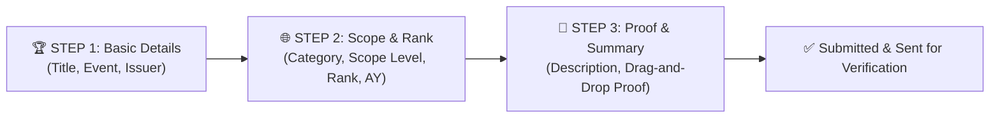

# AchieveNest NDMU Platform: Master Feature Roadmap & Clickable Component Specification

---

> [!NOTE]
> **Project Scope & Architecture Notice**:
> All implementation phases in this repository encompass the **Complete Frontend Client Web Application System** (built using React + Vite + TailwindCSS), featuring complete interactive UI components, dynamic state management, modal workflows, CSV exporters, role context switchers, and client-side data flows. Backend server API integration, database persistence, and server endpoints will be developed separately outside of Antigravity.

---

## 📊 1. Master System Status & Clickable Feature Matrix

This matrix provides an authoritative, complete inventory of all interactive buttons, cards, menus, modals, and links across the AchieveNest web application, detailing the exact behavior and display output triggered by each click.

### 🎓 A. Student Portal (`/student/dashboard` & `/student/achievements`)
| View / Component | Clickable Element | Interaction Type | Behavior & Display Output | Current Status |
| :--- | :--- | :--- | :--- | :--- |
| **Student Homepage** | `Digital ID Barcode` Button | Modal Popup | Opens `DigitalBarcodeIDCard` modal displaying NDMU Student ID, barcode graphics, and print button | ✅ **WORKING & CLICKABLE** |
| **Student Homepage** | `Submit New Achievement` Card | Navigation + Modal | Redirects to `/student/achievements` AND automatically opens `AchievementSubmissionModal` form overlay | ✅ **WORKING & CLICKABLE** |
| **Student Homepage** | `Edit Basic Information` Card | Modal Popup | Opens `EditBasicInfoModal` allowing editing of student contact info and academic details | ✅ **WORKING & CLICKABLE** |
| **Student Homepage** | `My Verified Certificates` Card | Category Filter | Filters timeline list to show verified student certificates only | ✅ **WORKING & CLICKABLE** |
| **Student Homepage** | Category Vault Cards | Filter & Scroll | Sets category filter and scrolls smoothly to timeline section | ✅ **WORKING & CLICKABLE** |
| **Achievements Catalog** | `Export Achievements` Button | CSV Download | Generates and downloads a structured CSV file (`AchieveNest_Student_Achievements.csv`) | ✅ **WORKING & CLICKABLE** |
| **Achievements Catalog** | `+ Add Achievement` Button | Modal Popup | Opens `AchievementSubmissionModal` overlay to attach document proof & submit entry | ✅ **WORKING & CLICKABLE** |
| **Achievements Catalog** | Stat Pills (Total / Verified / Pending) | Filter Grid | Filters achievement cards grid by verification status (`Verified`, `Pending Review`, `Returned`) | ✅ **WORKING & CLICKABLE** |
| **Achievements Catalog** | Grid 🔲 / List ☰ Toggle Buttons | Layout Toggle | Toggles card display between 2-column certificate card grid and compact row list view | ✅ **WORKING & CLICKABLE** |
| **Achievements Catalog** | "By Category" Sidebar Items | Filter Grid | Filters achievement cards grid by category (Academic, Leadership, Community, Sports, etc.) | ✅ **WORKING & CLICKABLE** |

### 👨‍🏫 B. Faculty & Personnel Portfolio (`/personnel/dashboard`)
| View / Component | Clickable Element | Interaction Type | Behavior & Display Output | Current Status |
| :--- | :--- | :--- | :--- | :--- |
| **Personnel Portfolio** | `Digital ID Barcode` Button | Modal Popup | Opens `DigitalBarcodeIDCard` modal with faculty employee ID, barcode, and designation | ✅ **WORKING & CLICKABLE** |
| **Personnel Portfolio** | `Submit New Accomplishment` Card | Modal Popup | Opens `PersonnelSubmissionModal` overlay to attach research/seminar proof | ✅ **WORKING & CLICKABLE** |
| **Personnel Portfolio** | `Edit Basic Information` Card | Modal Popup | Opens `EditBasicInfoModal` to update faculty rank, department, and credentials | ✅ **WORKING & CLICKABLE** |
| **Personnel Portfolio** | `My Verified Proofs` Card | Filter Timeline | Filters timeline cards to verified faculty accomplishments | ✅ **WORKING & CLICKABLE** |
| **Personnel Portfolio** | Category Vault Cards | Filter & Scroll | Sets category filter and scrolls smoothly to accomplishments timeline | ✅ **WORKING & CLICKABLE** |

### 🔄 C. Personnel Multi-Role Context Switcher (`Header.jsx` & `Sidebar.jsx`)
| View / Component | Clickable Element | Interaction Type | Behavior & Display Output | Current Status |
| :--- | :--- | :--- | :--- | :--- |
| **Top Header Menu** | Profile Avatar Dropdown | Popover Menu | Opens top-right profile popover menu (aligned right; `Switch To` hidden for students) | ✅ **WORKING & CLICKABLE** |
| **Header Dropdown** | `Switch To` Accordion | Submenu Toggle | Expands available administrative roles for personnel (excludes currently active view) | ✅ **WORKING & CLICKABLE** |
| **Header Dropdown** | `Program Coordinator` Option | Context Switch | Switches context to Program Coordinator; renders `CoordinatorDashboardView` & updates sidebar badge | ✅ **WORKING & CLICKABLE** |
| **Header Dropdown** | `Organization Account` Option | Context Switch | Switches context to Organization Moderator portal | ✅ **WORKING & CLICKABLE** |
| **Header Dropdown** | `Department Secretary` Option | Context Switch | Switches context to Department Secretary endorsement view | ✅ **WORKING & CLICKABLE** |
| **Header Dropdown** | `Faculty / Personnel View` Option | Context Switch | Switches context back to default Faculty Professional Portfolio view | ✅ **WORKING & CLICKABLE** |

### 🛡️ D. Program Coordinator Verification Portal (`active_role_context === 'program_coordinator'`)
| View / Component | Clickable Element | Interaction Type | Behavior & Display Output | Current Status |
| :--- | :--- | :--- | :--- | :--- |
| **Coordinator View** | Stat Counter Cards | Overview Metrics | Displays 4 counters: Pending Reviews (1), Verified (3), Returned (1), Avg Review Time (2.5 hrs) | ✅ **WORKING & CLICKABLE** |
| **Coordinator View** | Scope Notice Banner | Program Scope | Restricts view to assigned degree program (*BS Computer Science*) | ✅ **WORKING & CLICKABLE** |
| **Coordinator View** | Pending Queue Item Card | Modal Popup | Opens student submission review modal with document proof preview | ✅ **WORKING & CLICKABLE** |
| **Coordinator View** | `Approve & Verify` Button | Action Trigger | Approves achievement, updates status to Verified, and increments stats | ✅ **WORKING & CLICKABLE** |
| **Coordinator View** | `Return with Remarks` Button | Action Trigger | Returns submission to student with required feedback remarks | ✅ **WORKING & CLICKABLE** |

### 🏢 E. Department Secretary Portal (`active_role_context === 'department_secretary'`)
| View / Component | Clickable Element | Interaction Type | Behavior & Display Output | Current Status |
| :--- | :--- | :--- | :--- | :--- |
| **Secretary View** | Submissions Queue Cards | Modal Popup | Opens faculty submission review modal with document proof preview | ⏳ **IN PLANNING (Phase 5)** |
| **Secretary View** | `Endorse to HR` Button | Action Trigger | Endorses faculty accomplishment to HR Office queue and stamps `Dept Endorsed` | ⏳ **IN PLANNING (Phase 5)** |
| **Secretary View** | `Return to Faculty` Button | Action Trigger | Returns faculty accomplishment submission with required correction remarks | ⏳ **IN PLANNING (Phase 5)** |

### 🏛️ F. HR Office Directory & OSAD Admin Suite
| View / Component | Clickable Element | Interaction Type | Behavior & Display Output | Current Status |
| :--- | :--- | :--- | :--- | :--- |
| **HR Staff Dashboard** | Faculty Directory & Accreditation | Management | Manages university-wide records, exports accreditation reports & assigns secretary roles | ⏳ **IN PLANNING (Phase 6)** |
| **OSAD Admin Suite** | Org Moderation & Attendance | Scanner Engine | Moderates student org charters, runs barcode scanner sessions & generates digital certificates | ⏳ **IN PLANNING (Phase 7)** |

---

## 🚀 2. Phased Implementation Roadmap & Button Specifications

### Phase 1: Core Design System & Theme Infrastructure [COMPLETED - ✅ IMPLEMENTED & WORKING]
- Established NDMU Forest Green (`#1b4332`), Emerald accent (`#2d8a4e`), and Mint token design system in `src/index.css`.

### Phase 2: Application Shell Layout [COMPLETED - ✅ IMPLEMENTED & WORKING]
- Implemented `MainLayout.jsx`, `Header.jsx`, `Sidebar.jsx`, and `NotificationPopover.jsx`.

### Phase 3: Student Portfolio & Digital NDMU Barcode ID Interface [COMPLETED - ✅ IMPLEMENTED & WORKING]
- Implemented `StudentDashboard.jsx`, `DigitalBarcodeIDCard.jsx`, and `AchievementSubmissionModal.jsx`.

### Phase 3.1: Dedicated Student Achievements Catalog & Workspace [COMPLETED - ✅ IMPLEMENTED & WORKING]
- Implemented `StudentAchievementsPage.jsx` (`/student/achievements`) featuring grid/list view mode toggles, category/status filters, CSV export, category breakdown sidebar widget, and homepage submission redirect.

#### 📋 Detailed Field & UI Text Specification: 3-Step Achievement Submission Wizard [COMPLETED - ✅ IMPLEMENTED & WORKING]

##### 🏆 STEP 1: Basic Achievement Details
- **Header Title**: Submit New Achievement
- **Header Subtitle**: Step 1 of 3: Basic Details
- **Step Badge 1**: `1. Basic Info` (Active Green Pill)

| Field Name | Label Text | Component Type | Placeholder / Helper Text | Validation |
| :--- | :--- | :--- | :--- | :--- |
| `title` | Award / Achievement Title * | Text Input | e.g. Dean's Lister - First Semester AY 2025-2026 | Required, Min 5 chars |
| `event_name` | Event / Competition Name * | Text Input | e.g. 12th SOCCSKSARGEN IT Summit / NDMU Intramurals 2025 | Required, Min 3 chars |
| `issuer_organization` | Issuing Body / Organization * | Text Input | e.g. NDMU CITE / DOST Region XII | Required |

- **Step 1 Action Buttons**:
  - `Cancel` (Ghost button → closes modal)
  - `Next: Scope & Rank →` (Primary Emerald CTA)

##### 🌐 STEP 2: Classification, Scope & Rank Weighting (For TOPSIS Scoring)
- **Header Subtitle**: Step 2 of 3: Scope & Rank
- **Step Badge 2**: `2. Scope & Rank` (Active Green Pill)

| Field Name | Label Text | Component Type | Options List / Values | Validation |
| :--- | :--- | :--- | :--- | :--- |
| `category_id` | Category * | Dropdown Select | Academic, Leadership, Athletics, Volunteerism & Community, Arts & Culture | Required |
| `scope_level` | Geographic Scope / Level * | Dropdown Select | Institutional / Campus-Wide, Local / City Level, Regional (Region XII), National Level, International Level | Required |
| `rank_conferred` | Rank / Position Conferred * | Dropdown Select | Champion / 1st Place, 2nd Place, 3rd Place, Finalist / Runner-Up, Dean's Lister, Leadership Officer / Lead, Participant / Special Award | Required |
| `academic_year` | Academic Year * | Dropdown Select | AY 2025-2026, AY 2024-2025, AY 2023-2024 | Required |
| `semester` | Term / Semester * | Dropdown Select | 1st Semester, 2nd Semester, Summer Term | Required |
| `date_achieved` | Date Conferred * | Date Picker | MM / DD / YYYY | Required |

- **Step 2 Action Buttons**:
  - `← Back` (Returns to Step 1)
  - `Next: Proof & Submit →` (Primary Emerald CTA)

##### 📄 STEP 3: Supporting Proof & Summary Submission
- **Header Subtitle**: Step 3 of 3: Proof & Summary
- **Step Badge 3**: `3. Proof & Summary` (Active Green Pill)

| Field Name | Label Text | Component Type | Instruction / Helper Text | Validation |
| :--- | :--- | :--- | :--- | :--- |
| `description` | Narrative Description | Textarea (3 rows) | Brief details about the accomplishment, criteria met, or project abstract... | Optional |
| `document_url` | Supporting Evidence Document (PDF/JPG/PNG) * | Drag-and-Drop File Upload | Icon: Upload Cloud Primary Text: Click or drag certificate attachment here Subtext: PDF, JPG, PNG up to 5MB | Required |

- **Step 3 Action Buttons**:
  - `← Back` (Returns to Step 2)
  - `Submit Entry ✓` (Primary Emerald CTA)

### Phase 3.2: Dedicated Student Public Portfolio & Accomplishments Profile Workspace (`/student/portfolio`) [COMPLETED - ✅ IMPLEMENTED & WORKING]
- **Objective**: Build `StudentPortfolioPage.jsx` (`/student/portfolio`) matching design screenshots featuring hero banner with avatar, About Me card, vertical Experience & Involvement timeline, Featured Achievements grid, Supporting Evidence gallery, Contact & Skills cards, and category navigation redirect logic.
- **Key Components & Layout**:
  1. **Hero Header Profile Banner (NDMU Forest Green `#1b4332`)**: Large student avatar with verified badge, Full Name (*Maria Santos*), Student ID (*2024-01234*), Program (*BS Computer Science*), Year Level & Age (*3rd Year - 21 yrs*), Location (*Koronadal City, South Cotabato*), and 3 Right Stat Pill Cards (`5 Total`, `3 Verified`, `30 Points`).
  2. **About Me Card**: Narrative student bio and academic background statement.
  3. **Experience & Involvement Timeline Card**: Vertical timeline showcasing student positions (*President • Computer Society NDMU*, *Dean's Lister • CEAC NDMU*, *Community Extension • Koronadal City Barangay Program*, *Hackathon Finalist • DICT RegTech 2024*, *Core Developer • University Web Dev Team*).
  4. **Featured Achievements Grid**: Cards showing verified achievements with banner illustrations/emojis and category badges.
  5. **Supporting Evidence Section**: Evidence gallery cards displaying thumbnail previews for certificates.
  6. **Interactive Navigation Logic**: Clicking a category item under *Achievements by Category* or in *Supporting Evidence* redirects to the **Achievements Section** (`/student/achievements`) with that category pre-filtered!
### Phase 3.3: Canva-Style Portfolio Export Flow & Multi-Page PDF Generator [COMPLETED - ✅ IMPLEMENTED & WORKING]
- **Objective**: Transform the export modal into a Canva-style split-screen workspace (`w-full max-w-6xl`) with multi-page live document rendering, custom structure toggles, template selectors, and interactive page-by-page PDF generation (strictly PDF portfolio).
- **Key Architectural Specs & Layout**:
  - **Strict PDF Focus**: Dedicated 100% to print-ready PDF portfolio export (CSV format removed).
  - **Left Panel (65% width)**:
    - Live multi-page interactive preview renderer with pagination controls (`< Page X of Y >`, page jump dropdown).
    - **Page 1**: Official NDMU Cover Page (University Crest, Student Info, Program Seal).
    - **Page 2**: Table of Contents & Executive Summary (Dynamic stats recalculation based on selected items).
    - **Page 3 (and each category start)**: Full-page Category Separator Slide (e.g. `1. ACADEMIC ACHIEVEMENTS`).
    - **Page 4+ (Dedicated Self-Contained 1-Page Per Achievement)**:
      - **Strict Layout Guarantee**: Every achievement page fits **ALL important metadata on the top 35-40%**, immediately followed by **1 full attached certificate scan / document proof on the lower 60-65% of the EXACT SAME PAGE**.
      - **Top Metadata Section**: Title, Event/Competition Name, Issuing Entity, Geographic Scope Level, Rank Conferred, Academic Term, Date Conferred, Verifier Name, System QR Code, and `Verified ✓` badge.
      - **Bottom Certificate Section**: High-resolution scanned certificate / evidence preview box.
      - Page break rule: `page-break-after: always` to ensure zero overflow.
  - **Right Panel (35% width)**:
    - **Template Selection**: *Official NDMU Dossier*, *Modern Clean*, *Executive 1-Pager*.
    - **Structure Toggles**: Switches for `Include Cover Page`, `Include Table of Contents`, `Include Category Separators`, and `Chronological Sorting (Newest First)`.
    - **Item Checklist**: Collapsible category tree with checkboxes allowing students to pick/unpick specific items.
    - **Dynamic CTA**: `Download Portfolio PDF (X Pages)`.

### Phase 4: Faculty & Personnel Professional Portfolio Interface [COMPLETED - ✅ IMPLEMENTED & WORKING]
- Implemented `PersonnelDashboard.jsx`, `EditBasicInfoModal.jsx`, and `PersonnelSubmissionModal.jsx`.

### Phase 4.5: Personnel Multi-Role Context Switcher & Profile Menu [COMPLETED - ✅ IMPLEMENTED & WORKING]
- Implemented multi-role switching in `Header.jsx` and `Sidebar.jsx` supporting `program_coordinator`, `organization_moderator`, `department_secretary`, and `personnel`.

### Phase 4.6: Program Coordinator Verification & Management Portal [COMPLETED - ✅ IMPLEMENTED & WORKING]
- Implemented `CoordinatorDashboardView.jsx` with hero summary banner, 4 stat counter cards, program scope notice (*BS Computer Science*), pending verification queue, and verification summary cards.

### Phase 4.7: GitHub Version Control Checkpoint & Repository Snapshot [COMPLETED - ✅ IMPLEMENTED & WORKING]
- Initialized local Git repository, created initial commit `71b5acd`, tagged `v0.4.6-stable`, and pushed to remote GitHub repository `https://github.com/Astherisk1229/AchieveNest.git`.

### Phase 5: Department Secretary Endorsement & Verification Portal [UPCOMING]
- Build `SecretaryDashboardView.jsx` allowing department secretaries to review faculty submissions.
- **Button Behaviors**:
  - `Review Submission` Button: Opens modal with attached proof document preview.
  - `Endorse to HR Office` Button: Stamps `Dept Endorsed` and moves submission to HR verification queue.
  - `Return to Faculty` Button: Rejects submission back to faculty with required remarks text.

### Phase 6: HR Office Directory & Accreditation Suite [UPCOMING]
- Build `HRDashboard.jsx` for university-wide employee directory and accreditation reporting.
- **Button Behaviors**:
  - `Assign Secretary Role` Button: Grants department secretary context to selected faculty member.
  - `Generate Accreditation Report` Button: Exports accreditation compliance PDF/CSV.

### Phase 6.9 & 6.9.1: GitHub Version Control Checkpoint & Sync [UPCOMING]
- Commit, tag `v0.6.0-stable`, and push to GitHub repository (`git push origin main --tags`).

### Phase 7: OSAD Admin Suite, Student Org Governance & Barcode Attendance Generator [UPCOMING]
- Build `OSADDashboard.jsx` for student organization moderation and barcode attendance session engine.

### Phase 8: TOPSIS Decision Support Engine & Recognition Suite [UPCOMING]
- Build multi-criteria TOPSIS evaluation engine for automated student & faculty award ranking.
