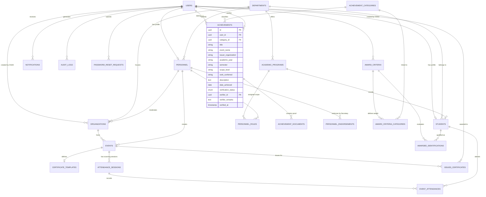

# AchieveNest: System Technical Specification & Design Documentation
**Notre Dame of Marbel University (NDMU)**  
*Web-Based Achievement, Portfolio, and Recognition Management System for Students and Personnel*

---

## Executive Summary & System Governance

### Account Governance & Role Assignment Model

The technical architecture of **AchieveNest** is structured around **4 Dedicated User Account Types (`user_type_enum`)** and **3 Assigned Administrative Roles (`personnel_role_enum`)**:

1. **Dedicated Account Types (`user_type_enum`)**:
   - **`student`**: Student account for submitting achievements, managing portfolios, downloading event certificates, and scanning attendance.
   - **`personnel`**: Faculty and staff account for submitting professional accomplishments, training records, research outputs, and managing employee portfolios.
   - **`hr_staff`**: **Dedicated standalone account** for Human Resource Office personnel to monitor university-wide staff accomplishments, generate accreditation reports, and **assign `department_secretary` roles to personnel**.
   - **`osad_staff`**: **Dedicated standalone account** for Office of Student Affairs and Development staff to manage student accounts, add/archive student organizations, configure award criteria, run automated awardee identification, and assign `program_coordinator` and `organization_moderator` roles.

2. **Assigned Personnel Roles (`personnel_role_enum`)**:
   - **`department_secretary`**: Granted by **HR Staff** to a `personnel` user within a department to review and endorse department faculty achievements.
   - **`program_coordinator`**: Granted by **OSAD Staff** to a `personnel` user to verify student achievement submissions for an academic degree program.
   - **`organization_moderator`**: Granted by **OSAD Staff** to a `personnel` user to manage organization events, barcode scanning sessions, and digital certificate generation.

---

## 1. Entity Relationship Diagram (ERD)



---

## 2. PostgreSQL Data Schema (`achievements` Table Update)

```sql
-- Comprehensive Achievements Table with Recognition Weighting Attributes
CREATE TABLE achievements (
    id UUID PRIMARY KEY DEFAULT uuid_generate_v4(),
    user_id UUID NOT NULL REFERENCES users(id) ON DELETE CASCADE,
    category_id UUID NOT NULL REFERENCES achievement_categories(id) ON DELETE RESTRICT,
    title VARCHAR(255) NOT NULL,
    event_name VARCHAR(255) NOT NULL,
    issuer_organization VARCHAR(255) NOT NULL,
    academic_year VARCHAR(20) NOT NULL,
    semester VARCHAR(50) NOT NULL,
    scope_level VARCHAR(100) NOT NULL, -- Institutional, Local, Regional, National, International
    rank_conferred VARCHAR(100) NOT NULL, -- Champion/1st Place, 2nd Place, 3rd Place, Finalist, Dean's Lister, Lead, Participant
    description TEXT NOT NULL,
    date_achieved DATE NOT NULL,
    verification_status verification_status_enum NOT NULL DEFAULT 'pending',
    verifier_id UUID REFERENCES users(id) ON DELETE SET NULL,
    verifier_remarks TEXT,
    verified_at TIMESTAMP WITH TIME ZONE,
    created_at TIMESTAMP WITH TIME ZONE DEFAULT CURRENT_TIMESTAMP,
    updated_at TIMESTAMP WITH TIME ZONE DEFAULT CURRENT_TIMESTAMP
);
```

---

## 3. Data Dictionary: `achievements` Table

| Column Name | Data Type | Nullable | Key / Constraint | Description |
| :--- | :--- | :--- | :--- | :--- |
| `id` | `UUID` | No | PK | Unique achievement entry identifier. |
| `user_id` | `UUID` | No | FK (`users.id`) | Owner of achievement (student or personnel). |
| `category_id` | `UUID` | No | FK (`achievement_categories.id`) | Selected classification category. |
| `title` | `VARCHAR(255)` | No | - | Award / Achievement Title. |
| `event_name` | `VARCHAR(255)` | No | - | Specific Competition or Event Name. |
| `issuer_organization` | `VARCHAR(255)` | No | - | Issuing body or agency. |
| `academic_year` | `VARCHAR(20)` | No | - | Target Academic Year (e.g., `AY 2025-2026`). |
| `semester` | `VARCHAR(50)` | No | - | Term (`1st Semester`, `2nd Semester`, `Summer`). |
| `scope_level` | `VARCHAR(100)` | No | - | Geographic scope (`Institutional`, `Local`, `Regional`, `National`, `International`). |
| `rank_conferred` | `VARCHAR(100)` | No | - | Distinction rank (`Champion / 1st Place`, `2nd Place`, `3rd Place`, `Finalist`, `Dean's Lister`, `Officer`, `Participant`). |
| `description` | `TEXT` | No | - | Narrative description / abstract. |
| `date_achieved` | `DATE` | No | - | Conferred date. |
| `verification_status` | `ENUM` | No | Default `pending` | Status (`pending`, `approved`, `rejected`, `revision_requested`). |
| `verifier_id` | `UUID` | Yes | FK (`users.id`) | Verifier account ID. |
| `verifier_remarks` | `TEXT` | Yes | - | Feedback / verification notes. |
| `verified_at` | `TIMESTAMP` | Yes | - | Timestamp when verified. |
