# AchieveNest: System Technical Specification & Design Documentation
**Notre Dame of Marbel University (NDMU)**  
*Web-Based Achievement, Portfolio, and Recognition Management System for Students and Personnel*

---

## Executive Summary & System Governance

### Account Governance & Role Assignment Model

The technical architecture of **AchieveNest** is structured around **4 Dedicated User Account Types (`user_type_enum`)** and **3 Assigned Administrative Roles (`personnel_role_enum`)**:

1. **Dedicated Account Types (`user_type_enum`)**:
   - **`student`**: Student account for submitting achievements, managing portfolios, downloading event certificates, and scanning attendance.
   - **`personnel`**: Faculty and staff account for submitting professional accomplishments, training records, research outputs, and managing employee portfolios.
   - **`hr_staff`**: **Dedicated standalone account** for Human Resource Office personnel to monitor university-wide staff accomplishments, generate accreditation reports, and **assign `department_secretary` roles to personnel**.
   - **`osad_staff`**: **Dedicated standalone account** for Office of Student Affairs and Development staff to manage student accounts, add/archive student organizations, configure award criteria, run automated awardee identification, and assign `program_coordinator` and `organization_moderator` roles.

2. **Assigned Personnel Roles (`personnel_role_enum`)**:
   - **`department_secretary`**: Granted by **HR Staff** to a `personnel` user within a department to review and endorse department faculty achievements.
   - **`program_coordinator`**: Granted by **OSAD Staff** to a `personnel` user to verify student achievement submissions for an academic degree program.
   - **`organization_moderator`**: Granted by **OSAD Staff** to a `personnel` user to manage organization events, barcode scanning sessions, and digital certificate generation.

---

## 1. Entity Relationship Diagram (ERD)

### 1.1 Relational Entity Relationship Diagram

```mermaid
erDiagram
    USERS ||--o| STUDENTS : "has profile"
    USERS ||--o| PERSONNEL : "has profile"
    USERS ||--o{ NOTIFICATIONS : "receives"
    USERS ||--o{ AUDIT_LOGS : "generates"
    USERS ||--o{ PASSWORD_RESET_REQUESTS : "submits"
    USERS ||--o{ ORGANIZATIONS : "created by OSAD"

    DEPARTMENTS ||--o{ ACADEMIC_PROGRAMS : "offers"
    DEPARTMENTS ||--o{ STUDENTS : "belongs to"
    DEPARTMENTS ||--o{ PERSONNEL : "belongs to"
    DEPARTMENTS ||--o{ ORGANIZATIONS : "houses"

    ACADEMIC_PROGRAMS ||--o{ STUDENTS : "enrolls"
    ACADEMIC_PROGRAMS ||--o{ PERSONNEL_ROLES : "assigned scope"

    PERSONNEL ||--o{ PERSONNEL_ROLES : "assigned"
    PERSONNEL ||--o{ ORGANIZATIONS : "moderates"

    USERS ||--o{ ACHIEVEMENTS : "submits"
    ACHIEVEMENT_CATEGORIES ||--o{ ACHIEVEMENTS : "classifies"
    ACHIEVEMENTS ||--o{ ACHIEVEMENT_DOCUMENTS : "contains proof"
    USERS ||--o{ ACHIEVEMENTS : "verifies"
    PERSONNEL ||--o{ PERSONNEL_ENDORSEMENTS : "endorses by Secretary"

    ORGANIZATIONS ||--o{ EVENTS : "hosts"
    PERSONNEL ||--o{ EVENTS : "creates"
    EVENTS ||--o| CERTIFICATE_TEMPLATES : "defines"
    EVENTS ||--o{ ATTENDANCE_SESSIONS : "has scanning sessions"
    ATTENDANCE_SESSIONS ||--o{ EVENT_ATTENDANCES : "records"
    STUDENTS ||--o{ EVENT_ATTENDANCES : "attends"

    EVENTS ||--o{ ISSUED_CERTIFICATES : "issues for"
    USERS ||--o{ ISSUED_CERTIFICATES : "awarded to"

    USERS ||--o{ AWARD_CRITERIA : "created by OSAD"
    AWARD_CRITERIA ||--o{ AWARD_CRITERIA_CATEGORIES : "defines weight"
    ACHIEVEMENT_CATEGORIES ||--o{ AWARD_CRITERIA_CATEGORIES : "linked to"

    AWARD_CRITERIA ||--o{ AWARDEE_IDENTIFICATIONS : "evaluates"
    STUDENTS ||--o{ AWARDEE_IDENTIFICATIONS : "qualified as"

    USERS {
        uuid id PK
        string email UK
        string password_hash
        enum user_type
        boolean is_active
        timestamp created_at
    }

    STUDENTS {
        uuid id PK, FK
        string student_number UK
        string institutional_email UK
        string first_name
        string middle_name
        string last_name
        uuid program_id FK
        uuid department_id FK
        int year_level
        string contact_number
        string avatar_url
    }

    PERSONNEL {
        uuid id PK, FK
        string employee_number UK
        string institutional_email UK
        string first_name
        string middle_name
        string last_name
        uuid department_id FK
        string designation
        string contact_number
        string avatar_url
    }

    ORGANIZATIONS {
        uuid id PK
        string code UK
        string name
        text description
        uuid department_id FK
        uuid moderator_id FK
        string logo_url
        boolean is_archived
        uuid created_by FK
    }

    DEPARTMENTS {
        uuid id PK
        string code UK
        string name
        string description
    }

    ACADEMIC_PROGRAMS {
        uuid id PK
        uuid department_id FK
        string code UK
        string name
    }

    PERSONNEL_ROLES {
        uuid id PK
        uuid personnel_id FK
        enum role_name
        uuid assigned_scope_id
        uuid assigned_by FK
        timestamp created_at
    }

    ACHIEVEMENT_CATEGORIES {
        uuid id PK
        string name UK
        string description
        boolean is_archived
        uuid created_by FK
    }

    ACHIEVEMENTS {
        uuid id PK
        uuid user_id FK
        uuid category_id FK
        string title
        text description
        date date_achieved
        string issuer_organization
        enum verification_status
        uuid verifier_id FK
        text verifier_remarks
        timestamp verified_at
    }

    PERSONNEL_ENDORSEMENTS {
        uuid id PK
        uuid achievement_id FK
        uuid secretary_id FK
        uuid department_id FK
        enum status
        text comments
        timestamp endorsed_at
    }

    ACHIEVEMENT_DOCUMENTS {
        uuid id PK
        uuid achievement_id FK
        string document_name
        string file_url
        string file_type
        bigint file_size
    }

    EVENTS {
        uuid id PK
        uuid organization_id FK
        string title
        text description
        date event_date
        time start_time
        time end_time
        string location
        boolean is_archived
        uuid created_by FK
    }

    ATTENDANCE_SESSIONS {
        uuid id PK
        uuid event_id FK
        string session_pin
        enum status
        timestamp started_at
        timestamp ended_at
    }

    EVENT_ATTENDANCES {
        uuid id PK
        uuid attendance_session_id FK
        uuid event_id FK
        uuid student_id FK
        string scanned_barcode
        timestamp scanned_at
    }

    CERTIFICATE_TEMPLATES {
        uuid id PK
        uuid event_id FK, UK
        string template_title
        string background_image_url
        string signatory_name
        string signatory_position
        string signature_image_url
    }

    ISSUED_CERTIFICATES {
        uuid id PK
        string certificate_number UK
        uuid event_id FK
        uuid user_id FK
        string pdf_url
        string qr_code_data
        timestamp issued_at
    }

    AWARD_CRITERIA {
        uuid id PK
        string award_name
        text description
        decimal min_gpa
        int min_approved_achievements
        string academic_year
        boolean is_archived
        uuid created_by FK
    }

    AWARD_CRITERIA_CATEGORIES {
        uuid id PK
        uuid award_criteria_id FK
        uuid category_id FK
        decimal weight_points
    }

    AWARDEE_IDENTIFICATIONS {
        uuid id PK
        uuid award_criteria_id FK
        uuid student_id FK
        decimal total_calculated_score
        int rank
        enum status
        timestamp evaluated_at
    }

    NOTIFICATIONS {
        uuid id PK
        uuid recipient_id FK
        string title
        text message
        string type
        boolean is_read
        timestamp created_at
    }

    AUDIT_LOGS {
        uuid id PK
        uuid user_id FK
        string action
        string module
        jsonb details
        string ip_address
        timestamp created_at
    }

    PASSWORD_RESET_REQUESTS {
        uuid id PK
        uuid user_id FK
        enum status
        text remarks
        timestamp requested_at
        timestamp processed_at
    }
```



---

## 2. Class Diagram

### 2.1 Software System Class Diagram

```mermaid
classDiagram
    class AuthController {
        +login(LoginDTO dto) Response
        +logout() Response
        +requestPasswordReset(ResetRequestDTO dto) Response
        +switchRole(RoleSwitchDTO dto) Response
    }

    class HRStaffAdminController {
        +getAllPersonnelPortfolios(FilterDTO filter) Response
        +assignDepartmentSecretaryRole(SecretaryAssignDTO dto) Response
        +revokeDepartmentSecretaryRole(UUID roleId) Response
        +generateHRAccomplishmentReport(HRReportDTO filter) Response
        +exportPersonnelAccreditationSummary(UUID departmentId) Response
    }

    class OSADStaffAdminController {
        +createOrganization(OrganizationDTO dto) Response
        +archiveOrganization(UUID id) Response
        +assignProgramCoordinatorRole(RoleAssignDTO dto) Response
        +assignOrganizationModeratorRole(RoleAssignDTO dto) Response
        +createAwardCriteria(CriteriaDTO dto) Response
        +runAutomatedAwardeeIdentification(UUID criteriaId) Response
        +publishAwardees(UUID criteriaId) Response
    }

    class DepartmentSecretaryController {
        +getDepartmentPersonnelSubmissions(UUID departmentId) Response
        +endorsePersonnelAchievement(EndorsementDTO dto) Response
        +generateDepartmentPersonnelReport(UUID departmentId) Response
    }

    class ProgramCoordinatorController {
        +getPendingStudentSubmissions(UUID programId) Response
        +verifyStudentAchievement(VerificationDTO dto) Response
        +getStudentPortfolios(UUID programId) Response
    }

    class OrganizationModeratorController {
        +createEvent(EventDTO dto) Response
        +updateEvent(UUID id, EventDTO dto) Response
        +archiveEvent(UUID id) Response
        +startAttendanceSession(UUID eventId) Response
        +recordBarcodeAttendance(ScanDTO dto) Response
        +generateCertificates(UUID eventId) Response
    }

    class HRStaffService {
        +assignSecretaryRole(UUID personnelId, UUID departmentId, UUID hrUserId) PersonnelRole
        +getUniversityPersonnelSummaryReport() HRSummaryDTO
    }

    class OSADStaffService {
        +registerOrganization(Organization org, UUID osadStaffId) Organization
        +archiveOrganizationRecord(UUID orgId, UUID osadStaffId) bool
        +assignRoleToPersonnel(UUID personnelId, RoleName role, UUID scopeId, UUID osadStaffId) PersonnelRole
    }

    class AchievementService {
        +processSubmission(Achievement model) Achievement
        +verifySubmission(UUID achievementId, string status, string remarks, UUID verifierId) bool
        +compileDigitalPortfolio(UUID userId) PortfolioDTO
    }

    class EventAttendanceService {
        +createEventWithTemplate(Event event, CertificateTemplate template) Event
        +verifyBarcodeAndMarkAttendance(string studentBarcode, UUID sessionId) AttendanceRecord
        +issueEventCertificates(UUID eventId) List~IssuedCertificate~
    }

    class AwardeeDecisionSupportService {
        +evaluatePotentialAwardees(UUID criteriaId) List~AwardeeResult~
        +calculateFuzzyTOPSISScore(Student student, AwardCriteria criteria) double
    }

    HRStaffAdminController --> HRStaffService
    OSADStaffAdminController --> OSADStaffService
    DepartmentSecretaryController --> HRStaffService
    ProgramCoordinatorController --> AchievementService
    OrganizationModeratorController --> EventAttendanceService
```



---

## 3. Data Schema of the System (PostgreSQL DDL)

```sql
-- =============================================================================
-- AchieveNest PostgreSQL Database Schema
-- Target Infrastructure: Supabase Cloud Database (PostgreSQL 15+)
-- Institution: Notre Dame of Marbel University (NDMU)
-- Complete Production DDL Script
-- =============================================================================

CREATE EXTENSION IF NOT EXISTS "uuid-ossp";

-- -----------------------------------------------------------------------------
-- ENUM TYPES
-- -----------------------------------------------------------------------------
CREATE TYPE user_type_enum AS ENUM (
    'student', 
    'personnel', 
    'hr_staff', 
    'osad_staff'
);

CREATE TYPE personnel_role_enum AS ENUM (
    'department_secretary', 
    'program_coordinator', 
    'organization_moderator'
);

CREATE TYPE verification_status_enum AS ENUM ('pending', 'approved', 'rejected', 'revision_requested');
CREATE TYPE endorsement_status_enum AS ENUM ('pending', 'endorsed', 'rejected');
CREATE TYPE attendance_session_status_enum AS ENUM ('active', 'ended');
CREATE TYPE awardee_status_enum AS ENUM ('identified', 'approved', 'published', 'rejected');
CREATE TYPE password_reset_status_enum AS ENUM ('pending', 'approved', 'denied');

-- -----------------------------------------------------------------------------
-- 1. USERS & AUTHENTICATION
-- -----------------------------------------------------------------------------
CREATE TABLE users (
    id UUID PRIMARY KEY DEFAULT uuid_generate_v4(),
    email VARCHAR(255) UNIQUE NOT NULL,
    password_hash VARCHAR(255) NOT NULL,
    user_type user_type_enum NOT NULL,
    is_active BOOLEAN NOT NULL DEFAULT TRUE,
    created_at TIMESTAMP WITH TIME ZONE DEFAULT CURRENT_TIMESTAMP,
    updated_at TIMESTAMP WITH TIME ZONE DEFAULT CURRENT_TIMESTAMP
);

-- -----------------------------------------------------------------------------
-- 2. ACADEMIC STRUCTURE
-- -----------------------------------------------------------------------------
CREATE TABLE departments (
    id UUID PRIMARY KEY DEFAULT uuid_generate_v4(),
    code VARCHAR(50) UNIQUE NOT NULL,
    name VARCHAR(255) NOT NULL,
    description TEXT,
    created_at TIMESTAMP WITH TIME ZONE DEFAULT CURRENT_TIMESTAMP
);

CREATE TABLE academic_programs (
    id UUID PRIMARY KEY DEFAULT uuid_generate_v4(),
    department_id UUID NOT NULL REFERENCES departments(id) ON DELETE CASCADE,
    code VARCHAR(50) UNIQUE NOT NULL,
    name VARCHAR(255) NOT NULL,
    created_at TIMESTAMP WITH TIME ZONE DEFAULT CURRENT_TIMESTAMP
);

-- -----------------------------------------------------------------------------
-- 3. PROFILES: STUDENTS & PERSONNEL
-- -----------------------------------------------------------------------------
CREATE TABLE students (
    id UUID PRIMARY KEY REFERENCES users(id) ON DELETE CASCADE,
    student_number VARCHAR(50) UNIQUE NOT NULL,
    institutional_email VARCHAR(255) UNIQUE NOT NULL,
    first_name VARCHAR(100) NOT NULL,
    middle_name VARCHAR(100),
    last_name VARCHAR(100) NOT NULL,
    program_id UUID NOT NULL REFERENCES academic_programs(id) ON DELETE RESTRICT,
    department_id UUID NOT NULL REFERENCES departments(id) ON DELETE RESTRICT,
    year_level INT NOT NULL CHECK (year_level BETWEEN 1 AND 6),
    contact_number VARCHAR(30),
    avatar_url TEXT,
    created_at TIMESTAMP WITH TIME ZONE DEFAULT CURRENT_TIMESTAMP,
    updated_at TIMESTAMP WITH TIME ZONE DEFAULT CURRENT_TIMESTAMP
);

CREATE TABLE personnel (
    id UUID PRIMARY KEY REFERENCES users(id) ON DELETE CASCADE,
    employee_number VARCHAR(50) UNIQUE NOT NULL,
    institutional_email VARCHAR(255) UNIQUE NOT NULL,
    first_name VARCHAR(100) NOT NULL,
    middle_name VARCHAR(100),
    last_name VARCHAR(100) NOT NULL,
    department_id UUID NOT NULL REFERENCES departments(id) ON DELETE RESTRICT,
    designation VARCHAR(150) NOT NULL,
    contact_number VARCHAR(30),
    avatar_url TEXT,
    created_at TIMESTAMP WITH TIME ZONE DEFAULT CURRENT_TIMESTAMP,
    updated_at TIMESTAMP WITH TIME ZONE DEFAULT CURRENT_TIMESTAMP
);

CREATE TABLE personnel_roles (
    id UUID PRIMARY KEY DEFAULT uuid_generate_v4(),
    personnel_id UUID NOT NULL REFERENCES personnel(id) ON DELETE CASCADE,
    role_name personnel_role_enum NOT NULL,
    assigned_scope_id UUID, -- References department_id (for secretary), program_id (for coordinator), or organization_id (for moderator)
    assigned_by UUID NOT NULL REFERENCES users(id) ON DELETE RESTRICT, -- HR Staff ID or OSAD Staff ID
    created_at TIMESTAMP WITH TIME ZONE DEFAULT CURRENT_TIMESTAMP,
    UNIQUE(personnel_id, role_name, assigned_scope_id)
);

-- -----------------------------------------------------------------------------
-- 4. ORGANIZATIONS (Managed & Archived by OSAD Staff)
-- -----------------------------------------------------------------------------
CREATE TABLE organizations (
    id UUID PRIMARY KEY DEFAULT uuid_generate_v4(),
    code VARCHAR(50) UNIQUE NOT NULL,
    name VARCHAR(255) NOT NULL,
    description TEXT,
    department_id UUID REFERENCES departments(id) ON DELETE SET NULL,
    moderator_id UUID REFERENCES personnel(id) ON DELETE SET NULL,
    logo_url TEXT,
    is_archived BOOLEAN NOT NULL DEFAULT FALSE,
    created_by UUID NOT NULL REFERENCES users(id) ON DELETE RESTRICT, -- OSAD Staff ID
    created_at TIMESTAMP WITH TIME ZONE DEFAULT CURRENT_TIMESTAMP
);

-- -----------------------------------------------------------------------------
-- 5. ACHIEVEMENTS & PORTFOLIO
-- -----------------------------------------------------------------------------
CREATE TABLE achievement_categories (
    id UUID PRIMARY KEY DEFAULT uuid_generate_v4(),
    name VARCHAR(150) UNIQUE NOT NULL,
    description TEXT,
    is_archived BOOLEAN NOT NULL DEFAULT FALSE,
    created_by UUID NOT NULL REFERENCES users(id) ON DELETE RESTRICT,
    created_at TIMESTAMP WITH TIME ZONE DEFAULT CURRENT_TIMESTAMP
);

CREATE TABLE achievements (
    id UUID PRIMARY KEY DEFAULT uuid_generate_v4(),
    user_id UUID NOT NULL REFERENCES users(id) ON DELETE CASCADE,
    category_id UUID NOT NULL REFERENCES achievement_categories(id) ON DELETE RESTRICT,
    title VARCHAR(255) NOT NULL,
    description TEXT NOT NULL,
    date_achieved DATE NOT NULL,
    issuer_organization VARCHAR(255) NOT NULL,
    verification_status verification_status_enum NOT NULL DEFAULT 'pending',
    verifier_id UUID REFERENCES users(id) ON DELETE SET NULL,
    verifier_remarks TEXT,
    verified_at TIMESTAMP WITH TIME ZONE,
    created_at TIMESTAMP WITH TIME ZONE DEFAULT CURRENT_TIMESTAMP,
    updated_at TIMESTAMP WITH TIME ZONE DEFAULT CURRENT_TIMESTAMP
);

CREATE TABLE personnel_endorsements (
    id UUID PRIMARY KEY DEFAULT uuid_generate_v4(),
    achievement_id UUID NOT NULL REFERENCES achievements(id) ON DELETE CASCADE,
    secretary_id UUID NOT NULL REFERENCES personnel(id) ON DELETE RESTRICT,
    department_id UUID NOT NULL REFERENCES departments(id) ON DELETE RESTRICT,
    status endorsement_status_enum NOT NULL DEFAULT 'pending',
    comments TEXT,
    endorsed_at TIMESTAMP WITH TIME ZONE DEFAULT CURRENT_TIMESTAMP
);

CREATE TABLE achievement_documents (
    id UUID PRIMARY KEY DEFAULT uuid_generate_v4(),
    achievement_id UUID NOT NULL REFERENCES achievements(id) ON DELETE CASCADE,
    document_name VARCHAR(255) NOT NULL,
    file_url TEXT NOT NULL,
    file_type VARCHAR(100) NOT NULL,
    file_size BIGINT NOT NULL,
    uploaded_at TIMESTAMP WITH TIME ZONE DEFAULT CURRENT_TIMESTAMP
);

-- -----------------------------------------------------------------------------
-- 6. EVENTS, ATTENDANCE & CERTIFICATES
-- -----------------------------------------------------------------------------
CREATE TABLE events (
    id UUID PRIMARY KEY DEFAULT uuid_generate_v4(),
    organization_id UUID NOT NULL REFERENCES organizations(id) ON DELETE CASCADE,
    title VARCHAR(255) NOT NULL,
    description TEXT,
    event_date DATE NOT NULL,
    start_time TIME NOT NULL,
    end_time TIME NOT NULL,
    location VARCHAR(255) NOT NULL,
    is_archived BOOLEAN NOT NULL DEFAULT FALSE,
    created_by UUID NOT NULL REFERENCES personnel(id) ON DELETE RESTRICT,
    created_at TIMESTAMP WITH TIME ZONE DEFAULT CURRENT_TIMESTAMP
);

CREATE TABLE attendance_sessions (
    id UUID PRIMARY KEY DEFAULT uuid_generate_v4(),
    event_id UUID NOT NULL REFERENCES events(id) ON DELETE CASCADE,
    session_pin VARCHAR(20) NOT NULL,
    status attendance_session_status_enum NOT NULL DEFAULT 'active',
    started_at TIMESTAMP WITH TIME ZONE DEFAULT CURRENT_TIMESTAMP,
    ended_at TIMESTAMP WITH TIME ZONE
);

CREATE TABLE event_attendances (
    id UUID PRIMARY KEY DEFAULT uuid_generate_v4(),
    attendance_session_id UUID NOT NULL REFERENCES attendance_sessions(id) ON DELETE CASCADE,
    event_id UUID NOT NULL REFERENCES events(id) ON DELETE CASCADE,
    student_id UUID NOT NULL REFERENCES students(id) ON DELETE CASCADE,
    scanned_barcode VARCHAR(100) NOT NULL,
    scanned_at TIMESTAMP WITH TIME ZONE DEFAULT CURRENT_TIMESTAMP,
    UNIQUE(event_id, student_id)
);

CREATE TABLE certificate_templates (
    id UUID PRIMARY KEY DEFAULT uuid_generate_v4(),
    event_id UUID UNIQUE NOT NULL REFERENCES events(id) ON DELETE CASCADE,
    template_title VARCHAR(255) NOT NULL,
    background_image_url TEXT NOT NULL,
    signatory_name VARCHAR(150) NOT NULL,
    signatory_position VARCHAR(150) NOT NULL,
    signature_image_url TEXT NOT NULL,
    created_at TIMESTAMP WITH TIME ZONE DEFAULT CURRENT_TIMESTAMP
);

CREATE TABLE issued_certificates (
    id UUID PRIMARY KEY DEFAULT uuid_generate_v4(),
    certificate_number VARCHAR(100) UNIQUE NOT NULL,
    event_id UUID REFERENCES events(id) ON DELETE SET NULL,
    user_id UUID NOT NULL REFERENCES users(id) ON DELETE CASCADE,
    pdf_url TEXT NOT NULL,
    qr_code_data TEXT NOT NULL,
    issued_at TIMESTAMP WITH TIME ZONE DEFAULT CURRENT_TIMESTAMP
);

-- -----------------------------------------------------------------------------
-- 7. RECOGNITION & AWARDEE DECISION SUPPORT
-- -----------------------------------------------------------------------------
CREATE TABLE award_criteria (
    id UUID PRIMARY KEY DEFAULT uuid_generate_v4(),
    award_name VARCHAR(255) NOT NULL,
    description TEXT,
    min_gpa DECIMAL(3, 2),
    min_approved_achievements INT NOT NULL DEFAULT 1,
    academic_year VARCHAR(20) NOT NULL,
    is_archived BOOLEAN NOT NULL DEFAULT FALSE,
    created_by UUID NOT NULL REFERENCES users(id) ON DELETE RESTRICT,
    created_at TIMESTAMP WITH TIME ZONE DEFAULT CURRENT_TIMESTAMP
);

CREATE TABLE award_criteria_categories (
    id UUID PRIMARY KEY DEFAULT uuid_generate_v4(),
    award_criteria_id UUID NOT NULL REFERENCES award_criteria(id) ON DELETE CASCADE,
    category_id UUID NOT NULL REFERENCES achievement_categories(id) ON DELETE RESTRICT,
    weight_points DECIMAL(5, 2) NOT NULL DEFAULT 1.0,
    UNIQUE(award_criteria_id, category_id)
);

CREATE TABLE awardee_identifications (
    id UUID PRIMARY KEY DEFAULT uuid_generate_v4(),
    award_criteria_id UUID NOT NULL REFERENCES award_criteria(id) ON DELETE CASCADE,
    student_id UUID NOT NULL REFERENCES students(id) ON DELETE CASCADE,
    total_calculated_score DECIMAL(7, 2) NOT NULL,
    rank INT NOT NULL,
    status awardee_status_enum NOT NULL DEFAULT 'identified',
    evaluated_at TIMESTAMP WITH TIME ZONE DEFAULT CURRENT_TIMESTAMP,
    UNIQUE(award_criteria_id, student_id)
);

-- -----------------------------------------------------------------------------
-- 8. SYSTEM NOTIFICATIONS, AUDIT LOGS & ACCOUNT RECOVERY
-- -----------------------------------------------------------------------------
CREATE TABLE notifications (
    id UUID PRIMARY KEY DEFAULT uuid_generate_v4(),
    recipient_id UUID NOT NULL REFERENCES users(id) ON DELETE CASCADE,
    title VARCHAR(255) NOT NULL,
    message TEXT NOT NULL,
    type VARCHAR(50) NOT NULL DEFAULT 'system',
    is_read BOOLEAN NOT NULL DEFAULT FALSE,
    created_at TIMESTAMP WITH TIME ZONE DEFAULT CURRENT_TIMESTAMP
);

CREATE TABLE audit_logs (
    id UUID PRIMARY KEY DEFAULT uuid_generate_v4(),
    user_id UUID REFERENCES users(id) ON DELETE SET NULL,
    action VARCHAR(150) NOT NULL,
    module VARCHAR(100) NOT NULL,
    details JSONB,
    ip_address VARCHAR(45),
    created_at TIMESTAMP WITH TIME ZONE DEFAULT CURRENT_TIMESTAMP
);

CREATE TABLE password_reset_requests (
    id UUID PRIMARY KEY DEFAULT uuid_generate_v4(),
    user_id UUID NOT NULL REFERENCES users(id) ON DELETE CASCADE,
    status password_reset_status_enum NOT NULL DEFAULT 'pending',
    remarks TEXT,
    requested_at TIMESTAMP WITH TIME ZONE DEFAULT CURRENT_TIMESTAMP,
    processed_at TIMESTAMP WITH TIME ZONE
);

-- -----------------------------------------------------------------------------
-- INDEXES FOR PERFORMANCE OPTIMIZATION
-- -----------------------------------------------------------------------------
CREATE INDEX idx_users_type ON users(user_type);
CREATE INDEX idx_personnel_roles_personnel ON personnel_roles(personnel_id);
CREATE INDEX idx_personnel_roles_role ON personnel_roles(role_name);
CREATE INDEX idx_organizations_code ON organizations(code);
CREATE INDEX idx_organizations_archived ON organizations(is_archived);
CREATE INDEX idx_students_student_number ON students(student_number);
CREATE INDEX idx_students_email ON students(institutional_email);
CREATE INDEX idx_personnel_employee_number ON personnel(employee_number);
CREATE INDEX idx_personnel_email ON personnel(institutional_email);
CREATE INDEX idx_achievements_user ON achievements(user_id);
CREATE INDEX idx_achievements_status ON achievements(verification_status);
CREATE INDEX idx_audit_logs_user ON audit_logs(user_id);
```

---

## 4. Complete Data Dictionaries Catalog (All 22 Tables)

### 4.1 `users` Table
Stores primary user accounts, authentication credentials, and account types.

| Column Name | Data Type | Nullable | Key / Constraint | Description |
| :--- | :--- | :--- | :--- | :--- |
| `id` | `UUID` | No | PK | Unique identifier for each user account. |
| `email` | `VARCHAR(255)` | No | UNIQUE | Official login email address. |
| `password_hash` | `VARCHAR(255)` | No | - | Bcrypt hashed password string. |
| `user_type` | `ENUM` | No | - | Account classification (`student`, `personnel`, `hr_staff`, `osad_staff`). |
| `is_active` | `BOOLEAN` | No | Default `TRUE` | Account status flag (active / suspended). |
| `created_at` | `TIMESTAMP` | No | Default `NOW()` | Account creation timestamp. |
| `updated_at` | `TIMESTAMP` | No | Default `NOW()` | Profile/credential update timestamp. |

---

### 4.2 `departments` Table
Catalog of NDMU academic colleges and administrative departments.

| Column Name | Data Type | Nullable | Key / Constraint | Description |
| :--- | :--- | :--- | :--- | :--- |
| `id` | `UUID` | No | PK | Department identifier. |
| `code` | `VARCHAR(50)` | No | UNIQUE | Department acronym (e.g., `CEAC`, `CBA`). |
| `name` | `VARCHAR(255)` | No | - | Full department title. |
| `description` | `TEXT` | Yes | - | Detailed scope of the department. |
| `created_at` | `TIMESTAMP` | No | Default `NOW()` | Creation timestamp. |

---

### 4.3 `academic_programs` Table
Catalog of academic degree programs under NDMU departments.

| Column Name | Data Type | Nullable | Key / Constraint | Description |
| :--- | :--- | :--- | :--- | :--- |
| `id` | `UUID` | No | PK | Program identifier. |
| `department_id` | `UUID` | No | FK (`departments.id`) | College offering the program. |
| `code` | `VARCHAR(50)` | No | UNIQUE | Program abbreviation (e.g., `BSIT`, `BSCS`). |
| `name` | `VARCHAR(255)` | No | - | Full degree program title. |
| `created_at` | `TIMESTAMP` | No | Default `NOW()` | Creation timestamp. |

---

### 4.4 `students` Table
Stores student profiles, institutional email addresses, and academic enrollments.

| Column Name | Data Type | Nullable | Key / Constraint | Description |
| :--- | :--- | :--- | :--- | :--- |
| `id` | `UUID` | No | PK, FK (`users.id`) | Primary key referencing user account. |
| `student_number` | `VARCHAR(50)` | No | UNIQUE | Official student ID printed on barcode card. |
| `institutional_email` | `VARCHAR(255)` | No | UNIQUE | Official NDMU student email (`@ndmu.edu.ph`). |
| `first_name` | `VARCHAR(100)` | No | - | Student's given name. |
| `middle_name` | `VARCHAR(100)` | Yes | - | Student's middle name. |
| `last_name` | `VARCHAR(100)` | No | - | Student's family name. |
| `program_id` | `UUID` | No | FK (`academic_programs.id`) | Enrolled degree program. |
| `department_id` | `UUID` | No | FK (`departments.id`) | Parent academic department. |
| `year_level` | `INT` | No | CHECK `1..6` | Current year level. |
| `contact_number` | `VARCHAR(30)` | Yes | - | Mobile contact number. |
| `avatar_url` | `TEXT` | Yes | - | Profile avatar URL. |
| `created_at` | `TIMESTAMP` | No | Default `NOW()` | Profile creation timestamp. |
| `updated_at` | `TIMESTAMP` | No | Default `NOW()` | Last update timestamp. |

---

### 4.5 `personnel` Table
Stores university faculty and administrative staff profile data and institutional email.

| Column Name | Data Type | Nullable | Key / Constraint | Description |
| :--- | :--- | :--- | :--- | :--- |
| `id` | `UUID` | No | PK, FK (`users.id`) | Primary key referencing user account. |
| `employee_number` | `VARCHAR(50)` | No | UNIQUE | Official NDMU employee identification number. |
| `institutional_email` | `VARCHAR(255)` | No | UNIQUE | Official NDMU staff email (`@ndmu.edu.ph`). |
| `first_name` | `VARCHAR(100)` | No | - | Personnel given name. |
| `middle_name` | `VARCHAR(100)` | Yes | - | Personnel middle name. |
| `last_name` | `VARCHAR(100)` | No | - | Personnel family name. |
| `department_id` | `UUID` | No | FK (`departments.id`) | Primary department assignment. |
| `designation` | `VARCHAR(150)` | No | - | Official job title (e.g., Associate Professor). |
| `contact_number` | `VARCHAR(30)` | Yes | - | Contact telephone or mobile number. |
| `avatar_url` | `TEXT` | Yes | - | Profile picture URL. |
| `created_at` | `TIMESTAMP` | No | Default `NOW()` | Profile creation timestamp. |
| `updated_at` | `TIMESTAMP` | No | Default `NOW()` | Profile update timestamp. |

---

### 4.6 `personnel_roles` Table
Role assignments granted to `personnel` accounts. `department_secretary` roles are granted by `hr_staff` (`assigned_by`), while `program_coordinator` and `organization_moderator` roles are granted by `osad_staff`.

| Column Name | Data Type | Nullable | Key / Constraint | Description |
| :--- | :--- | :--- | :--- | :--- |
| `id` | `UUID` | No | PK | Role assignment record identifier. |
| `personnel_id` | `UUID` | No | FK (`personnel.id`) | Target personnel user receiving role. |
| `role_name` | `ENUM` | No | - | Assigned role (`department_secretary`, `program_coordinator`, `organization_moderator`). |
| `assigned_scope_id`| `UUID` | Yes | - | Department ID (secretary), Program ID (coordinator), or Organization ID (moderator). |
| `assigned_by` | `UUID` | No | FK (`users.id`) | HR Staff ID (for secretary) or OSAD Staff ID (for coordinator/moderator). |
| `created_at` | `TIMESTAMP` | No | Default `NOW()` | Timestamp when role was granted. |

---

### 4.7 `organizations` Table
Stores student organizations. Addition and archiving managed exclusively by **OSAD Staff**.

| Column Name | Data Type | Nullable | Key / Constraint | Description |
| :--- | :--- | :--- | :--- | :--- |
| `id` | `UUID` | No | PK | Organization identifier. |
| `code` | `VARCHAR(50)` | No | UNIQUE | Organization acronym (e.g., `ITS`, `JPCS`). |
| `name` | `VARCHAR(255)` | No | - | Full organization title. |
| `description` | `TEXT` | Yes | - | Organization purpose description. |
| `department_id` | `UUID` | Yes | FK (`departments.id`) | Parent academic department (if college-based). |
| `moderator_id` | `UUID` | Yes | FK (`personnel.id`) | Assigned faculty moderator. |
| `logo_url` | `TEXT` | Yes | - | Organization emblem image URL. |
| `is_archived` | `BOOLEAN` | No | Default `FALSE` | Archive status flag toggled by OSAD Staff. |
| `created_by` | `UUID` | No | FK (`users.id`) | OSAD Staff account ID creating organization. |
| `created_at` | `TIMESTAMP` | No | Default `NOW()` | Registration timestamp. |

---

### 4.8 `achievement_categories` Table
Classifications for student and personnel accomplishments. Managed by OSAD Staff.

| Column Name | Data Type | Nullable | Key / Constraint | Description |
| :--- | :--- | :--- | :--- | :--- |
| `id` | `UUID` | No | PK | Category identifier. |
| `name` | `VARCHAR(150)` | No | UNIQUE | Category name (e.g., `Leadership`, `Academics`, `Athletics`, `Volunteerism`, `Arts & Culture`). |
| `description` | `TEXT` | Yes | - | Category description and criteria scope. |
| `is_archived` | `BOOLEAN` | No | Default `FALSE` | Archive status flag. |
| `created_by` | `UUID` | No | FK (`users.id`) | OSAD Staff creator ID. |
| `created_at` | `TIMESTAMP` | No | Default `NOW()` | Category creation timestamp. |

---

### 4.9 `achievements` Table
Stores student and personnel achievement submissions.

| Column Name | Data Type | Nullable | Key / Constraint | Description |
| :--- | :--- | :--- | :--- | :--- |
| `id` | `UUID` | No | PK | Unique achievement entry identifier. |
| `user_id` | `UUID` | No | FK (`users.id`) | Owner of achievement (student or personnel). |
| `category_id` | `UUID` | No | FK (`achievement_categories.id`) | Achievement classification category. |
| `title` | `VARCHAR(255)` | No | - | Title of award or accomplishment. |
| `description` | `TEXT` | No | - | Narrative description. |
| `date_achieved` | `DATE` | No | - | Date when award was conferred. |
| `issuer_organization` | `VARCHAR(255)` | No | - | Issuing entity or organization. |
| `verification_status` | `ENUM` | No | Default `pending` | Status (`pending`, `approved`, `rejected`, `revision_requested`). |
| `verifier_id` | `UUID` | Yes | FK (`users.id`) | Program Coordinator or OSAD Staff verifier. |
| `verifier_remarks` | `TEXT` | Yes | - | Evaluator comments or revision notes. |
| `verified_at` | `TIMESTAMP` | Yes | - | Verification decision timestamp. |
| `created_at` | `TIMESTAMP` | No | Default `NOW()` | Submission timestamp. |
| `updated_at` | `TIMESTAMP` | No | Default `NOW()` | Last update timestamp. |

---

### 4.10 `personnel_endorsements` Table
Tracks Department Secretary verification and endorsement of faculty achievements.

| Column Name | Data Type | Nullable | Key / Constraint | Description |
| :--- | :--- | :--- | :--- | :--- |
| `id` | `UUID` | No | PK | Endorsement record identifier. |
| `achievement_id` | `UUID` | No | FK (`achievements.id`) | Target faculty/personnel achievement. |
| `secretary_id` | `UUID` | No | FK (`personnel.id`) | Department Secretary performing endorsement. |
| `department_id` | `UUID` | No | FK (`departments.id`) | Department scope restriction. |
| `status` | `ENUM` | No | Default `pending` | Endorsement status (`pending`, `endorsed`, `rejected`). |
| `comments` | `TEXT` | Yes | - | Endorsement remarks. |
| `endorsed_at` | `TIMESTAMP` | No | Default `NOW()` | Endorsement action timestamp. |

---

### 4.11 `achievement_documents` Table
Stores supporting certificates and documents verifying achievement submissions.

| Column Name | Data Type | Nullable | Key / Constraint | Description |
| :--- | :--- | :--- | :--- | :--- |
| `id` | `UUID` | No | PK | Document identifier. |
| `achievement_id` | `UUID` | No | FK (`achievements.id`) | Parent achievement record. |
| `document_name` | `VARCHAR(255)` | No | - | Filename of uploaded document. |
| `file_url` | `TEXT` | No | - | File storage URL in Supabase bucket. |
| `file_type` | `VARCHAR(100)` | No | - | MIME type (e.g., `application/pdf`). |
| `file_size` | `BIGINT` | No | - | Size in bytes. |
| `uploaded_at` | `TIMESTAMP` | No | Default `NOW()` | Upload timestamp. |

---

### 4.12 `events` Table
Campus events and activities created by Organization Moderators.

| Column Name | Data Type | Nullable | Key / Constraint | Description |
| :--- | :--- | :--- | :--- | :--- |
| `id` | `UUID` | No | PK | Event identifier. |
| `organization_id` | `UUID` | No | FK (`organizations.id`) | Host organization. |
| `title` | `VARCHAR(255)` | No | - | Event title. |
| `description` | `TEXT` | Yes | - | Event details. |
| `event_date` | `DATE` | No | - | Date of event. |
| `start_time` | `TIME` | No | - | Start time. |
| `end_time` | `TIME` | No | - | End time. |
| `location` | `VARCHAR(255)` | No | - | Event venue. |
| `is_archived` | `BOOLEAN` | No | Default `FALSE` | Archive status flag. |
| `created_by` | `UUID` | No | FK (`personnel.id`) | Moderator who created event. |
| `created_at` | `TIMESTAMP` | No | Default `NOW()` | Creation timestamp. |

---

### 4.13 `attendance_sessions` Table
Live barcode scanning sessions managed by student officers.

| Column Name | Data Type | Nullable | Key / Constraint | Description |
| :--- | :--- | :--- | :--- | :--- |
| `id` | `UUID` | No | PK | Session identifier. |
| `event_id` | `UUID` | No | FK (`events.id`) | Associated event. |
| `session_pin` | `VARCHAR(20)` | No | - | Temporary security PIN for scanner device. |
| `status` | `ENUM` | No | Default `active` | Session status (`active`, `ended`). |
| `started_at` | `TIMESTAMP` | No | Default `NOW()` | Scanning start timestamp. |
| `ended_at` | `TIMESTAMP` | Yes | - | Scanning end timestamp. |

---

### 4.14 `event_attendances` Table
Individual student attendance scans captured via NDMU student ID barcodes.

| Column Name | Data Type | Nullable | Key / Constraint | Description |
| :--- | :--- | :--- | :--- | :--- |
| `id` | `UUID` | No | PK | Attendance entry identifier. |
| `attendance_session_id` | `UUID` | No | FK (`attendance_sessions.id`) | Scanning session ID. |
| `event_id` | `UUID` | No | FK (`events.id`) | Target event ID. |
| `student_id` | `UUID` | No | FK (`students.id`) | Scanned student ID. |
| `scanned_barcode` | `VARCHAR(100)` | No | - | Raw barcode string read from ID card. |
| `scanned_at` | `TIMESTAMP` | No | Default `NOW()` | Scan timestamp. |

---

### 4.15 `certificate_templates` Table
Layout templates and digitized signatures for automated certificate generation.

| Column Name | Data Type | Nullable | Key / Constraint | Description |
| :--- | :--- | :--- | :--- | :--- |
| `id` | `UUID` | No | PK | Template identifier. |
| `event_id` | `UUID` | No | FK, UNIQUE (`events.id`) | Associated event ID. |
| `template_title` | `VARCHAR(255)` | No | - | Certificate header text. |
| `background_image_url` | `TEXT` | No | - | Certificate template frame asset URL. |
| `signatory_name` | `VARCHAR(150)` | No | - | Full name of signatory. |
| `signatory_position` | `VARCHAR(150)` | No | - | Position title of signatory. |
| `signature_image_url` | `TEXT` | No | - | Digitized signature file URL. |
| `created_at` | `TIMESTAMP` | No | Default `NOW()` | Configuration timestamp. |

---

### 4.16 `issued_certificates` Table
Digital certificates issued to students upon event participation.

| Column Name | Data Type | Nullable | Key / Constraint | Description |
| :--- | :--- | :--- | :--- | :--- |
| `id` | `UUID` | No | PK | Issued certificate ID. |
| `certificate_number` | `VARCHAR(100)` | No | UNIQUE | Unique verifiable certificate serial number. |
| `event_id` | `UUID` | Yes | FK (`events.id`) | Originating event ID. |
| `user_id` | `UUID` | No | FK (`users.id`) | Recipient user ID. |
| `pdf_url` | `TEXT` | No | - | PDF document URL. |
| `qr_code_data` | `TEXT` | No | - | QR verification code string. |
| `issued_at` | `TIMESTAMP` | No | Default `NOW()` | Issuance timestamp. |

---

### 4.17 `award_criteria` Table
Rules and thresholds defined by OSAD Staff for institutional student awards.

| Column Name | Data Type | Nullable | Key / Constraint | Description |
| :--- | :--- | :--- | :--- | :--- |
| `id` | `UUID` | No | PK | Criteria identifier. |
| `award_name` | `VARCHAR(255)` | No | - | Title of recognition award. |
| `description` | `TEXT` | Yes | - | Award description. |
| `min_gpa` | `DECIMAL(3,2)` | Yes | - | Minimum GPA requirement. |
| `min_approved_achievements`| `INT` | No | Default `1` | Minimum verified achievements required. |
| `academic_year` | `VARCHAR(20)` | No | - | Academic year scope (e.g., `2025-2026`). |
| `is_archived` | `BOOLEAN` | No | Default `FALSE` | Archive status flag. |
| `created_by` | `UUID` | No | FK (`users.id`) | OSAD Staff creator ID. |
| `created_at` | `TIMESTAMP` | No | Default `NOW()` | Configuration timestamp. |

---

### 4.18 `award_criteria_categories` Table
Weight multipliers connecting award criteria to achievement categories for TOPSIS evaluation.

| Column Name | Data Type | Nullable | Key / Constraint | Description |
| :--- | :--- | :--- | :--- | :--- |
| `id` | `UUID` | No | PK | Weight entry ID. |
| `award_criteria_id` | `UUID` | No | FK (`award_criteria.id`) | Award criteria ID. |
| `category_id` | `UUID` | No | FK (`achievement_categories.id`) | Target achievement category ID. |
| `weight_points` | `DECIMAL(5,2)` | No | Default `1.0` | Category weight multiplier. |

---

### 4.19 `awardee_identifications` Table
Results of automated criteria-based awardee evaluation and candidate ranking.

| Column Name | Data Type | Nullable | Key / Constraint | Description |
| :--- | :--- | :--- | :--- | :--- |
| `id` | `UUID` | No | PK | Identification result ID. |
| `award_criteria_id` | `UUID` | No | FK (`award_criteria.id`) | Evaluated award criteria ID. |
| `student_id` | `UUID` | No | FK (`students.id`) | Candidate student ID. |
| `total_calculated_score` | `DECIMAL(7,2)` | No | - | Calculated evaluation score. |
| `rank` | `INT` | No | - | Candidate rank position. |
| `status` | `ENUM` | No | Default `identified` | Status (`identified`, `approved`, `published`, `rejected`). |
| `evaluated_at` | `TIMESTAMP` | No | Default `NOW()` | Evaluation timestamp. |

---

### 4.20 `notifications` Table
In-app and system alerts delivered to users.

| Column Name | Data Type | Nullable | Key / Constraint | Description |
| :--- | :--- | :--- | :--- | :--- |
| `id` | `UUID` | No | PK | Notification identifier. |
| `recipient_id` | `UUID` | No | FK (`users.id`) | Alert recipient user ID. |
| `title` | `VARCHAR(255)` | No | - | Notification title. |
| `message` | `TEXT` | No | - | Detailed body message. |
| `type` | `VARCHAR(50)` | No | Default `system` | Category (`system`, `verification`, `event`, `award`). |
| `is_read` | `BOOLEAN` | No | Default `FALSE` | Read status indicator. |
| `created_at` | `TIMESTAMP` | No | Default `NOW()` | Timestamp sent. |

---

### 4.21 `audit_logs` Table
System-generated audit logs for security, transparency, and accountability.

| Column Name | Data Type | Nullable | Key / Constraint | Description |
| :--- | :--- | :--- | :--- | :--- |
| `id` | `UUID` | No | PK | Audit log entry ID. |
| `user_id` | `UUID` | Yes | FK (`users.id`) | User performing action. |
| `action` | `VARCHAR(150)` | No | - | Action name (e.g., `APPROVE_ACHIEVEMENT`). |
| `module` | `VARCHAR(100)` | No | - | Affected system module. |
| `details` | `JSONB` | Yes | - | JSON payload changes. |
| `ip_address` | `VARCHAR(45)` | Yes | - | Client IP address. |
| `created_at` | `TIMESTAMP` | No | Default `NOW()` | Event timestamp. |

---

### 4.22 `password_reset_requests` Table
Tracks user password reset requests and OSAD Staff approvals.

| Column Name | Data Type | Nullable | Key / Constraint | Description |
| :--- | :--- | :--- | :--- | :--- |
| `id` | `UUID` | No | PK | Reset request ID. |
| `user_id` | `UUID` | No | FK (`users.id`) | Requesting user ID. |
| `status` | `ENUM` | No | Default `pending` | Request status (`pending`, `approved`, `denied`). |
| `remarks` | `TEXT` | Yes | - | OSAD Staff resolution notes. |
| `requested_at` | `TIMESTAMP` | No | Default `NOW()` | Request timestamp. |
| `processed_at` | `TIMESTAMP` | Yes | - | Resolution timestamp. |
