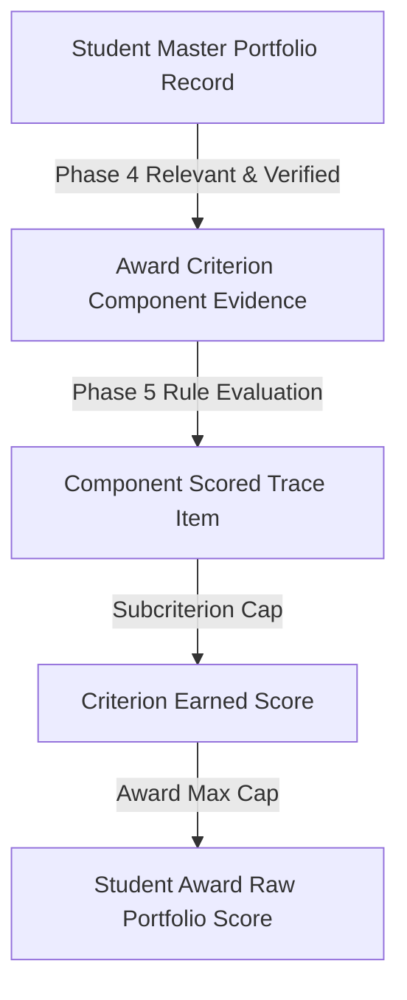

# AchieveNest — OSAD Award Evaluation & Portfolio Scoring
# Phase 5: Evidence Traceability & Audit Schema

> **Document:** `osad-award-phase5-evidence-traceability.md`  
> **Phase:** 5 of 8  
> **Scope:** Traceability from Evaluation Score down to Master Portfolio Record  
> **Status:** AUDITED & VERIFIED  

---

## 1. Traceability Architecture

Phase 5 enforces end-to-end explainability and deterministic auditability. Every point included in a student's `raw_portfolio_score` links directly to a specific record in `student_portfolio_records`.



---

## 2. Traceability Payload Structure

Each item in `evidence_traceability` contains:

```json
{
  "record_id": "rec-uuid-1234",
  "title": "SSG University President",
  "criterion_id": "50000002-0001-0000-0000-000000000001",
  "criterion_code": "CRIT_NDA_LEADERSHIP",
  "component_name": "Leadership Involvement (Highest Only)",
  "rule_type": "HIGHEST_APPLICABLE_ONLY",
  "base_points": 10.0,
  "contribution_points": 10.0,
  "is_selected": true
}
```

---

## 3. Transparency Guarantee for OSAD & Students

1. **Unselected Records**: When a lower-tier record is superseded under `HIGHEST_APPLICABLE_ONLY`, it remains visible in the trace with `is_selected: false` and `contribution_points: 0.00`.
2. **Capped Records**: When a section cap is reached, excess contribution is capped gracefully while preserving the link to all supporting evidence.
3. **Idempotency**: Recalculating scores replaces previous evaluation records cleanly without orphaned or duplicated score entries.
