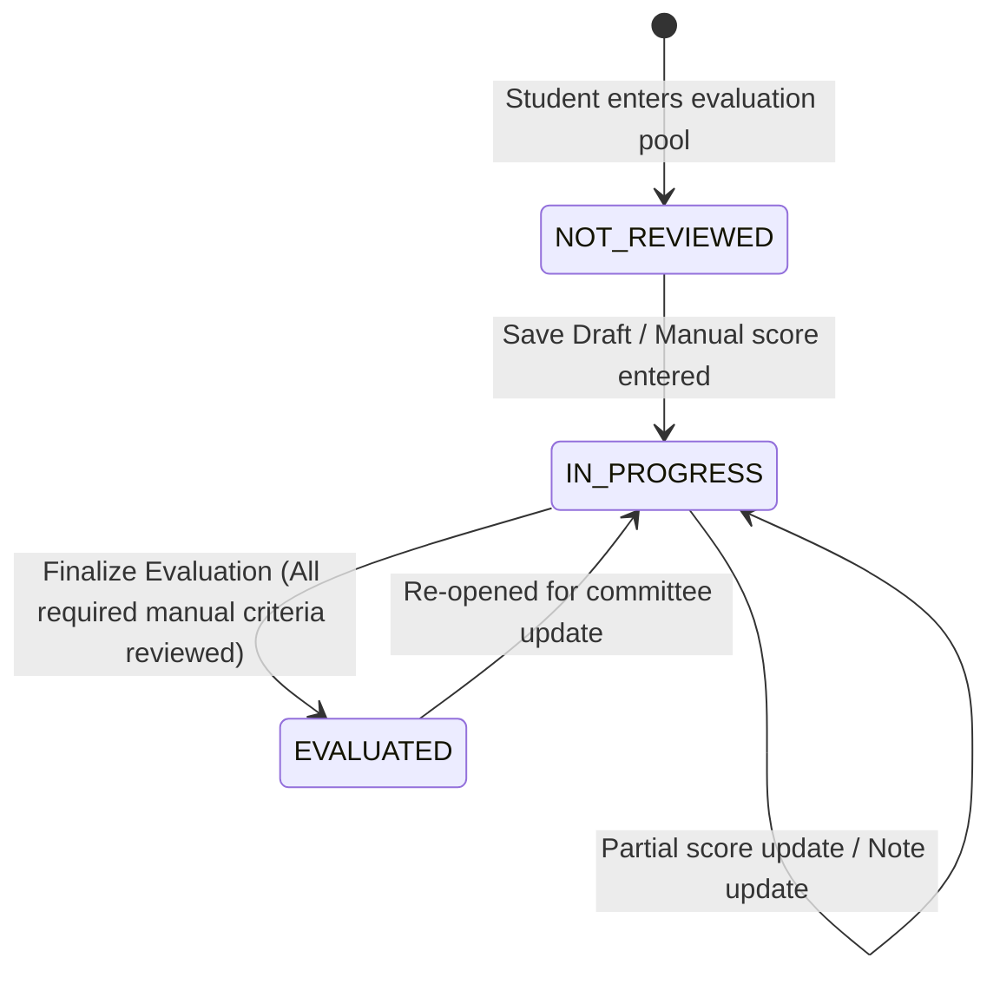

# AchieveNest — OSAD Award Evaluation & Portfolio Scoring
# Phase 6: OSAD Evaluation Workflow & Architecture

> **Document:** `osad-award-phase6-review-workflow.md`  
> **Phase:** 6 of 8  
> **Authority Source:** `AchieveNest — OSAD Award Evaluation & Portfolio Scoring Implementation Plan — COMPLETE`  
> **Service Layer:** `App\Services\AwardReviewService`  
> **Status:** IMPLEMENTED & AUDITED  

---

## 1. Executive Summary

Phase 6 implements the authoritative OSAD evaluation review workflow, providing an award-first workspace where institutional evaluators review individual students using:
1. **Authoritative Award Context**: Metadata, computable maximum, and governance badges.
2. **Phase 3 Eligibility**: Graduation and sex restriction validation.
3. **Phase 4 Relevant Verified Evidence**: Mapped student master records filtered to the award rubric.
4. **Phase 5 Computed Portfolio Scores**: Read-only calculated criterion scores with component breakdowns and cap explanations.
5. **Non-Computable / Panel Criteria**: Controlled manual entry with strict validation ($0 \le score \le official\_max$) and review note logging.

```text
Awards (15 Authoritative Awards)
    ↓
Students for Evaluation (Eligible + Verified Evidence Pool)
    ↓
Select Student
    ↓
Student Review Workspace
    ├── Relevant Verified Evidence (Left Panel)
    ├── Computed Portfolio Criteria (Right Panel, Read-Only)
    ├── Non-Computable / Panel Criteria (Right Panel, Manual Entry)
    ├── Review Notes / Committee Remarks
    └── Evaluation Status (NOT_REVIEWED → IN_PROGRESS → EVALUATED)
```

---

## 2. Review Status State Machine



- **`NOT_REVIEWED`**: Student has relevant verified evidence; no manual scores entered.
- **`IN_PROGRESS`**: Manual scores saved as draft or review initiated.
- **`EVALUATED`**: All required manual/panel criteria reviewed, validated, and finalized by authorized OSAD staff.

---

## 3. Strict Phase Boundary Enforcements

- **No Overwrite of Computed Scores**: Phase 5 computed portfolio scores are read-only.
- **Separate Portfolios and Panel Scores**: Manual criteria (Scholastic, Character, Interview, Sports Attitude) are NOT mixed into or added to the `raw_portfolio_score`.
- **No Potential Candidate Generation**: $\ge 80\%$ threshold decision, rankings, and Top 3/Top 5 designations are strictly reserved for Phase 7.
