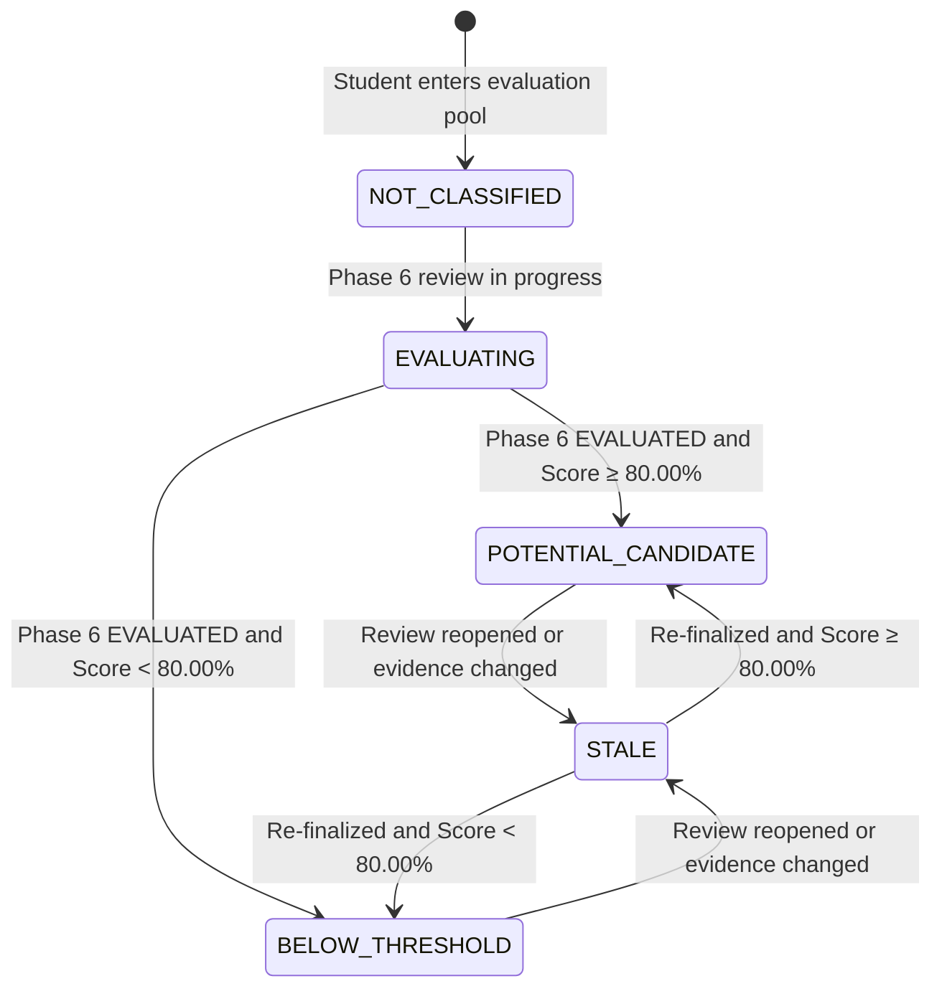

# AchieveNest — OSAD Award Evaluation & Portfolio Scoring
# Phase 7: Potential Candidate Engine & Normalization Architecture

> **Document:** `osad-award-phase7-potential-candidate-engine.md`  
> **Phase:** 7 of 8  
> **Authority Source:** `AchieveNest — OSAD Award Evaluation & Portfolio Scoring Implementation Plan — COMPLETE`  
> **Service Layer:** `App\Services\AwardPotentialCandidateService`  
> **Status:** IMPLEMENTED & AUDITED  

---

## 1. Purpose and Non-Negotiable Rule

Phase 7 implements the authoritative, normalized **Portfolio Potential Score** calculation and the universal **80% Potential Candidate threshold** across all 15 institutional awards.

> **NON-NEGOTIABLE INVARIANT:**  
> **Potential Candidate ≠ Final Awardee / Winner.**  
> Phase 7 determines which evaluated students meet the authoritative 80% Portfolio Potential Score preselection threshold and presents those students for institutional review. It must **not** automatically declare winners, truncate to Top 3/Top 5, or replace committee authority.

---

## 2. Authoritative Formula & Lifecycle

```text
Phase 2 (Award Registry & Computable Max)
    ↓
Phase 3 (Award Eligibility)
    ↓
Phase 4 (Relevant Verified Evidence)
    ↓
Phase 5 (Scoring Engine: Raw Portfolio Score)
    ↓
Phase 6 (OSAD Review: EVALUATED status)
    ↓
Phase 7: Portfolio Potential Score Normalization
    Portfolio Potential Score = (Raw Portfolio Score / Computable Max) * 100
        ├── ≥ 80.00% → POTENTIAL_CANDIDATE
        └── < 80.00% → BELOW_THRESHOLD
```

### Manual / Non-Computable Criteria Exclusion
Manual criteria (Scholastic 20–30, Character 20, Interview 10, Sports Attitude 20) are preserved for institutional deliberation, but are **strictly excluded** from the Portfolio Potential Score normalization formula.

---

## 3. Candidate Status Lifecycle State Machine


