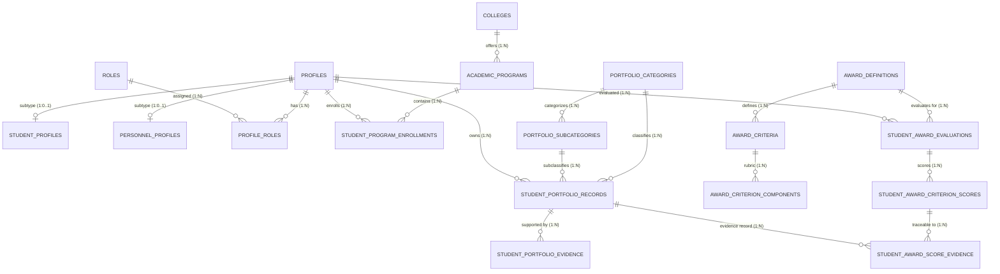

# AchieveNest — Local Database Consolidated Entity Relationship Diagram (ERD)

> **Database:** `achievenest_local`  
> **Audit Scope:** Consolidated Institutional Relational Architecture  

---

```mermaid
erDiagram
    PROFILES ||--o| STUDENT_PROFILES : "subtype (1:0..1)"
    PROFILES ||--o| PERSONNEL_PROFILES : "subtype (1:0..1)"
    PROFILES ||--o{ PROFILE_ROLES : "has (1:N)"
    ROLES ||--o{ PROFILE_ROLES : "assigned (1:N)"

    COLLEGES ||--o{ ACADEMIC_PROGRAMS : "offers (1:N)"
    ACADEMIC_PROGRAMS ||--o{ STUDENT_PROGRAM_ENROLLMENTS : "contains (1:N)"
    PROFILES ||--o{ STUDENT_PROGRAM_ENROLLMENTS : "enrolls (1:N)"

    PORTFOLIO_CATEGORIES ||--o{ PORTFOLIO_SUBCATEGORIES : "categorizes (1:N)"
    PORTFOLIO_CATEGORIES ||--o{ STUDENT_PORTFOLIO_RECORDS : "classifies (1:N)"
    PORTFOLIO_SUBCATEGORIES ||--o{ STUDENT_PORTFOLIO_RECORDS : "subclassifies (1:N)"
    PROFILES ||--o{ STUDENT_PORTFOLIO_RECORDS : "owns (1:N)"
    STUDENT_PORTFOLIO_RECORDS ||--o{ STUDENT_PORTFOLIO_EVIDENCE : "supported by (1:N)"

    AWARD_DEFINITIONS ||--o{ AWARD_CRITERIA : "defines (1:N)"
    AWARD_CRITERIA ||--o{ AWARD_CRITERION_COMPONENTS : "rubric (1:N)"
    AWARD_DEFINITIONS ||--o{ STUDENT_AWARD_EVALUATIONS : "evaluates for (1:N)"
    PROFILES ||--o{ STUDENT_AWARD_EVALUATIONS : "evaluated (1:N)"
    STUDENT_AWARD_EVALUATIONS ||--o{ STUDENT_AWARD_CRITERION_SCORES : "scores (1:N)"
    STUDENT_AWARD_CRITERION_SCORES ||--o{ STUDENT_AWARD_SCORE_EVIDENCE : "traceable to (1:N)"
    STUDENT_PORTFOLIO_RECORDS ||--o{ STUDENT_AWARD_SCORE_EVIDENCE : "evidence record (1:N)"
```
