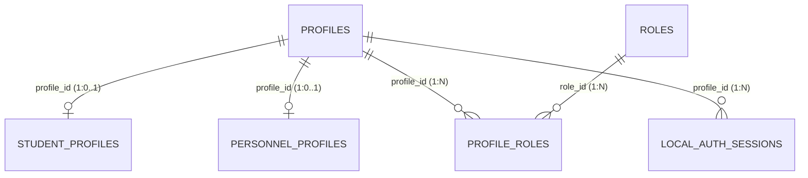
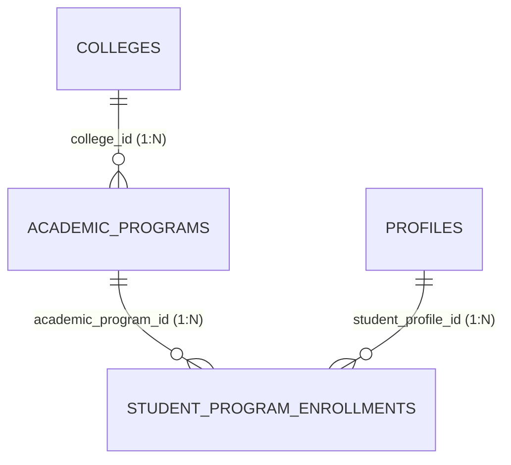
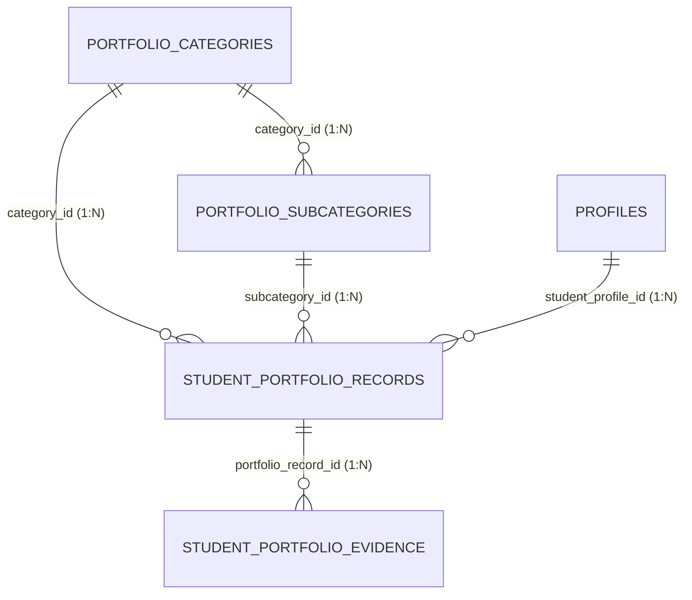
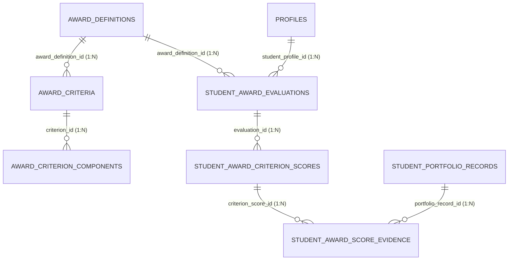

# AchieveNest — Phase D: Domain Entity Relationship Diagrams (ERDs)

> **Database:** `achievenest_local`  

---

## 1. Identity & Roles Domain ERD

## 2. Academic & Student Enrollment Domain ERD

## 3. Student Portfolio Domain ERD

## 4. OSAD Award Evaluation & Scoring Traceability Domain ERD

