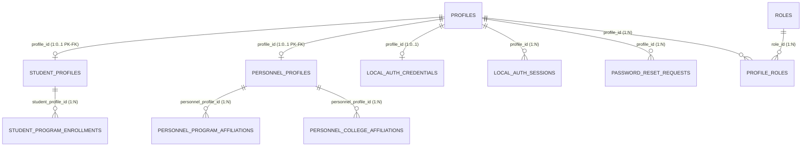

# AchieveNest — Phase E: Identity Architecture Entity Relationship Diagram

> **Database:** `achievenest_local`  

---

```mermaid
erDiagram
    PROFILES ||--o| STUDENT_PROFILES : "profile_id (1:0..1 PK-FK)"
    PROFILES ||--o| PERSONNEL_PROFILES : "profile_id (1:0..1 PK-FK)"
    PROFILES ||--o| LOCAL_AUTH_CREDENTIALS : "profile_id (1:0..1)"
    PROFILES ||--o{ LOCAL_AUTH_SESSIONS : "profile_id (1:N)"
    PROFILES ||--o{ PASSWORD_RESET_REQUESTS : "profile_id (1:N)"
    PROFILES ||--o{ PROFILE_ROLES : "profile_id (1:N)"
    ROLES ||--o{ PROFILE_ROLES : "role_id (1:N)"
    STUDENT_PROFILES ||--o{ STUDENT_PROGRAM_ENROLLMENTS : "student_profile_id (1:N)"
    PERSONNEL_PROFILES ||--o{ PERSONNEL_PROGRAM_AFFILIATIONS : "personnel_profile_id (1:N)"
    PERSONNEL_PROFILES ||--o{ PERSONNEL_COLLEGE_AFFILIATIONS : "personnel_profile_id (1:N)"
```
