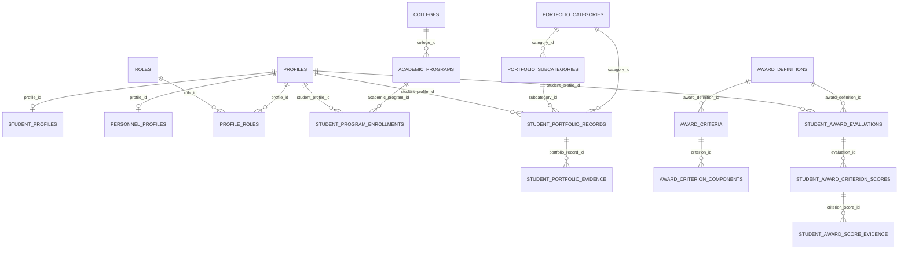

# AchieveNest — Phase 1: ERD Skeleton

> **Database:** `achievenest_local`  

---

```mermaid
erDiagram
    PROFILES ||--o| STUDENT_PROFILES : "profile_id"
    PROFILES ||--o| PERSONNEL_PROFILES : "profile_id"
    PROFILES ||--o{ PROFILE_ROLES : "profile_id"
    ROLES ||--o{ PROFILE_ROLES : "role_id"

    COLLEGES ||--o{ ACADEMIC_PROGRAMS : "college_id"
    ACADEMIC_PROGRAMS ||--o{ STUDENT_PROGRAM_ENROLLMENTS : "academic_program_id"
    PROFILES ||--o{ STUDENT_PROGRAM_ENROLLMENTS : "student_profile_id"

    PORTFOLIO_CATEGORIES ||--o{ PORTFOLIO_SUBCATEGORIES : "category_id"
    PORTFOLIO_CATEGORIES ||--o{ STUDENT_PORTFOLIO_RECORDS : "category_id"
    PORTFOLIO_SUBCATEGORIES ||--o{ STUDENT_PORTFOLIO_RECORDS : "subcategory_id"
    PROFILES ||--o{ STUDENT_PORTFOLIO_RECORDS : "student_profile_id"
    STUDENT_PORTFOLIO_RECORDS ||--o{ STUDENT_PORTFOLIO_EVIDENCE : "portfolio_record_id"

    AWARD_DEFINITIONS ||--o{ AWARD_CRITERIA : "award_definition_id"
    AWARD_CRITERIA ||--o{ AWARD_CRITERION_COMPONENTS : "criterion_id"
    AWARD_DEFINITIONS ||--o{ STUDENT_AWARD_EVALUATIONS : "award_definition_id"
    PROFILES ||--o{ STUDENT_AWARD_EVALUATIONS : "student_profile_id"
    STUDENT_AWARD_EVALUATIONS ||--o{ STUDENT_AWARD_CRITERION_SCORES : "evaluation_id"
    STUDENT_AWARD_CRITERION_SCORES ||--o{ STUDENT_AWARD_SCORE_EVIDENCE : "criterion_score_id"
```
