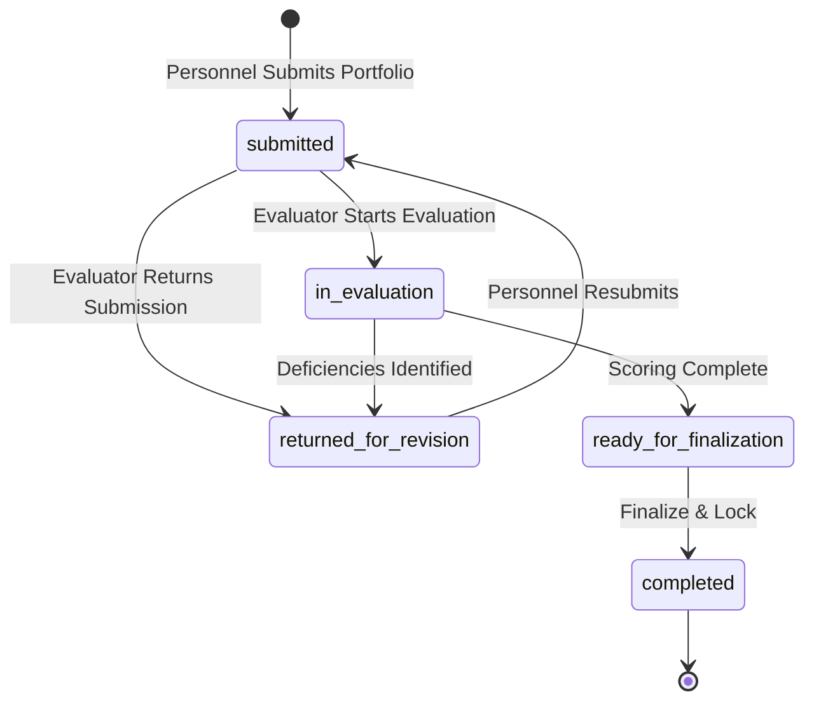

# CHU-02 Phase 2E — Evaluation Status Model Audit

## Document Purpose
This document audits the authoritative evaluation lifecycle states, database columns, backend constants, allowed transitions, and role owners under **CHU-02 Phase 2**.

---

## 1. Authoritative Evaluation State Machine

| State Code | Display Label | Responsible Role | Description |
|---|---|---|---|
| `submitted` | **Submitted / Pending Start** | Evaluator (Dean / HR) | Personnel has finalized and submitted portfolio; pending evaluation start. |
| `in_evaluation` | **In Evaluation** | Evaluator (Dean / HR) | Evaluator is verifying evidence items and scoring criteria. |
| `returned_for_revision` | **Revision Requested** | Personnel | Evaluator returned submission due to deficiencies or missing evidence. |
| `ready_for_finalization` | **Ready for Finalization** | Evaluator (Dean / HR) | All items verified and scored; ready for lock and rating compilation. |
| `completed` | **Completed / Locked** | System / HR | Final points calculated, rank recommendation resolved, snapshot locked. |

---

## 2. Valid State Transitions

- `submitted` $\rightarrow$ `in_evaluation`, `returned_for_revision`
- `in_evaluation` $\rightarrow$ `returned_for_revision`, `ready_for_finalization`
- `returned_for_revision` $\rightarrow$ `submitted`
- `ready_for_finalization` $\rightarrow$ `completed`
- `completed` $\rightarrow$ Terminal (No further transitions permitted)

---

## 3. Database Persistence & Source Tables
- **Main Evaluation Records**: `personnel_evaluations`
  - `status` (`submitted`, `in_evaluation`, `returned_for_revision`, `ready_for_finalization`, `completed`)
  - `personnel_profile_id` (UUID of personnel target)
  - `evaluator_profile_id` (UUID of resolved reviewer: Dean or HR)
  - `evaluation_cycle_id` / `cycle_name`
  - `final_score`, `recommended_rank_title`, `finalized_at`
- **Item Evidence Scores**: `personnel_evaluation_items`
  - `verification_status` (`verified`, `rejected`, `unverified`)
  - `points_awarded`, `evaluator_notes`
- **Deficiencies**: `personnel_evaluation_deficiencies`
  - `status` (`pending`, `responded`, `resolved`, `cancelled`)
- **Annual Dean Reviews**: `dean_annual_reviews` (Plan D1 companion)
  - `review_status` (`satisfactory`, `needs_improvement`, `unsatisfactory`)
