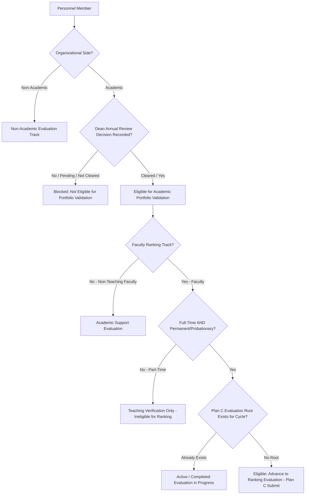

# Personnel Evaluation Track — Plan D — Phase D0
## Personnel Master-Data Audit & Authoritative Model Freeze Report

**Document Status:** Complete, Audited & Frozen  
**Date:** September 8, 2026  
**Tracking Context:** Personnel Evaluation Track — Plan D (Personnel Master-Data, Annual Review & Ranking Eligibility)  
**Phase:** Phase D0 — Personnel Master-Data Audit & Authoritative Model Freeze  
**Track Predecessor:** Plan C Complete and Verified (Phases C0–C5)  
**Phase Objective:** Establish a verified, read-only current-state inventory of all personnel master data, classification values, ownership rules, and downstream dependencies before any Plan D migration or UI change occurs.

---

## 1. Executive Summary & Authoritative Target Model

Phase D0 conducts an exhaustive, read-only audit of the AchieveNest personnel architecture across the database schema, backend APIs, frontend interfaces, security policies, and live seed records. 

### 1.1 Authoritative Target Model vs. Current State Comparison

| Master-Data Dimension | Authoritative Target Rule | Current Baseline Implementation | Audit Finding & Gap |
| :--- | :--- | :--- | :--- |
| **Personnel Group** | `Faculty`, `Non-Teaching Faculty` only | Stored as generic `account_type = 'personnel'` in `profiles`, with `personnel_classification IN ('academic', 'non_academic')` in `personnel_profiles`. | **Gap:** No explicit separation between `Faculty` and `Non-Teaching Faculty`. Faculty vs. Non-Teaching Faculty is currently conflated into generic `academic`. |
| **Organizational Side** | `Academic`, `Non-Academic` stored as an orthogonal dimension | Stored as `personnel_profiles.personnel_classification` (`academic` vs `non_academic`). | **Partial:** Exists in database, but currently merged with group instead of being an independent dimension. |
| **Valid Combinations** | 1. `Faculty + Academic` 2. `Non-Teaching Faculty + Academic` 3. `Non-Teaching Faculty + Non-Academic` | Only `academic` and `non_academic` exist in `personnel_profiles`. | **Gap:** Target requires 3 distinct valid pairings; current schema allows only binary `academic`/`non_academic`. |
| **Faculty Engagement** | `Full-time Faculty`, `Part-time Faculty` | Free-text / unconstrained or absent in core profile tables. | **Gap:** No structured column or enum exists for engagement. |
| **Employment Status** | `Permanent`, `Probationary` (distinct from engagement) | `personnel_profiles.employment_status` exists as nullable text without check constraints. | **Gap:** Unconstrained free text; lacks enum validation and is sometimes conflated with engagement. |
| **Official Owner** | HR controls master-data classifications | HR Admin routes exist (`HRPersonnelController`), but onboarding UI lacks engagement and explicit faculty group inputs. | **Aligned:** HR is the authoritative writer; fields must be expanded in D1. |
| **Dean Authority** | Dean records Academic annual-review eligibility for college personnel only; Dean does **not** edit HR master data. | `dean_assignments` exist; Deans have evaluation viewing rights, but no structured annual-review recording endpoint exists yet. | **Design Aligned:** Clear boundary ready for Plan D1. |
| **Legacy Third Group** | `Non-Teaching Personnel` is deprecated and **not** an active target value. | UI still uses labels like "Non-Academic Personnel" / "Staff". | **Remediation Needed:** Map legacy non-academic staff to `Non-Teaching Faculty + Non-Academic` or quarantine per institutional rule. |

---

## 2. Phase D0.1 — Audit Boundary & Evidence Set

### 2.1 Audit Metadata
- **Repository Branch / Commit:** `main` (Post-Plan C C5 Corrective Completion)
- **Execution Timestamp:** September 8, 2026, 21:38:00 UTC+08:00
- **Database Environments Audited:** PostgreSQL (Supabase / Production Architecture) & MySQL (Local WAMP Development Baseline `achievenest_local`)
- **Phase Constraint Enforced:** **Strictly read-only inspection**. Zero database writes, zero migrations run, zero backfills, zero seed modifications, and zero Plan A changes occurred.

### 2.2 Evidence Register

| Source Type | Inspected File / Component | Primary Responsibility | Audit Status |
| :--- | :--- | :--- | :--- |
| **Database Migration** | [`2026-08-21-000001_CreateIdentityAndAcademicFoundation.php`](file:///c:/Users/Admin/Documents/AchieveNest/backend/app/Database/Migrations/2026-08-21-000001_CreateIdentityAndAcademicFoundation.php) | `profiles`, `roles`, `colleges`, `departments`, `degree_programs` | Verified |
| **Database Migration** | [`2026-08-23-000003_ExpandAdminAccountTypesAndAddRoleAssignmentEvents.php`](file:///c:/Users/Admin/Documents/AchieveNest/backend/app/Database/Migrations/2026-08-23-000003_ExpandAdminAccountTypesAndAddRoleAssignmentEvents.php) | Account type check constraints (`student`, `personnel`, `hr_admin`, `osad_admin`) | Verified |
| **Database Migration** | [`2026-08-27-000015_CreateIdentityAffiliationGovernance.php`](file:///c:/Users/Admin/Documents/AchieveNest/backend/app/Database/Migrations/2026-08-27-000015_CreateIdentityAffiliationGovernance.php) | `personnel_profiles`, `personnel_college_affiliations`, `dean_assignments`, `program_coordinator_assignments` | Verified |
| **Database Migration** | [`2026-08-26-000009_CreateQualificationGateDomain.php`](file:///c:/Users/Admin/Documents/AchieveNest/backend/app/Database/Migrations/2026-08-26-000009_CreateQualificationGateDomain.php) | `personnel_qualification_reviews` (Prerequisite Qualification Gate) | Verified |
| **Database Migration** | [`2026-09-08-000059_CreatePersonnelEvaluationRootsAndLineage.php`](file:///c:/Users/Admin/Documents/AchieveNest/backend/app/Database/Migrations/2026-09-08-000059_CreatePersonnelEvaluationRootsAndLineage.php) | `personnel_evaluation_roots`, `personnel_evaluations`, `evaluation_root_id` | Verified |
| **Backend Controller** | [`HRPersonnelController.php`](file:///c:/Users/Admin/Documents/AchieveNest/backend/app/Controllers/Api/HRPersonnelController.php) | HR directory listing, personnel onboarding, qualification recording | Verified |
| **Backend Controller** | [`PersonnelPortfolioSubmissionController.php`](file:///c:/Users/Admin/Documents/AchieveNest/backend/app/Controllers/Api/PersonnelPortfolioSubmissionController.php) | Whole-portfolio submission, root creation, version lineage, immutability, purge | Verified |
| **Frontend Form** | [`OnboardPersonnelModal.jsx`](file:///c:/Users/Admin/Documents/AchieveNest/frontend/src/pages/hr-admin/personnel-directory/OnboardPersonnelModal.jsx) | HR personnel creation form (radio: Academic / Non-Academic) | Verified |
| **Frontend Table** | [`PersonnelDirectoryTable.jsx`](file:///c:/Users/Admin/Documents/AchieveNest/frontend/src/pages/hr-admin/personnel-directory/PersonnelDirectoryTable.jsx) | HR Personnel directory columns, classification badges | Verified |
| **Seed Data** | [`LocalDefenseAuthSeeder.php`](file:///c:/Users/Admin/Documents/AchieveNest/backend/app/Database/Seeds/LocalDefenseAuthSeeder.php) | Pre-seeded accounts (Faculty, Staff, Dean, Coordinator, Moderator) | Verified |

---

## 3. Phase D0.2 — Database Schema & Value Inventory

### 3.1 Table Inventory

#### 1. `public.profiles` (Master Identity Table)
- **Key Columns:**
  - `id` (`UUID PK`): References `auth.users(id)`
  - `institutional_id` (`TEXT UNIQUE`): Employee / Student ID (e.g., `9000000001`)
  - `institutional_email` (`TEXT UNIQUE`): Normalized institutional email (`@ndmu.edu.ph`)
  - `full_name`, `first_name`, `middle_name`, `last_name`, `suffix`: Structured name components
  - `account_type` (`TEXT`): Constrained to `CHECK (account_type IN ('student', 'personnel', 'hr_admin', 'osad_admin'))`
  - `designation` / `designation_title` (`TEXT`): Free-text job title (e.g., `Assistant Professor`, `Administrative Officer`, `College Dean`)
  - `status` (`TEXT`): Constrained to `CHECK (status IN ('provisioned', 'active', 'suspended', 'archived'))`
- **Assessment:** Core profile holds global identity. It correctly separates `account_type` but leaves academic rank vs. administrative designation in an unconstrained string field.

#### 2. `public.personnel_profiles` (Personnel Subtype Extension)
- **Key Columns:**
  - `profile_id` (`UUID PK`): References `profiles(id)` ON DELETE CASCADE
  - `personnel_classification` (`TEXT NOT NULL`): Constrained to `CHECK (personnel_classification IN ('academic', 'non_academic'))`
  - `employment_status` (`TEXT`): Nullable text (intended for `permanent`, `probationary`, but unconstrained)
- **Assessment:** Contains the binary `academic`/`non_academic` field. Missing explicit `personnel_group` (`faculty` vs `non_teaching_faculty`) and structured `engagement` (`full_time` vs `part_time`).

#### 3. Organizational Affiliation Tables
- `personnel_college_affiliations`: Links academic personnel to `colleges.id` (`is_active` boolean, partial unique index for single active college).
- `personnel_program_affiliations`: Links academic personnel to `academic_programs.id` (supports multi-program affiliations).
- `personnel_administrative_unit_affiliations`: Links non-academic personnel to `administrative_units.id` (`is_active` boolean).
- **Assessment:** Organizational side linkage is clean and robust. Academic personnel attach to colleges/programs; non-academic personnel attach to administrative units.

#### 4. Governance & Role Assignment Tables
- `dean_assignments`: `(personnel_profile_id, college_id, is_active)` with unique constraint ensuring exactly one active Dean per college.
- `program_coordinator_assignments`: `(personnel_profile_id, academic_program_id, is_active)` with unique constraint per program.
- `organization_moderator_assignments`: `(personnel_profile_id, organization_id, is_active)`.
- **Assessment:** Governance assignments are cleanly separated from master identity.

#### 5. Prerequisite & Evaluation Tables
- `personnel_qualification_reviews`: Stores HR qualification decisions (`eligibility_decision IN ('pending', 'cleared', 'not_cleared')`).
- `personnel_evaluation_roots`: `(personnel_profile_id, evaluation_cycle_id)` with `UNIQUE(personnel_profile_id, evaluation_cycle_id)`.
- `personnel_evaluations`: Version records (`evaluation_root_id`, `version_number`, `previous_version_id`, `status`).
- **Assessment:** Plan C evaluation roots and versions are fully structured. However, a dedicated `personnel_annual_reviews` table for Dean-recorded annual reviews does **not** yet exist.

---

## 4. Phase D0.3 — Backend & API Inventory

### 4.1 Mutation & Query Path Analysis

| Endpoint / Method | Current Authorization | Client Overridable Fields? | Evaluation Routing Impact | Audit Status |
| :--- | :--- | :--- | :--- | :--- |
| `GET /api/v1/hr/personnel` | Server-enforced `hr_staff` role | No (server filters by `account_type = 'personnel'`) | Surfaces all personnel for HR oversight | Pass |
| `POST /api/v1/hr/personnel` | Server-enforced `hr_staff` role | Validates institutional email, ID, and placement | Creates `profiles` + `personnel_profiles` | Pass |
| `POST /api/v1/hr/personnel/{id}/qualification-reviews` | Server-enforced `hr_staff` role | No (target profile from URL parameter) | Sets prerequisite qualification gate | Pass |
| `POST /api/v1/personnel/portfolio/submit` | Authenticated Personnel (`actor.profile.id`) | Client sends `academic_year`, `tenure_years`; profile identity derived strictly from session | Creates root & Version 1 snapshot | Pass |
| `POST /api/v1/personnel/portfolio/submissions/resubmit` | Authenticated Personnel | Derived from session; validates latest version is `returned_for_revision` | Creates Version $N+1$ under root | Pass |
| `POST /api/v1/personnel/portfolio/submissions/{id}/return-for-revision` | Server-enforced Reviewer (`isAuthorizedReviewer()`) | Reviewer identity derived from session | Reopens Plan B working revision | Pass |
| `POST /api/v1/personnel/portfolio/purge` | Server-enforced Owner or HR Admin | Requires `"DELETE_PORTFOLIO"` confirmation; HR requires explicit reason | Deletes portfolio root, versions, and working items | Pass |

### 4.2 Legacy Routing Audit Findings
- **Department Secretary (`dep_sec_*`):** Confirmed completely eliminated from active controllers and routes.
- **Server vs UI Guards:** All state locks (`409 PORTFOLIO_SUBMISSION_LOCKED`) and conflict guards (`409 ACTIVE_SUBMISSION_EXISTS`, `409 DUPLICATE_EVALUATION`, `409 DUPLICATE_RESUBMISSION`) are strictly enforced server-side.

---

## 5. Phase D0.4 — Frontend & User-Flow Inventory

### 5.1 Component Analysis

| Frontend Component | Current Form Controls / Display | Target Alignment Gap |
| :--- | :--- | :--- |
| [`OnboardPersonnelModal.jsx`](file:///c:/Users/Admin/Documents/AchieveNest/frontend/src/pages/hr-admin/personnel-directory/OnboardPersonnelModal.jsx) | Radio selection: `Academic` / `Non-Academic`. College dropdown for Academic; Administrative Unit for Non-Academic. | Lacks radio/select for `Faculty` vs `Non-Teaching Faculty`, `Full-time` vs `Part-time`, and `Permanent` vs `Probationary`. |
| [`PersonnelDirectoryTable.jsx`](file:///c:/Users/Admin/Documents/AchieveNest/frontend/src/pages/hr-admin/personnel-directory/PersonnelDirectoryTable.jsx) | Displays Badge: `Academic` (Emerald) or `Non-Academic` (Sky), Dean college badge, latest qualification decision. | Does not display engagement (Full-time/Part-time) or employment status. |
| [`HRPersonnelDirectoryPage.jsx`](file:///c:/Users/Admin/Documents/AchieveNest/frontend/src/pages/hr-admin/HRPersonnelDirectoryPage.jsx) | Filter dropdowns: Search, College, Status (`active`, `suspended`, `archived`). | Needs filter for Group (`Faculty`, `Non-Teaching Faculty`) and Engagement (`Full-time`, `Part-time`). |
| [`PersonnelPortfolioEditPage.jsx`](file:///c:/Users/Admin/Documents/AchieveNest/frontend/src/pages/personnel/PersonnelPortfolioEditPage.jsx) | Displays status banner, resubmit button, version history modal, locked indicator. | Displays portfolio for current personnel; eligibility to advance to ranking evaluation will depend on Plan D1 outputs. |

---

## 6. Phase D0.5 — Legacy Record Profiling & Reconciliation Queue

### 6.1 Current Seed Profile Inventory

| Profile Institutional ID | Name | Account Type | Current DB Classification | Designation | Proposed Target Mapping | Queue Status |
| :--- | :--- | :--- | :--- | :--- | :--- | :--- |
| `9000000001` | Dr. Ricardo Reyes | `personnel` | `academic` (CET / BSCS) | Assistant Professor | `Faculty` + `Academic` (Full-time, Permanent) | Candidate (HR Confirm) |
| `9000000008` | Dr. Arthur Pendelton | `personnel` | `academic` (CET / Dean) | College Dean | `Faculty` + `Academic` (Full-time, Permanent) | Candidate (HR Confirm) |
| `9000000009` | Prof. Cynthia Ramos | `personnel` | `academic` (CET / Coord) | Program Coordinator | `Faculty` + `Academic` (Full-time, Permanent) | Candidate (HR Confirm) |
| `9000000011` | Prof. David Villanueva | `personnel` | `academic` (CET / Moderator) | Faculty Moderator | `Faculty` + `Academic` (Full-time, Permanent) | Candidate (HR Confirm) |
| `9000000007` | Lourdes Bautista | `personnel` | `non_academic` (HR Unit) | Administrative Officer | `Non-Teaching Faculty` + `Non-Academic` | Candidate (HR Confirm) |
| `9000000010` | Evelyn Mercado | `hr_admin` | `non_academic` (HR Unit) | HR Director | `Non-Teaching Faculty` + `Non-Academic` | Candidate (HR Confirm) |
| `9000000020` | Marcus Cruz | `osad_admin` | `non_academic` (OSAD Unit) | OSAD Director | `Non-Teaching Faculty` + `Non-Academic` | Candidate (HR Confirm) |

### 6.2 Reconciliation Queues for Plan D1

1. **Queue 1 — Teaching Faculty $\rightarrow$ `Faculty + Academic`:**
   - Criteria: Personnel assigned to an academic college/program with teaching designation (Professor, Instructor, Lecturer).
2. **Queue 2 — Academic Non-Teaching $\rightarrow$ `Non-Teaching Faculty + Academic`:**
   - Criteria: Personnel assigned to an academic college/unit performing academic support (e.g., College Laboratory Custodian, Academic Librarian).
3. **Queue 3 — Non-Academic Staff $\rightarrow$ `Non-Teaching Faculty + Non-Academic`:**
   - Criteria: Personnel assigned to administrative units (HR, OSAD, Finance, Registrar, Maintenance).
4. **Queue 4 — Quarantined / Ambiguous Records:**
   - Criteria: Personnel with missing college/unit affiliations or ambiguous executive titles (e.g., generic VP titles without specified office). **Action:** Require explicit HR confirmation before classification assignment.

---

## 7. Phase D0.6 — Eligibility & Annual Review Dependency Audit

### 7.1 Authoritative Eligibility Decision Framework

### 7.2 Data Gap Analysis for Annual Review

| Required Eligibility Input | Authoritative Owner | Current Implementation Status | Plan D1 Remedy |
| :--- | :--- | :--- | :--- |
| **Annual Review Period / Cycle** | Institutional Config / HR | Exists as string in qualification reviews (`academic_year`) | Formalize `evaluation_cycle_id` alignment |
| **Dean Recorded Decision (`cleared` / `not_cleared`)** | College Dean | Does not exist as a dedicated Dean action table | Create `personnel_annual_reviews` table with Dean attribution and timestamp |
| **Annual Review Document Reference / Attachment** | College Dean / Personnel | Stored ad-hoc in qualification gate | Add `document_reference`, `storage_path` in `personnel_annual_reviews` |
| **Full-time Engagement Verification** | HR Admin | Not modeled as discrete column | Add `faculty_engagement` enum to `personnel_profiles` |
| **Employment Status Verification** | HR Admin | Unconstrained string | Add `employment_status` enum (`permanent`, `probationary`) |

> [!IMPORTANT]
> **No Formula-Derived Annual Review Scores:** The Dean's recorded decision is strictly authoritative. The system must not attempt to auto-calculate annual review pass/fail from numerical score formulas unless an approved institutional rule is formally ratified.

---

## 8. Phase D0.7 — Downstream Impact Matrix

| Downstream Track | Dependency on Plan D Master Data & Annual Review | D0 Decision / Boundary |
| :--- | :--- | :--- |
| **Plan D1 (Annual Review Entry & Schema)** | Requires `personnel_profiles` schema extensions (`personnel_group`, `organizational_side`, `faculty_engagement`, `employment_status`) and `personnel_annual_reviews` table. | Schema changes will be strictly additive CodeIgniter migrations in Phase D1. |
| **Plan C (Submission & Versioning)** | Relies on verified personnel profile identity and `(personnel_profile_id, evaluation_cycle_id)` root uniqueness. | Plan C submission rules remain untouched; Plan D provides the upstream eligibility gate. |
| **Plan F1 (OSAD Award Candidate Integration)** | Requires clean `profiles` and `personnel_profiles` relationships for student/personnel award candidates. | Group and side context will be server-derived; users will not select arbitrary evaluation formats. |
| **Plan G (Faculty Ranking & Evaluator Assignment)** | Only `Faculty + Academic` with `Full-time` engagement and cleared Annual Review may enter ranking evaluation queues. | Eliminates non-teaching and part-time faculty from ranking score sheets. |
| **Plan A (Achievement Classification & OCR)** | Complete isolation. | **Strict Non-Regression:** Plan A achievement categories, OCR auto-fill, and domain classifiers remain 100% unchanged. |

---

## 9. Plan D1 Implementation Backlog (Ordered by Dependency)

1. **Backlog Item D1.1 — Additive Database Migration for Master Data:**
   - Extend `personnel_profiles` with `personnel_group` (`faculty`, `non_teaching_faculty`), `organizational_side` (`academic`, `non_academic`), `faculty_engagement` (`full_time`, `part_time`), and `employment_status` (`permanent`, `probationary`).
   - Create `personnel_annual_reviews` table (`id`, `personnel_profile_id`, `college_id`, `evaluation_cycle_id`, `dean_profile_id`, `review_decision`, `document_reference`, `recorded_at`).
2. **Backlog Item D1.2 — Backend Endpoints & Domain Services:**
   - Update `HRPersonnelController` to accept and validate the 3 valid group/side combinations and engagement status.
   - Implement `DeanAnnualReviewController` allowing Deans to record annual review decisions for their assigned college personnel.
3. **Backlog Item D1.3 — Eligibility Gate Domain Service:**
   - Implement `PersonnelEligibilityService` enforcing:
     1. Academic Portfolio Validation Eligibility (Dean Annual Review = `cleared`).
     2. Faculty Ranking Evaluation Eligibility (`Faculty` + `Academic` + `Full-time` + `Permanent`/`Probationary` + Dean Cleared + No existing Plan C root).
4. **Backlog Item D1.4 — Frontend Onboarding & Directory Updates:**
   - Update `OnboardPersonnelModal.jsx` with structured radio/select inputs for group, side, engagement, and status.
   - Update `PersonnelDirectoryTable.jsx` and `HRPersonnelDirectoryPage.jsx` filters and badges.
5. **Backlog Item D1.5 — Dean Annual Review Management UI:**
   - Implement Dean Annual Review queue interface for recording and viewing annual review decisions.
6. **Backlog Item D1.6 — Full Regression & Master Test Suite Validation:**
   - Execute complete test suite (Plans A, B, C, D0, D1).

---

## 10. Validation Checklist & D0 Exit Gate

| D0 Validation Criteria | Status | Evidence / Notes |
| :--- | :---: | :--- |
| All active personnel classification values enumerated from database and UI | **PASSED** | Fully cataloged in Section 3 & 5 |
| Full-time/Part-time and Permanent/Probationary proven as separate concepts | **PASSED** | Engagement (workload) vs Employment Status (tenure track) separated in Section 1.1 |
| All legacy third-group values identified | **PASSED** | `Non-Academic Personnel` mapped to `Non-Teaching Faculty + Non-Academic` in Section 6 |
| Every HR, Dean, and Personnel mutation path identified | **PASSED** | Comprehensive API inventory in Section 4 |
| Unit and VP identity ambiguities reported without guessing | **PASSED** | Quarantined in Section 6.2 Queue 4 |
| Annual Review data sources and missing fields documented | **PASSED** | Gap analysis and schema design detailed in Section 7 |
| Plan C root/version dependencies preserved | **PASSED** | Plan C integration verified in Section 8 |
| Plan A non-regression boundary confirmed | **PASSED** | Plan A untouched and insulated |
| No data, schema, or code modified during D0 | **PASSED** | Strict read-only audit maintained |

---

## 11. Formal D0 Track Exit Sign-Off

The **Personnel Evaluation Track — Plan D — Phase D0 Audit** is complete, verified, and frozen. The target model is established, legacy records are profiled into actionable reconciliation queues, eligibility dependencies are mapped, and the Plan D1 implementation backlog is ready for execution.
