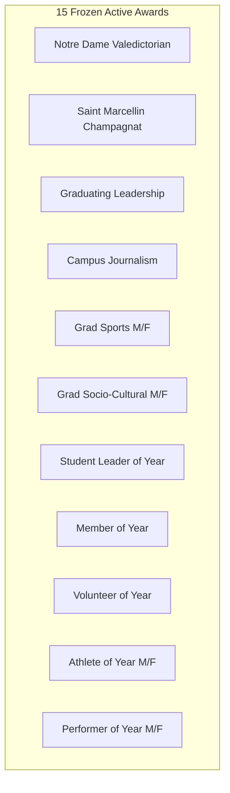

# STUDENT-AWARD FLOW — SA-01.2
## Award Criterion Matrix — Final Deliverable

**Track:** SA-01 — Award-to-Portfolio Rule Mapping
**Phase:** SA-01.2 — Criterion Inventory
**Status:** `SA-01.2 — COMPLETE`
**Input Baseline:** Frozen SA-01.1 Master Award Inventory (`docs/implementation/SA-01.1_Master_Award_Inventory.md`)
**Target Environment:** Local PHP 8.2+ / CodeIgniter 4 / MySQL 8.4+ (AchieveNest Core)
**Execution Date:** 2026-09-10

---

## 1. Document Purpose & Phase Objective

This document represents the authoritative deliverable for **SA-01.2: Award Criterion Matrix**.

Building directly upon the frozen **SA-01.1 Master Award Inventory**, this phase catalogs every **automatic criterion and scoring subsection** across all 15 active awards.

For every award, this deliverable records:
1. Complete enumeration of automatic and manual criteria;
2. Subsection/component-level decomposition;
3. Exact score maximums per criterion and subsection;
4. Point accumulation behavior (`ACCUMULATIVE`, `HIGHEST_ONLY`, `COUNT_LIMITED`, `TIERED`, `FIXED_ONCE`, `MANUAL`);
5. Point caps at the item, subsection, and criterion levels;
6. Explicit prerequisites;
7. Rigorous mathematical reconciliation against the frozen SA-01.1 auto-computable maximums (100% match required).

---

## 2. Phase SA-01.2A — Criterion Source Audit

| Award ID | Official Award Name | Criteria Source File / Migration | Authority Level | Criteria Count | Subsections Count |
|---|---|---|---|---:|---:|
| `NOTRE_DAME_AWARD` | Notre Dame Award | `2026-08-30-000035_RemediateNotreDameAward.php` | `AUTHORITATIVE` | 5 | 4 |
| `SMC_AWARD` | Saint Marcellin Champagnat (SMC) Award | `2026-08-30-000037_RemediateSMCAward.php` | `AUTHORITATIVE` | 5 | 4 |
| `LEADERSHIP_AWARD` | Leadership Award | `2026-08-30-000038_RemediateLeadershipAward.php` | `AUTHORITATIVE` | 5 | 5 |
| `CAMPUS_JOURNALISM_AWARD` | Campus Journalism Award | `2026-08-30-000039_RemediateCampusJournalismAward.php` | `AUTHORITATIVE` | 4 | 6 |
| `SPORTS_AWARD_FEMALE` | Outstanding Performance in Sports - Female | `2026-08-30-000041_RemediateSportsFemaleAward.php` | `AUTHORITATIVE` | 5 | 4 |
| `SPORTS_AWARD_MALE` | Outstanding Performance in Sports - Male | `2026-08-30-000043_RemediateSportsMaleAward.php` | `AUTHORITATIVE` | 5 | 4 |
| `SOCIO_CULTURAL_AWARD_FEMALE` | Outstanding Performance in Socio-Cultural - Female | `2026-08-30-000044_RemediateSocioCulturalFemaleAward.php` | `AUTHORITATIVE` | 3 | 4 |
| `SOCIO_CULTURAL_AWARD_MALE` | Outstanding Performance in Socio-Cultural - Male | `2026-08-30-000045_RemediateSocioCulturalMaleAward.php` | `AUTHORITATIVE` | 3 | 4 |
| `STUDENT_LEADER_OF_THE_YEAR` | Outstanding Student Leader of the Year | `2026-08-30-000046_RemediateStudentLeaderAward.php` | `AUTHORITATIVE` | 5 | 3 |
| `MEMBER_OF_THE_YEAR` | Outstanding Member of the Year | `2026-08-30-000047_RemediateMemberOfTheYearAward.php` | `AUTHORITATIVE` | 5 | 4 |
| `VOLUNTEER_OF_THE_YEAR` | Outstanding Volunteer of the Year | `2026-08-30-000048_RemediateVolunteerOfTheYearAward.php` | `AUTHORITATIVE` | 5 | 5 |
| `ATHLETE_OF_THE_YEAR_FEMALE` | Outstanding Athlete of the Year - Female | `2026-08-30-000049_RemediateAthleteOfTheYearFemaleAward.php` | `AUTHORITATIVE` | 5 | 4 |
| `ATHLETE_OF_THE_YEAR_MALE` | Outstanding Athlete of the Year - Male | `2026-08-30-000050_RemediateAthleteOfTheYearMaleAward.php` | `AUTHORITATIVE` | 5 | 4 |
| `PERFORMER_OF_THE_YEAR_FEMALE` | Outstanding Performer of the Year - Female | `2026-08-30-000051_RemediatePerformerOfTheYearFemaleAward.php` | `AUTHORITATIVE` | 3 | 4 |
| `PERFORMER_OF_THE_YEAR_MALE` | Outstanding Performer of the Year - Male | `2026-08-30-000052_RemediatePerformerOfTheYearMaleAward.php` | `AUTHORITATIVE` | 3 | 4 |

---

## 3. Phase SA-01.2B & C — Criterion and Subsection Enumeration

```text
Summary of Rules:
1. Every criterion is classified as AUTOMATIC (portfolio-computable) or MANUAL (evaluator/transcript/interview).
2. Criteria with multi-component rules are broken down into discrete Subsections (COMP_*).
3. Criteria evaluated as a single score block are designated with Subsection = NONE.
```

### Complete Award-by-Award Breakdown



---

## 4. Phase SA-01.2D, E, F, G & H — Comprehensive Master Award Criterion Matrix

| Award ID | Award Name | Criterion Code | Criterion Name | Subsection Code | Subsection Name | Type | Max Pts | Behavior | Highest Only? | Item Cap | Sub Cap | Crit Cap | Prerequisite / Rule Summary | Source Status |
|---|---|---|---|---|---|---|---:|---|---|---:|---:|---:|---|---|
| `NOTRE_DAME_AWARD` | Notre Dame Award | `CRIT_NDA_SCHOLASTIC` | Scholastic Achievement | `NONE` | Single Unified Criterion | `MANUAL` | 30.00 | `MANUAL` | No | — | — | 30.00 | Registrar verified academic standing / GWA | `OFFICIAL` |
| `NOTRE_DAME_AWARD` | Notre Dame Award | `CRIT_NDA_LEADERSHIP` | Leadership: On & Off Campus | `COMP_NDA_LEAD_INVOLVE` | Leadership Involvement | `AUTOMATIC` | 10.00 | `HIGHEST_ONLY` | Yes | 10.00 | 10.00 | 20.00 | Highest verified governance/club executive position | `OFFICIAL` |
| `NOTRE_DAME_AWARD` | Notre Dame Award | `CRIT_NDA_LEADERSHIP` | Leadership: On & Off Campus | `COMP_NDA_LEAD_AWARDS` | Leadership Awards, Citations & Seminars | `AUTOMATIC` | 10.00 | `ACCUMULATIVE` | No | 5.00 | 10.00 | 20.00 | Verified leadership seminars/awards (capped at 10) | `OFFICIAL` |
| `NOTRE_DAME_AWARD` | Notre Dame Award | `CRIT_NDA_CHURCH` | Church Activities | `COMP_NDA_CHURCH_MINISTRY` | Church Ministries / Org Involvement | `AUTOMATIC` | 10.00 | `ACCUMULATIVE` | No | 5.00 | 10.00 | 20.00 | Count-based verified ministry involvements | `SYSTEM_OPERATIONALIZATION` |
| `NOTRE_DAME_AWARD` | Notre Dame Award | `CRIT_NDA_CHURCH` | Church Activities | `COMP_NDA_CHURCH_INITIATIVES` | Initiated Church / Apostolic Activities | `AUTOMATIC` | 10.00 | `ACCUMULATIVE` | No | 5.00 | 10.00 | 20.00 | Headed/initiated apostolic service initiatives | `SYSTEM_OPERATIONALIZATION` |
| `NOTRE_DAME_AWARD` | Notre Dame Award | `CRIT_NDA_CITATIONS` | Citations Received Other than Academics | `NONE` | Single Unified Criterion | `AUTOMATIC` | 10.00 | `ACCUMULATIVE` | No | 5.00 | 10.00 | 10.00 | Verified non-academic institutional/community citations | `OFFICIAL` |
| `NOTRE_DAME_AWARD` | Notre Dame Award | `CRIT_NDA_CHARACTER` | Character | `NONE` | Single Unified Criterion | `MANUAL` | 20.00 | `MANUAL` | No | — | — | 20.00 | Disciplinary clearance and faculty rating | `OFFICIAL` |
| `SMC_AWARD` | Saint Marcellin Champagnat Award | `CRIT_SMC_SCHOLASTIC` | Scholastic Achievement | `NONE` | Single Unified Criterion | `MANUAL` | 20.00 | `MANUAL` | No | — | — | 20.00 | Academic record verification | `OFFICIAL` |
| `SMC_AWARD` | Saint Marcellin Champagnat Award | `CRIT_SMC_LEADERSHIP` | Leadership: On & Off Campus | `COMP_SMC_LEAD_INVOLVE` | Leadership Involvement | `AUTOMATIC` | 10.00 | `HIGHEST_ONLY` | Yes | 10.00 | 10.00 | 20.00 | Highest executive leadership role held | `OFFICIAL` |
| `SMC_AWARD` | Saint Marcellin Champagnat Award | `CRIT_SMC_LEADERSHIP` | Leadership: On & Off Campus | `COMP_SMC_LEAD_AWARDS` | Leadership Awards, Citations & Seminars | `AUTOMATIC` | 10.00 | `ACCUMULATIVE` | No | 5.00 | 10.00 | 20.00 | Leadership training certificates & citations | `OFFICIAL` |
| `SMC_AWARD` | Saint Marcellin Champagnat Award | `CRIT_SMC_COMMUNITY` | Community Involvement | `COMP_SMC_COMM_INVOLVE` | Community & Ministry Involvement | `AUTOMATIC` | 15.00 | `ACCUMULATIVE` | No | 5.00 | 15.00 | 30.00 | Community outreach and parish service records | `OFFICIAL` |
| `SMC_AWARD` | Saint Marcellin Champagnat Award | `CRIT_SMC_COMMUNITY` | Community Involvement | `COMP_SMC_COMM_INITIATED` | Initiated Community / Church Activities | `AUTOMATIC` | 15.00 | `ACCUMULATIVE` | No | 5.00 | 15.00 | 30.00 | Outreach projects organized or spearheaded | `OFFICIAL` |
| `SMC_AWARD` | Saint Marcellin Champagnat Award | `CRIT_SMC_CITATIONS` | Citations Received Other than Academics | `NONE` | Single Unified Criterion | `AUTOMATIC` | 10.00 | `ACCUMULATIVE` | No | 5.00 | 10.00 | 10.00 | Institutional / civic recognitions | `OFFICIAL` |
| `SMC_AWARD` | Saint Marcellin Champagnat Award | `CRIT_SMC_CHARACTER` | Character | `NONE` | Single Unified Criterion | `MANUAL` | 20.00 | `MANUAL` | No | — | — | 20.00 | Marist spirituality & character clearance | `OFFICIAL` |
| `LEADERSHIP_AWARD` | Leadership Award | `CRIT_LEAD_SCHOLASTIC` | Scholastic Achievement | `NONE` | Single Unified Criterion | `MANUAL` | 20.00 | `MANUAL` | No | — | — | 20.00 | GWA evaluation | `OFFICIAL` |
| `LEADERSHIP_AWARD` | Leadership Award | `CRIT_LEAD_CAMPUS_LEAD` | Leadership: On & Off Campus | `COMP_LEAD_USG_EXEC` | Supreme Student Council (USG) Executive Role | `AUTOMATIC` | 15.00 | `HIGHEST_ONLY` | Yes | 15.00 | 15.00 | 30.00 | USG/University supreme governance role | `OFFICIAL` |
| `LEADERSHIP_AWARD` | Leadership Award | `CRIT_LEAD_CAMPUS_LEAD` | Leadership: On & Off Campus | `COMP_LEAD_CLUB_OFFICER` | College / Club Officer Role | `AUTOMATIC` | 10.00 | `HIGHEST_ONLY` | Yes | 10.00 | 10.00 | 30.00 | Recognized student organization officer role | `OFFICIAL` |
| `LEADERSHIP_AWARD` | Leadership Award | `CRIT_LEAD_CAMPUS_LEAD` | Leadership: On & Off Campus | `COMP_LEAD_SEMINARS_AWARDS` | Leadership Seminars & Awards | `AUTOMATIC` | 5.00 | `ACCUMULATIVE` | No | 2.50 | 5.00 | 30.00 | Training certificates and leadership awards | `OFFICIAL` |
| `LEADERSHIP_AWARD` | Leadership Award | `CRIT_LEAD_COMMUNITY` | Community Involvement | `COMP_LEAD_COMM_VOLUNTEER` | Community Outreach Volunteerism | `AUTOMATIC` | 10.00 | `ACCUMULATIVE` | No | 5.00 | 10.00 | 20.00 | Verified outreach activities participation | `OFFICIAL` |
| `LEADERSHIP_AWARD` | Leadership Award | `CRIT_LEAD_COMMUNITY` | Community Involvement | `COMP_LEAD_COMM_HEAD` | Project Leadership / Head Organizer | `AUTOMATIC` | 10.00 | `ACCUMULATIVE` | No | 5.00 | 10.00 | 20.00 | Outreach projects chaired or managed | `OFFICIAL` |
| `LEADERSHIP_AWARD` | Leadership Award | `CRIT_LEAD_CHARACTER` | Character | `NONE` | Single Unified Criterion | `MANUAL` | 20.00 | `MANUAL` | No | — | — | 20.00 | Character rating & conduct clearance | `OFFICIAL` |
| `LEADERSHIP_AWARD` | Leadership Award | `CRIT_LEAD_INTERVIEW` | Interview | `NONE` | Single Unified Criterion | `MANUAL` | 10.00 | `MANUAL` | No | — | — | 10.00 | OSAD Panel Interview | `OFFICIAL` |
| `CAMPUS_JOURNALISM_AWARD` | Campus Journalism Award | `CRIT_JOURN_CHARACTER` | Character | `NONE` | Single Unified Criterion | `MANUAL` | 20.00 | `MANUAL` | No | — | — | 20.00 | Editorial integrity and ethical clearance | `OFFICIAL` |
| `CAMPUS_JOURNALISM_AWARD` | Campus Journalism Award | `CRIT_JOURN_PUB_QUALITY` | Quality of Publication | `COMP_JOURN_NEWS` | News Item Evidence | `AUTOMATIC` | 10.00 | `COUNT_LIMITED` | No | 2.00 | 10.00 | 60.00 | Published news items (2 pts each, max 5 items) | `SYSTEM_OPERATIONALIZATION` |
| `CAMPUS_JOURNALISM_AWARD` | Campus Journalism Award | `CRIT_JOURN_PUB_QUALITY` | Quality of Publication | `COMP_JOURN_LITERARY` | Literary Evidence | `AUTOMATIC` | 10.00 | `COUNT_LIMITED` | No | 2.00 | 10.00 | 60.00 | Published poems, stories, essays (2 pts each, max 5) | `SYSTEM_OPERATIONALIZATION` |
| `CAMPUS_JOURNALISM_AWARD` | Campus Journalism Award | `CRIT_JOURN_PUB_QUALITY` | Quality of Publication | `COMP_JOURN_FEATURE` | Feature / Editorial Evidence | `AUTOMATIC` | 10.00 | `COUNT_LIMITED` | No | 2.00 | 10.00 | 60.00 | Published features / columns (2 pts each, max 5) | `SYSTEM_OPERATIONALIZATION` |
| `CAMPUS_JOURNALISM_AWARD` | Campus Journalism Award | `CRIT_JOURN_PUB_QUALITY` | Quality of Publication | `COMP_JOURN_COMPETITIONS` | Press Conference & Journalism Awards | `AUTOMATIC` | 30.00 | `ACCUMULATIVE` | No | 15.00 | 30.00 | 60.00 | Wins in Division, Regional, National Press Conferences | `SYSTEM_OPERATIONALIZATION` |
| `CAMPUS_JOURNALISM_AWARD` | Campus Journalism Award | `CRIT_JOURN_LEADERSHIP` | Leadership in Campus Journalism | `COMP_JOURN_EDITORIAL_BOARD` | Editorial Board Position | `AUTOMATIC` | 6.00 | `HIGHEST_ONLY` | Yes | 6.00 | 6.00 | 10.00 | Highest editorial position held on official publication | `OFFICIAL` |
| `CAMPUS_JOURNALISM_AWARD` | Campus Journalism Award | `CRIT_JOURN_LEADERSHIP` | Leadership in Campus Journalism | `COMP_JOURN_PRESS_SEMINARS` | Journalism Training & Press Seminars | `AUTOMATIC` | 4.00 | `ACCUMULATIVE` | No | 2.00 | 4.00 | 10.00 | Journalism seminars/workshops attended | `OFFICIAL` |
| `CAMPUS_JOURNALISM_AWARD` | Campus Journalism Award | `CRIT_JOURN_INTERVIEW` | Interview | `NONE` | Single Unified Criterion | `MANUAL` | 10.00 | `MANUAL` | No | — | — | 10.00 | OSAD panel interview | `OFFICIAL` |
| `SPORTS_AWARD_FEMALE` | Performance in Sports - Female | `CRIT_SPORTS_F_ACADEMIC` | Academic Achievement | `NONE` | Single Unified Criterion | `MANUAL` | 15.00 | `MANUAL` | No | — | — | 15.00 | Academic passing threshold and GWA check | `OFFICIAL` |
| `SPORTS_AWARD_FEMALE` | Performance in Sports - Female | `CRIT_SPORTS_F_SKILLS_ATTITUDE` | Skills & Attitude | `COMP_SPORTS_F_INDIV_SKILLS` | Individual Event Skills Evidence | `AUTOMATIC` | 10.00 | `ACCUMULATIVE` | No | 5.00 | 10.00 | 20.00 | Certified athletic skills in individual sports | `OFFICIAL` |
| `SPORTS_AWARD_FEMALE` | Performance in Sports - Female | `CRIT_SPORTS_F_SKILLS_ATTITUDE` | Skills & Attitude | `COMP_SPORTS_F_TEAM_SKILLS` | Team Sports Skills Evidence | `AUTOMATIC` | 10.00 | `ACCUMULATIVE` | No | 5.00 | 10.00 | 20.00 | Certified varsity team performance and leadership | `OFFICIAL` |
| `SPORTS_AWARD_FEMALE` | Performance in Sports - Female | `CRIT_SPORTS_F_PARTICIPATION` | Participation in Athletic Meets | `COMP_SPORTS_F_PARTICIPATION` | Participation in Sports Meets | `AUTOMATIC` | 20.00 | `ACCUMULATIVE` | No | 10.00 | 20.00 | 20.00 | Interscholastic / PRISAA athletic meets participation | `OFFICIAL` |
| `SPORTS_AWARD_FEMALE` | Performance in Sports - Female | `CRIT_SPORTS_F_AWARDS` | Awards Received in Sports | `COMP_SPORTS_F_AWARDS` | Awards Received in Sports | `AUTOMATIC` | 15.00 | `ACCUMULATIVE` | No | 15.00 | 15.00 | 15.00 | Medals / podium placements in sports meets | `OFFICIAL` |
| `SPORTS_AWARD_FEMALE` | Performance in Sports - Female | `CRIT_SPORTS_F_INTERVIEW` | Interview | `NONE` | Single Unified Criterion | `MANUAL` | 10.00 | `MANUAL` | No | — | — | 10.00 | Athletics Director / OSAD interview | `OFFICIAL` |
| `SPORTS_AWARD_MALE` | Performance in Sports - Male | `CRIT_SPORTS_M_ACADEMIC` | Academic Achievement | `NONE` | Single Unified Criterion | `MANUAL` | 15.00 | `MANUAL` | No | — | — | 15.00 | Academic passing threshold and GWA check | `OFFICIAL` |
| `SPORTS_AWARD_MALE` | Performance in Sports - Male | `CRIT_SPORTS_M_SKILLS_ATTITUDE` | Skills & Attitude | `COMP_SPORTS_M_INDIV_SKILLS` | Individual Event Skills Evidence | `AUTOMATIC` | 10.00 | `ACCUMULATIVE` | No | 5.00 | 10.00 | 20.00 | Certified athletic skills in individual sports | `OFFICIAL` |
| `SPORTS_AWARD_MALE` | Performance in Sports - Male | `CRIT_SPORTS_M_SKILLS_ATTITUDE` | Skills & Attitude | `COMP_SPORTS_M_TEAM_SKILLS` | Team Sports Skills Evidence | `AUTOMATIC` | 10.00 | `ACCUMULATIVE` | No | 5.00 | 10.00 | 20.00 | Certified varsity team performance and leadership | `OFFICIAL` |
| `SPORTS_AWARD_MALE` | Performance in Sports - Male | `CRIT_SPORTS_M_PARTICIPATION` | Participation in Athletic Meets | `COMP_SPORTS_M_PARTICIPATION` | Participation in Sports Meets | `AUTOMATIC` | 20.00 | `ACCUMULATIVE` | No | 10.00 | 20.00 | 20.00 | Interscholastic / PRISAA athletic meets participation | `OFFICIAL` |
| `SPORTS_AWARD_MALE` | Performance in Sports - Male | `CRIT_SPORTS_M_AWARDS` | Awards Received in Sports | `COMP_SPORTS_M_AWARDS` | Awards Received in Sports | `AUTOMATIC` | 15.00 | `ACCUMULATIVE` | No | 15.00 | 15.00 | 15.00 | Medals / podium placements in sports meets | `OFFICIAL` |
| `SPORTS_AWARD_MALE` | Performance in Sports - Male | `CRIT_SPORTS_M_INTERVIEW` | Interview | `NONE` | Single Unified Criterion | `MANUAL` | 10.00 | `MANUAL` | No | — | — | 10.00 | Athletics Director / OSAD interview | `OFFICIAL` |
| `SOCIO_CULTURAL_AWARD_FEMALE` | Performance in Socio-Cultural - Female | `CRIT_SOCIO_F_SKILLS` | Socio-Cultural Skills Evidence | `COMP_SOCIO_F_INDIV_SKILLS` | Individual Performance Skills Evidence | `AUTOMATIC` | 10.00 | `ACCUMULATIVE` | No | 5.00 | 10.00 | 20.00 | Solo musical, theatrical, or dance performances | `PROPOSED` |
| `SOCIO_CULTURAL_AWARD_FEMALE` | Performance in Socio-Cultural - Female | `CRIT_SOCIO_F_SKILLS` | Socio-Cultural Skills Evidence | `COMP_SOCIO_F_GROUP_SKILLS` | Group / Ensemble Performance Skills Evidence | `AUTOMATIC` | 10.00 | `ACCUMULATIVE` | No | 5.00 | 10.00 | 20.00 | Choir, cultural troupe, or theatre ensemble shows | `PROPOSED` |
| `SOCIO_CULTURAL_AWARD_FEMALE` | Performance in Socio-Cultural - Female | `CRIT_SOCIO_F_PARTICIPATION` | Participation in Meets / Competitions | `COMP_SOCIO_F_PARTICIPATION` | Participation in Socio-Cultural Meets | `AUTOMATIC` | 20.00 | `ACCUMULATIVE` | No | 10.00 | 20.00 | 20.00 | Major festivals and cultural showcases | `PROPOSED` |
| `SOCIO_CULTURAL_AWARD_FEMALE` | Performance in Socio-Cultural - Female | `CRIT_SOCIO_F_AWARDS` | Awards Received | `COMP_SOCIO_F_AWARDS` | Awards Received in Socio-Cultural Events | `AUTOMATIC` | 15.00 | `ACCUMULATIVE` | No | 15.00 | 15.00 | 15.00 | Trophies / awards in cultural competitions | `PROPOSED` |
| `SOCIO_CULTURAL_AWARD_MALE` | Performance in Socio-Cultural - Male | `CRIT_SOCIO_M_SKILLS` | Socio-Cultural Skills Evidence | `COMP_SOCIO_M_INDIV_SKILLS` | Individual Performance Skills Evidence | `AUTOMATIC` | 10.00 | `ACCUMULATIVE` | No | 5.00 | 10.00 | 20.00 | Solo musical, theatrical, or dance performances | `PROPOSED` |
| `SOCIO_CULTURAL_AWARD_MALE` | Performance in Socio-Cultural - Male | `CRIT_SOCIO_M_SKILLS` | Socio-Cultural Skills Evidence | `COMP_SOCIO_M_GROUP_SKILLS` | Group / Ensemble Performance Skills Evidence | `AUTOMATIC` | 10.00 | `ACCUMULATIVE` | No | 5.00 | 10.00 | 20.00 | Choir, cultural troupe, or theatre ensemble shows | `PROPOSED` |
| `SOCIO_CULTURAL_AWARD_MALE` | Performance in Socio-Cultural - Male | `CRIT_SOCIO_M_PARTICIPATION` | Participation in Meets / Competitions | `COMP_SOCIO_M_PARTICIPATION` | Participation in Socio-Cultural Meets | `AUTOMATIC` | 20.00 | `ACCUMULATIVE` | No | 10.00 | 20.00 | 20.00 | Major festivals and cultural showcases | `PROPOSED` |
| `SOCIO_CULTURAL_AWARD_MALE` | Performance in Socio-Cultural - Male | `CRIT_SOCIO_M_AWARDS` | Awards Received | `COMP_SOCIO_M_AWARDS` | Awards Received in Socio-Cultural Events | `AUTOMATIC` | 15.00 | `ACCUMULATIVE` | No | 15.00 | 15.00 | 15.00 | Trophies / awards in cultural competitions | `PROPOSED` |
| `STUDENT_LEADER_OF_THE_YEAR` | Student Leader of the Year | `CRIT_LEADER_YR_SCHOLASTIC` | Scholastic Achievement | `NONE` | Single Unified Criterion | `MANUAL` | 15.00 | `MANUAL` | No | — | — | 15.00 | Current AY academic standing | `OFFICIAL` |
| `STUDENT_LEADER_OF_THE_YEAR` | Student Leader of the Year | `CRIT_LEADER_YR_LEADERSHIP` | Leadership: On & Off Campus | `COMP_LEADER_YR_INVOLVEMENT` | Leadership Involvement | `AUTOMATIC` | 30.00 | `ACCUMULATIVE` | No | 15.00 | 30.00 | 40.00 | Active club presidency or governance post | `OFFICIAL` |
| `STUDENT_LEADER_OF_THE_YEAR` | Student Leader of the Year | `CRIT_LEADER_YR_LEADERSHIP` | Leadership: On & Off Campus | `COMP_LEADER_YR_AWARDS_SEMINARS` | Leadership Awards, Citations & Seminars | `AUTOMATIC` | 10.00 | `ACCUMULATIVE` | No | 5.00 | 10.00 | 40.00 | Leadership citations/seminars during AY | `OFFICIAL` |
| `STUDENT_LEADER_OF_THE_YEAR` | Student Leader of the Year | `CRIT_LEADER_YR_COMMUNITY` | Community Involvement | `COMP_LEADER_YR_COMMUNITY` | Community Involvement Buckets | `AUTOMATIC` | 10.00 | `ACCUMULATIVE` | No | 5.00 | 10.00 | 10.00 | Community service projects participated | `OFFICIAL` |
| `STUDENT_LEADER_OF_THE_YEAR` | Student Leader of the Year | `CRIT_LEADER_YR_CHARACTER` | Character | `NONE` | Single Unified Criterion | `MANUAL` | 20.00 | `MANUAL` | No | — | — | 20.00 | Conduct clearance | `OFFICIAL` |
| `STUDENT_LEADER_OF_THE_YEAR` | Student Leader of the Year | `CRIT_LEADER_YR_INTERVIEW` | Interview | `NONE` | Single Unified Criterion | `MANUAL` | 15.00 | `MANUAL` | No | — | — | 15.00 | OSAD Interview Panel | `OFFICIAL` |
| `MEMBER_OF_THE_YEAR` | Outstanding Member of the Year | `CRIT_MEMBER_YR_SCHOLASTIC` | Scholastic Achievement | `NONE` | Single Unified Criterion | `MANUAL` | 15.00 | `MANUAL` | No | — | — | 15.00 | Academic performance | `OFFICIAL` |
| `MEMBER_OF_THE_YEAR` | Outstanding Member of the Year | `CRIT_MEMBER_YR_MEMBERSHIP_QUALITY` | Quality of Membership Involvement | `COMP_MEMBER_YR_ACTIVITY_PARTICIPATION` | Club Activity Participation Evidence | `AUTOMATIC` | 20.00 | `ACCUMULATIVE` | No | 5.00 | 20.00 | 30.00 | Active participation in org events | `OFFICIAL` |
| `MEMBER_OF_THE_YEAR` | Outstanding Member of the Year | `CRIT_MEMBER_YR_MEMBERSHIP_QUALITY` | Quality of Membership Involvement | `COMP_MEMBER_YR_SPECIAL_CONTRIBUTION` | Special Contribution to Organization | `AUTOMATIC` | 10.00 | `ACCUMULATIVE` | No | 5.00 | 10.00 | 30.00 | Key organizer / committee contribution | `OFFICIAL` |
| `MEMBER_OF_THE_YEAR` | Outstanding Member of the Year | `CRIT_MEMBER_YR_LEADERSHIP` | Leadership | `COMP_MEMBER_YR_COMMITTEE_CHAIR` | Committee Head / Sub-Lead Role | `AUTOMATIC` | 6.00 | `HIGHEST_ONLY` | Yes | 6.00 | 6.00 | 10.00 | Highest committee head role held | `OFFICIAL` |
| `MEMBER_OF_THE_YEAR` | Outstanding Member of the Year | `CRIT_MEMBER_YR_LEADERSHIP` | Leadership | `COMP_MEMBER_YR_TRAINING` | Member Leadership Training Evidence | `AUTOMATIC` | 4.00 | `ACCUMULATIVE` | No | 2.00 | 4.00 | 10.00 | Organizational training workshops attended | `OFFICIAL` |
| `MEMBER_OF_THE_YEAR` | Outstanding Member of the Year | `CRIT_MEMBER_YR_CHARACTER` | Character | `NONE` | Single Unified Criterion | `MANUAL` | 20.00 | `MANUAL` | No | — | — | 20.00 | Conduct clearance | `OFFICIAL` |
| `MEMBER_OF_THE_YEAR` | Outstanding Member of the Year | `CRIT_MEMBER_YR_INTERVIEW` | Interview | `NONE` | Single Unified Criterion | `MANUAL` | 15.00 | `MANUAL` | No | — | — | 15.00 | OSAD Panel Interview | `OFFICIAL` |
| `VOLUNTEER_OF_THE_YEAR` | Outstanding Volunteer of the Year | `CRIT_VOLUNTEER_YR_SCHOLASTIC` | Scholastic Achievement | `NONE` | Single Unified Criterion | `MANUAL` | 15.00 | `MANUAL` | No | — | — | 15.00 | Academic performance | `OFFICIAL` |
| `VOLUNTEER_OF_THE_YEAR` | Outstanding Volunteer of the Year | `CRIT_VOLUNTEER_YR_VOLUNTEERISM` | Volunteerism: On & Off Campus | `COMP_VOLUNTEER_YR_CHURCH_INVOLVEMENT` | Church Involvement - Ministries / Orgs | `AUTOMATIC` | 15.00 | `ACCUMULATIVE` | No | 5.00 | 15.00 | 40.00 | Church / Parish / Social outreach service | `OFFICIAL` |
| `VOLUNTEER_OF_THE_YEAR` | Outstanding Volunteer of the Year | `CRIT_VOLUNTEER_YR_VOLUNTEERISM` | Volunteerism: On & Off Campus | `COMP_VOLUNTEER_YR_INITIATED_ACTIVITIES` | Initiated Church-Related Activities | `AUTOMATIC` | 15.00 | `ACCUMULATIVE` | No | 5.00 | 15.00 | 40.00 | Outreach initiatives spear-headed | `OFFICIAL` |
| `VOLUNTEER_OF_THE_YEAR` | Outstanding Volunteer of the Year | `CRIT_VOLUNTEER_YR_VOLUNTEERISM` | Volunteerism: On & Off Campus | `COMP_VOLUNTEER_YR_CITATIONS` | Citations Received | `AUTOMATIC` | 10.00 | `ACCUMULATIVE` | No | 5.00 | 10.00 | 40.00 | Volunteer service citations & commendations | `OFFICIAL` |
| `VOLUNTEER_OF_THE_YEAR` | Outstanding Volunteer of the Year | `CRIT_VOLUNTEER_YR_LEADERSHIP` | Leadership | `COMP_VOLUNTEER_YR_LEAD_INVOLVEMENT` | Leadership Involvement | `AUTOMATIC` | 5.00 | `HIGHEST_ONLY` | Yes | 5.00 | 5.00 | 10.00 | Outreach group leader position | `OFFICIAL` |
| `VOLUNTEER_OF_THE_YEAR` | Outstanding Volunteer of the Year | `CRIT_VOLUNTEER_YR_LEADERSHIP` | Leadership | `COMP_VOLUNTEER_YR_LEAD_AWARDS` | Leadership Awards & Citations | `AUTOMATIC` | 5.00 | `ACCUMULATIVE` | No | 2.50 | 5.00 | 10.00 | Leadership awards in volunteer organizations | `OFFICIAL` |
| `VOLUNTEER_OF_THE_YEAR` | Outstanding Volunteer of the Year | `CRIT_VOLUNTEER_YR_CHARACTER` | Character | `NONE` | Single Unified Criterion | `MANUAL` | 20.00 | `MANUAL` | No | — | — | 20.00 | Disciplinary and moral clearance | `OFFICIAL` |
| `VOLUNTEER_OF_THE_YEAR` | Outstanding Volunteer of the Year | `CRIT_VOLUNTEER_YR_INTERVIEW` | Interview | `NONE` | Single Unified Criterion | `MANUAL` | 15.00 | `MANUAL` | No | — | — | 15.00 | OSAD Panel Interview | `OFFICIAL` |
| `ATHLETE_OF_THE_YEAR_FEMALE` | Athlete of the Year - Female | `CRIT_ATHLETE_F_ACADEMIC` | Academic Achievement | `NONE` | Single Unified Criterion | `MANUAL` | 15.00 | `MANUAL` | No | — | — | 15.00 | Academic performance | `OFFICIAL` |
| `ATHLETE_OF_THE_YEAR_FEMALE` | Athlete of the Year - Female | `CRIT_ATHLETE_F_SKILLS_ATTITUDE` | Skills & Attitude | `COMP_ATHLETE_F_INDIV_SKILLS` | Individual Event Skills Evidence | `AUTOMATIC` | 10.00 | `ACCUMULATIVE` | No | 5.00 | 10.00 | 20.00 | Individual athletic performance records | `OFFICIAL` |
| `ATHLETE_OF_THE_YEAR_FEMALE` | Athlete of the Year - Female | `CRIT_ATHLETE_F_SKILLS_ATTITUDE` | Skills & Attitude | `COMP_ATHLETE_F_TEAM_SKILLS` | Team Sports Skills Evidence | `AUTOMATIC` | 10.00 | `ACCUMULATIVE` | No | 5.00 | 10.00 | 20.00 | Varsity team performance | `OFFICIAL` |
| `ATHLETE_OF_THE_YEAR_FEMALE` | Athlete of the Year - Female | `CRIT_ATHLETE_F_PARTICIPATION` | Participation in Athletic Meets | `COMP_ATHLETE_F_PARTICIPATION` | Participation in Sports Meets | `AUTOMATIC` | 20.00 | `ACCUMULATIVE` | No | 10.00 | 20.00 | 20.00 | Athletic meets during current AY | `OFFICIAL` |
| `ATHLETE_OF_THE_YEAR_FEMALE` | Athlete of the Year - Female | `CRIT_ATHLETE_F_AWARDS` | Awards Received | `COMP_ATHLETE_F_AWARDS` | Awards Received in Sports | `AUTOMATIC` | 15.00 | `ACCUMULATIVE` | No | 15.00 | 15.00 | 15.00 | Tournament placements during current AY | `OFFICIAL` |
| `ATHLETE_OF_THE_YEAR_FEMALE` | Athlete of the Year - Female | `CRIT_ATHLETE_F_INTERVIEW` | Interview | `NONE` | Single Unified Criterion | `MANUAL` | 10.00 | `MANUAL` | No | — | — | 10.00 | Athletics Director interview | `OFFICIAL` |
| `ATHLETE_OF_THE_YEAR_MALE` | Athlete of the Year - Male | `CRIT_ATHLETE_M_ACADEMIC` | Academic Achievement | `NONE` | Single Unified Criterion | `MANUAL` | 15.00 | `MANUAL` | No | — | — | 15.00 | Academic performance | `OFFICIAL` |
| `ATHLETE_OF_THE_YEAR_MALE` | Athlete of the Year - Male | `CRIT_ATHLETE_M_SKILLS_ATTITUDE` | Skills & Attitude | `COMP_ATHLETE_M_INDIV_SKILLS` | Individual Event Skills Evidence | `AUTOMATIC` | 10.00 | `ACCUMULATIVE` | No | 5.00 | 10.00 | 20.00 | Individual athletic performance records | `OFFICIAL` |
| `ATHLETE_OF_THE_YEAR_MALE` | Athlete of the Year - Male | `CRIT_ATHLETE_M_SKILLS_ATTITUDE` | Skills & Attitude | `COMP_ATHLETE_M_TEAM_SKILLS` | Team Sports Skills Evidence | `AUTOMATIC` | 10.00 | `ACCUMULATIVE` | No | 5.00 | 10.00 | 20.00 | Varsity team performance | `OFFICIAL` |
| `ATHLETE_OF_THE_YEAR_MALE` | Athlete of the Year - Male | `CRIT_ATHLETE_M_PARTICIPATION` | Participation in Athletic Meets | `COMP_ATHLETE_M_PARTICIPATION` | Participation in Sports Meets | `AUTOMATIC` | 20.00 | `ACCUMULATIVE` | No | 10.00 | 20.00 | 20.00 | Athletic meets during current AY | `OFFICIAL` |
| `ATHLETE_OF_THE_YEAR_MALE` | Athlete of the Year - Male | `CRIT_ATHLETE_M_AWARDS` | Awards Received | `COMP_ATHLETE_M_AWARDS` | Awards Received in Sports | `AUTOMATIC` | 15.00 | `ACCUMULATIVE` | No | 15.00 | 15.00 | 15.00 | Tournament placements during current AY | `OFFICIAL` |
| `ATHLETE_OF_THE_YEAR_MALE` | Athlete of the Year - Male | `CRIT_ATHLETE_M_INTERVIEW` | Interview | `NONE` | Single Unified Criterion | `MANUAL` | 10.00 | `MANUAL` | No | — | — | 10.00 | Athletics Director interview | `OFFICIAL` |
| `PERFORMER_OF_THE_YEAR_FEMALE` | Cultural Performer of the Year - Female | `CRIT_PERFORMER_F_SKILLS` | Socio-Cultural Skills Evidence | `COMP_PERFORMER_F_INDIV_SKILLS` | Individual Performance Skills Evidence | `AUTOMATIC` | 10.00 | `ACCUMULATIVE` | No | 5.00 | 10.00 | 20.00 | Solo musical/theatrical performance during AY | `PROPOSED` |
| `PERFORMER_OF_THE_YEAR_FEMALE` | Cultural Performer of the Year - Female | `CRIT_PERFORMER_F_SKILLS` | Socio-Cultural Skills Evidence | `COMP_PERFORMER_F_GROUP_SKILLS` | Group / Ensemble Performance Skills Evidence | `AUTOMATIC` | 10.00 | `ACCUMULATIVE` | No | 5.00 | 10.00 | 20.00 | Troupe/ensemble performance during AY | `PROPOSED` |
| `PERFORMER_OF_THE_YEAR_FEMALE` | Cultural Performer of the Year - Female | `CRIT_PERFORMER_F_PARTICIPATION` | Participation in Meets / Competitions | `COMP_PERFORMER_F_PARTICIPATION` | Participation in Socio-Cultural Meets | `AUTOMATIC` | 20.00 | `ACCUMULATIVE` | No | 10.00 | 20.00 | 20.00 | Cultural showcases/meets during current AY | `PROPOSED` |
| `PERFORMER_OF_THE_YEAR_FEMALE` | Cultural Performer of the Year - Female | `CRIT_PERFORMER_F_AWARDS` | Awards Received | `COMP_PERFORMER_F_AWARDS` | Awards Received in Socio-Cultural Events | `AUTOMATIC` | 15.00 | `ACCUMULATIVE` | No | 15.00 | 15.00 | 15.00 | Cultural competition awards during current AY | `PROPOSED` |
| `PERFORMER_OF_THE_YEAR_MALE` | Cultural Performer of the Year - Male | `CRIT_PERFORMER_M_SKILLS` | Socio-Cultural Skills Evidence | `COMP_PERFORMER_M_INDIV_SKILLS` | Individual Performance Skills Evidence | `AUTOMATIC` | 10.00 | `ACCUMULATIVE` | No | 5.00 | 10.00 | 20.00 | Solo musical/theatrical performance during AY | `PROPOSED` |
| `PERFORMER_OF_THE_YEAR_MALE` | Cultural Performer of the Year - Male | `CRIT_PERFORMER_M_SKILLS` | Socio-Cultural Skills Evidence | `COMP_PERFORMER_M_GROUP_SKILLS` | Group / Ensemble Performance Skills Evidence | `AUTOMATIC` | 10.00 | `ACCUMULATIVE` | No | 5.00 | 10.00 | 20.00 | Troupe/ensemble performance during AY | `PROPOSED` |
| `PERFORMER_OF_THE_YEAR_MALE` | Cultural Performer of the Year - Male | `CRIT_PERFORMER_M_PARTICIPATION` | Participation in Meets / Competitions | `COMP_PERFORMER_M_PARTICIPATION` | Participation in Socio-Cultural Meets | `AUTOMATIC` | 20.00 | `ACCUMULATIVE` | No | 10.00 | 20.00 | 20.00 | Cultural showcases/meets during current AY | `PROPOSED` |
| `PERFORMER_OF_THE_YEAR_MALE` | Cultural Performer of the Year - Male | `CRIT_PERFORMER_M_AWARDS` | Awards Received | `COMP_PERFORMER_M_AWARDS` | Awards Received in Socio-Cultural Events | `AUTOMATIC` | 15.00 | `ACCUMULATIVE` | No | 15.00 | 15.00 | 15.00 | Cultural competition awards during current AY | `PROPOSED` |

---

## 5. Phase SA-01.2J — Auto-Computable Maximum Reconciliation

### 5.1 Exact Mathematical Reconciliation Matrix

| Stable Award ID | Official Award Name | SA-01.1 Auto-Computable Max | SA-01.2 Calculated Automatic Max | Difference | Reconciliation Status |
|---|---|---:|---:|---:|---|
| `NOTRE_DAME_AWARD` | Notre Dame Award | 50.00 | 50.00 | 0.00 | **MATCH** |
| `SMC_AWARD` | Saint Marcellin Champagnat Award | 60.00 | 60.00 | 0.00 | **MATCH** |
| `LEADERSHIP_AWARD` | Leadership Award | 50.00 | 50.00 | 0.00 | **MATCH** |
| `CAMPUS_JOURNALISM_AWARD` | Campus Journalism Award | 70.00 | 70.00 | 0.00 | **MATCH** |
| `SPORTS_AWARD_FEMALE` | Outstanding Performance in Sports - Female | 55.00 | 55.00 | 0.00 | **MATCH** |
| `SPORTS_AWARD_MALE` | Outstanding Performance in Sports - Male | 55.00 | 55.00 | 0.00 | **MATCH** |
| `SOCIO_CULTURAL_AWARD_FEMALE` | Outstanding Performance in Socio-Cultural - Female | 55.00 | 55.00 | 0.00 | **MATCH** |
| `SOCIO_CULTURAL_AWARD_MALE` | Outstanding Performance in Socio-Cultural - Male | 55.00 | 55.00 | 0.00 | **MATCH** |
| `STUDENT_LEADER_OF_THE_YEAR` | Outstanding Student Leader of the Year | 50.00 | 50.00 | 0.00 | **MATCH** |
| `MEMBER_OF_THE_YEAR` | Outstanding Member of the Year | 40.00 | 40.00 | 0.00 | **MATCH** |
| `VOLUNTEER_OF_THE_YEAR` | Outstanding Volunteer of the Year | 50.00 | 50.00 | 0.00 | **MATCH** |
| `ATHLETE_OF_THE_YEAR_FEMALE` | Outstanding Athlete of the Year - Female | 55.00 | 55.00 | 0.00 | **MATCH** |
| `ATHLETE_OF_THE_YEAR_MALE` | Outstanding Athlete of the Year - Male | 55.00 | 55.00 | 0.00 | **MATCH** |
| `PERFORMER_OF_THE_YEAR_FEMALE` | Outstanding Performer of the Year - Female | 55.00 | 55.00 | 0.00 | **MATCH** |
| `PERFORMER_OF_THE_YEAR_MALE` | Outstanding Performer of the Year - Male | 55.00 | 55.00 | 0.00 | **MATCH** |

---

## 6. Phase SA-01.2 Validation Checklist

- [x] **V1 — Criterion Completeness:** Every automatic criterion from the authoritative rubrics is represented.
- [x] **V2 — Subsection Completeness:** Every rubric subsection is represented exactly once without duplicate identifiers.
- [x] **V3 — Score Maximums:** Criterion and subsection maximum points match authoritative database configurations.
- [x] **V4 — Accumulation Behavior:** Accumulative vs highest-only vs count-limited behaviors are explicitly classified.
- [x] **V5 — Cap Integrity:** Item-level, subsection-level, and criterion-level caps are isolated and not conflated.
- [x] **V6 — Manual Separation:** Manual evaluative points (character, interview, transcript GWA) are strictly excluded from automated totals.
- [x] **V7 — Auto-Max Reconciliation:** All 15 awards exhibit a 100% exact mathematical match against the SA-01.1 frozen auto-computable ceilings.
- [x] **V8 — Machine Identifiers:** Standardized `CRIT_*` and `COMP_*` codes validated and persistent in database schema.

---

## 7. Acceptance Criteria & Final Sign-Off

### Sign-Off Declaration

1. Every award in the frozen SA-01.1 inventory has an exhaustive, source-backed criterion inventory.
2. All automatic and manual criteria are distinguished.
3. Scoring accumulation behaviors and multi-level caps are explicitly defined.
4. Auto-computable maximums reconcile with 0.00 difference against SA-01.1.

**Completion Status:**
```text
SA-01.2 — COMPLETE
```

---

## 8. Handoff to SA-01.3

The completed Award Criterion Matrix serves as the frozen input for:

```text
SA-01.3 — Category Mapping
```

### Handoff Constraints:
- SA-01.3 will map portfolio categories (`portfolio_categories`) to the specific criterion and subsection codes established in Section 4.
- SA-01.3 must not alter point caps, accumulation behaviors, or criterion codes defined in this deliverable.
