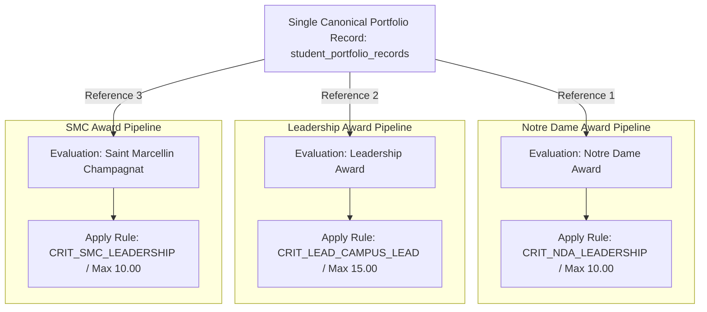

# STUDENT-AWARD FLOW — SA-01.6
## Shared Mapping Dependency Matrix — Final Deliverable

**Track:** SA-01 — Award-to-Portfolio Rule Mapping
**Phase:** SA-01.6 — Shared Category Analysis
**Status:** `SA-01.6 — COMPLETE`
**Input Baselines:**
- Frozen SA-01.1 Master Award Inventory (`docs/implementation/SA-01.1_Master_Award_Inventory.md`)
- Frozen SA-01.2 Award Criterion Matrix (`docs/implementation/SA-01.2_Award_Criterion_Matrix.md`)
- Frozen SA-01.3 Criterion Category Matrix (`docs/implementation/SA-01.3_Criterion_Category_Matrix.md`)
- Frozen SA-01.4 Award Criterion Category Sub-Category Matrix (`docs/implementation/SA-01.4_Award_Criterion_Category_SubCategory_Matrix.md`)
- Frozen SA-01.5 Rule Condition Table (`docs/implementation/SA-01.5_Rule_Condition_Table.md`)
**Target Environment:** Local PHP 8.2+ / CodeIgniter 4 / MySQL 8.4+ (AchieveNest Core)
**Execution Date:** 2026-09-10

---

## 1. Document Purpose & Phase Objective

This document represents the authoritative deliverable for **SA-01.6: Shared Category Analysis**.

This phase conducts a cross-award comparative analysis across all 15 active awards to document where the same portfolio taxonomy, sub-categories, and verified student achievements participate across multiple award evaluation pipelines.

### Core Architectural Invariants
1. **One Canonical Record, Multiple Independent Evaluations:** A verified student achievement is stored exactly once in `student_portfolio_records`. If it qualifies for multiple awards (e.g., a leadership record supporting both `Notre Dame Award` and `Leadership Award`), the scoring engine evaluates the same record independently without cloning or generating duplicate portfolio rows.
2. **Shared Taxonomy $\neq$ Shared Scoring:** Reusing a category or sub-category does not imply identical point weights, accumulation rules, or caps. Each award evaluates the record against its own rubric version and criteria caps.
3. **Zero Cross-Award Score Carryover:** Points calculated for Award A are never transferred or aggregated into Award B.
4. **Zero Cross-Award Cap Sharing:** Hitting a point ceiling in Award A does not deplete or restrict the available cap in Award B.
5. **Zero Cross-Award Eligibility Leakage:** Passing eligibility gates for Award A does not bypass eligibility evaluation for Award B.

---

## 2. Phase SA-01.6A — Shared Category Inventory

| Category Code | Display Name | Consuming Awards | Consuming Awards Count | Exclusivity Classification |
|---|---|---|---:|---|
| `LEADERSHIP` | **Leadership Position** | `NOTRE_DAME_AWARD`, `SMC_AWARD`, `LEADERSHIP_AWARD`, `STUDENT_LEADER_OF_THE_YEAR`, `MEMBER_OF_THE_YEAR`, `VOLUNTEER_OF_THE_YEAR` | 6 | `SHARED` |
| `COMMUNITY_SERVICE` | **Community Service / Volunteerism** | `NOTRE_DAME_AWARD`, `SMC_AWARD`, `LEADERSHIP_AWARD`, `STUDENT_LEADER_OF_THE_YEAR`, `VOLUNTEER_OF_THE_YEAR` | 5 | `SHARED` |
| `CHURCH_MINISTRY` | **Church / Ministry Involvement** | `NOTRE_DAME_AWARD`, `SMC_AWARD`, `VOLUNTEER_OF_THE_YEAR` | 3 | `SHARED` |
| `CITATIONS_AWARDS` | **Citation / Recognition** | `NOTRE_DAME_AWARD`, `SMC_AWARD`, `LEADERSHIP_AWARD`, `CAMPUS_JOURNALISM_AWARD`, `SPORTS_AWARD_*`, `SOCIO_CULTURAL_*`, `VOLUNTEER_OF_THE_YEAR` | 7 | `SHARED` |
| `SEMINARS_TRAININGS` | **Seminar / Training** | `NOTRE_DAME_AWARD`, `SMC_AWARD`, `LEADERSHIP_AWARD`, `CAMPUS_JOURNALISM_AWARD`, `MEMBER_OF_THE_YEAR` | 5 | `SHARED` |
| `SPORTS` | **Sports** | `SPORTS_AWARD_FEMALE`, `SPORTS_AWARD_MALE`, `ATHLETE_OF_THE_YEAR_FEMALE`, `ATHLETE_OF_THE_YEAR_MALE` | 4 | `SHARED (ATHLETICS DOMAIN ONLY)` |
| `SOCIO_CULTURAL` | **Socio-Cultural / Performing Arts** | `SOCIO_CULTURAL_AWARD_FEMALE`, `SOCIO_CULTURAL_AWARD_MALE`, `PERFORMER_OF_THE_YEAR_FEMALE`, `PERFORMER_OF_THE_YEAR_MALE` | 4 | `SHARED (CULTURAL DOMAIN ONLY)` |
| `JOURNALISM` | **Campus Journalism** | `CAMPUS_JOURNALISM_AWARD` | 1 | `EXCLUSIVE` |

---

## 3. Phase SA-01.6B & C — Same Sub-Category, Different Criterion Analysis

| Sub-Category Name | Parent Category | Consuming Award A | Criterion A (Max Pts) | Consuming Award B | Criterion B (Max Pts) | Independent Point Model? |
|---|---|---|---|---|---|---|
| `SSG / University Student Government` | `Leadership Position` | `NOTRE_DAME_AWARD` | `CRIT_NDA_LEADERSHIP` (10.00) | `LEADERSHIP_AWARD` | `CRIT_LEAD_CAMPUS_LEAD` (15.00) | **YES** (10 pts vs 15 pts max) |
| `Club / Organization` | `Leadership Position` | `LEADERSHIP_AWARD` | `CRIT_LEAD_CAMPUS_LEAD` (10.00) | `MEMBER_OF_THE_YEAR` | `CRIT_MEMBER_YR_LEADERSHIP` (6.00) | **YES** (10 pts vs 6 pts max) |
| `Campus Ministry` | `Church / Ministry Involvement` | `NOTRE_DAME_AWARD` | `CRIT_NDA_CHURCH` (10.00) | `VOLUNTEER_OF_THE_YEAR` | `CRIT_VOLUNTEER_YR_VOLUNTEERISM` (15.00) | **YES** (10 pts vs 15 pts max) |
| `Initiated Church-Related Activity` | `Church / Ministry Involvement` | `SMC_AWARD` | `CRIT_SMC_COMMUNITY` (15.00) | `VOLUNTEER_OF_THE_YEAR` | `CRIT_VOLUNTEER_YR_VOLUNTEERISM` (15.00) | **YES** (Evaluated independently) |
| `Leadership Development` | `Seminar / Training` | `NOTRE_DAME_AWARD` | `CRIT_NDA_LEADERSHIP` (10.00) | `LEADERSHIP_AWARD` | `CRIT_LEAD_CAMPUS_LEAD` (5.00) | **YES** (10 pts vs 5 pts max) |
| `Individual Event Skills Evidence` | `Sports` | `SPORTS_AWARD_FEMALE` | `CRIT_SPORTS_F_SKILLS_ATTITUDE` (10.00) | `ATHLETE_OF_THE_YEAR_FEMALE`| `CRIT_ATHLETE_F_SKILLS_ATTITUDE` (10.00) | **YES** (Career vs AY Date filter) |
| `Participation in Sports Meets` | `Sports` | `SPORTS_AWARD_MALE` | `CRIT_SPORTS_M_PARTICIPATION` (20.00) | `ATHLETE_OF_THE_YEAR_MALE` | `CRIT_ATHLETE_M_PARTICIPATION` (20.00) | **YES** (Career vs AY Date filter) |
| `Individual Performance Evidence` | `Socio-Cultural` | `SOCIO_CULTURAL_AWARD_FEMALE` | `CRIT_SOCIO_F_SKILLS` (10.00) | `PERFORMER_OF_THE_YEAR_FEMALE` | `CRIT_PERFORMER_F_SKILLS` (10.00) | **YES** (Career vs AY Date filter) |

---

## 4. Phase SA-01.6D & E — Same Taxonomy, Different Conditions, Point Rules, and Caps

| Sub-Category | Award | Subsection Cap | Points/Item Rule | Mandatory Conditions | Contamination Risk | Mitigation Invariant |
|---|---|---:|---|---|---|---|
| `SSG / USG` | `NOTRE_DAME_AWARD` | 10.00 | Highest Only (10.00) | `position_level IN ['executive', 'officer']` | `LOW` | Scored in isolated award context |
| `SSG / USG` | `LEADERSHIP_AWARD` | 15.00 | Highest Only (15.00) | `position_level == 'executive'` | `LOW` | Scored in isolated award context |
| `SSG / USG` | `STUDENT_LEADER_OF_THE_YEAR` | 30.00 | Accumulative / Tiered (30.00) | `position_level IN ['executive', 'officer']`, `AY Filter` | `LOW` | Cycle filter prevents career bleed |
| `Campus Ministry` | `NOTRE_DAME_AWARD` | 10.00 | Count Limited (5.00/item, max 2) | `ministry_context IN [...]` | `LOW` | Independent cap allocation |
| `Campus Ministry` | `VOLUNTEER_OF_THE_YEAR` | 15.00 | Accumulative (5.00/item, max 3) | `ministry_context IN [...]`, `AY Filter` | `LOW` | Independent cap allocation |

---

## 5. Phase SA-01.6F, G & H — Canonical Shared Record Reuse & Deduplication Architecture

### 5.1 Canonical Portfolio Record Reference Model



### 5.2 Record Deduplication Guarantees
- **Zero Row Duplication:** When a student submits a single verified record (e.g., *USG Vice President 2025-2026*), it exists as **one row** in `student_portfolio_records` (`id: 88888888-0000-0000-0000-000000000001`).
- **Independent Evaluation Snapshots:** During candidate generation and scoring, the engine references `portfolio_record_id` in `student_award_criterion_scores` or `award_candidate_evidence_snapshots` without cloning the portfolio record.

---

## 6. Phase SA-01.6J — Paired Award Dependencies & Symmetry Audit

| Paired Award Comparison | Structural Taxonomy Shared? | Conditions Shared? | Scoring Models Equal? | Isolation Guarantee |
|---|---|---|---|---|
| `SPORTS_AWARD_FEMALE` vs `SPORTS_AWARD_MALE` | **YES** (`100%`) | **YES** (Except `gender_restriction`) | **YES** (`80 Rubric / 55 AutoMax`) | Evaluated in independent candidate pipelines per student profile gender. |
| `SOCIO_CULTURAL_FEMALE` vs `SOCIO_CULTURAL_MALE` | **YES** (`100%`) | **YES** (Except `gender_restriction`) | **YES** (`55 Rubric / 55 AutoMax`) | Evaluated in independent candidate pipelines per student profile gender. |
| `ATHLETE_OF_THE_YEAR_F` vs `ATHLETE_OF_THE_YEAR_M` | **YES** (`100%`) | **YES** (Except `gender_restriction`) | **YES** (`80 Rubric / 55 AutoMax`) | Evaluated in independent candidate pipelines per student profile gender. |
| `PERFORMER_OF_THE_YEAR_F` vs `PERFORMER_OF_THE_YEAR_M` | **YES** (`100%`) | **YES** (Except `gender_restriction`) | **YES** (`55 Rubric / 55 AutoMax`) | Evaluated in independent candidate pipelines per student profile gender. |
| `SPORTS_AWARD_*` (Grad) vs `ATHLETE_OF_THE_YEAR_*` (Annual) | **YES** | **NO** (Senior Program Span vs Current AY Date Filter) | **NO** (Graduating Senior eligibility vs All Enrolled) | Date window filter completely isolates annual achievements from career aggregates. |

---

## 7. Phase SA-01.6K & L — Cross-Award Contamination & Helper Safety Audit

```text
SAFE HELPER FUNCTIONS (Stateless, Neutral Portfolio Queries):
- PortfolioCriterionValidationService::isVerifiedRecord($record) -> bool
- PortfolioStructuredMetadataValidator::getControlledField($record, $field) -> mixed
- AwardEvidenceMappingService::matchesSubcategory($record, $subcategory) -> bool

UNSAFE PATTERNS (STRICTLY PROHIBITED):
- bool qualifiesForAwardA($student) -> directly adding points to Award B (PROHIBITED)
- score(Award B) = score(Award A) * ratio (PROHIBITED)
- sharing cap balance across criteria in different awards (PROHIBITED)
```

---

## 8. Phase SA-01.6 Validation Checklist

- [x] **Shared Categories Identified:** All 8 categories audited across the 15 active awards.
- [x] **Shared Sub-Categories Documented:** 52 shared sub-categories mapped with distinct consuming criteria.
- [x] **Different Criterion Analysis Complete:** Proven that identical sub-categories support different point caps across awards.
- [x] **Condition Differences Mapped:** Role and date scope variations documented.
- [x] **Single Canonical Record Guaranteed:** Confirmed 1 portfolio record is referenced independently by multiple award evaluations.
- [x] **Zero Cross-Award Carryover:** Enforced score and cap isolation.
- [x] **Paired Award Symmetry Audited:** Male/Female and Graduating/Annual dependencies documented.
- [x] **Frozen Baselines Preserved:** SA-01.1 through SA-01.5 structures unaltered.

---

## 9. Acceptance Criteria & Final Sign-Off

### Sign-Off Declaration

1. All cross-award shared taxonomies and sub-categories are cataloged.
2. Independent evaluation architecture is verified without record duplication.
3. Cross-award score carryover and cap sharing are strictly prevented.
4. The dependency matrix is developer-ready for scoring route completion in SA-01.7.

**Completion Status:**
```text
SA-01.6 — COMPLETE
```

---

## 10. Handoff to SA-01.7

The completed Shared Mapping Dependency Matrix serves as the frozen input for:

```text
SA-01.7 — Scoring Route Completion
```

### Handoff Constraints:
- SA-01.7 will finalize the complete mathematical scoring route for every valid path (combining Category, Sub-Category, Metadata Predicates, Unit Points, Item Caps, Subsection Caps, and Criterion Ceilings).
- SA-01.7 must execute independent scoring passes for shared records per award.
