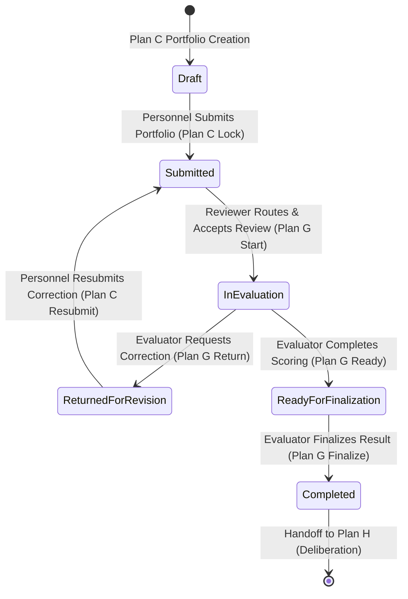

# Personnel Evaluation Track — Plan G — Phase G0: Plan C to Plan G Handoff Audit

## Evaluation Submission Handoff Lifecycle

### Audit Findings & Invariants:
1. **Submission Snapshot Locking**: When Personnel submits a portfolio in Plan C, the snapshot is locked with immutable `rule_version = 'NDMU-PERSONNEL-RATING-V2'`.
2. **Reviewer Assignment Trigger**: Reviewer route is resolved server-side upon entering `submitted` status based on the candidate's active classification and college placement.
3. **No In-Place Mutation**: Evaluators cannot modify Personnel achievement entries, dates, titles, or evidence uploads. They only enter verification decisions, evaluator comments, and accepted points.
