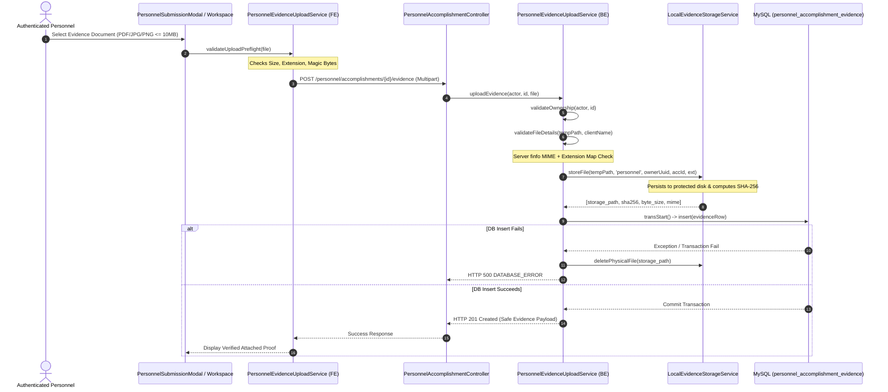

# Canonical Upload Flow — Phase I1

```mermaid
sequenceDiagram
    autonumber
    actor Candidate as Authenticated Personnel
    participant UI as PersonnelSubmissionModal / Workspace
    participant Svc as PersonnelEvidenceUploadService (FE)
    participant Ctrl as PersonnelAccomplishmentController
    participant UploadSvc as PersonnelEvidenceUploadService (BE)
    participant Storage as LocalEvidenceStorageService
    participant DB as MySQL (personnel_accomplishment_evidence)

    Candidate->>UI: Select Evidence Document (PDF/JPG/PNG <= 10MB)
    UI->>Svc: validateUploadPreflight(file)
    Note over Svc: Checks Size, Extension, Magic Bytes
    Svc->>Ctrl: POST /personnel/accomplishments/{id}/evidence (Multipart)
    Ctrl->>UploadSvc: uploadEvidence(actor, id, file)
    UploadSvc->>UploadSvc: validateOwnership(actor, id)
    UploadSvc->>UploadSvc: validateFileDetails(tempPath, clientName)
    Note over UploadSvc: Server finfo MIME + Extension Map Check
    UploadSvc->>Storage: storeFile(tempPath, 'personnel', ownerUuid, accId, ext)
    Note over Storage: Persists to protected disk & computes SHA-256
    Storage-->>UploadSvc: [storage_path, sha256, byte_size, mime]
    UploadSvc->>DB: transStart() -> insert(evidenceRow)
    alt DB Insert Fails
        DB-->>UploadSvc: Exception / Transaction Fail
        UploadSvc->>Storage: deletePhysicalFile(storage_path)
        UploadSvc-->>Ctrl: HTTP 500 DATABASE_ERROR
    else DB Insert Succeeds
        DB-->>UploadSvc: Commit Transaction
        UploadSvc-->>Ctrl: HTTP 201 Created (Safe Evidence Payload)
        Ctrl-->>Svc: Success Response
        Svc-->>UI: Display Verified Attached Proof
    end
```
