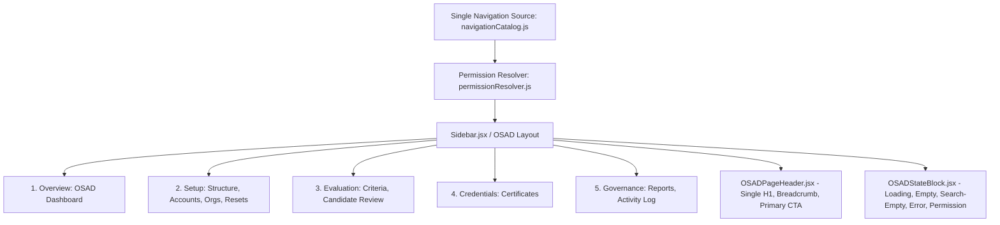

# OSAD Navigation & UX Architecture — Final Reference
## AchieveNest Plan 06: Final Architecture Document

---

## 1. Architectural Overview

AchieveNest OSAD (Office of Student Affairs and Development) navigation and user experience architecture is designed around a single, authoritative navigation catalog, deterministic sequence rules, clear action hierarchy, and reusable accessible interface primitives.

---

## 2. Canonical Source of Truth

- **File**: `frontend/src/config/navigationCatalog.js`
- **Security Rule**: Every navigation destination defines allowed account types (`allowedAccountTypes`), required permissions (`requiredPermissions`), and required active role contexts (`requiredActiveContexts`). Visual components filter items before rendering JSX. Unauthorized links are never present in the DOM.
- **Canonical Count**: Exactly **1** catalog source across all viewports (zero separate mobile definitions).

---

## 3. Information Architecture & Task-Based Groups

The 10 canonical OSAD destinations are categorized into 5 sequential workflow families:

1. **Overview (`overview`)**: High-level system vitals and shortcuts.
   - `osad-dashboard` -> `/osad/dashboard`
2. **Student & Institutional Setup (`setup`)**: Foundational academic and student data management.
   - `osad-academic-structure` -> `/osad/dashboard?tab=academic-structure`
   - `osad-student-accounts` -> `/osad/dashboard?tab=accounts`
   - `osad-student-organizations` -> `/osad/dashboard?tab=organizations`
   - `osad-password-resets` -> `/osad/dashboard?tab=password-resets`
3. **Portfolio & Evaluation (`evaluation`)**: Scoring criteria and candidate deliberations.
   - `osad-award-categories` -> `/osad/dashboard?tab=awards`
   - `osad-award-candidate-review` -> `/osad/dashboard?tab=candidate-review`
4. **Events & Certificates (`credentials`)**: Credential design and issuance templates.
   - `osad-certificate-templates` -> `/osad/dashboard?tab=certificate-templates`
5. **Governance & Reports (`governance`)**: Compliance verification and immutable audit trail.
   - `osad-accreditation-reports` -> `/osad/dashboard?tab=reports`
   - `osad-activity-log` -> `/osad/dashboard?tab=audit`

---

## 4. Shared Component Architecture

- **`frontend/src/components/osad/OSADPageHeader.jsx`**:
  Standardized page header providing single semantic `<h1>`, breadcrumb `<nav aria-label="Breadcrumb">`, back control, and dedicated primary action slot.
- **`frontend/src/components/osad/OSADStateBlock.jsx`**:
  Standardized state handling primitive providing `OSADLoadingState`, `OSADEmptyState`, `OSADSearchEmptyState`, `OSADErrorState` (with safe retry), and `OSADPermissionState`.
- **`frontend/src/components/layout/Sidebar.jsx`**:
  Consumes `navigationCatalog.js`, handles responsive off-canvas drawer mechanics, active route matching, group headers, and >=44px touch targets.
- **`frontend/src/components/layout/Topbar.jsx`**:
  Provides global quick actions, theme toggle, notifications, and profile dropdown with instant in-memory role switching.
