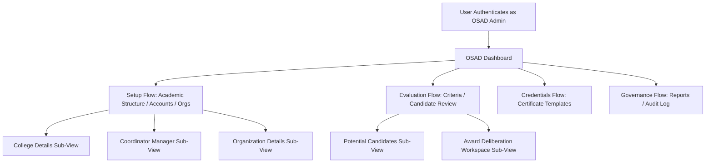

# OSAD Navigation & User Workflow — Final Reference
## AchieveNest Plan 06: Final Workflow Document

---

## 1. Primary User Journey & Workflow Flows

---

## 2. Navigation Flow & Sequence Principles

1. **Overview First**: The dashboard represents the central command center for institutional vitals.
2. **Setup Before Evaluation**: Colleges, programs, accounts, and student organizations must be configured prior to evaluating candidate submissions.
3. **Criteria Definition Before Deliberation**: Scoring rubrics and award categories precede candidate review.
4. **Operations Before Governance**: Daily operational tasks precede compliance report generation and audit inspection.
5. **Account & Settings in Header**: User profile, password management, and theme settings remain scoped to the Topbar, keeping the sidebar dedicated to domain workflows.

---

## 3. Detail Sub-View Traversal & Return Patterns

- **Sub-View Entry**: Navigating into sub-views (e.g. `OSADCollegeDetailsView`, `OSADOrganizationDetailsView`, `OSADCoordinatorManagerView`, `OSADStudentAwardReviewWorkspace`) passes state and updates view context without altering parent sidebar active highlight.
- **Breadcrumb Navigation**: Sub-views utilize semantic breadcrumbs to navigate back to parent canonical views seamlessly.
- **State Recovery**: If an error or empty state occurs within a sub-view, contextual action buttons allow retrying or navigating back cleanly.

---

## 4. Role & Account Switching Flow

1. Admin clicks user profile in `Topbar.jsx`.
2. Admin selects an alternate assigned role (e.g. Program Coordinator, Dean, Moderator).
3. `switchRoleContext` in `AuthContext.jsx` updates active session state in-memory.
4. `Sidebar.jsx` re-renders authorized navigation catalog items immediately without requiring a browser page reload.
