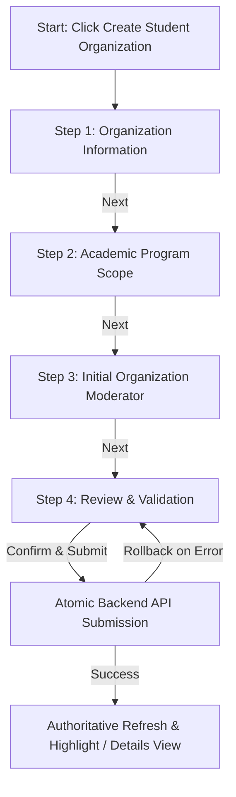

# AchieveNest — OSAD Organization Creation & Management
## Plan 02 Phase 2: Creation Workflow & Information Architecture Redesign
**Authoritative Final Creation Workflow Design & Specification Document**

---

### 1. Executive Summary

Phase 2 establishes the redesigned, unified **Student Organization Creation Workflow** for OSAD Administrators in AchieveNest. 

Entering Phase 2, Phase 1 proved that organization master data, program affiliations, and moderator assignments are stored across three distinct, normalized database tables (`organizations`, `organization_program_affiliations`, `organization_moderator_assignments`). However, the existing UI was fragmented: initial creation only established master data and program affiliations, moderator selection was absent from creation, and post-creation moderator assignment was routed to disconnected in-memory mock state.

This redesign establishes a single, progressive 4-step creation experience:
```text
Step 1: Organization Information (Master Data & Logo)
Step 2: Academic Program Scope (Searchable Multi-Select with Removable Chips)
Step 3: Initial Organization Moderator (Eligible Personnel Selector — Optional)
Step 4: Review & Final Confirmation
└── Create Organization (Atomic Transactional Submission)
```

---

### 2. Verified Phase 1 Baseline

- **Repository Branch**: `audit/project-architecture-linkage`
- **Git HEAD**: `ea987bf32c208cc99ebe1a60b989c0c09ca83e98`
- **Database**: `achievenest_local` (MySQL on local WAMP)
- **Verified Sources of Truth**:
  - `organizations`: Master metadata (id, college_id, code, name, scope, category, status, logo metadata).
  - `organization_program_affiliations`: Relational mapping of academic programs (`organization_id`, `academic_program_id`).
  - `organization_moderator_assignments`: Relational moderator assignments with unique active guard constraint `uq_active_org_moderator`.
- **Verified Cardinality Rules**:
  - Organization to Program Scope: 1:N (One organization may cover multiple programs).
  - Program to Organization: N:1 / N:N (Multiple organizations may cover the same program).
  - Organization to Active Moderator: At most one active moderator per organization (`0..1`).
  - Moderator to Organizations: 1:N (One faculty member may moderate multiple student organizations).

---

### 3. Final Creation Workflow

The creation workflow is architected as a cohesive, step-progressive modal interface (`CreateOrganizationModal`):



All 4 steps operate over a single, local client draft state. No partial database records are created during step transitions.

---

### 4. Organization Information (Step 1)

Step 1 collects the essential institutional master data:
1. **Organization Name** (`name`): Text input, max 150 characters, required.
2. **Acronym / Code** (`code`): Text input, max 30 characters, required, automatically converted to uppercase.
3. **Category Classification** (`category`): Dropdown, required.
   - Allowed options: `academic_college`, `co_curricular`, `special_interest`, `socio_cultural`, `religious`, `sports`, `student_council`.
4. **Academic Scope** (`scope`): Dropdown, required.
   - Allowed options: `university`, `college`, `program`.
5. **Parent College Affiliation** (`college_id`): Dropdown, required if `scope` is `college` or `program`; hidden/omitted if `scope` is `university`.
6. **Organization Logo Asset** (`logo`): Optional file upload (JPEG, PNG, WebP up to 5 MB) with instant preview and remove capability.

---

### 5. Organization Name UX & Non-Destructive Assistance

- **Title-Style Assistant**: A non-intrusive suggestion helper is displayed below the name input if casing can be improved.
- **Rules for Title-Style Formatting**:
  - Capitalizes meaningful words.
  - Keeps lowercase connector words: `of`, `and`, `the`, `for`, `in`, `on`, `at`, `to`, `by` (unless it is the first word).
  - Preserves recognized capitalized acronyms (e.g. `ACM`, `IEEE`, `NDMU`).
- **User Agency**: The suggestion is strictly optional and user-correctable. The backend receives and stores the exact submitted string without server-side mutation.

---

### 6. Acronym / Code Rules

- Organization acronym/code is automatically uppercased on input (`.toUpperCase()`) and trimmed.
- Examples: `psits` -> `PSITS`, `css` -> `CSS`, `ssg` -> `SSG`.
- Code uniqueness is checked in real-time or verified upon submission against `organizations.code`.

---

### 7. Classification & Scope Rules

| Scope (`scope`) | College Selection Required? | Program Scope Required? | Description |
|---|---|---|---|
| `university` | NO (`college_id = null`) | NO (0 programs) | University-wide student body or council (e.g. Supreme Student Council). |
| `college` | YES (`college_id` required) | NO (0 programs) | College-wide student association representing all students of that college. |
| `program` | YES (`college_id` required) | YES (>= 1 program required) | Program-specific academic society affiliated with specific degree programs. |

---

### 8. Academic Program Scope (Step 2)

Step 2 is dynamically presented when `scope === 'program'`:
- For `scope === 'university'` or `scope === 'college'`, Step 2 indicates that the chosen scope does not require program-level affiliations and allows the user to proceed directly to Step 3.
- For `scope === 'program'`, at least one academic program affiliation is required.

---

### 9. Program Search & Multi-Select UX

Replacing the static checkbox list:
1. **Search & Filter Bar**: Real-time filtering by Program Code (`BSCS`), Program Name (`Computer Science`), or College.
2. **Searchable Dropdown / Selector List**: Displays available programs filtered by the selected parent college.
3. **Selection Action**: Clicking `Add Program` or selecting a program immediately adds it to the staged list.
4. **Selected Programs Display**:
   - Rendered as removable badge cards/rows.
   - Shows: `[Program Code] Program Name` and college badge.
   - Includes a red `Remove` (trash icon) action.
5. **Duplicate Prevention**: Selected programs are automatically disabled/hidden in the available search list to prevent duplicate selection.

---

### 10. Program Scope Validation

- **Program-Scoped Organizations**: Form validation blocks advancement if `selectedProgramIds.length === 0`.
- **College Consistency**: All selected programs must belong to the selected `college_id`.
- **Active Programs Only**: Inactive programs are filtered out from the selection picker.

---

### 11. Initial Organization Moderator (Step 3)

Step 3 enables selecting the initial Organization Moderator directly during creation:
- **Optional by Default**: An organization can be created in an `Unassigned` state without blocking creation.
- **Single Moderator Selection**: At most **one** active moderator can be assigned to an organization (`0..1`).
- **Inline Searchable Selector**: Reuses the canonical personnel lookup component (`PersonnelSelectorModal` mechanics) with real-time search across name, employee ID, and department.

---

### 12. Moderator Candidate Display & Eligibility

- **Eligibility Filter**: Active profiles with `account_type IN ('personnel', 'hr_admin', 'osad_admin')` and `status = 'active'`.
- **College Affiliation Rule**: For college-scoped and program-scoped organizations, candidates affiliated with the parent college are prioritized.
- **Candidate Display**:
  - Full Name
  - Employee ID
  - Academic Rank & Department Placement
  - Currently assigned roles badges (e.g. `Moderator (CSS)`)
- **Selected Moderator Card**: Displays selected moderator card with a `Change / Remove` button.

---

### 13. Moderator Optionality

- If no moderator is selected: Step 3 shows an informational notice: *"No initial Organization Moderator selected. The organization will be created in an Unassigned state and a moderator can be assigned later."*
- Creation proceeds normally.

---

### 14. Review Step (Step 4)

Step 4 presents a complete, clean review of all staged parameters before submission:

```text
┌────────────────────────────────────────────────────────┐
│  Review New Student Organization Configuration         │
├────────────────────────────────────────────────────────┤
│  Organization Information                              │
│  • Name: Computer Science Society                      │
│  • Acronym / Code: CSS                                 │
│  • Category: Academic / College-Based                  │
│  • Academic Scope: Academic Program (CEAC)             │
│  • Logo: Provided (logo_preview.png • 120 KB)          │
├────────────────────────────────────────────────────────┤
│  Academic Program Scope (1 Program)                    │
│  • [BSCS] Bachelor of Science in Computer Science      │
├────────────────────────────────────────────────────────┤
│  Initial Organization Moderator                        │
│  • Engr. Roberto Cruz (Assistant Professor • CEAC)     │
├────────────────────────────────────────────────────────┤
│  Configuration Status: COMPLETE                        │
└────────────────────────────────────────────────────────┘
```

---

### 15. Configuration Completeness Model

The review step provides a visual indicator:
- **Fully Configured**: Organization has valid master data, appropriate program scope (if applicable), and an initial moderator assigned.
- **Partially Configured**: Organization has valid master data and program scope, but moderator is unassigned. Creation is fully allowed.

---

### 16. Form State Model

The client draft state is managed in a single React state structure:

```javascript
const initialDraftState = {
  // Step 1: Master Data
  name: '',
  code: '',
  category: 'academic_college',
  scope: 'university',
  collegeId: '',
  logoFile: null,
  logoPreviewUrl: null,

  // Step 2: Program Scope
  selectedProgramIds: [],

  // Step 3: Moderator
  selectedModerator: null // { id, full_name, email, employee_id, designation }
}
```

---

### 17. Validation Model

| Level | Validation Triggers | Rules Enforced |
|---|---|---|
| Field Level | `onBlur`, `onChange` | Trimming, uppercase code, max lengths, valid file types/sizes |
| Step Level | `onNextStep` | Required fields present, valid scope selections |
| Final Step | `onSubmit` | Complete payload verification before API call |
| Server Side | `POST /osad/organizations` | Authoritative validation of code uniqueness, FK validity, eligibility |

---

### 18. Loading, Empty, Error & Retry States

- **Program Search Loading**: Skeleton list while fetching programs.
- **Moderator Search Loading**: Spinner in search bar while filtering personnel.
- **Submission Loading**: Stepper buttons disabled; submit button shows spinning indicator (`Creating Organization...`).
- **Empty Program Matches**: Display *"No academic programs found under selected college."*
- **Empty Moderator Matches**: Display *"No eligible personnel match your search."*
- **Submission Error**: Display alert banner with backend error message; preserve form draft state for user correction.

---

### 19. Server-Side Authorization UX

- Routes are guarded by `GovernancePolicy::canManageOrganizations`.
- If an unauthorized session attempts creation, backend returns HTTP 403 Forbidden.
- Frontend renders a clear authorization error banner without losing draft inputs.

---

### 20. Responsive Layout

- **Desktop (>= 1024px)**: 2-column layout in Step 1 (Name + Code, Category + Scope); side-by-side review cards in Step 4.
- **Tablet / Mobile (< 1024px)**: Single-column vertically stacked form; full-width program and moderator selection lists; touch-friendly 44px tap targets.

---

### 21. Accessibility Standards

- Modal focus trap on open; focus restored to trigger on close.
- Esc key dismiss with discard confirmation dialog (`useConfirmableClose`).
- Proper ARIA attributes (`aria-label`, `aria-describedby`, `role="dialog"`).
- High-contrast text meeting WCAG AA standards.

---

### 22. Phase 3 Backend Transaction Requirements

Phase 3 must update `OrganizationService::createOrganization` to execute an atomic database transaction:

```sql
START TRANSACTION;

-- 1. Insert Master Row
INSERT INTO organizations (id, college_id, code, name, scope, category, status, logo_storage_key, ...)
VALUES (?, ?, ?, ?, ?, ?, 'active', ...);

-- 2. Insert Program Affiliations (if scope is 'program')
INSERT INTO organization_program_affiliations (id, organization_id, academic_program_id, created_at)
VALUES (?, ?, ?, NOW());

-- 3. Insert Initial Moderator Assignment (if selected)
INSERT INTO organization_moderator_assignments (id, organization_id, personnel_profile_id, effective_from, is_active, assigned_by, assigned_at)
VALUES (?, ?, ?, CURDATE(), 1, ?, NOW());

COMMIT;
```

If any insert or validation fails, `ROLLBACK` is executed and any staged logo file is unlinked.

---

### 23. Phase 4 Detail-View Handoff

Upon successful creation:
1. Modal closes and triggers an authoritative refetch via `loadPersistentOrgs()`.
2. A success toast notification is displayed: `Created Student Organization: [CODE] Name`.
3. In Phase 4, the created organization card becomes clickable and opens the Organization Details View workspace.

---

### 24. Decision Register

| Decision | Final Choice | Rationale |
|---|---|---|
| Creation Architecture | Single 4-step progressive modal | Eliminates post-creation navigation friction while keeping atomic client state |
| Moderator at Creation | YES (Optional) | Allows full initial setup without forcing separate workflow |
| Moderator Requirement | Optional | Organizations may legitimately start unassigned |
| Program Scope at Creation | YES (Required for `program` scope) | Program-scoped organizations must have clear program coverage |
| Program Selector UX | Searchable multi-select with removable chips | Scales significantly better than checkbox-only lists |
| Name Formatting | Non-destructive title assistance | Preserves user agency and acronyms while providing clean suggestions |
| In-Memory Callback | Replace with API persistence | Fixes confirmed Phase 1 workflow conflict |

---

### 25. Acceptance Criteria

- [x] Final creation workflow documented with 4 progressive steps.
- [x] Organization information fields and optional title-style assistance defined.
- [x] Program scope searchable multi-select and duplicate prevention defined.
- [x] Initial moderator selection integrated and defined as optional.
- [x] Review step and configuration completeness defined.
- [x] Atomic transaction requirements specified for Phase 3 handoff.
- [x] In-memory assignment path marked for removal/replacement.
- [x] Zero code changes, schema changes, or business-rule alterations executed during Phase 2.

---

### 26. Phase 2 Exit Decision

The creation workflow and information architecture redesign is complete, verified against all architectural boundaries, and ready for backend transaction alignment.

**PLAN 02 PHASE 2 STATUS: GO FOR PHASE 3 — BACKEND TRANSACTION DESIGN**
