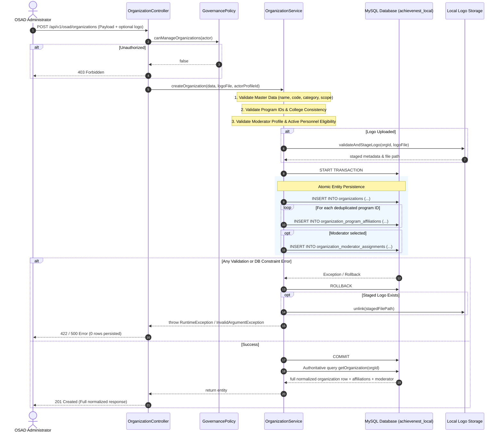

# Plan 02 Phase 3: Organization Transaction Sequence

## Transaction Lifecycle & Integrity Guarantee

```mermaid
sequenceDiagram
    autonumber
    actor OSAD as OSAD Administrator
    participant C as OrganizationController
    participant Auth as GovernancePolicy
    participant S as OrganizationService
    participant DB as MySQL Database (achievenest_local)
    participant FS as Local Logo Storage

    OSAD->>C: POST /api/v1/osad/organizations (Payload + optional logo)
    C->>Auth: canManageOrganizations(actor)
    alt Unauthorized
        Auth-->>C: false
        C-->>OSAD: 403 Forbidden
    end

    C->>S: createOrganization(data, logoFile, actorProfileId)
    
    Note over S: 1. Validate Master Data (name, code, category, scope)
    Note over S: 2. Validate Program IDs & College Consistency
    Note over S: 3. Validate Moderator Profile & Active Personnel Eligibility
    
    alt Logo Uploaded
        S->>FS: validateAndStageLogo(orgId, logoFile)
        FS-->>S: staged metadata & file path
    end

    S->>DB: START TRANSACTION

    rect rgb(240, 248, 255)
        Note over S,DB: Atomic Entity Persistence
        S->>DB: INSERT INTO organizations (...)
        loop For each deduplicated program ID
            S->>DB: INSERT INTO organization_program_affiliations (...)
        end
        opt Moderator selected
            S->>DB: INSERT INTO organization_moderator_assignments (...)
        end
    end

    alt Any Validation or DB Constraint Error
        DB-->>S: Exception / Rollback
        S->>DB: ROLLBACK
        opt Staged Logo Exists
            S->>FS: unlink(stagedFilePath)
        end
        S-->>C: throw RuntimeException / InvalidArgumentException
        C-->>OSAD: 422 / 500 Error (0 rows persisted)
    else Success
        S->>DB: COMMIT
        S->>DB: Authoritative query getOrganization(orgId)
        DB-->>S: full normalized organization row + affiliations + moderator
        S-->>C: return entity
        C-->>OSAD: 201 Created (Full normalized response)
    end
```
