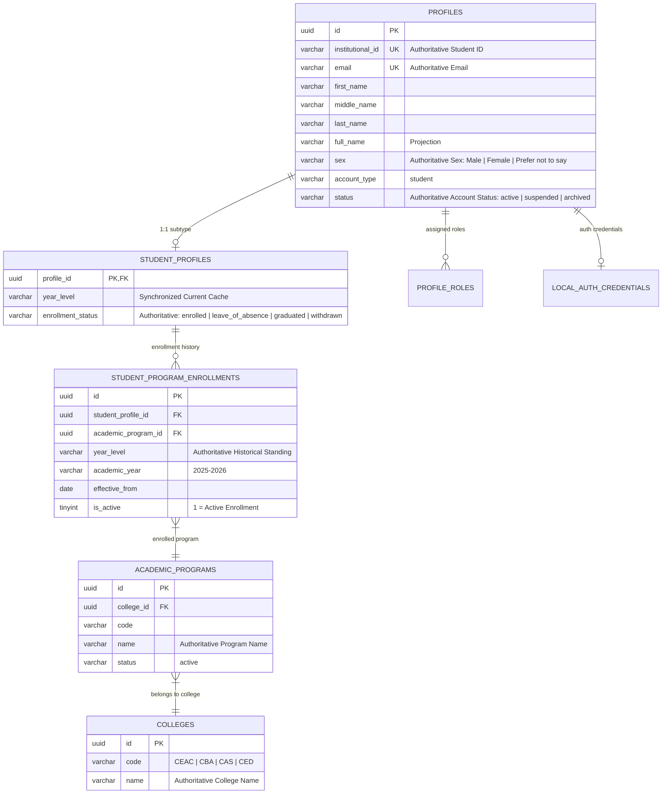

# AchieveNest — OSAD Student Account Management & Student Data Completeness
## Final Architecture Specification

---

### 1. Architectural Overview

This document specifies the authoritative data architecture, source-of-truth governance, and normalized relationship models for student account administration in AchieveNest.

---

### 2. Authoritative Data Ownership

---

### 3. Source-of-Truth Governance Matrix

| Business Fact | Authoritative Database Source | Current API Projection Field | Governance Classification |
|---|---|---|---|
| Student Identity | `profiles.id` | `id` | Master Identity |
| Institutional Student ID | `profiles.institutional_id` | `institutional_id` / `student_id` | Master Identifier |
| Student Full Name | `profiles.full_name` | `full_name` | Master Name |
| Institutional Email | `profiles.email` | `email` | Master Email |
| Student Sex | `profiles.sex` | `sex` | Sole Authority (`Male`, `Female`, `Prefer not to say`) |
| Current Year Level | `student_profiles.year_level` | `year_level` | Synchronized Current Cache |
| Historical Year Level | `student_program_enrollments.year_level` | N/A | Historical Authority (0 drift) |
| Academic Program | active `student_program_enrollments.academic_program_id` -> `academic_programs.name` | `program`, `program_code` | Normalized Master Relationship |
| College Affiliation | `academic_programs.college_id` -> `colleges.code` | `college`, `college_name` | Normalized Master Relationship |
| Enrollment Status | `student_profiles.enrollment_status` | `enrollment_status` | Subtype Authority (`enrolled`, etc.) |
| Account Lifecycle Status | `profiles.status` | `status` | Identity Authority (`active`, `suspended`, etc.) |
| Auth Credentials | `local_auth_credentials.password_hash` | N/A | Server-Side Security Authority |

---

### 4. Schema Remediation Record

- **Introduced Column**: `profiles.sex` (`VARCHAR(20) NULL`)
- **Migration**: `2026-09-01-000053_AddSexToProfiles.php` (Runner: `MigratePlan03Phase5.php`)
- **Domain Constraint**: `'Male'`, `'Female'`, `'Prefer not to say'`
- **Duplicate Subtype Columns**: **0** (No `student_profiles.sex` or duplicate subtype attributes)
- **Legacy Row Handling**: Legacy records without sex retain `NULL` safely and project to UI as `—`.
