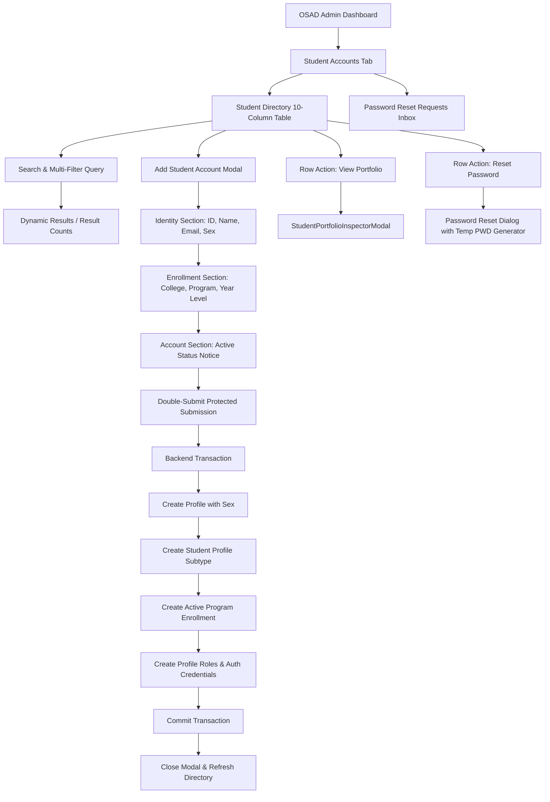

# AchieveNest — OSAD Student Account Management & Student Data Completeness
## Final Workflow Specification

---

### 1. OSAD Student Accounts Lifecycle Workflow

---

### 2. Search & Filter Interaction Workflow

1. **Multi-Attribute Search**:
   - Matches `Name`, `Institutional ID`, `Email`, `Academic Program`, and `College`.
   - Debounced, case-insensitive, with instant clear (`X`) button.
2. **Filter Controls**:
   - `College`: Filters by college and cascades to filter degree programs.
   - `Program`: Filters by active academic program.
   - `Year Level`: Filters by current standing (`1st Year` - `Graduate`).
   - `Sex`: Filters by authoritative sex (`Male`, `Female`, `Prefer not to say`).
   - `Status`: Filters by account lifecycle (`Active`, `Suspended`, `Archived`).
   - `Reset Filters`: Clears all active filters in one action.
3. **Combination Semantics**:
   - Combined filters evaluate with strict **AND** semantics.

---

### 3. Row Actions Workflow

- **View Portfolio**:
  - Direct contextual action opening `StudentPortfolioInspectorModal` to view verified accomplishments, points, and documentation proofs.
- **Reset Password**:
  - Security modal enabling OSAD admins to generate secure temporary passwords (`NDMU-StdXXXX!`), copy to clipboard, and dispatch reset events with system audit logging.
- **Confirmable Discard Protection**:
  - Modal modifications are guarded by `useConfirmableClose` and `ConfirmDialog` to prevent accidental loss of uncommitted inputs.
