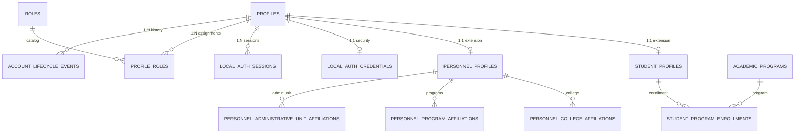

# AchieveNest Plan 07 — Phase 1 Evidence
# Database Relationship Map & Integrity Audit

---

## 1. Core Schema Entities

---

## 2. Table Specifications

### 2.1 `profiles` Table
- **Primary Key**: `id` (char 36, UUID)
- **Unique Keys**: `institutional_id` (varchar 50), `email` (varchar 255)
- **Columns**: `account_type` (`student`, `personnel`, `hr_admin`, `osad_admin`), `full_name`, `first_name`, `middle_name`, `last_name`, `sex`, `designation_title`, `status` (`active`, `suspended`, `archived`), `must_change_password` (tinyint 1, default 1), `password_hash` (varchar 255).

### 2.2 `local_auth_credentials` Table
- **Primary Key**: `profile_id` (char 36, UUID)
- **Columns**: `password_hash` (varchar 255), `password_changed_at` (datetime), `status` (varchar 20, default `active`), `created_at`, `updated_at`.

### 2.3 `local_auth_sessions` Table
- **Primary Key**: `id` (char 36, UUID)
- **Foreign Key**: `profile_id` (char 36) -> `profiles.id`
- **Unique Key**: `token_hash` (char 64, SHA-256)
- **Columns**: `issued_at`, `expires_at`, `last_seen_at`, `revoked_at`, `revocation_reason`, `created_ip`, `user_agent_hash`.

### 2.4 `student_profiles` & `student_program_enrollments`
- `student_profiles`: PK `profile_id` -> `profiles.id`, `year_level`, `enrollment_status`.
- `student_program_enrollments`: PK `id`, FK `student_profile_id`, FK `academic_program_id`, `year_level`, `academic_year`, `is_active`.

### 2.5 `personnel_profiles` & Affiliations
- `personnel_profiles`: PK `profile_id` -> `profiles.id`, `personnel_classification` (`academic`, `non_academic`), `employment_status`, `rank_level`.
- `personnel_college_affiliations`: FK `personnel_profile_id`, FK `college_id`, `is_active`.
- `personnel_program_affiliations`: FK `personnel_profile_id`, FK `academic_program_id`, `is_active`.
- `personnel_administrative_unit_affiliations`: FK `personnel_profile_id`, FK `administrative_unit_id`, `is_active`.

---

## 3. Integrity Audit Query Results

| Audit Check | Scope | Actual Count | Result |
| :--- | :--- | :--- | :--- |
| **Student profiles without base profile** | `student_profiles` -> `profiles` | 0 orphan records | **PASS** |
| **Base student profiles without student extension** | `profiles(student)` -> `student_profiles` | 0 orphan records | **PASS** |
| **Personnel profiles without base profile** | `personnel_profiles` -> `profiles` | 0 orphan records | **PASS** |
| **Base personnel profiles without personnel extension**| `profiles(personnel)` -> `personnel_profiles`| 0 orphan records | **PASS** |
| **Profiles without `local_auth_credentials`** | `profiles` -> `local_auth_credentials` | 0 missing credentials | **PASS** |
| **Profiles without roles** | `profiles` -> `profile_roles` | 0 missing roles | **PASS** |
| **Duplicate institutional emails** | `profiles.email` | 0 duplicates | **PASS** |
| **Duplicate institutional IDs** | `profiles.institutional_id` | 0 duplicates | **PASS** |
