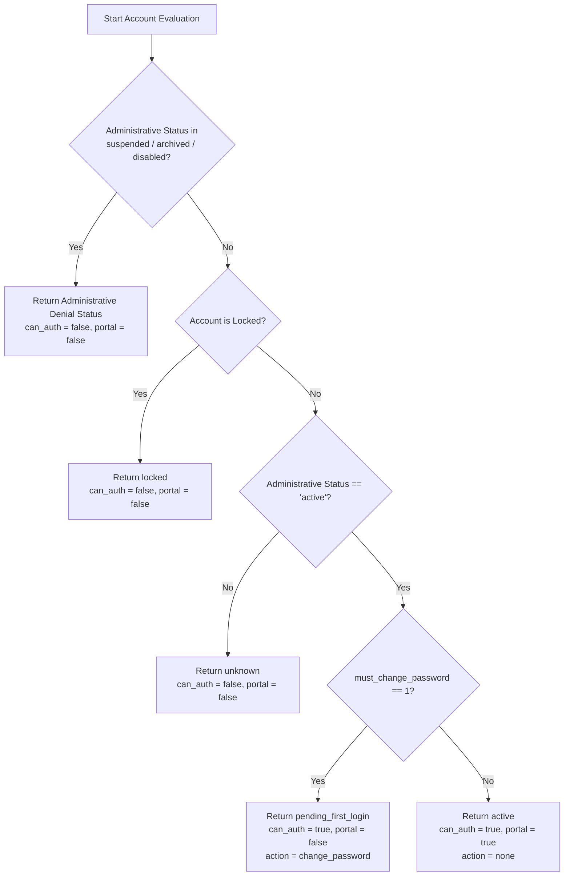

# AchieveNest Plan 07 — Phase 2 Evidence
# Canonical Lifecycle State & Precedence Map

---

## 1. Lifecycle State Derivation Matrix

| Administrative Status (`profiles.status`) | Credential State (`must_change_password`) | Lock State | Derived Lifecycle (`account_lifecycle_status`) | Can Authenticate | Protected Portal Access | Required Next Action (`required_next_action`) |
| :--- | :---: | :---: | :--- | :---: | :---: | :--- |
| `active` | `1` (true) | `false` | `pending_first_login` | **YES** | **NO** (Phase 6 trap) | `change_password` |
| `active` | `0` (false)| `false` | `active` | **YES** | **YES** | `none` |
| `active` | `0` or `1` | `true` | `locked` | **NO** | **NO** | `contact_administrator` |
| `suspended` | `0` or `1` | Any | `suspended` | **NO** | **NO** | `contact_administrator` |
| `archived` | `0` or `1` | Any | `archived` | **NO** | **NO** | `contact_administrator` |
| `disabled` | `0` or `1` | Any | `disabled` | **NO** | **NO** | `contact_administrator` |
| *Null / Unsupported* | Any | Any | `unknown` | **NO** | **NO** | `contact_administrator` |

---

## 2. Precedence Hierarchy

---

## 3. Resolver Invariant Rules

1. **Deterministic Resolution**: `AccountLifecycleResolver::resolve($profileStatus, $mustChangePassword, $isLocked)` is the single authoritative source of truth.
2. **Fail Closed**: Any unmapped, null, or corrupted administrative status resolves to `unknown` with all authentication and portal permissions disabled.
3. **No Secret Leakage**: The lifecycle resolver returns only normalized status and capability flags; credentials, hashes, and session tokens are never handled by the resolver.
