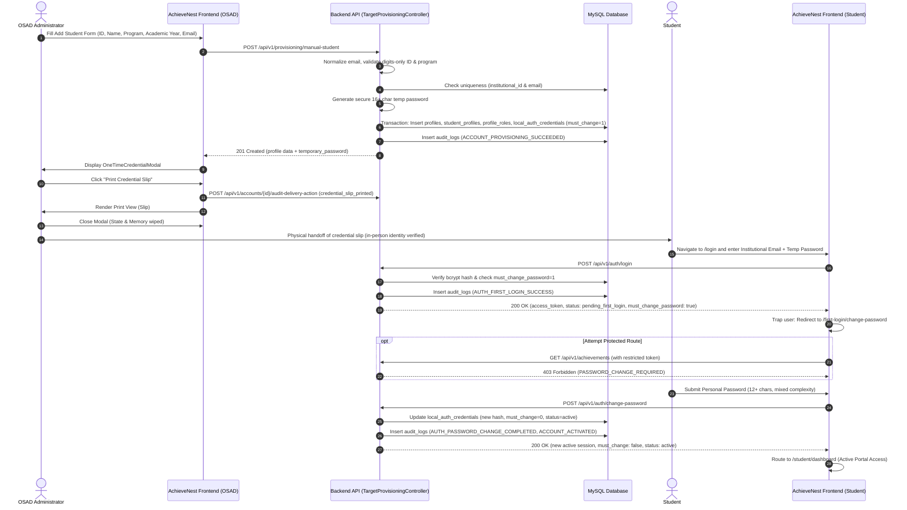
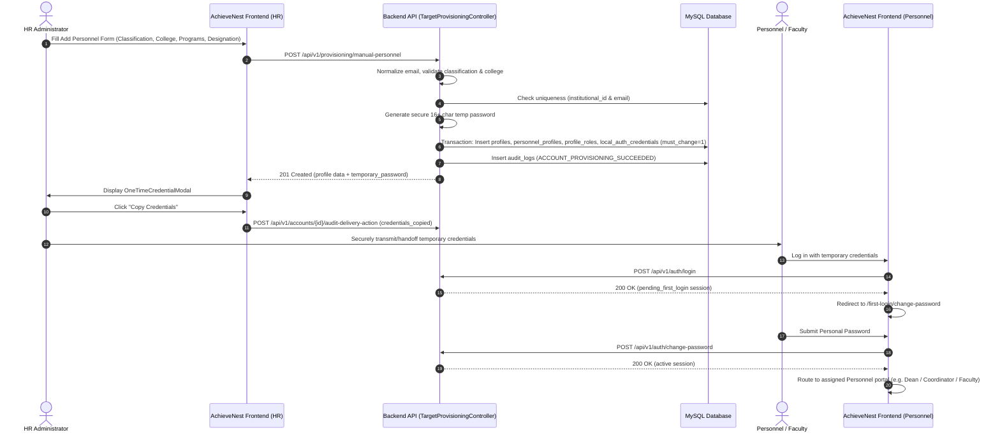
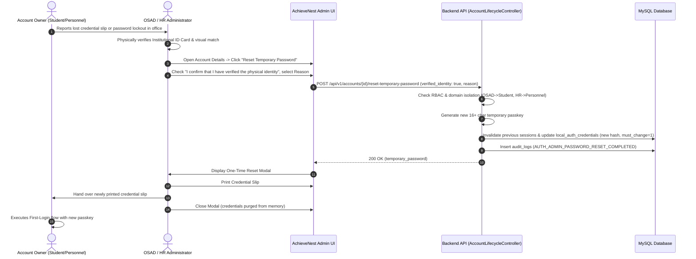

# AchieveNest Plan 07 — Final Provisioning & First-Login Workflow
## End-to-End Sequence & Technical Contracts

---

## 1. Student Account Provisioning & Activation Flow

---

## 2. Personnel Account Provisioning & Activation Flow

---

## 3. In-Office Administrative Reset & Recovery Flow

