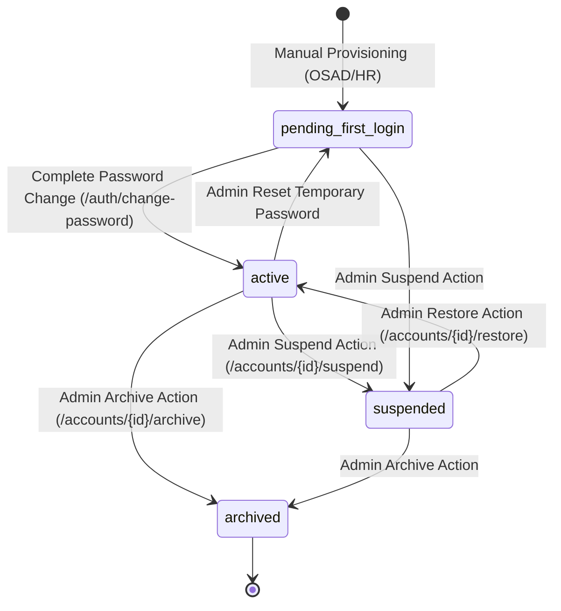

# AchieveNest Plan 07 — Role Ownership & Lifecycle Mapping
## Authoritative RBAC Responsibilities & Canonical Lifecycle State Transitions

---

## 1. Authorized Role Ownership Matrix

| Capability | Authorized Roles (`roles.role_key`) | Domain Scope | Backend Endpoint / Policy | Verification Evidence |
| :--- | :--- | :--- | :--- | :--- |
| **Create Student Account** | `osad_staff` (`account_type: osad_admin`) | Students (`account_type: student`) | `POST /api/v1/provisioning/manual-student` | `TargetProvisioningController::manualStudent`, Test P9-01 |
| **Create Personnel Account** | `hr_staff` (`account_type: hr_admin`) | Personnel (`account_type: personnel`) | `POST /api/v1/provisioning/manual-personnel` | `TargetProvisioningController::manualPersonnel`, Test P9-02 |
| **Reset Student Credential** | `osad_staff` (`account_type: osad_admin`) | Students only | `POST /api/v1/accounts/{id}/reset-temporary-password` | Domain isolation check, Test P9-11A, P9-17B |
| **Reset Personnel Credential**| `hr_staff` (`account_type: hr_admin`) | Personnel only | `POST /api/v1/accounts/{id}/reset-temporary-password` | Domain isolation check, Test P9-17B |
| **View Student Audits** | `osad_staff` (`account_type: osad_admin`) | OSAD & Student events | `GET /api/v1/osad/audit` | `TargetProvisioningController::audit`, Test P9-18 |
| **View Personnel Audits** | `hr_staff` (`account_type: hr_admin`) | HR & Personnel events | `GET /api/v1/hr/audit` | `HRPersonnelController::audit`, Test P9-18 |
| **Suspend Account** | `osad_staff` (students), `hr_staff` (personnel) | Owned Domain | `POST /api/v1/accounts/{id}/suspend` | `AccountLifecycleController::suspend`, Test P9-14A |
| **Restore Account** | `osad_staff` (students), `hr_staff` (personnel) | Owned Domain | `POST /api/v1/accounts/{id}/restore` | `AccountLifecycleController::restore`, Test P9-14C |
| **Archive Account** | `osad_staff` (students), `hr_staff` (personnel) | Owned Domain | `POST /api/v1/accounts/{id}/archive` | `AccountLifecycleController::archive` |

---

## 2. Canonical Account Lifecycle & Status Mapping

AchieveNest models account status through canonical pairs:
1. `profiles.status`: The general administrative status (`active`, `suspended`, `archived`).
2. `local_auth_credentials.must_change_password`: The first-login / password rotation gate (`1` for pending, `0` for active).
3. `account_lifecycle_status`: The resolved computed lifecycle status evaluated dynamically by `AccountLifecycleResolver`.

| Plan 07 Conceptual Lifecycle | `profiles.status` | `local_auth_credentials.must_change_password` | Resolved Lifecycle Status (`account_lifecycle_status`) | Authentication Allowed? | Portal Access Permitted? |
| :--- | :--- | :--- | :--- | :--- | :--- |
| **Pending First Login** | `active` | `1` | `pending_first_login` | **YES** (Temporary passkey) | **NO** (Trapped at `/first-login/change-password`, returns 403 `PASSWORD_CHANGE_REQUIRED` on protected APIs) |
| **Active** | `active` | `0` | `active` | **YES** (Personal password) | **YES** (Full role-based portal access) |
| **Suspended / Disabled** | `suspended` | Any (`0` or `1`) | `suspended` | **NO** (Rejected with 401/403) | **NO** (All access revoked) |
| **Archived** | `archived` | Any (`0` or `1`) | `archived` | **NO** (Rejected with 401/403) | **NO** (Historical record only) |

---

## 3. Lifecycle State Transition Rules

### Security Guarantees
- **Atomic Transition**: Account activation cannot occur without establishing a valid personal password.
- **Fail-Closed Gate**: If `must_change_password = 1`, all requests to protected routes fail closed (`403 PASSWORD_CHANGE_REQUIRED`).
- **Administrative Override**: Suspending an account instantly blocks all active tokens and prevents password changes.
