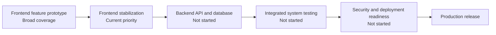

# AchieveNest Project Progress Roadmap

**Institution:** Notre Dame of Marbel University (NDMU)  
**System:** Web-Based Achievement, Portfolio, Evaluation, and Recognition Management System  
**Last reviewed:** August 19, 2026  
**Review basis:** Current frontend routes, pages, components, controllers, models, hooks, package scripts, static source review, production build, and lint results

## 1. Executive Status

AchieveNest currently has a broad, navigable **frontend prototype** covering all primary user roles. The earlier roadmap was outdated because it still listed the Department Secretary and HR workspaces as upcoming even though substantial implementations now exist.

The application is not production-ready yet. Most workflows still use client-side or mock data, authentication is simulated, several exports are print or alert placeholders, automated tests are not configured, and lint currently fails on React hook-order errors.

| Delivery dimension | Current status | Estimated progress | Evidence and limitation |
|---|---|---:|---|
| Frontend feature coverage | Active — broad prototype coverage | ~88% | All primary role workspaces and routes exist; several flows still need terminology, state, and interaction refinement. |
| Frontend stabilization and QA | In progress — quality gate & tests | ~72% | Production build passes (entry chunk 362 kB); lint passes with 0 errors; 19 Vitest unit tests pass; full role acceptance testing remains. |
| Backend API and database | Not started in this workspace | 0% | Frontend controllers and services use mock or browser-local state rather than a live CodeIgniter/Supabase API. |
| Production deployment | Not started | 0% | No verified production environment, CI/CD gate, monitoring, security audit, or deployment acceptance record. |

> **Progress interpretation:** These percentages describe separate delivery dimensions. Frontend screen coverage must not be interpreted as total-system or production-readiness completion.

## 2. Current Verification Snapshot

### Production build

**Result:** Passed on August 19, 2026.

```text
npm run build
✓ 1931 modules transformed
✓ built successfully in 2.95s
```

Bundle metrics:

- Primary JavaScript entry chunk reduced from 1.4 MB to **362.98 kB** (108.84 kB gzip);
- Route-level code splitting (`React.lazy` + `<Suspense fallback={<RouteLoadingFallback />}>`) emits 33 lightweight route chunks;
- Vite large-chunk warning resolved for main entry bundle.

### Lint

**Result:** Passed with 0 errors on August 19, 2026.

```text
npm run lint
Found 340 warnings and 0 errors.
```

- All 7 conditional React hook calls in `ExportPortfolioPreviewModal.jsx` and `PortfolioEvaluationStudio.jsx` resolved;
- `npm run lint` exits with code 0.

### Automated tests

**Result:** Configured with Vitest on August 19, 2026.

```text
npm run test
Test Files  4 passed (4)
Tests       19 passed (19)
Duration    2.50s
```

Suites passed:
- `AdminSetupGuideRegistry.test.js` (6 tests — role isolation & guide resolution)
- `AdminSetupStatusModel.test.js` (4 tests — denominator & progress calculations)
- `AdminSetupGuideController.test.js` (3 tests — setup evaluation logic)
- `NDMURatingEngine.test.js` (6 tests — rating caps, tenure factors, immutability, and null safety)

### Data and service integration

**Result:** Prototype only.

- authentication uses demo users and mock JWT-like tokens;
- several controllers use seeded arrays, local storage, or generated fallback records;
- HR evaluation submissions contain mock data;
- attendance scanning uses mock Student and officer databases;
- PDF/report actions commonly rely on browser printing or simulated alerts.

## 3. Delivery Lifecycle



### Current active milestone

**Frontend stabilization and workflow alignment**

The next milestone is not simply “finish more screens.” It is to make the existing workflows consistent, testable, and ready to connect to authoritative backend services.

## 4. Frontend Module Progress Matrix

Status definitions:

- **Implemented:** Primary route and core UI flow exist.
- **Partial:** Meaningful implementation exists, but important logic, integration, or validation remains.
- **Needs stabilization:** Implemented but currently has known quality, consistency, or verification issues.
- **Not started:** No meaningful implementation found.

| Module | Status | Current implementation | Remaining work |
|---|---|---|---|
| Authentication and protected routing | Partial | Split-screen login, demo accounts, role-based route guards, and role-context switching exist. | Replace demo authentication and mock tokens with backend identity, session expiry, account recovery, and server-enforced RBAC. |
| Shared application shell | Implemented; needs stabilization | Sidebar, top bar, notifications, theme support, account/settings pages, role switcher, and role-specific startup guide exist. | Remove unused legacy guide, complete accessibility/responsive QA, verify every navigation action, and standardize role labels. |
| Student dashboard and profile | Implemented; needs stabilization | Dashboard, digital ID/barcode modal, profile editing, achievements, and portfolio pages exist. | Fix lint failures in portfolio export, remove sample fallbacks, connect authoritative Student data, and perform acceptance testing. |
| Student achievement submission | Partial | Multi-step submission, evidence fields, category data, preview, filters, and client-side status handling exist. | Backend uploads, validation, file security, transactional submission, verifier routing, revision history, and notifications. |
| Personnel dashboard and professional portfolio | Implemented; needs stabilization | Personnel dashboard, profile, portfolio editor, achievement submission, preview, and booklet/export presentation exist. | Backend persistence, document storage, real PDF generation, validation, workflow history, and browser QA. |
| Program Coordinator verification | Partial | Department-scoped dashboard, queue, dossier review, and verification controls exist. | Confirm Department assignment rules, persist decisions, implement concurrency/audit controls, and run role acceptance tests. |
| Department Secretary portal | Partial | Dashboard, portfolio roster, evaluator workbench, verification controller, model/hook integration, endorsement/revision UI exist. | Replace alert-based evidence preview, confirm College-based assignment scope, persist decisions, add audit/history, and complete end-to-end testing. |
| Organization Moderator portal | Partial | Organization dashboard, event creation, event management, attendance sessions, scanner routes, and certificate preview exist. | Backend event/attendance records, real scanner validation, duplicate prevention, certificate issuance service, permissions, and device testing. |
| HR dashboard | Implemented; needs stabilization | HR overview, submission and activity presentation, and administrative entry points exist. | Remove mock data, validate metric definitions, connect authoritative services, and complete content/interaction QA. |
| HR Personnel Directory and onboarding | Implemented; needs stabilization | Personnel table, search/filter/sort, portal-based row action menu, onboarding stepper, draft recovery, placement, password reset, assignment editing, and dossier drawer exist. | Complete table/browser regression testing, validate all actions, connect HR API, implement invitation delivery, and persist onboarding transactions. |
| HR College leadership assignments | Partial | Department/College assignment UI, Dean presentation, Department Secretary assignment modal, and related controls exist. | Confirm College-based Secretary rules, enforce one-active-assignment constraints, persist assignments, and prevent cross-role mutations. |
| HR evaluation submissions | Partial; lint-blocked | Queue, filtering, evaluation studio, evidence viewer, criteria scoring, return/finalize dialogs, and manual score controls exist. | Fix conditional hooks, replace mock submissions, persist drafts/decisions, validate scoring policy, implement document preview, and complete acceptance tests. |
| HR faculty evaluation and ranking | Partial | Ranking page, rating engine/model, rank assignment logs, scoring and audit presentation exist. | Remove simulated export alert, confirm authoritative criteria and override rules, persist ranking cycles, and generate real approved reports. |
| HR audit trail | Partial | Event registry, controller/hook, timeline, filters, pagination, and audit page exist. | Connect append-only backend audit source, enforce redaction/access policy, define retention/export, and verify event coverage. |
| OSAD dashboard | Implemented; needs terminology review | Operational summary, quick actions, achievement distribution, recent awardees, and role-specific startup guide exist. | Replace hard-coded metrics, standardize OSAD terminology, verify all actions, and connect backend data. |
| OSAD Academic Structure | Partial | College, Department, and Degree Program creation modals; Department cards; Coordinator assignment; HR-owned Dean read-only presentation exist. | Correct Department-versus-College wording, standardize Program Coordinator scope, remove legacy OSAD Dean mutation methods, and persist hierarchy changes. |
| OSAD Student Accounts | Partial | Student directory, search/filter/sort, portfolio access, password reset requests, and reset dialogs exist. | Rename remaining “Student Governance” content, connect identity service, validate Program placement, secure password operations, and test authorization. |
| OSAD Student Organizations | Partial | Organization records, creation flow, Moderator assignment, membership counts, and cards exist. | Define Organization versus Club, remove unused Club path if not approved, persist records, and validate Moderator eligibility/assignment rules. |
| OSAD award categories and awardees | Partial | Award category configuration, score thresholds/weights, ranked candidates, and award confirmation UI exist. | Remove fabricated fallback scores, confirm policy and official terms, separate verified evidence from OSAD confirmation, and persist award cycles. |
| OSAD reports and activity log | Prototype | Report cards, print/export triggers, activity log presentation, and refresh action exist. | Align labels with actual output, implement real PDF/CSV services, connect authoritative audit data, and avoid “official”/“immutable” claims until enforced. |
| Account, profile, settings, and notifications | Partial | Shared account/settings/notification pages and preference controllers/hooks exist. | Connect server persistence and real notification delivery, validate role-specific fields, and resolve lint warnings. |

## 5. Correct Role Ownership Baseline

Future implementation and content review must preserve this ownership model.

### OSAD

- creates Colleges;
- creates Departments under Colleges;
- creates Degree Programs under Departments;
- manages Student accounts and Degree Program placement;
- assigns Program Coordinators to Departments;
- creates Student Organizations; and
- assigns Organization Moderators to Organizations.

### HR

- creates Personnel accounts;
- assigns Personnel to Colleges;
- designates College Deans; and
- assigns Department Secretaries using the approved College-based scope.

### Program Coordinator

- reviews and verifies Student achievement submissions within the assigned Department scope.

### Department Secretary

- reviews Personnel submissions within the approved College-based scope and endorses or returns them according to policy.

### Organization Moderator

- manages Organization events, attendance, and certificate generation;
- does not verify Student or Personnel achievement submissions.

## 6. Known Cross-Cutting Gaps

### Critical

1. **No backend integration:** Client-side state is not an authoritative institutional record.
2. **Mock authentication:** Role and route protection are not equivalent to server-side authorization.
3. **Lint failure:** Conditional hook calls can cause unstable component behavior.
4. **No automated regression suite:** Changes are not protected by repeatable tests.
5. **Mock/fallback data:** Empty states can appear populated and can misrepresent system readiness.

### High priority

1. Real file upload, storage, validation, malware scanning, and access control are missing.
2. Verification/endorsement/evaluation decisions need backend transactions, audit events, concurrency handling, and revision history.
3. Reports and certificates need authoritative server-generated output rather than print/alert simulations.
4. Password resets and invitations need secure identity-service integration.
5. Terminology and ownership are still inconsistent in parts of OSAD and legacy workflow code.
6. The main JavaScript bundle needs route-level code splitting.

### Medium priority

1. Remove unused imports, dead props, and legacy components.
2. Resolve incomplete hook dependency arrays.
3. Replace hard-coded Academic Year, metric, person, score, and report values.
4. Complete keyboard, screen-reader, responsive, dark-mode, reduced-motion, and zoom testing.
5. Establish loading, empty, error, offline, retry, and permission-denied states consistently.

## 7. Immediate Stabilization Plan

### Milestone 1 — Restore frontend quality gate

- [x] Fix all conditional React hook calls.
- [x] Make `npm run lint` pass with zero errors.
- [x] Triage warnings into cleanup versus genuine hook/state defects.
- [x] Keep `npm run build` passing.
- [x] Add route-level lazy loading and review bundle size.

**Exit criterion:** Lint and production build both pass; no known hook-order violation remains.

### Milestone 2 — Validate role workflows

- [ ] Test Student submission through Program Coordinator verification.
- [ ] Test Personnel submission through Department Secretary endorsement and HR evaluation.
- [ ] Test Organization event creation through attendance and certificate generation.
- [ ] Test OSAD academic structure and role assignments.
- [ ] Test HR Personnel onboarding, College placement, Dean designation, and Department Secretary assignment.
- [ ] Verify role boundaries and unauthorized routes/actions.

**Exit criterion:** A documented acceptance checklist exists for every role with defects recorded and prioritized.

### Milestone 3 — Remove misleading prototype behavior

- [ ] Replace fabricated fallback content with proper empty states.
- [ ] Label demo/mock data clearly in development builds.
- [x] Align OSAD terminology with the approved ownership model.
- [x] Make export labels match actual behavior.
- [x] Remove OSAD Dean mutation capabilities.
- [ ] Define Organization versus Club.

**Exit criterion:** Stakeholder demos no longer imply unsupported, cross-role, or production capabilities.

### Milestone 4 — Add automated tests

- [x] Select and configure unit/component testing (Vitest in Node environment).
- [x] Add tests for models, controllers, sorting/filtering, status calculations, and score rules.
- [ ] Add component tests for onboarding, draft recovery, assignment menus, and evaluation decisions.
- [ ] Add end-to-end smoke tests for login and each primary role route.
- [ ] Add lint, test, and build commands to CI.

**Exit criterion:** Pull requests cannot pass the quality gate when lint, tests, or build fail.

## 8. Backend and Database Roadmap

Backend work should begin only after workflow contracts and role ownership are stable enough to avoid encoding incorrect rules.

### Backend foundation

- [ ] Confirm the authoritative database schema and migration strategy.
- [ ] Implement CodeIgniter 4 project structure and environment configuration.
- [ ] Connect PostgreSQL/Supabase using server-side credentials.
- [ ] Implement authentication, refresh/session policy, and RBAC.
- [ ] Add request validation, consistent error responses, audit context, and API versioning.

### Priority API domains

1. Authentication, users, roles, and active assignments.
2. Colleges, Departments, Degree Programs, and placements.
3. Student and Personnel profiles.
4. Achievement submissions, evidence, revisions, and decisions.
5. Organization events, attendance, and certificates.
6. HR evaluation, scores, ranking cycles, and overrides.
7. Awards, candidates, confirmations, reports, and audit events.
8. Notifications, invitations, and password-reset workflows.

### File and document services

- [ ] Secure evidence upload and download.
- [ ] MIME/type/size validation and malware scanning.
- [ ] Signed or access-controlled file URLs.
- [ ] Server-generated PDF dossiers, reports, and certificates.
- [ ] Public verification endpoint and QR code policy where approved.

## 9. Integration, Security, and Deployment Roadmap

### Integration testing

- [ ] Replace mock controllers incrementally with API clients.
- [ ] Preserve loading, retry, empty, and permission-denied states.
- [ ] Test concurrent decisions and stale-record conflicts.
- [ ] Verify audit events for every material mutation.
- [ ] Test data migration and seed/demo separation.

### Security readiness

- [ ] Threat model authentication, authorization, file upload, QR verification, scanner, and exports.
- [ ] Verify server-side scope enforcement for every role.
- [ ] Add rate limiting, CSRF/CORS policy, secure headers, and secret management.
- [ ] Define audit retention, redaction, and privileged access.
- [ ] Perform dependency, static, and penetration/security testing.

### Deployment readiness

- [ ] Establish development, staging, and production environments.
- [ ] Configure CI/CD with lint, tests, build, migrations, and rollback.
- [ ] Configure HTTPS, domain, backups, monitoring, logging, and alerts.
- [ ] Conduct performance, accessibility, browser, device, and load testing.
- [ ] Complete stakeholder acceptance and operational handover.

## 10. Release Gates

### Frontend prototype complete

- all approved screens and role flows are implemented;
- lint and build pass;
- no misleading mock fallback appears as real data;
- terminology and role ownership are approved; and
- role-by-role manual acceptance testing is documented.

### Integration complete

- all production workflows use backend APIs;
- authentication and authorization are server-enforced;
- files, reports, certificates, and audit events use authoritative services;
- automated integration and end-to-end tests pass; and
- no critical/high-severity defect remains open.

### Production ready

- security and privacy review passes;
- accessibility and performance targets pass;
- backup, recovery, monitoring, and incident procedures are verified;
- deployment rollback is tested; and
- institutional stakeholders sign off on workflows, terminology, reports, and permissions.

## 11. Current Next Actions

Recommended order:

1. Fix the conditional-hook lint errors.
2. Complete the OSAD terminology and role-ownership cleanup.
3. Run a full button/action audit for OSAD and HR.
4. Run end-to-end manual acceptance tests for all five operational roles.
5. Remove fabricated fallback content and simulated success messages.
6. Configure automated tests and CI quality gates.
7. Freeze workflow/API contracts.
8. Begin backend authentication and academic-structure APIs.

## 12. Reference Documents

- `docs/planning/PROJECT_PROGRESS_ROADMAP.md` — this evidence-based status roadmap.
- `achievenest_master_plan.md` — master feature and component specification.
- `SYSTEM_ARCHITECTURE_ANALYSIS.md` — architecture and OOP/MVC guidance.
- `achievenest_system_design.md` — proposed database and API design.
- `achievenest_user_role_inputs_and_transactions.md` — role inputs and transactions.
- `docs/planning/compact_admin_setup_guide_widget_implementation_plan.md` — role-specific setup-guide plan.

> Reference files describe intended scope. Current implementation status must continue to be verified from executable code and quality checks rather than inferred from planning documents alone.
