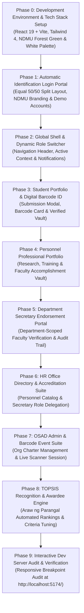
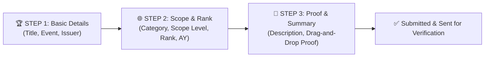

# AchieveNest: Exhaustive Phased Technical Implementation Plan

**Notre Dame of Marbel University (NDMU)**  
*Web-Based Achievement, Portfolio, and Recognition Management System for Students and Personnel*

---

> [!NOTE]
> **Frontend Web Application Scope Notice**:  
> All implementation phases in this codebase focus on building the **Complete Frontend Client Web Application UI System** (React + Vite + TailwindCSS), featuring complete interactive UI components, state management, modal workflows, CSV exporters, role context switchers, and client-side data flows. Backend server API endpoints and database persistence will be integrated separately outside of Antigravity.  
>  
> For database schemas (22 tables), RLS policies, and backend API specifications, refer to: 📄 **[achievenest_system_design.md](file:///c:/Users/Admin/.gemini/antigravity/scratch/achievenest/achievenest_system_design.md)**

---

## Phased Implementation Architecture

---

## Detailed Component & Phase Breakdown
$$
DONE
### Phase 0: Development Environment & Technology Stack Setup

#### Objective
Configure and establish the complete technical ecosystem, developer dependencies, framework settings, and institutional color system for **AchieveNest**.

> [!IMPORTANT]
> **Development Scope Note**: After setting up the system stack specifications, since development is being conducted inside **Antigravity**, our active workspace focus and direct modification scope is dedicated to the **Frontend Application (React 19 + Vite + Tailwind CSS 4)**. The PHP CodeIgniter 4 API backend and Supabase infrastructure serve as the external service layer.

#### Master Technology Stack

| Category | Technology | Purpose |
| :--- | :--- | :--- |
| **Frontend Framework** | React 19 + Vite | Builds a fast, modern, and interactive single-page application. |
| **Programming Language** | JavaScript (ES6+) | Implements the frontend application logic. |
| **Styling Framework** | Tailwind CSS 4 | Creates responsive, modern, and customizable user interfaces using utility classes. |
| **Frontend Routing** | React Router | Handles client-side navigation between pages. |
| **HTTP Client** | Axios | Sends HTTP requests between the React frontend and the backend REST API. |
| **Backend Language** | PHP 8.3+ | Implements the server-side application logic. |
| **Backend Framework** | CodeIgniter 4.6+ | Develops the RESTful API, routing, authentication, and business logic following the MVC architecture. |
| **Architecture** | MVC (Model-View-Controller) | Organizes the application's code into separate components for maintainability. |
| **Programming Paradigm** | Object-Oriented Programming (OOP) | Structures the backend using classes and objects for modular development. |
| **API** | RESTful API | Enables communication between the frontend and backend. |
| **Cloud Backend** | Supabase | Provides cloud-based backend services. |
| **Database** | PostgreSQL (Supabase) | Stores system data securely. |
| **Authentication** | Supabase Authentication + JWT | Manages user authentication and secure session handling. |
| **File Storage** | Supabase Storage | Stores uploaded certificates, portfolio files, and other documents. |
| **Real-Time Services** | Supabase Realtime | Supports real-time notifications and updates. |
| **PDF Generation** | mPDF | Generates printable portfolios, certificates, and reports. |
| **QR Code Generation** | Endroid QR Code | Generates QR codes for attendance and certificate verification. |
| **QR Code Scanning** | html5-qrcode | Scans QR codes using a device's camera. |
| **Data Import/Export** | CSV and Excel | Imports student and personnel masterlists and exports administrative records and reports. |
| **Security** | JWT, Password Hashing, Role-Based Access Control (RBAC), Input Validation, Secure File Handling | Protects user accounts, uploaded files, and system data. |
| **Development Environment** | Antigravity | AI-assisted integrated development environment for coding and project management. |
| **Dependency Manager (PHP)** | Composer | Installs and manages PHP packages and libraries. |
| **Package Manager (JavaScript)** | npm | Installs and manages JavaScript dependencies. |
| **Version Control** | Git | Tracks changes to the source code. |
| **Repository Hosting** | GitHub | Stores the source code and supports collaboration and version control. |

#### Official NDMU Institutional Color Palette & Design System

| Token Name | Color / Hex | Tailwind Utility | Application & Usage |
| :--- | :--- | :--- | :--- |
| **NDMU Forest Green (Primary)** | `#1b4332` / `#143823` | `from-[#12361e] via-[#1b4332] to-[#0d2816]` | Left brand panel, dark hero backgrounds, primary institutional headers. |
| **Action Accent Green** | `#2d8a4e` (Hover: `#236e3e`) | `bg-[#2d8a4e] hover:bg-[#236e3e]` | Primary action buttons (`Sign In`), interactive CTAs, active status badges. |
| **Mint Tint Container** | `#eef7f0` (Border: `#cbe6d2`) | `bg-[#eef7f0] border-[#cbe6d2]` | Demo accounts box, card highlights, subtle background fills. |
| **Institutional Gold / Amber** | `#f59e0b` / `#d4af37` | `text-amber-500`, `border-amber-400` | NDMU Crest details, gold star highlights, accreditation accents. |
| **Clean Pure White** | `#ffffff` | `bg-white`, `text-white` | Right authentication panel, input backgrounds, pill cards. |
| **Slate Dark Neutral** | `#0f172a` / `#334155` | `text-slate-900`, `text-slate-500` | Primary headings, subtexts, and form field labels. |

---
DONE
### Phase 1: Automatic Identification Login Portal & Recovery Suite

#### Objective
Build an official, split-screen **Login Portal** (`src/pages/Login.jsx`) divided 50%/50% between the NDMU Forest Green brand panel and clean white authentication panel, featuring automatic system role routing.

#### Technical Specifications & Layout Structure
1. **50/50 Split Screen Container (`src/pages/Login.jsx`)**:
   - **Left Panel (50% - NDMU Forest Green `#1b4332`)**:
     - NDMU emblem badge logo with `AchieveNest` title.
     - Campus hero card overlaid with white accreditation banner (*PAASCU Accredited, ISO Certified, CHED Recognized*).
     - *"Your journey of excellence starts here."* feature list with checkmark icons.
     - Statistical counters row (**2,500+** Active Students, **15,000+** Achievements, **98%** Satisfaction).
   - **Right Panel (50% - Clean White Background)**:
     - **Welcome back** heading & subtitle.
     - Email Address (`your.email@ndmu.edu.ph`) & Password input fields.
     - `Keep me signed in` checkbox & solid green **Sign In** CTA button (`bg-[#2d8a4e]`).
     - **Demo Accounts Card** (`bg-[#eef7f0]`):
       - 1-Click quick fill buttons for **Student**, **Personnel**, **Coordinator**, **Organization**, and **OSAD Admin**.
2. **Automatic System Identification Engine (`src/services/authService.js`)**:
   - Evaluates `user_type` on login:
     - `student` $\rightarrow$ Routes to `/student/dashboard`
     - `personnel` $\rightarrow$ Routes to `/personnel/dashboard`
     - `hr_staff` $\rightarrow$ Routes to `/hr/dashboard`
     - `osad_staff` $\rightarrow$ Routes to `/osad/dashboard`
3. **Password Reset Request Modal (`src/components/auth/PasswordResetModal.jsx`)**:
   - Triggered by password reset requests, logging entries into `password_reset_requests` table for OSAD Staff resolution (per SRS Figure 17/26).

$$
---
$$
DONE
### Phase 2: Global App Shell, Navigation & Personnel Dynamic Role Switcher

#### Objective
Establish the primary application layout (`src/layouts/MainLayout.jsx`) and top header navbar (`src/components/Navbar.jsx`) utilizing the NDMU Forest Green header styling, active user state, and dynamic role switcher.

#### Technical Specifications & Component Structure
1. **Header Navigation Shell (`src/components/Navbar.jsx`)**:
   - Deep forest green (`#1b4332`) top bar with NDMU branding badge, quick search shortcut, notification trigger, and profile avatar menu.
2. **Personnel Role Context Switcher (`src/components/RoleSwitcher.jsx`)**:
   - Dropdown menu allowing multi-role personnel to switch contexts:
     - `Faculty / Personnel View` *(Base portfolio view)*
     - `Department Secretary` *(If assigned by HR Staff)*
     - `Program Coordinator` *(If assigned by OSAD Staff)*
     - `Organization Moderator` *(If assigned by OSAD Staff)*
3. **In-App Notification Center (`src/components/NotificationPopover.jsx`)**:
   - Bell icon with unread count badge rendering alerts from `notifications` table.

$$
---

$$
DONE
### Phase 3: Student Portfolio & Digital NDMU Barcode ID Interface

#### Objective
Construct the **Student Dashboard** (`src/pages/StudentDashboard.jsx`) featuring student profile summary, achievement stats, filterable achievement list, digital NDMU ID barcode preview card, and submission modal.
$$

$$
DONE
### Phase 3.1: Dedicated Student Achievements Catalog & Workspace
- Implemented `StudentAchievementsPage.jsx` (`/student/achievements`) featuring grid/list view mode toggles, category/status filters, CSV export, category breakdown sidebar widget, and seamless homepage submission redirect.

#### 📋 Detailed Field & UI Text Specification: 3-Step Achievement Submission Wizard

##### 🏆 STEP 1: Basic Achievement Details
- **Header Title**: Submit New Achievement
- **Header Subtitle**: Step 1 of 3: Basic Details
- **Step Badge 1**: `1. Basic Info` (Active Green Pill)

| Field Name | Label Text | Component Type | Placeholder / Helper Text | Validation |
| :--- | :--- | :--- | :--- | :--- |
| `title` | Award / Achievement Title * | Text Input | e.g. Dean's Lister - First Semester AY 2025-2026 | Required, Min 5 chars |
| `event_name` | Event / Competition Name * | Text Input | e.g. 12th SOCCSKSARGEN IT Summit / NDMU Intramurals 2025 | Required, Min 3 chars |
| `issuer_organization` | Issuing Body / Organization * | Text Input | e.g. NDMU CITE / DOST Region XII | Required |

- **Step 1 Action Buttons**:
  - `Cancel` (Ghost button → closes modal)
  - `Next: Scope & Rank →` (Primary Emerald CTA)

##### 🌐 STEP 2: Classification, Scope & Rank Weighting (For TOPSIS Scoring)
- **Header Subtitle**: Step 2 of 3: Scope & Rank
- **Step Badge 2**: `2. Scope & Rank` (Active Green Pill)

| Field Name | Label Text | Component Type | Options List / Values | Validation |
| :--- | :--- | :--- | :--- | :--- |
| `category_id` | Category * | Dropdown Select | Academic, Leadership, Athletics, Volunteerism & Community, Arts & Culture | Required |
| `scope_level` | Geographic Scope / Level * | Dropdown Select | Institutional / Campus-Wide, Local / City Level, Regional (Region XII), National Level, International Level | Required |
| `rank_conferred` | Rank / Position Conferred * | Dropdown Select | Champion / 1st Place, 2nd Place, 3rd Place, Finalist / Runner-Up, Dean's Lister, Leadership Officer / Lead, Participant / Special Award | Required |
| `academic_year` | Academic Year * | Dropdown Select | AY 2025-2026, AY 2024-2025, AY 2023-2024 | Required |
| `semester` | Term / Semester * | Dropdown Select | 1st Semester, 2nd Semester, Summer Term | Required |
| `date_achieved` | Date Conferred * | Date Picker | MM / DD / YYYY | Required |

- **Step 2 Action Buttons**:
  - `← Back` (Returns to Step 1)
  - `Next: Proof & Submit →` (Primary Emerald CTA)

##### 📄 STEP 3: Supporting Proof & Summary Submission
- **Header Subtitle**: Step 3 of 3: Proof & Summary
- **Step Badge 3**: `3. Proof & Summary` (Active Green Pill)

| Field Name | Label Text | Component Type | Instruction / Helper Text | Validation |
| :--- | :--- | :--- | :--- | :--- |
| `description` | Narrative Description | Textarea (3 rows) | Brief details about the accomplishment, criteria met, or project abstract... | Optional |
| `document_url` | Supporting Evidence Document (PDF/JPG/PNG) * | Drag-and-Drop File Upload | Icon: Upload Cloud Primary Text: Click or drag certificate attachment here Subtext: PDF, JPG, PNG up to 5MB | Required |

- **Step 3 Action Buttons**:
  - `← Back` (Returns to Step 2)
  - `Submit Entry ✓` (Primary Emerald CTA)
$$

---

### Phase 3.2: Dedicated Student Public Portfolio & Accomplishments Profile Workspace (`/student/portfolio`)

#### Objective
Build the standalone **Student Portfolio Page** (`src/pages/StudentPortfolioPage.jsx`), accessible via the left sidebar `Portfolio` menu item (`/student/portfolio`), matching the design screenshots and Google Docs requirements.

#### User Review Required
> [!IMPORTANT]
> **Category Navigation Logic**: As per Google Docs revision requirements, clicking a category item under *Achievements by Category* or inside *Supporting Evidence* will redirect back to the **Achievements Section** (`/student/achievements`) with that specific category pre-filtered!

#### Proposed Changes

##### [NEW] [StudentPortfolioPage.jsx](file:///c:/Users/Admin/.gemini/antigravity/scratch/achievenest/src/pages/StudentPortfolioPage.jsx)
- **Hero Header Profile Banner (NDMU Forest Green `#1b4332`)**: Large student avatar with verified icon badge, Full Name (*Maria Santos*), Student ID (*2024-01234*), Program (*BS Computer Science*), Year & Age (*3rd Year - 21 yrs*), Location (*Koronadal City, South Cotabato*), and 3 Right Stat Pill Cards (`5 Total`, `3 Verified`, `30 Points`).
- **About Me Card**: Narrative student bio and academic background statement.
- **Experience & Involvement Timeline Card**: Vertical timeline showcasing student positions (*President • Computer Society NDMU*, *Dean's Lister • CEAC NDMU*, *Community Extension • Koronadal City Barangay Program*, *Hackathon Finalist • DICT RegTech 2024*, *Core Developer • University Web Dev Team*).
- **Featured Achievements Grid**: Cards showing verified achievements with banner illustrations/emojis and category badges.
- **Supporting Evidence Section**: Evidence gallery cards displaying thumbnail previews for certificates.
- **Right Sidebar Widgets**:
  - **Contact Information Card**: Email (`student@ndmu.edu.ph`), Phone (`+63 912 345 6789`), Address (`Koronadal City, South Cotabato`).
  - **Skills & Competencies Card**: Skill pills with proficiency indicators (*Expert*, *Proficient*, *Familiar*) for Leadership, Communication, Technical Skills, Teamwork, Problem Solving, Critical Thinking, Public Speaking, Time Management, Research, Project Management.
  - **Achievements by Category Card**: Interactive category list (*Academic: 2*, *Leadership: 1*, *Community: 1*, *Sports: 1*). Clicking a category navigates to `/student/achievements` pre-filtered to that category.
  - **Portfolio Summary Card**: 4-stat grid (`5 Total`, `3 Verified`, `1 Pending`, `30 Points`).

##### [MODIFY] [App.jsx](file:///c:/Users/Admin/.gemini/antigravity/scratch/achievenest/src/App.jsx)
- Register route `/student/portfolio` rendering `StudentPortfolioPage`.

##### [MODIFY] [Sidebar.jsx](file:///c:/Users/Admin/.gemini/antigravity/scratch/achievenest/src/components/Sidebar.jsx)
- Update `Portfolio` sidebar menu item link to `/student/portfolio`.

##### [MODIFY] [StudentAchievementsPage.jsx](file:///c:/Users/Admin/.gemini/antigravity/scratch/achievenest/src/pages/StudentAchievementsPage.jsx)
- Handle pre-filtered category initialization from navigation state (`location.state?.selectedCategory`).

#### UI & Feature Specifications (Matching Design Mockup)
1. **Header Action Bar & Metrics Row**:
   - **Title**: "Achievements", Subtitle: *"View, manage, and track your achievements. Attach supporting documents for verification by your program coordinator."*
   - **Top Right Actions**: `Export Achievements` (export to CSV/PDF) and `+ Add Achievement` (launches `AchievementSubmissionModal`).
   - **3 Stat Pills Row**: `5 Total Achievements`, `3 Verified`, `1 Pending Review`.
2. **Filter & Search Control Toolbar**:
   - Live Search Input (*"Search achievements..."*).
   - Filter Selectors: `Category` (*Academic, Leadership, Community, Sports, Recognition, Professional Development*), `Status` (*Verified, Pending Review, Returned*), `Sort` (*Newest First, Oldest First*).
   - View Mode Switcher: Grid View 🔲 vs List View ☰.
3. **Main Content Grid (2 Column Layout)**:
   - **Left Column (3/4 Width)**:
     - **Achievement Card Grid**: Green certificate header graphics with category icons, title, issuing campus/location, completion date, verification status pill (`Verified`, `Pending Review`, `Returned`), and action context menu (`...`).
     - Pagination bar at bottom (*"Showing 1-5 of 5 achievements"*).
   - **Right Column (1/4 Width - Sidebar Widgets)**:
     - **"By Category" Widget**: Interactive list displaying category icons and count badges (*Academic: 2, Leadership: 1, Community: 1, Sports: 1, Recognition: 0, Professional Development: 0*). Clicking any category filters the achievements grid immediately.
     - **"Upload Tips" Widget**: Instructions for faster coordinator verification and accepted file formats (*PDF, JPG, PNG*).

#### Proposed Components & Routes
- **[NEW] [StudentAchievementsPage.jsx](file:///c:/Users/Admin/.gemini/antigravity/scratch/achievenest/src/pages/StudentAchievementsPage.jsx)**: Standalone student achievements catalog page matching design mockup.
- **[MODIFY] [App.jsx](file:///c:/Users/Admin/.gemini/antigravity/scratch/achievenest/src/App.jsx)**: Register route `/student/achievements`.
- **[MODIFY] [Sidebar.jsx](file:///c:/Users/Admin/.gemini/antigravity/scratch/achievenest/src/components/Sidebar.jsx)**: Link `Achievements` nav item to `/student/achievements`.
$$

---
$$
DONE
### Phase 4: Faculty & Personnel Professional Portfolio Interface

#### Objective
Build the comprehensive **Personnel Dashboard** (`src/pages/PersonnelDashboard.jsx`) mirroring the layout structure, interactive stats, timeline cards, digital barcode ID card, basic information editor, and accomplishment submission modals of the Student Dashboard.

#### UI & Structural Alignment with Student Dashboard
1. **Hero Summary Banner (NDMU Forest Green `#1b4332`)**:
   - **Header Title**: "Personnel Professional Portfolio".
   - **Profile Details**: Faculty name, employee ID, academic rank/designation, department, and contact info.
   - **Digital ID Barcode Button**: Interactive button launching `DigitalBarcodeIDCard` modal for faculty attendance scanning.
   - **5 Filter Stats Cards Row**: `Total Accomplishments`, `Verified` (HR Verified), `Pending` (Secretary Review), `Endorsed` (Department Endorsed), and `Total Proofs`. Clicking any stat card filters the timeline accordingly.
2. **Quick Actions Bar (3 Cards)**:
   - **Submit New Accomplishment**: Launches `PersonnelSubmissionModal`.
   - **Edit Basic Information**: Launches `EditBasicInfoModal` to edit rank, department, degree, contact number, and specialization.
   - **My Verified Proofs**: Quick filter for verified certificates.
3. **Accomplishments Timeline & Category Filter Tabs**:
   - Filter pills: `All`, `Research & Publications`, `Seminars & Workshops`, `Extension Services`, `Institutional Awards`, `Certifications & Licenses`.
   - Accomplishment cards matching Student Dashboard timeline item layout (category tag, status pill, date, issuer, proof file preview button).
4. **Supporting Evidence Vault & Category Cards**:
   - Interactive category cards. Clicking any card sets the timeline category filter and scrolls smoothly back to the Accomplishments section.

#### Proposed Components
- **[MODIFY] [PersonnelDashboard.jsx](file:///c:/Users/Admin/.gemini/antigravity/scratch/achievenest/src/pages/PersonnelDashboard.jsx)**: Main personnel dashboard mirroring Student Dashboard layout.
- **[NEW] [EditBasicInfoModal.jsx](file:///c:/Users/Admin/.gemini/antigravity/scratch/achievenest/src/components/personnel/EditBasicInfoModal.jsx)**: Modal for editing faculty basic information and academic credentials.
- **[NEW] [PersonnelSubmissionModal.jsx](file:///c:/Users/Admin/.gemini/antigravity/scratch/achievenest/src/components/personnel/PersonnelSubmissionModal.jsx)**: Modal for submitting faculty accomplishments and proof attachments.
$$
$$
DONE
### Phase 4.5: Personnel Multi-Role Context Switcher & Dynamic Profile Menu

#### Objective
Implement the **Personnel Multi-Role Context Switcher** (`src/components/Header.jsx`, `src/components/RoleSwitcher.jsx`, and `src/components/Sidebar.jsx`) allowing personnel users to dynamically switch between their assigned administrative roles without logging out.

#### Assignable Personnel Roles & Context Scopes
A `personnel` user type can be assigned any combination of the following **3 Administrative Roles**:
1. **`program_coordinator` (Program Coordinator)**: Verifies student achievement submissions for an academic degree program.
2. **`organization_moderator` (Organization Moderator / Account)**: Moderates student org events, manages barcode attendance scanner sessions, and generates digital certificates.
3. **`department_secretary` (Department Secretary)**: Reviews and endorses department faculty accomplishment submissions to HR Staff.
4. **`personnel` (Faculty / Personnel View)**: Default primary employee portfolio view.

#### UI & Technical Specifications
1. **Header Profile Dropdown Menu (`src/components/Header.jsx`)**:
   - **Profile Header Card**: Avatar circle/image, full name (`Dr. Ana Reyes`), user type badge (`Personnel`).
   - **Action Items**:
     - 👤 **My Profile**: View and edit basic credentials.
     - ⚙️ **Settings**: Account and system preferences.
     - 🔄 **Switch To (Submenu Accordion)**: Expandable role selector menu displaying assigned roles (`Program Coordinator`, `Organization Moderator`, `Department Secretary`, `Faculty / Personnel View`).
     - 🚪 **Logout**: Red action link for ending session.
2. **Context Persistence & Shell Synchronization**:
   - Updates `user.active_role_context` state in real-time.
   - Synchronizes left sidebar (`src/components/Sidebar.jsx`) top portal badge (`Personnel Portal`, `Coordinator Portal`, `Org Moderator Portal`, `Dept Secretary Portal`).

#### Proposed Components
- **[MODIFY] [Header.jsx](file:///c:/Users/Admin/.gemini/antigravity/scratch/achievenest/src/components/Header.jsx)**: Integrated top-right profile dropdown with expandable `Switch To` role menu listing `program_coordinator`, `organization_moderator`, `department_secretary`, and `personnel`.
- **[MODIFY] [RoleSwitcher.jsx](file:///c:/Users/Admin/.gemini/antigravity/scratch/achievenest/src/components/RoleSwitcher.jsx)**: Role switcher engine supporting the 3 assigned personnel roles.
- **[MODIFY] [Sidebar.jsx](file:///c:/Users/Admin/.gemini/antigravity/scratch/achievenest/src/components/Sidebar.jsx)**: Active role context badge & navigation synchronization.
$$

$$
DONE
### Phase 4.6: Program Coordinator Verification & Management Portal

#### Objective
Build the dedicated **Program Coordinator View** (`src/components/coordinator/CoordinatorDashboardView.jsx`), rendered when personnel switches active context to `program_coordinator`, allowing assigned faculty to verify student achievement submissions within their assigned degree program scope (e.g., *BS Computer Science*).

#### UI & Technical Specifications (Matching Design Mockup & Specs)
1. **Hero Summary Banner (NDMU Forest Green `#1b4332`)**:
   - **Header**: Shield Icon, "Program Coordinator Dashboard", Subtitle: *"Achievement Verification & Management"*, and NDMU emblem badge.
   - **4 Stat Counters Row**:
     - `Pending Reviews`: **1**
     - `Verified`: **3**
     - `Returned`: **1**
     - `Avg Review Time`: **2.5 hrs**
2. **Program Scope Filter Notice Banner**:
   - Mint container (`bg-[#eef7f0] border-[#cbe6d2]`): **Program Scope: BS Computer Science**.
   - Notice: *"You can only view and manage students enrolled in your assigned program."*
3. **Pending Verification Queue Card Section**:
   - Header: **Pending Verification Queue** (Subtitle: *BS Computer Science students only*, Badge: `1 pending`).
   - Queue Item Card: Student Avatar, Achievement Title (*Community Outreach Volunteer*), Student Name & Category (*Maria Santos • Community*), Date & Proof Doc Count (*3/20/2026 • 1 docs*), with quick review/approve/return modal triggers.
4. **Verification Summary — BS Computer Science**:
   - Summary stat cards: `3 Verified Achievements`, `1 Pending Review`, `1 Returned with Remarks`.
5. **Sidebar Navigation & Shell Synchronization**:
   - Blue Role Badge: `Program Coordinator` (with Shield icon).
   - Navigation links: `Overview` (active green pill), `Verification Workspace`, `Students`, `Reports`.

#### Proposed Components
- **[NEW] [CoordinatorDashboardView.jsx](file:///c:/Users/Admin/.gemini/antigravity/scratch/achievenest/src/components/coordinator/CoordinatorDashboardView.jsx)**: Dedicated Program Coordinator overview dashboard component matching UI design mockup.
- **[MODIFY] [PersonnelDashboard.jsx](file:///c:/Users/Admin/.gemini/antigravity/scratch/achievenest/src/pages/PersonnelDashboard.jsx)**: Render `CoordinatorDashboardView` when `active_role_context === 'program_coordinator'`.
- **[MODIFY] [Sidebar.jsx](file:///c:/Users/Admin/.gemini/antigravity/scratch/achievenest/src/components/Sidebar.jsx)**: Update sidebar role badge and navigation items (`Overview`, `Verification Workspace`, `Students`, `Reports`) for Program Coordinator context.
$$

$$
DONE
### Phase 4.7: GitHub Version Control Checkpoint & Repository Snapshot

#### Objective
Establish a clean Git version control checkpoint (commit and push to GitHub repository or create a local release branch/tag) after Phase 4.6, securing all working implementations (Student Dashboard, Student Achievements Catalog, Personnel Portfolio, Personnel Multi-Role Switcher, and Program Coordinator Portal) to guarantee system rollback safety before beginning Phase 5.

#### Action Steps & Commands
1. **Repository Safety Audit & Status Check**:
   - Run `git status` to verify modified and untracked components.
2. **Stage & Commit Stable Workspace**:
   - Stage all codebase updates (`git add .`).
   - Create a structured commit: `git commit -m "feat: complete Phase 4.6 Program Coordinator Portal and Phase 3.1 Achievements Catalog"`.
3. **Branching / Tagging / Remote Push**:
   - Create a checkpoint tag/branch (`git tag -a v0.4.6-stable -m "Stable release after Phase 4.6 implementation"`).
   - Push commits and tags to remote repository (`git push origin main --tags` or inspect remote branch state).

#### Verification Plan
- Verify clean `git status` (no uncommitted or lost work).
- Ensure dev server builds cleanly (`npm run build`).
$$

---

### Phase 5: Department Secretary Endorsement & Verification Portal

#### Objective
Build the dedicated **Department Secretary Portal View** (`src/components/secretary/SecretaryDashboardView.jsx`), rendered when personnel switches active working context to `department_secretary`, allowing department secretaries to review, verify, and endorse faculty accomplishment submissions before forwarding them to the HR Office.

#### UI & Technical Specifications
1. **Hero Summary Banner (NDMU Forest Green `#1b4332`)**:
   - **Header**: Building Icon, "Department Secretary Portal", Subtitle: *"Department Faculty Accomplishment Review & HR Endorsement"*.
   - **4 Stat Counters Row**:
     - `Pending Endorsements`: **2** (with clock icon)
     - `Endorsed to HR`: **3** (with check circle icon)
     - `Returned to Faculty`: **0** (with rotate ccw icon)
     - `Active Department Faculty`: **12 Members** (with users icon)
2. **Department Scope Notice Banner**:
   - Mint container (`bg-[#eef7f0] border-[#cbe6d2]`): **Department Scope: College of Information Technology**.
   - Notice: *"You are reviewing accomplishments submitted by faculty members under your assigned department."*
3. **Pending Faculty Submissions Endorsement Queue**:
   - Filter tabs: `All Submissions`, `Pending Endorsement`, `Endorsed to HR`, `Returned`.
   - Submission Item Cards: Faculty Name & Academic Rank (*Dr. Maria Santos • Associate Professor*), Title (*Machine Learning Frameworks in Higher Education*), Category (*Research & Publications*), Submission Date, Document Proof preview trigger.
4. **Review & Endorsement Modal Workflow**:
   - Document Proof preview viewer.
   - Action button 1: **Endorse to HR Office** (updates status to `Endorsed to HR`).
   - Action button 2: **Return to Faculty** (with required remarks text field).
5. **Sidebar Navigation & Shell Synchronization**:
   - Role Badge: `Department Secretary` (with Building icon).
   - Navigation links: `Overview` (active), `Faculty Submissions Queue`, `Department Roster`, `Endorsement Logs`.

#### Proposed Components
- **[NEW] [SecretaryDashboardView.jsx](file:///c:/Users/Admin/.gemini/antigravity/scratch/achievenest/src/components/secretary/SecretaryDashboardView.jsx)**: Dedicated Department Secretary overview & endorsement view.
- **[MODIFY] [PersonnelDashboard.jsx](file:///c:/Users/Admin/.gemini/antigravity/scratch/achievenest/src/pages/PersonnelDashboard.jsx)**: Render `SecretaryDashboardView` when `active_role_context === 'department_secretary'`.
- **[MODIFY] [Sidebar.jsx](file:///c:/Users/Admin/.gemini/antigravity/scratch/achievenest/src/components/Sidebar.jsx)**: Update navigation links (`Overview`, `Faculty Submissions Queue`, `Department Roster`, `Endorsement Logs`) for Department Secretary context.

---

### Phase 6: HR Office Directory & Accreditation Suite

#### Objective
Construct the **HR Staff Dashboard** (`src/pages/HRDashboard.jsx`) for monitoring university-wide employee accomplishments and assigning `department_secretary` roles.

---

### Phase 6.9: GitHub Version Control Checkpoint & Remote Push

#### Objective
Establish a clean Git version control checkpoint and push all updates to GitHub repository `https://github.com/Astherisk1229/AchieveNest.git` after Phase 6, securing Department Secretary Endorsement and HR Office Accreditation suites to guarantee complete system backup before OSAD features.

#### Action Steps & Commands
1. **Repository Safety Audit & Status Check**:
   - Run `git status` to verify modified files and untracked components.
2. **Stage & Commit Workspace**:
   - Stage all codebase updates (`git add .`).
   - Create a structured commit: `git commit -m "feat: complete Phase 5 Department Secretary and Phase 6 HR Office Suite"`.
3. **Remote Push & Release Tagging**:
   - Create release tag `v0.6.0-stable` (`git tag -a v0.6.0-stable -m "Stable release after Phase 6 implementation"`).
   - Push commits and tags to GitHub (`git push origin main --tags`).

#### Verification Plan
- Verify clean `git status` and remote tracking.
- Verify production build with `npm run build`.

---

### Phase 6.9.1: Git Workspace Sync & Version Restore (Git Pull / Checkout)

#### Objective
Provide procedures and commands to synchronize (`git pull origin main`) or restore (`git checkout <tag/branch>`) the latest saved repository version from GitHub, ensuring any workstation or developer can pull the exact codebase snapshot and resume development seamlessly.

#### Action Steps & Commands
1. **Fetch & Pull Remote Updates (`git pull`)**:
   - Pull the latest commits from the GitHub remote repository:
     `git pull origin main`
2. **Restore / Switch to a Specific Version Snapshot (`git checkout`)**:
   - List available release tags: `git tag -l`
   - Switch to a specific saved version snapshot (e.g. `v0.4.6-stable` or `v0.6.0-stable`):
     `git checkout tags/v0.4.6-stable -b release-v0.4.6`
3. **Verify Dependencies & Launch Local Server**:
   - Re-install dependencies if needed (`npm install`) and start local dev server (`npm run dev`).

#### Verification Plan
- Confirm workspace is fully up-to-date with remote GitHub repository (`git status`).

---

### Phase 7: OSAD Admin Suite, Student Org Governance & Barcode Attendance Generator

#### Objective
Build the **OSAD Administrator Dashboard** (`src/pages/OSADDashboard.jsx`) for student organization charter administration, barcode event attendance, and digital certificates.

---

### Phase 8: TOPSIS Decision Support Engine & Recognition Suite

#### Objective
Implement the automated **TOPSIS** multi-criteria recognition engine (`src/services/topsisEngine.js`) for ranking *Araw ng Parangal* award candidates.

---

### Phase 9: Interactive Dev Server Audit & Verification

#### Objective
Execute comprehensive end-to-end testing across all user role portals on the local Vite server (`http://localhost:5174/`).
